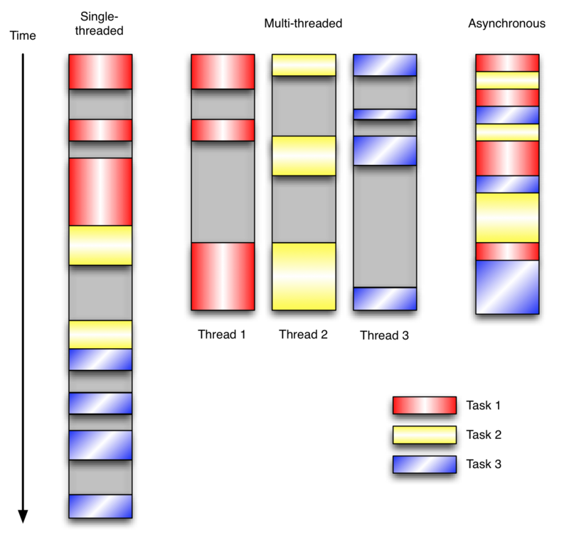
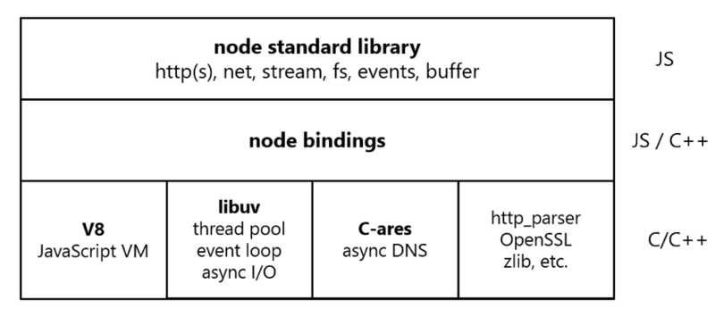

# 事件驱动模型(Node.js复盘)

这是一篇填坑的文章，之前写过一点 Node.js 的介绍，最近翻到了看看写的是什么玩意（毕竟那会刚上大学的愣头青），就像本文，过几年再回来看，估计是一样的想法。

> 话说有个叫 Ryan Dahl 的歪果仁，他的工作是用 C/C++ 写高性能 Web 服务。
>
> **对于高性能，异步 IO、事件驱动是基本原则**，但是用 C/C++ 写就太痛苦了。于是这位仁兄开始设想用高级语言开发 Web 服务。他评估了很多种高级语言，发现很多语言虽然同时提供了同步 IO 和异步 IO，但是**开发人员一旦用了同步 IO，他们就再也懒得写异步 IO了**，所以，最终，Ryan 瞄向了 JavaScript。
>
> 因为 JavaScript 是单线程执行，根本不能进行同步 IO 操作，所以，JavaScript 的这一“缺陷”导致了它只能使用异步 IO。
>
> 选定了开发语言，还要有运行时引擎。这位仁兄曾考虑过自己写一个，不过明智地放弃了，因为 V8 就是开源的 JavaScript 引擎。让 Google 投资去优化 V8，咱只负责改造一下拿来用，还不用付钱，这个买卖很划算。
>
> 于是在 2009 年，Ryan 正式推出了基于 JavaScript 语言和 V8 引擎的开源 Web 服务器项目，命名为 Node.js。虽然名字很土，但是，Node 第一次把 JavaScript 带入到后端服务器开发，加上世界上已经有无数的 JavaScript 开发人员，所以 Node 一下子就火了起来。
>
> **Node.js 使用事件驱动、非阻塞式 I/O 的模型，它以单进程、单线程模式运行，没有多线程的资源占用和上下文切换，这意味着面对大规模的 http 请求，Node.js 凭借事件驱动搞定一切。**

这里引用的是[廖雪峰](https://www.liaoxuefeng.com/wiki/1022910821149312/1023025235359040)的一段介绍，写的还蛮有意思的，我也是看完后才知道原来还有个 `io.js` 的项目：

> 因为 Node.js 是开源项目，虽然由社区推动，但幕后一直由 Joyent 公司资助。由于一群开发者对 Joyent 公司的策略不满，于 2014 年从 Node.js 项目 fork 出了 io.js 项目，决定单独发展，但两者实际上是兼容的。
>
> 然而中国有句古话，叫做“分久必合，合久必分”。分家后没多久，Joyent 公司表示要和解，于是，io.js 项目又决定回归 Node.js。
>
> 具体做法是将来 io.js 将首先添加新的特性，如果大家测试用得爽，就把新特性加入 Node.js。io.js 是“尝鲜版”，而 Node.js 是线上稳定版

好了，到此介绍回顾完毕，下面开始重点。

## 事件驱动模型

事件驱动编程是一种**编程范式**，这里程序的执行流**由外部事件来决定**。它的特点是包含一个**事件循环**，当外部事件发生时使用回调机制来触发相应的处理。

看到这里是不是非常熟悉了，跟上一篇讲的浏览器的 Event Loop 是一样的，还记得 JS 引擎线程和事件触发线程么？

除了事件驱动这种编程范式，另外两种常见的编程范式是（单线程）同步以及多线程编程，这个就都熟悉了。

这张图较真的话可能不是太准确，不过问题不大，但是足以说明问题了，

前两个就不用说了，好处与缺点很明显，多线程共享变量的锁估计就让各位很头痛了，在事件驱动版本的程序中，3 个任务交错执行，但仍然在一个单独的**线程**控制中。

当处理 I/O 或者其他昂贵的操作时，注册一个回调**到事件循环中**，然后当 I/O 操作完成时继续执行。简单说就是回调的艺术！

事件循环轮询所有的事件，当事件到来时将它们分配给等待处理事件的回调函数。这种方式让程序尽可能的得以执行而不需要用到额外的线程。事件驱动型程序比多线程程序更容易推断出行为，因为程序员**不需要关心线程安全问题**。

## Node主要模块

Node 的结构可以用这幅图来介绍：

Node.js 的结构大致分为三个层次：

### Node.js标准库

这部分是由 Javascript 编写的，即我们使用过程中直接能调用的 API。在源码中的 lib 目录下可以看到。

### Node bindings

这一层是 Javascript 与底层 C/C++ 能够沟通的关键，前者通过 bindings 调用后者，相互交换数据。

### 核心库

这一层是支撑 Node.js 运行的关键，**由 C/C++ 实现**。

**V8**：Google 推出的 Javascript VM，简单说就是 JS 执行引擎，也是 Node.js 为什么使用的是 Javascript 的关键，它为 Javascript 提供了在非浏览器端运行的环境，它的高效是 Node.js 之所以高效的原因之一。

**Libuv**：它为 Node.js 提供了跨平台，线程池，事件池，异步 I/O 等能力，是 Node.js 如此强大的关键。

**C-ares**：提供了异步处理 DNS 相关的能力。

**http_parser、OpenSSL、zlib 等**：提供包括 http 解析、SSL、数据压缩等其他的能力。

想要深入了解 Node，总是避不开 libuv，不过这不属于本文的范围，做前端的可以看看，毕竟听说现在不会 Node 的前端都被误认是会点前端的美工了，后端也是需要了解前端的一些技术的，参考[疑问解答](https://segmentfault.com/a/1190000014926921)

## JS与Node

虽然 Node 使用的语言是 JS，但是毫无疑问他俩还是不太一样的，首先 Node 中用 JS 可以通过 Node bindings 来调用 I/O 等 API，这对纯 JS 来说是不可能的，有了 C/C++ 的加持就是不一样啊！

不过我觉得最大的好处是 Node 不用考虑浏览器兼容问题了，直接用 ES6 爽歪歪。

**Node 既然是单线程，如何实现异步、非阻塞 I/O？**

其实只有 js 执行是单线程，I/O 显然是其它线程，你可以对比一下上一篇浏览器中的 JS 执行，思想都是一样的。

js 执行线程是单线程，把需要做的 I/O 交给 libuv，自己马上返回做别的事情，然后 libuv 在指定的时刻回调就行了。

> 其实 Node 也是有线程池的，并且可以配置，不过这个是 I/O 线程池，它基本决定了吞吐量，或者说并发量。

---

**Node 事件驱动是如何实现的？和浏览器的 event loop 是一回事吗？**

event loop 是一个**执行模型**，在不同的地方有不同的实现。浏览器和 nodejs 基于不同的技术实现了各自的 event loop。

nodejs 的 event 是基于 libuv，而浏览器的 event loop 则在 html5 的规范中明确定义，具体实现交给浏览器。

在 Node 中  js 会把**回调和任务**交给 libuv，之后基本就没事了，可以处理下一个了，libuv 何时来调用回调就是 event loop 来控制的。

event loop 首先会在内部维持多个事件队列（或者叫做观察者 watcher），比如 时间队列、网络队列等等，使用者可以在 watcher 中注册回调，当事件发生时事件转入 pending 状态，再下一次循环的时候按顺序取出来执行，而 libuv 会执行一个相当于 while true 的无限循环，不断的检查各个 watcher 上面是否有需要处理的 pending 状态事件，如果有则按顺序去触发队列里面保存的事件，同时由于 libuv 的事件循环每次只会执行一个回调（~~具体的执行还是要到 JS 执行引擎线程中，我的猜测~~），从而避免了竞争的发生。

## Node的适用性

从上面可以看出，NodeJS **能响应大量的并发请求**，因为基于回调的异步、非阻塞、事件驱动的能力，它不会有等待的机会，遇到需要等待的直接把下面的执行代码交给事件循环（以回调的方式），自己就可以腾出手去处理其他请求，等资源准备好了再来继续处理。

所以，**NodeJS 适合运用在高并发、I/O密集、少量业务逻辑的场景**。

当碰到 CPU 密集型任务时，即只用 CPU 计算的操作，这时 Node.js 就会亲自处理，一个一个的计算，前面的任务没有执行完，后面的任务就只能干等着。

现在大部分服务器都是多 CPU 或多核的，而 Node.js 只有一个 EventLoop，也就是只占用一个 CPU 内核，当 Node.js 被CPU 密集型任务占用，导致其他任务被阻塞时，却还有 CPU 内核处于闲置状态，造成资源浪费。

Node 的作者也推荐可以在多核 CPU 上启动多个 Node 线程来进行协同处理。

**总结就是虽然 Node.js 可以处理数以千记的并发，但是一个 Node.js 进程在某一时刻其实只是在处理一个请求。**

---

假设没有限制，单从 JS 执行线程考虑，接受请求后在遇到 I/O 直接就丢给 EventLoop，马上可以处理下一个请求，也是同样的操作，这样在处理并发请求上的能力上是恐怖的，一个线程处理几万应该也不是问题，但是问题是 EventLoop 的压力会很大，并且在 I/O 线程池数量很小的情况下，大量的请求会被卡在 EventLoop，最终 EventLoop 的队列会爆，即：你虽然能够接受大量的请求，但是没有能力将它们全部处理完。