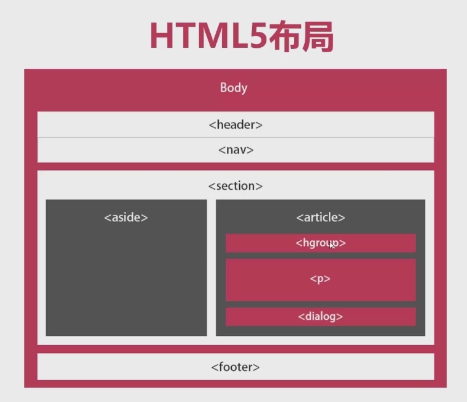

# HTML5补充

只说几个新加的我认为很有用的几个特性

[TOC]

## 新标签

在 HTML5 中为了得到更好的结构，引入了下面的标签：

- section：

  这个标签表示一个通用的文档或者应用程序节。它可以和 h1 - h6 一起使用来表示文档结构。
- section：

  这个标签表示一个通用的文档或者应用程序节。它可以和 h1-h6 一起使用来表示文档结构。
- article：

  这个标签表示文档内容的一个独立块，比如博客条目或者报纸上的文章。
- aside：

  这个标签表示与页面其他部分略微相关的内容块。
- header：

  这个标签表示一个节的头部。
- footer：

  这个标签表示一个节的脚注，可以包含作者，版权等信息。
- nav：

  这个标签表示用于导航文档的节。
- dialog：

  这个标签可以用于标记会话。
- figure：

  这个标签可以用于关联标题和某些嵌入内容，比如图表和视频。

用图来表示下应该更好理解：



## 标准属性&自定属性

下面列出的属性几乎所有的 HTML5 标签都支持。

| 属性              | 选项                | 功能                                       |
| --------------- | ----------------- | ---------------------------------------- |
| accesskey       | 用户自定义             | 定义访问元素的键盘快捷键                             |
| align           | right，left，center | 水平对齐标签                                   |
| background      | URL               | 在元素后面设置一个背景图像                            |
| bgcolor         | 数值，十六进制，RGB       | 在元素后面设置一个背景颜色                            |
| class           | 用户自定义             | 分类一个元素，便于使用样式表                           |
| contenteditable | true，false        | 定义用户是否可以编辑元素的内容                          |
| contentedita    | Menu id           | 为元素定义上下文菜单                               |
| data-XXX        | 用户自定义             | 自定义属性。 HTML 文档的作者可以定义自己的属性。<br />自定义属性必须以 "data-" 开头 |
| draggable       | true，false，auto   | 定义用户是否可以拖动元素                             |
| height          | 数字值               | 定义表格，图像或表格单元的高度                          |
| hidden          | hidden            | 定义元素是否应该可见                               |
| id              | 用户自定义             | 命名元素，便于使用样式表                             |
| item            | 元素列表              | 用于组合元素                                   |
| itemprop        | 条目列表              | 用于组合条目                                   |
| spellcheck      | true，false        | 定义元素是否必须有拼写或错误检查                         |
| style           | css样式表            | 给元素定义内联样式                                |
| subject         | 用户定义id            | 定义元素关联的条目                                |
| tabindex        | tab number        | 定义元素的 tab 键顺序                            |
| title           | 用户定义              | 元素“弹出”标题                                 |
| valign          | top，middle，bottom | HTML 元素内标签的垂直对齐方式                        |

在 HTML5 中还引入了一个新特性，就是可以添加自定义的数据属性，自定义数据属性以 `data-` 开头，基于我们的需求命名，这个属性在使用了 HTML5 的页面非常的常见。

可以使用 JavaScript API 或者在 CSS 中以获取标准属性类似的方式获取它们的值。

### js中获取data自定属性

首先介绍下用原生 JS 获取自定属性的方式：

``` javascript
var div = document.getElementById("myDiv");
var appId = div.dataset.appid;  //获取data-appid的值
var myName = div.dataset.myname;  //获取data-myname的值
//设置值
div.dataset.appid = 456;
div.dataset.myname = "newname";

// 传统方法获取（就需要全称了）
var appId = div.getAttribute("data-appid");
```

dataset 属性的值是 DOMStringMap 的一个实例，保存的是键值对的映射。只不过该属性名没有 data- 前缀。

需要注意的是，dataset 中大小写的问题。带连字符连接的名称在使用的时候需要命名驼峰化。

例如 `data-my-name` 对应的是 `dataset.myName` 的值。

下面就来看看使用 JQ 是如何获取的，稍微简单一些吧：

``` javascript
//获取属性
var appid = $("#myDiv").data("appid");
var app_id = $("#myDiv").data("app-id");
//属性赋值
$("#myDiv").data("appid","666");

// 更传统的写法
var appid = $("#myDiv").attr("data-appid");
```

需要注意的是，对使用 data() 获取的值进行修改并不会影响到 DOM 元素上的 `data-*` 属性的改变。

data() 的本质其实是将一个  “cache”  附加到了对象上，并使用了一个特殊的属性名称，此时修改只是修改了缓存的那个值。

## HTML5事件

下面列出了一些常用的事件，属性的值一般都是 JavaScript 函数名，或者直接写 js 代码（比如在 XSS 中很喜欢搞这个）

| 属性                 | 值      | 描述                                |
| ------------------ | ------ | --------------------------------- |
| offline            | script | 文档进入离线状态时触发。                      |
| onabort            | script | 事件中断时触发。                          |
| onafterprint       | script | 文档被打印后触发。                         |
| onbeforeonload     | script | 文档载入前触发。                          |
| onbeforeprint      | script | 文档被打印前触发。                         |
| onblur             | script | 窗口失去焦点时触发。                        |
| oncanplay          | script | 媒体停止缓冲，可以开始播放时触发。                 |
| oncanplaythrough   | script | 媒体可以播放到结束时触发，无需停止缓冲。              |
| onchange           | script | 元素发生变化时触发。                        |
| onclick            | script | 鼠标点击触发。                           |
| oncontextmenu      | script | 上下文菜单被触发时触发。                      |
| ondblclick         | script | 双击鼠标时触发。                          |
| ondrag             | script | 元素被拖动时触发。                         |
| ondragend          | script | 拖拽操作结束时触发。                        |
| ondragenter        | script | 元素被拖拽到有效放置目标时触发。                  |
| ondragleave        | script | 元素离开有效放置目标时触发。                    |
| ondragover         | script | 元素被拖放到有效目标上时触发。                   |
| ondragstart        | script | 拖拽操作开始时触发。                        |
| ondrop             | script | 拖动的元素被放置时触发。                      |
| ondurationchange   | script | 媒体时长改变时触发。                        |
| onemptied          | script | 媒体资源元素突然清空时触发。                    |
| onended            | script | 媒体到达终点时触发。                        |
| onerror            | script | 发生错误时触发。                          |
| onfocus            | script | 窗口获得焦点时触发。                        |
| onformchange       | script | 表单变化时触发。                          |
| onforminput        | script | 表单获得用户输入时触发。                      |
| onhaschange        | script | 文档变化时触发。                          |
| oninput            | script | 元素获得用户输入时触发。                      |
| oninvalid          | script | 元素失效时触发。                          |
| onkeydown          | script | 键盘按下时触发。                          |
| onkeypress         | script | 键盘按下并释放时触发。                       |
| onkeyup            | script | 按键释放时触发。                          |
| onload             | script | 载入文档时触发。                          |
| onloadeddata       | script | 载入媒体数据时触发。                        |
| onloadedmetadata   | script | 媒体元素的媒体数据载入时触发。                   |
| onloadstart        | script | 浏览器开始载入媒体数据时触发。                   |
| onmessage          | script | 消息被触发时触发。                         |
| onmousedown        | script | 鼠标按键被按下时触发。                       |
| onmousemove        | script | 鼠标指针移动时触发。                        |
| onmouseout         | script | 鼠标指针移出元素时触发。                      |
| onmouseover        | script | 鼠标指针移入元素时触发。                      |
| onmouseup          | script | 鼠标按键释放时触发。                        |
| onmousewheel       | script | 鼠标滚轮转动时触发。                        |
| onoffline          | script | 文档进入离线状态时触发。                      |
| onoine             | script | 文档上线时触发。                          |
| ononline           | script | 文档上线时触发。                          |
| onpagehide         | script | 窗口隐藏时触发。                          |
| onpageshow         | script | 窗口变得可见时触发。                        |
| onpause            | script | 媒体数据暂停时触发。                        |
| onplay             | script | 媒体数据开始播放时触发。                      |
| onplaying          | script | 媒体数据播放时触发。                        |
| onpopstate         | script | 窗口历史信息改变时触发。                      |
| onprogress         | script | 浏览器获取媒体数据时触发。                     |
| onratechange       | script | 媒体数据的播放比率改变时触发。                   |
| onreadystatechange | script | ready-state 改变时触发。                |
| onredo             | script | 文档执行 redo 操作时触发。                  |
| onresize           | script | 调整窗口尺寸时触发。                        |
| onscroll           | script | 元素的滚动条滚动时触发。                      |
| onseeked           | script | 媒体元素的 seeking 属性不在为真并结束时触发。       |
| onseeking          | script | 媒体元素的 seeking 属性为真，seeking 开始时触发。 |
| onselect           | script | 元素被选中时触发。                         |
| onstalled          | script | 获取媒体数据发生错误时触发。                    |
| onstorage          | script | 载入文档时触发。                          |
| onsubmit           | script | 表单提交时触发。                          |
| onsuspend          | script | 浏览器获取媒体数据，但获取整个媒体文件中止时触发。         |
| ontimeupdate       | script | 媒体播放位置改变时触发。                      |
| onundo             | script | 文档执行 undo 操作时触发。                  |
| onunload           | script | 用户离开文档时触发。                        |
| onvolumechange     | script | 媒体音量发生变化，包括设置为“静音”时触发。            |
| onwaiting          | script | 媒体停止播放，等待恢复时触发。                   |

一般情况下，这里列举的这些应该是足够用了

## 表单2.0

来看看 HTML5 中的 input 标签的新加内容，也就是新加的几个 type

| 类型             | 描述                                       |
| -------------- | ---------------------------------------- |
| datetime       | 按照 ISO 8601 编码，时区设置为 UTC 的日期和时间（包括年，月，日，时，分，秒，分秒）。 |
| datetime-local | 按照 ISO 8601 编码的日期和时间（包括年，月，日，时，分，秒，分秒），不带时区信息。 |
| date           | 按照 ISO 8601 编码的日期（包括年，月，日）。              |
| month          | 由 ISO 8601 编码的年和月组成的日期。                  |
| week           | 由 ISO 8601 编码的年和星期数组成的日期。                |
| time           | 按照 ISO 8601 编码时间（包括时，分，秒，和分秒）。           |
| number         | 只接受数值。step 属性可以指定精度，默认为1。（可以鼠标上调下调的那种）   |
| range          | range 类型适用于应该包含某个范围内数值的输入字段。（进度条）        |
| email          | 只接受邮箱值。这个类型适用于应该包含一个邮箱地址的输入字段。如果尝试提交一个简单的文本，它会强制要求输入 email@example.com 格式的邮箱地址。 |
| url            | 只接受 URL 值。这个类型适用于应该包含一个 URL 地址的输入字段。如果尝试提交一个简单的文本，它会强制要求输入 http://www.example.com 或者 http://example.com 格式的 URL 地址。 |

然后就来说几个新加的标签，首先是 output，用来表示不同类型的输出结果

``` html
<form oninput="x.value=parseInt(a.value)+parseInt(b.value)">
  0<input type="range" id="a" value="50">100
  +<input type="number" id="b" value="50">
  =<output name="x" for="a b"></output>
</form> 
```

然后还加了一个非常有用的属性：**placeholder** ，确实非常的有用！

这个属性在 input 和 textarea 元素上为用户提供了在这个字段可以**输入提示**。占位符字符不能包含回车符或者换行符，就是 hint。

第二个非常实用的新增属性是 **required** ，它会保证输入框有值，这样就不需要再用 js 代码来写判断了

## Web存储

这也是 HTML5 的一大特性了，也是非常赞的一个特性了，这两种存储方式是 **session storage** 和 **local storage** ，它们将用于处理不同的情况，克服 Cookies 的 4k 大小限制和每次需要传输带来的安全和速度问题。

但这并不代表可以取代 Cookies，各自都有各自的使用场景。

- 会话存储

  用户仍然可以在打开的持有该会话的窗口中访问同一站点的任意页面，当关闭窗口时，会话也会丢失
- 本地存储

  本地存储被设计用于跨多个窗口进行存储，并持续处在当前会话上。

  尤其是，出于性能的原因 Web 应用程序可能希望在客户端存储百万字节的用户数据，比如用户撰写的整个文档或者是用户的邮箱。

  用于访问页面的本地存储区域而没有时间限制，无论何时我们使用这个页面的时候本地存储都是可用的

会话存储关闭时浏览器会自动清除，本地存储的清理有两个方法：removeItem('key') 和 clear

这两个主要就是来存比较大的数据并且没必要随请求一起发送的数据，它们也受跨域的限制。

```javascript
// setItem方法，存储变量名为key，值为value的变量
sessionStorage.setItem("key","value");
var valueSession = sessionStorage.getItem("key");
sessionStorage.removeItem('key');
sessionStorage.clear();

// 本地存储的使用
localStorage.setItem("key","value");
localStorage.key = "value";
var valueLocal = localStorage.getItem("key");
var valueLocal = localStorage.key;
localStorage.removeItem('key');
localStorage.clear();

// 利用length属性和key方法，遍历所有的数据
for(var i = 0; i < localStorage.length; i++){
  console.log(localStorage.key(i));
}

// 将 JSON 对象 jsonValue 转化成字符串
value = JSON.stringify(jsonValue);
localStorage.setItem("key", value);
// 读取 localStorage 中 Json 格式数据
var value = localStorage.getItem("key");
jsonValue = JSON.parse(value);
```

上面列举了常用的一些方法，就是用来存 k-v 键值对的，另外可以监听它的数据变化：

``` javascript
window.addEventListener("storage",onStorageChange);
function onStorageChange(e){
  console.log(e.key);    
}
```

当数据发生变化就会触发 storage 事件，回调函数接受一个 event 对象作为参数。这个 event 对象的 key 属性，保存发生变化的键名，除了 key 属性，还有几个：

- oldValue：更新前的值。如果该键为新增加，则这个属性为null。
- newValue：更新后的值。如果该键被删除，则这个属性为null。
- url：原始触发storage事件的那个网页的网址。

值得特别注意的是，**该事件不在导致数据变化的当前页面触发** ，也就是说如果浏览器同时打开一个域名下面的多个页面，触发的是别的页面的 storage 事件，可以通过这种机制，实现多个窗口之间的通信。

PS：注意 IE，它会在所有页面触发 storage 事件。

## Web SQL

Web SQL 数据库 API **并不是 HTML5 规范的一部分**，但是它是一个独立的规范，引入了一组使用 SQL 操作客户端
数据库的 APIs。

核心方法有三个，所以说应该不是多难：

- openDatabase：

  这个方法使用现有的数据库或者新建的数据库创建一个数据库对象。
- transaction：

  这个方法让我们能够控制一个事务，以及基于这种情况执行提交或者回滚
- executeSql：

  这个方法用于执行实际的 SQL 查询。

下面就用些示例代码来说明问题：

``` javascript
var db = openDatabase('mydb', '1.0', 'Test DB', 2 * 1024 * 1024);

// 执行查询
db.transaction(function (tx) {
  tx.executeSql('CREATE TABLE IF NOT EXISTS LOGS (id unique, log)');
});

// 插入，可以使用外部变量
db.transaction(function (tx) {
  tx.executeSql('INSERT INTO LOGS (id, log) VALUES (1, "foobar")');
  tx.executeSql('INSERT INTO LOGS (id, log) VALUES (2, "logmsg")');
  tx.executeSql('INSERT INTO LOGS (id, log) VALUES (?, ?'), [e_id, e_log];
});

// 读取
db.transaction(function (tx) {
  tx.executeSql('SELECT * FROM LOGS', [], function (tx, results) {
    var len = results.rows.length, i;
    msg = "<p>Found rows: " + len + "</p>";
    document.querySelector('#status').innerHTML += msg;
    for (i = 0; i < len; i++){
	  alert(results.rows.item(i).log );
    }
  }, null);
});
```

如果数据库已经存在，openDatabase 方法负责开启数据库，如果不存在，这个方法会创建它；所需的参数依次为：数据库名称、版本号、描述文本、数据库大小、创建回调。第五个我没写，创建回调会在创建数据库后被调用。

## 服务器推送事件（SSE）

传统的请求都是浏览器到 web 服务器，使用 SSE 可以不停的将 DOM 事件推送到用户的浏览器中，这个事件流方法会打开一个到服务器的持久连接，新消息可用时发送数据到客户端，从而不再需要持续的轮询。

使用 SSE 只需要在页面添加一个 `<eventsource>` 元素，它的 src 属性应该指向一个 URL，这个 URL 应该提供一个 HTTP 持久连接用于发送包含事件的数据流。

服务器端脚本应该发送 Content-type 头指定类型为 `text/event-stream` ，设置 Content-type 之后，服务器端脚本将发送一个后面紧跟事件名称的 Event 标签，最后一步是使用 Data  标签发送事件数据，紧随其后的是以换行符结束的整数字符串值，

下面是用 perl 写的一个例子：

``` perl
#!/usr/bin/perl
print "Content-Type: text/event-stream\n\n";
while(true){
  print "Event: server-time\n";
  $time = localtime();
  print "Data: $time\n";
  sleep(5);
}
```

emmmm，我也没用过 Perl，但是基本还是能看懂的。

在 HTML 中可以使用 JS 来获取服务器推送的信息，例如：

``` html
<script type="text/javascript">
  document.getElementsByTagName("eventsource")[0].addEventListener("server-time", eventHandler, false);
  function eventHandler(event){
    // Alert time sent by the server
    document.querySelector('#ticker').innerHTML = event.data;
  }
</script>
```

上面是基本的使用，就这样而言还是挺简单的，~~点到为止~~

## 音频和视频

HTML5 特性，包括原生音频和视频支持而无需 Flash。这算是一大好处，比用 Flash 更省电、更省内存、更安全！

基本的使用非常简单，如果想自定义播放器，那就是一门学问了，下面也只是介绍最最基本的使用，基本使用部分：

``` html
<video src="foo.mp4" width="300" height="200" controls>
	Your browser does not support the <video> element.
</video>

  <!-- 可以指定多个 source ，但是浏览器会使用第一个认可的格式 -->
<video width="300" height="200" controls autoplay>
  <source src="/html5/foo.ogg" type="video/ogg" />
  <source src="/html5/foo.mp4" type="video/mp4" />
  Your browser does not support the <video> element.
</video>

<!-- 音频也是一样，但是最常用的音频格式是 ogg，mp3 和 wav。 -->
<audio src="foo.wav" controls autoplay>
  Your browser does not support the <audio> element.   
</audio>
```

关于支持的格式，HTML5 指定浏览器应该在 video 标签中支持哪种视频格式自己查查吧，常用的应该是可以的；

Video 元素的相关属性：

| 属性         | 描述                                       |
| ---------- | ---------------------------------------- |
| autoplay   | 如果指定这个布尔值属性，只要没有停止加载数据，视频就会立刻开始自动播放。     |
| autobuffer | 如果指定这个布尔值属性，即使没有设置自动播放，视频也会自动开始缓冲。       |
| controls   | 如果指定这个属性，就允许用户控制视频播放，包括音量控制，快进，暂停或者恢复播放。 |
| height     | 这个属性以 CSS 像素的形式指定视频显示区域的高度。              |
| loop       | 如果指定这个布尔值属性，表示允许播放结束后自动回放。               |
| preload    | 指定这个属性，视频会在载入页面时加载并准备就绪。如果指定自动播放则忽略。     |
| poster     | 这是一个图像 URL，显示到用户播放或快进。                   |
| src        | 要嵌入的视频 URL。可选，可以在 video 块中使用 `<source>` 元素替代来指定要嵌入的视频。 |
| width      | 这个属性以 CSS 像素的形式指定视频显示区域的宽度。              |

然后是关于音频的一些属性：

| 属性         | 描述                                       |
| ---------- | ---------------------------------------- |
| autoplay   | 如果指定这个布尔值属性，只要没停止加载数据，音频就会立刻自动开始播放。      |
| autobuffer | 如果指定这个布尔值属性，即使没有设置自动播放，音频也会自动开始缓冲。       |
| controls   | 如果指定这个属性，表示允许用户控制音频播放，包括音量控制，快进以及暂停/恢复播放。 |
| loop       | 如果指定这个布尔值属性，表示允许音频播放结束后自动回放。             |
| preload    | 这个属性指定加载页面时加载音频并准备就绪。如果指定自动播放则忽略。        |
| src        | 要嵌入的音频 URL。可选，可以在音频块里面使用 `<source>` 元素指定要嵌入的音频来替代。 |

媒体事件：

| 事件           | 描述                                    |
| ------------ | ------------------------------------- |
| abort        | 播放中止时生成这个事件。                          |
| canplay      | 足够的数据可用并且媒体可以播放时生成这个事件。               |
| ended        | 播放完成时生成这个事件。                          |
| error        | 发生错误时生成这个事件。                          |
| loadeddata   | 媒体第一帧载入完成时生成这个事件。                     |
| loadstart    | 开始加载媒体时生成这个事件。                        |
| pause        | 播放暂停时生成这个事件。                          |
| play         | 播放开始或者恢复时生成这个事件。                      |
| progress     | 定期通知媒体下载进度时生成这个事件。                    |
| ratechange   | 播放速度改变时生成这个事件。                        |
| seeked       | 快进操作完成时生成这个事件。                        |
| seeking      | 快进操作开始时生成这个事件。                        |
| suspend      | 媒体加载被暂停时生成这个事件。                       |
| volumechange | 音频音量变化时生成这个事件。                        |
| waiting      | 请求操作（比如播放）被延迟，等待另一个操作完成（比如快进）时生成这个事件。 |

## 其他

其他的一些不常用的标签还有用 math 来应用 MathML 元素，输出的数学公式还是挺好的；

定义矢量图形可以使用 SVG 标签，这和绘图可不一样哦，仅仅是矢量图形，我感觉并不常用。

然后画布 canvas 也不多说，我记得以前是写过的，如果需要直接去 GitHub 翻翻就行了，关键还是靠 JS 功底。

还有一些获取地理位置信息的功能、微数据（itemscope）、拖放（DnD）也不说了，知道有这么个东西就行

---

另外 HTML5 中加入了 WebSockets，用于 Web 应用程序的新一代双向通信技术，运行在单一套接字之上，它通过 JavaScript 接口暴漏在 HTML5 兼容的浏览器中，具体的使用 API 就不说了需要去查即可。

> 一个 WebSocket 就是客户端和服务端之间的标准双向 TCP 套接字。
>
> 套接字以 HTTP 连接开始，在 HTTP 握手之后“升级”为 TCP 套接字。
>
> 握手之后，任意一端都可以发送数据

---

JavaScript 被设计为运行在一个单线程环境中，这意味着多个脚本不能同时运行。考虑这样一种情况，我们需要处理 UI 事件，查询和处理大量的 API 数据以及操作 DOM。

在 CPU 使用率过高的情况下 JavaScript 还会造成浏览器假死。

上述情况可以使用 **Web Workers** 处理，这样就不会阻塞用户界面，它通常运行在单独的线程上。

> Web Workers 允许长时间运行脚本，而不阻塞脚本响应点击或者其他用户交互；它还允许执行长期任务而无需页面保持响应。
> 当脚本执行在 Web Worker 中时，它不能访问 Web 页面的 window 对象（window.document），这意味着这个 Web Workers 不必直接访问该页面和 DOM API。
>
> 尽管 Web Workers 不能阻塞浏览器 UI，但它们仍然会消耗 CPU 周期，降低系统的响应速度。

## 参考

https://www.awaimai.com/200.html
http://wiki.jikexueyuan.com/project/html5/