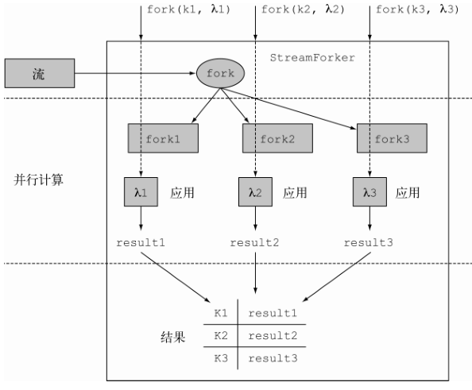

Java8 除了使用最频繁的 行为参数化（Lambda 以及方法引用）、流、CompletableFuture、Optional，还有一些不错的更新。

## 注解

Java 8 中支持了重复注解，不过它目前还不是默认行为，你需要显式地要求进行重复注解（将注解标记为 @Repeatable）。

从Java 8开始，注解已经能应用于任何类型。
这其中包括 new 操作符、类型转换、 instanceof 检查、泛型类型参数，以及 implements 和 throws 子句。

``` java
@NonNull String name = person.getName();

List<@NonNull Car> cars = new ArrayList<>();
```

Java 8并未提供官方的注解或者一种工具能以开箱即用的方式使用它们。它仅仅提供了一种功能，你使用它可以对不同的类型添加注解。

另外对通用目标类型推断也进行了加强。

## 集合类库更新

除了引入了流，Collection API 还有一部分更新，新增方法一览：

|  类/接口   | 新方法                                                       |
| :--------: | ------------------------------------------------------------ |
|    Map     | getOrDefault ， forEach ， compute ， <br />computeIfAbsent ， computeIfPresent ， merge ，<br />putIfAbsent ， remove(key,value) ， replace ， replaceAll |
|  Iterable  | forEach ， spliterator                                       |
|  Iterator  | forEachRemaining                                             |
| Collection | **removeIf** ， stream ， parallelStream                     |
|    List    | **replaceAll** ， sort                                       |
|   BitSet   | stream                                                       |

下面挑几个单独说说

### Map

Map 接口的变化最大，它增加了多个新方法，利用这些新方法能更加便利地操纵 Map 中的数据。
比如， getOrDefault 方法就可以替换现在检测 Map 中是否包含给定键映射的惯用方法。
如果 Map 中不存在这样的键映射，你可以提供一个默认值，方法会返回该默认值。

``` java
// 前
Map<String, Integer> carInventory = new HashMap<>();
Integer count = 0;
if(map.containsKey("Aston Martin")){
  count = map.get("Aston Martin");
}
// 后
Integer count = map.getOrDefault("Aston Martin", 0);
```

> 注意，这一方法仅在没有映射时才生效。比如，如果键被显式地映射到了空值，那么该方法是不会返回你设定的默认值的。

另一个特别有用的方法是 computeIfAbsent ，它能帮助你非常方便地**使用缓存模式**。

``` java
// 前
public String getData(String url){
  String data = cache.get(url);
  if(data == null){
    data = getData(url);
    cache.put(url, data);
  }
  return data;
}

// 后
public String getData(String url){
  return cache.computeIfAbsent(url, this::getData);
}
```

### Collections类

Java 8中它又新增了一个方法，该方法可以**返回不可修改的、同步的、受检查的或者是空的 NavigableMap 或 NavigableSet** 。
除此之外，它还引入了 checkedQueue 方法，该方法返回一个队列视图，可以扩展进行动态类型检查。

### Comparator

Comparator 接口现在同时包含了默认方法和静态方法。

- reversed：

  对当前的 Comparator 对象进行逆序排序，并返回排序之后新的 Comparator 对象。

- thenComparing：

  当两个对象相同时，返回使用另一个 Comparator 进行比较的 Comparator 对象。

- thenComparingInt 、 thenComparingDouble 、 thenComparingLong：

  这些方法的工作方式和 thenComparing 方法类似，不过它们的处理函数是特别针对某些**基本数据类型**（分别对应于 ToIntFunction 、 ToDoubleFunction 和 ToLongFunction ）的。

新的静态方法包括下面这些：

- comparingInt 、 comparingDouble 、 comparingLong：

  它们的工作方式和 comparing 类似，但接受的函数特别针对某些基本数据类型。

- naturalOrder：

  对 Comparable 对象进行**自然排序**，返回一个 Comparator 对象。

- nullsFirst 、 nullsLast：

  对空对象和非空对象进行比较，你可以指定空对象（null）比非空对象（non-null）小或者比非空对象大，返回值是一个 Comparator 对象。

- reverseOrder：

  和 `naturalOrder().reversed()` 方法类似。

## 并发类库更新

除了之前说过的并行流、CompletableFuture， Arrays 类现在支持并发操作了。

这里围绕 `java.util.concurrent.atomic` 包的更新展开讨论。
这个包的主要功能是处理原子变量（atomic variable）。除此之外，我们还会讨论 ConcurrentHashMap 类的更新，它现在又新增了几个方法。

### 原子操作

atomic 包提供了多个对数字类型进行操作的类，比如 AtomicInteger 和 AtomicLong ，它们支持对单一变量的原子操作。

- getAndUpdate：

  以原子方式用给定的方法更新当前值，并返回变更之前的值。

- updateAndGet：

  以原子方式用给定的方法更新当前值，并返回变更之后的值。

- getAndAccumulate：

  以原子方式用给定的方法对当前及给定的值进行更新，并返回变更之前的值。

- accumulateAndGet：

  以原子方式用给定的方法对当前及给定的值进行更新，并返回变更之后的值。

栗子：如何以原子方式比较一个现存的原子整型值和一个给定的观测值，并将变量设定为二者中较小的一个：

`int min = atomicInteger.accumulateAndGet(10, Integer::min);`

### Adder和Accumulator

多线程的环境中，如果多个线程需要**频繁地进行更新操作**，且**很少有读取的动作**，Java API 文档中推荐大家使用新的类 LongAdder 、 LongAccumulator 、DoubleAdder 以及 DoubleAccumulator ，尽量避免使用它们对应的原子类型。这些新的类在设计之初就考虑了动态增长的需求，**可以有效地减少线程间的竞争**。

LongAddr 和 DoubleAdder 类都支持加法操作，而 LongAccumulator 和 DoubleAccumulator 可以使用给定的方法整合多个值。

``` java
// 使用默认构造，初始为 0
LongAdder adder = new LongAdder();
// 可在不同的线程中进行加法运算
adder.add(10);
// 得出 sum 的值
long sum = adder.sum();


LongAccumulator acc = new LongAccumulator(Long::sum, 0);
// 在不同的线程中累计计算值
acc.accumulate(10);
// 获取结果
long result = acc.get();
```

### ConcurrentHashMap

 它对并发的支持非常友好。 ConcurrentHashMap 允许并发地进行新增和更新操作，因为它仅对内部数据结构的**某些部分上锁**。因此，和另一种选择，即同步式的 Hashtable 比较起来，它具有更高的读写性能。

这个之前其实也写过， 在 JDK1.8 中，HashMap 采用位桶 + 链表 + 红黑树实现，当链表长度超过阈值（8）时，将链表转换为红黑树，这样大大减少了查找时间。

> 为了改善性能，要对 ConcurrentHashMap 的内部数据结构进行调整。典型情况下， map 的条目会被存储在桶中，依据键生成哈希值进行访问。但是，如果大量键返回相同的哈希值，**由于桶是由 List 实现的**，它的查询复杂度为O(n)，这种情况下性能会恶化。
>
> 在Java 8中，当桶过于臃肿时，它们会被动态地替换为排序树（sorted tree），新的数据结构具有更好的查询性能（排序树的查询复杂度为O(log(n))）。
>
> **注意，这种优化只有当键是可以比较的（比如 String 或者 Number 类）时才可能发生。**

ConcurrentHashMap 支持三种新的操作，这些操作和你之前在流中所见的很像：

- forEach：

  对每个键值对进行特定的操作

- reduce：

  使用给定的精简函数（reduction function），将所有的键值对整合出一个结果

- search：

  对每一个键值对执行一个函数，直到函数的返回值为一个非空值

以上每一种操作都支持四种形式，接受使用键、值、 Map.Entry 以及键值对的函数：

1. 使用键和值的操作（ forEach 、 reduce 、 search ）
2. 使用键的操作（ forEachKey 、 reduceKeys 、 searchKeys ）
3. 使用值的操作 （ forEachValue 、 reduceValues 、 searchValues ）
4. 使用 Map.Entry 对象的操作（ forEachEntry 、 reduceEntries 、 searchEntries ）

这些操作不会对 ConcurrentHashMap 的状态上锁。它们只会在运行过程中对元素进行操作。应用到这些操作上的函数不应该对任何的顺序，或者其他对象，抑或在计算过程发生变化的值，有依赖。

除此之外，你需要为这些操作指定一个并发阈值。如果经过预估当前 map 的大小小于设定的阈值，操作会顺序执行。

---

ConcurrentHashMap 类提供了一个新的方法，名叫 **mappingCount** ，它以长整型 long 返回 map 中映射的数目。我们应该尽量使用这个新方法，而不是老的 size 方法， size 方法返回的类型为 int 。这是因为映射的数量可能是 int 无法表示的。

ConcurrentHashMap 类还提供了一个名为 KeySet 的新方法，该方法以 Set 的形式返回 ConcurrentHashMap 的一个**视图**（对 map 的修改会反映在该 Set 中，反之亦然）。
你也可以使用新的静态方法 newKeySet ，由 ConcurrentHashMap 创建一个 Set 。

## 其他类库更新

### Arrays

parallelSort 方法会以并发的方式对指定的数组进行排序，你可以使用自然顺序，也可以为数组对象定义特别的 Comparator 。

setAll 和 parallelSetAll 方法可以以顺序的方式也可以用并发的方式，使用提供的函数计算每一个元素的值，对指定数组中的所有元素进行设置。
该函数**接受元素的索引**，**返回该索引元素对应的值**。由于 parallelSetAll 需要并发执行，所以**提供的函数必须没有任何副作用**。

``` java
int[] evenNumbers = new int[10];
Arrays.setAll(evenNumbers, i -> i * 2);
```

parallelPrefix 方法**以并发的方式**，用用户提供的二进制操作符对给定数组中的每个元素进行累积计算。

``` java
int[] ones = new int[10];
Arrays.fill(ones, 1);
Arrays.parallelPrefix(ones, (a, b) -> a + b);
// out：[1, 2, 3, 4, 5, 6, 7, 8, 9, 10]
```

其中，a 会随着 a+b 递增，而 b 固定为 1，也就是 b 为数组原来的数，执行后就变成了 a+b，嗯....有点乱。

### Number和String

Number 类中新增的方法如下：

- Short 、 Integer 、 Long 、 Float 和 Double 类提供了静态方法 sum 、 min 和 max 。
- Integer 和 Long 类提供了 compareUnsigned 、 divideUnsigned 、 remainderUnsigned 和 toUnsignedLong 方法来处理**无符号数**。
- Integer 和 Long 类也分别提供了静态方法 parseUnsignedInt 和 parseUnsignedLong 将字符解析为无符号 int 或者 long 类型。
- Byte 和 Short 类提供了 toUnsignedInt 和 toUnsignedLong 方法通过无符号转换将参数转化为 int 或者 long 类型,类似地 ， Integer 类现在也提供了静态方法 toUnsignedLong 。
- Double 和 Float 类提供了静态方法 isFinite ，可以检查参数是否为有限浮点数。
- Boolean 类现在提供了静态方法 logicalAnd 、 logicalOr 和 logicalXor ，可以在两个 boolean 之间执行 and 、 or 和 xor 操作。
- BigInteger 类提供了 byteValueExact 、 shortValueExact 、 intValueExact 和 longValueExact ，可以将 BigInteger 类型的值转换为对应的基础类型。不过，如果在转换过程中有信息的丢失，方法会抛出算术异常。

---

String 类也新增了一个静态方法，名叫 join 。

这样用：`String authors = String.join(", ", "Raoul", "Mario", "Alan");`

### Files

现在可以用文件直接产生流，例如通过 Files.lines 该方法你可以以延迟方式读取文件的内容，并将其作为一个流。

- Files.list：

  生成由指定目录中所有条目构成的 `Stream<Path>` 。这个列表**不是递归包含的**。由于流是**延迟消费的**，处理包含内容非常庞大的目录时，这个方法非常有用。

- Files.walk：

  和 Files.list 有些类似，它也生成包含给定目录中所有条目的 `Stream<Path>` 。

  不过这个列表**是递归的**，你可以设定递归的深度。注意，该遍历是依照深度优先进行的。

- Files.find：

  通过递归地遍历一个目录找到符合条件的条目，并生成一个 `Stream<Path>` 对象。

## Lambda和JVM字节码

我们的理解中似乎在编译过程中让 Java 编译器直接将 Lambda 表达式转换为匿名类更直观。不过，匿名类有着种种不尽如人意的特性，会对应用程序的性能带来负面影响。

- 编译器会为每个匿名类生成一个新的 `.class` 文件。

  这些新生成的类文件的文件名通常以 `ClassName$1` 这种形式呈现，其中 ClassName 是匿名类出现的类的名字，紧跟着一个美元符号和一个数字。

  生成大量的类文件是不利的，因为每个类文件在使用之前都需要加载和验证，这会直接影响应用的启动性能。

- 每个新的匿名类都会为类或者接口产生一个新的子类型。

  如果你为了实现一个比较器，使用了一百多个不同的 Lambda 表达式，这意味着该比较器会有一百多个不同的子类型。这种情况下，JVM 的运行时性能调优会变得更加困难。

编译时，匿名类和 Lambda 表达式使用了不同的字节码指令，在 Lambda 中创建额外的类现在被 invokedynamic 指令替代了。

> 字节码指令 invokedynamic 最初被 JDK7 引入，用于支持运行于 JVM 上的动态类型语言。
> 执行方法调用时， invokedynamic 添加了更高层的抽象，使得一部分逻辑可以依据动态语言的特征来决定调用目标

以这种方式使用 invokedynamic ，可以将实现 Lambda 表达式的这部分代码的字节码生成推迟到运行时。

PS：生成方法的签名不会和 Lambda 表达式一样，因为它还需要携带参数来传递上下文中额外的状态。为了实现这一目标，最简单的方案是在 Lambda 表达式中为每一个需要额外保存的变量预留参数。

## 以并发方式在同一个流上执行多种操作

实际操作中，如果你试图多次遍历同一个流，结果就是得到一个 IllegalStateException 异常啦，虽然流的设计就是如此，但我们在处理流时经常希望能同时获取多个结果。

为了达到这一目标，你需要一个 fork 类型的方法，对每个复制的流应用不同的函数。更理想的情况是你能以并发的方式执行这些操作，用不同的线程执行各自的运算得到对应的结果。

不幸的是，这些特性目前还没有在Java 8 的流实现中提供。不过，会为你展示一种方法，利用一个通用 API ，即 Spliterator ，尤其是它的延迟绑定能力，结合 BlockingQueues 和 Futures 来实现这一大有裨益的特性。

### 复制流

你需要做的第一件事就是创建一个 StreamForker ，这个 StreamForker 会对原始的流进行封装，在此基础之上你可以继续定义你希望执行的各种操作：

``` java
/**
 * 定义一个 StreamForker ，在一个流上执行多个操作
 */
public class StreamForker<T> {
  private final Stream<T> stream;
  private final Map<Object, Function<Stream<T>, ?>> forks = new HashMap<>();
  
  public StreamForker(Stream<T> stream) {
    this.stream = stream;
  }
  
  /**
   * key 参数，通过它你可以取得操作的结果，并将这些键/函数对累积到一个内部的 Map 中
   * Function 参数，它对流进行处理，将流转变为代表这些操作结果的任何类型
   */
  public StreamForker<T> fork(Object key, Function<Stream<T>, ?> f) {
    // 使用一个键对流上的函数进行索引
    forks.put(key, f);
    // 链式调用
    return this;
  }
  
  public Results getResults() {
    // To be implemented
  }
}
```

主要思想：



 StreamForker 会遍历原始的流，并创建它的三个副本。这时就可以并行地在复制的流上执行这三种操作，这些函数运行的结果由对应的键进行索引，最终会填入到结果的 Map 。

所有由 fork 方法添加的**操作的执行**都是通过 getResults 方法的**调用触发的**，该方法返回一个 Results 接口的实现，具体的定义如下：

``` java
public static interface Results {
  public <R> R get(Object key);
}
```

你可以将 fork 方法中使用的 key 对象作为参数传入，方法会返回该键对应的操作结果。

### 实现Results接口

之前的方法还留了一个方法没实现对吧，然后它的返回值是一个 Results 类型的，这里就来补全这个类，使用 ForkingStreamConsumer 实现 Results 接口。

``` java
// 定义在 StreamForker 中
public Results getResults() {
  ForkingStreamConsumer<T> consumer = build();
  try {
    stream.sequential().forEach(consumer);
  } finally {
    consumer.finish();
  }
  return consumer;
}

/**
 * 使用 build 方法创建 ForkingStreamConsumer
 */
private ForkingStreamConsumer<T> build() {
  // 创建由队列组成的列表，每一个队列对应一个操作
  List<BlockingQueue<T>> queues = new ArrayList<>();
  // 建立用于标识 操作的键 与 包含操作结果 的 Future之间的映射关系
  Map<Object, Future<?>> actions = forks.entrySet().stream()
    .reduce(
    new HashMap<Object, Future<?>>(),
    (map, e) -> {
      map.put(e.getKey(),
              getOperationResult(queues, e.getValue()));
      return map;
    },
    (m1, m2) -> {
      m1.putAll(m2);
      return m1;
    });
  return new ForkingStreamConsumer<>(queues, actions);
}

/**
 * 使用 getOperationResult 方法创建 Future
 */
private Future<?> getOperationResult(List<BlockingQueue<T>> queues,
                                     Function<Stream<T>, ?> f) {
  // 创建一个队列，并将其添加到队列的列表中
  BlockingQueue<T> queue = new LinkedBlockingQueue<>();
  queues.add(queue);
  
  // 使用 Spliterator 遍历队列的元素
  Spliterator<T> spliterator = new BlockingQueueSpliterator<>(queue);
  // 创建一个流，将 Spliterator 作为数据源
  Stream<T> source = StreamSupport.stream(spliterator, false);
  // 创建一个 Future 对象，以异步方式计算在流上执行特定函数的结果
  return CompletableFuture.supplyAsync( () -> f.apply(source) );
}
```

ForkingStreamConsumer 它主要的任务就是处理流中的元素，将它们分发到多个 BlockingQueues 中处理， BlockingQueues 的数量和通过 fork 方法提交的操作数是一致的。
注意，我们很明确地知道**流是顺序处理的**，不过，如果你在一个并发流上执行 forEach 方法，它的元素可能就不是顺序地被插入到队列中了。 
**finish 方法会在队列的末尾插入特殊元素表明该队列已经没有更多需要处理的元素了**。

在 build 方法中我们创建了一个 Map ， Map 的键就是你在流中用于标识不同操作的键，值包含在 Future 中，Future 中包含了这些操作对应的处理结果。 
BlockingQueues 的列表和 Future 组成的 Map 会被传递给 ForkingStreamConsumer 的构造函数。每个 Future 都是通过 getOperationResult 方法创建的。

getOperationResult 方法会创建一个新的 BlockingQueue ，并将其添加到队列的列表。这个队列会被传递给一个新的 BlockingQueueSpliterator 对象，后者是一个延迟绑定的 Spliterator ，它会遍历读取队列中的每个元素。

### ForkingStreamConsumer

然后就是还剩下 ForkingStreamConsumer 与 BlockingQueueSpliterator 这两个没实现：

``` java
/**
 * 实现 ForkingStreamConsumer 类，为其添加处理多个队列的流元素
 */
static class ForkingStreamConsumer<T> implements Consumer<T>, Results {
  static final Object END_OF_STREAM = new Object();
  private final List<BlockingQueue<T>> queues;
  private final Map<Object, Future<?>> actions;
  
  ForkingStreamConsumer(List<BlockingQueue<T>> queues,
                        Map<Object, Future<?>> actions) {
    this.queues = queues;
    this.actions = actions;
  }
  
  @Override
  public void accept(T t) {
    // 将流中遍历的元素添加到所有的队列中
    queues.forEach(q -> q.add(t));
  }
  
  void finish() {
    // 将最后一个元素添加到队列中，表明该流已经结束
    accept((T) END_OF_STREAM);
  }
  
  @Override
  public <R> R get(Object key) {
    try {
      // 等待 Future 完成相关的计算，返回由特定键标识的处理结果
      return ((Future<R>) actions.get(key)).get();
    } catch (Exception e) {
      throw new RuntimeException(e);
    }
  }
}
```

这个类同时实现了 Consumer 和 Results 接口，并持有两个引用，一个指向由 BlockingQueues 组成的列表，另一个是执行了由 Future 构成的 Map 结构，它们表示的是即将在流上执行的各种操作。

Consumer 接口要求实现 accept 方法。这里，每当 ForkingStreamConsumer 接受流中的一个元素，它就会将该元素添加到所有的 BlockingQueues 中。
另外，当原始流中的所有元素都添加到所有队列后， finish 方法会将最后一个元素添加所有队列。 lockingQueueSpliterators 碰到最后这个元素时会知道队列中不再有需要处理的元素了。

最后，流上要进行的每个操作都会对应一个 BlockingQueueSpliterator 。每个 BlockingQueueSpliterator 都持有一个指向 BlockingQueues 的引用，这个 BlockingQueues 是由 ForkingStreamConsumer 生成的。

### BlockingQueueSpliterator

下面把最后的 BlockingQueueSpliterator 实现补上：

``` java
/**
 * 一个遍历 BlockingQueue 并读取其中元素的 Spliterator
 */
class BlockingQueueSpliterator<T> implements Spliterator<T> {
  private final BlockingQueue<T> q;
  
  BlockingQueueSpliterator(BlockingQueue<T> q) {
    this.q = q;
  }
  
  @Override
  public boolean tryAdvance(Consumer<? super T> action) {
    T t;
    while (true) {
      try {
        t = q.take();
        break;
      } catch (InterruptedException e) { }
    }
    if (t != ForkingStreamConsumer.END_OF_STREAM) {
      action.accept(t);
      return true;
    }
    return false;
  }
  
  @Override
  public Spliterator<T> trySplit() {
    return null;
  }
  
  @Override
  public long estimateSize() {
    return 0;
  }
  
  @Override
  public int characteristics() {
    return 0;
  }
}
```

这段代码实现了一个 Spliterator ，不过它并未定义如何切分流的策略，**仅仅利用了流的延迟绑定能力**。由于这个原因，它也没有实现 trySplit 方法。
由于无法预测能从队列中取得多少个元素，所以 estimatedSize 方法也无法返回任何有意义的值。更进一步，由于你没有试图进行任何切分，所以这时的估算也没什么用处。

这段代码中提供了实现的唯一方法是 tryAdvance ，它从 BlockingQueue 中取得原始流中的元素，而这些元素最初由 ForkingSteamConsumer 添加。依据 getOperationResult 方法创建 Spliterator 同样的方式，这些元素会被作为进一步处理流的源头传递给 Consumer 对象（在流上要执行的函数会作为参数传递给某个 fork 方法调用）。 tryAdvance 方法返回 true 通知调用方还有其他的元素需要处理，直到它发现由 ForkingSteamConsumer 添加的特殊对象，表明队列中已经没有更多需要处理的元素了。


右边的 ForkingStreamConsumer 为每一种操作的对象维护了一个队列，原始流中的所有元素会被分发到这些队列中。

图的下半部分，每一个队列都有一个 BlockingQueueSpliterator 从队列中提取元素作为各个流处理的源头。最后，由原始流复制创建的每个流，都会被作为参数传递给某个处理函数，执行对应的操作。

### 实战例子

用下面的代码测试：

``` java
Stream<Dish> menuStream = menu.stream();
StreamForker.Results results = new StreamForker<Dish>(menuStream)
  .fork("shortMenu", s -> s.map(Dish::getName)
        .collect(joining(", ")))
  .fork("totalCalories", s -> s.mapToInt(Dish::getCalories).sum())
  .fork("mostCaloricDish", s -> s.collect(reducing(
    (d1, d2) -> d1.getCalories() > d2.getCalories() ? d1 : d2))
        .get())
  .fork("dishesByType", s -> s.collect(groupingBy(Dish::getType)))
  .getResults();

String shortMenu = results.get("shortMenu");
int totalCalories = results.get("totalCalories");
Dish mostCaloricDish = results.get("mostCaloricDish");
Map<Dish.Type, List<Dish>> dishesByType = results.get("dishesByType");
System.out.println("Short menu: " + shortMenu);
System.out.println("Total calories: " + totalCalories);
System.out.println("Most caloric dish: " + mostCaloricDish);
System.out.println("Dishes by type: " + dishesByType);
```

StreamForker 提供了一种使用简便、结构流畅的 API，它能够复制流，并对每个复制的流施加不同的操作。这些应用在流上以函数的形式表示，可以用任何对象的方式标识，在这个例子里，我们选择使用 String 的方式。

调用 StreamForker 的 getResults 方法，触发所有定义的操作**开始执行**，并取得 StreamForker.Results 。由于这些操作的内部实现就是异步的， getResults 方法调用后会立刻返回，不会等待所有的操作完成，拿到所有的执行结果才返回。

如果该时刻操作已经完成， get 方法会返回对应的结果；否则，该方法会阻塞，直到计算结束，取得对应的操作结果。

### 性能

提起性能，你不应该想当然地认为这种方法比多次遍历流的方式更加高效。如果构成流的数据都保存在内存中，阻塞式队列所引发的开销很容易就抵消了由并发执行操作所带来的性能提升。

与此相反，如果操作涉及大量的 I/O，譬如流的源头是一个巨型文件，那么单次访问流可能是个不错的选择；因此（大多数情况下）优化应用性能唯一有意义的规则是“好好地度量它”。