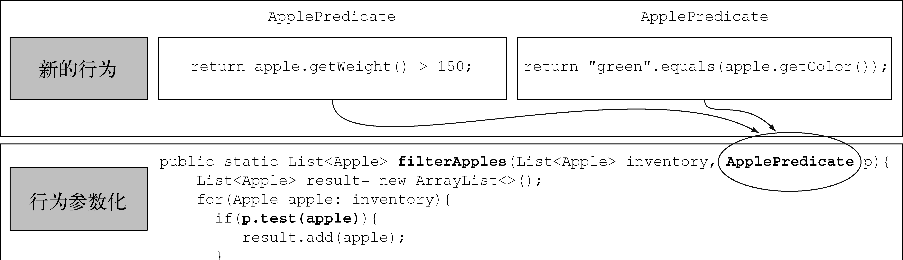
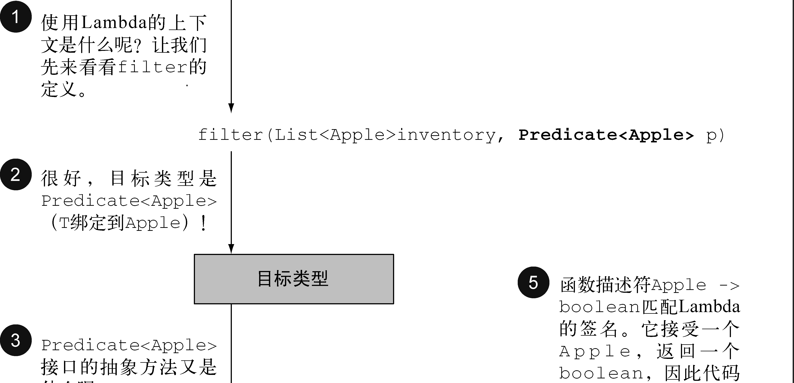

# Java8实战笔记

Java8 的意义不多说了，之前专门介绍过 Java 的几个主要特性，用了两篇才写完觉得已经很全了，最近开始读 《Java8实战》这本书，发现原来的那点远远不够，就此在做补充，Java8 确实带来了一大批更新，如今已经到了 Java11 也是一个 LTS 版本，加入了不少特性，也需要去学习，不能再拖了。

## 写在前面

Java8 对硬件也是有“影响”的，如今我们的计算机都是多核的，但是绝大多数现有的 Java 程序都只使用其中一个内核。在 Java 8 之前，专家们可能会告诉你，必须利用线程才能使用多个内核，而多线程的控制是比较复杂的。

Java 8 提供了一个新的 API（称为“流”，Stream），**它支持许多处理数据的并行操作**，其思路和在数据库查询语言中的思路类似——用更高级的方式表达想要的东西，而由“实现”（在这里是 Streams 库）来选择最佳低级执行机制。

此外，还有两项重要的扩充：把**代码传递给方法**的简洁方式（方法引用、Lambda）和接口中的默认方法。
比方说，你想要写两个只有几行代码不同的方法，那现在你只需要把不同的那部分代码作为参数传递进去就可以了。

最好需要了解一下的概念：

## 流处理

流是一系列数据项，**一次只生成一项**。程序可以从输入流中一个一个读取数据项，然后以同样的方式将数据项写入输出流。一个程序的输出流很可能是另一个程序的输入流。

Java 8在 `java.util.stream` 中添加了一个Stream API； `Stream<T>` 就是一系列 T 类型的项目。你现在可以把它看成一种比较花哨的迭代器。Stream API 的很多方法可以**链接起来形成一个复杂的流水线**；另一个好处是，Java 8 可以透明地把输入的不相关部分拿到几个 CPU 内核上去分别执行你的 Stream 操作流水线——这是**几乎免费的并行**，用不着去费劲搞 Thread 了。

## 行为参数化

Java 8 增加了把方法（你的代码）作为参数传递给另一个方法的能力。

在软件工程中，一个众所周知的问题就是，不管你做什么，用户的需求肯定会变！

你可以将**代码块作为参数传递**给另一个方法，稍后再去执行它。这样，这个方法的行为就基于那块代码被参数化了。

常见的套路是将需求容易变化的部分继续向上抽象，最后抽成一个接口（可以尝试使用匿名类，如果接口只有一个方法，可以使用 Lambda）：



## 几乎免费的并行

你的行为必须能够同时对不同的输入安全地执行。一般情况下这就意味着，你写代码时**不能访问共享的可变数据**。这些函数有时被称为“纯函数”或“无副作用函数”或“无状态函数”。

> 在多个处理器内核之间使用 synchronized ，其代价往往比你预期的要大得多，因为同步迫使代码按照顺序执行，而这与并行处理的宗旨相悖。

这两个要点（没有共享的可变数据，将方法和函数即代码传递给其他方法的能力）是我们平常所说的函数式编程范式的基石。

## 函数

Java 8 中新增了函数——值的一种新形式。它有助于使用前面谈到的流，有了它，Java 8 可以进行多核处理器上的并行编程。

我们要注意到，编程语言的整个目的就在于操作值，这些值因此被称为一等值（或一等公民）；编程语言中的其他结构也许有助于我们表示值的结构，但在程序执行期间不能传递，因而是二等公民。前面所说的值是 Java 中的一等公民，但其他很多 Java 概念（如方法和类等）则是二等公民。

人们发现，在运行时传递方法能将方法变成一等公民。这在编程中非常有用，因此 Java 8 的设计者把这个功能加入到了Java 中。

> Scala 和 Groovy 等语言的实践已经证明，让方法等概念作为一等值可以扩充程序员的工具库，从而让编程变得更容易。
> 一旦程序员熟悉了这个强大的功能，他们就再也不愿意使用没有这一功能的语言了。
> 因此，Java 8 的设计者决定允许方法作为值，让编程更轻松。

看一个例子：

``` java
File[] hiddenFiles = new File(".").listFiles(new FileFilter() {
  public boolean accept(File file) {
    return file.isHidden();
  }
});

// Java 8
File[] hiddenFiles = new File(".").listFiles(File::isHidden);
```

你已经有了函数 isHidden ，因此只需用 Java 8 的**方法引用** `::` 语法（即“把这个方法作为值”）将其传给 listFiles 方法。

但要是你没有方便的方法和类可用，新的 Lambda 语法更简洁。但要是 Lambda 的长度多于几行（它的行为也不是一目了然）的话，那你还是应该用方法引用来指向一个有描述性名称的方法，而不是使用匿名的 Lambda。你应该以代码的清晰度为准绳。

关于 Lambda 的介绍之前已经算写的比较详细了。

> 和 Collection API 相比，Stream API 处理数据的方式非常不同。
> 用集合的话，你得自己去做迭代的过程。你得用 for-each 循环一个个去迭代元素，然后再处理元素。我们把这种数据迭代的方法称为外部迭代。
> 相反，有了 Stream API，你根本用不着操心循环的事情。数据处理完全是在库内部进行的。我们把这种思想叫作内部迭代。

有许多反复出现的数据处理模式，类似于 SQL 查询（筛选、提取、分组）等，这类操作常常可以并行化。例如，在两个 CPU 上筛选列表，可以让一个 CPU 处理列表的前一半，第二个 CPU 处理后一半，这称为分支步骤；CPU 随后对各自的半个列表做筛选；最后，一个 CPU 会把两个结果合并起来。

> **Collection 主要是为了存储和访问数据，而 Stream 则主要用于描述对数据的计算。**
> 这里的关键点在于，Stream 允许并提倡并行处理一个 Stream 中的元素。
> 虽然可能乍看上去有点儿怪，但筛选一个 Collection 的最快方法常常是将其转换为 Stream ，进行并行处理，然后再转换回 List 

## Lambda

用它代替匿名类的用法就不说了，前面已经用烂了，这里主要点一下 Predicate 等对象，利用它们我们就可以定义一些常用的 Lambda 变量。

其实看一下它们的实现就明白是怎么回事了，它们都放在 ` java.util.function` 包里：

``` java
// 它接受泛型 T 对象，并返回一个 boolean 
public interface Predicate<T>{
  boolean test (T t);
}

// 它接受泛型 T 的对象，没有返回（ void ）
public interface Consumer<T>{
  void accept(T t);
}
// e.g.：例如大名鼎鼎的 forEach 实现：
public static <T> void forEach(List<T> list, Consumer<T> c){
  for(T i: list){
    c.accept(i);
  }
}

// 它接受一个泛型 T 的对象，并返回一个泛型 R 的对象
public interface Function<T, R>{
  R apply(T t);
}
// e.g.：应用如 Java8 中 map 方法的实现
public static <T, R> List<R> map(List<T> list,
                                 Function<T, R> f) {
  List<R> result = new ArrayList<>();
  for(T s: list){
    result.add(f.apply(s));
  }
  return result;
}
// e.g.：返回值是 [7, 2, 6]
List<Integer> l = map(
  Arrays.asList("lambdas","in","action"),
  (String s) -> s.length()
);
```

可以说，这一系列对象就是把我们常用的模式给定义好了，方便直接用不用再先搞一个只有一个抽象方法的接口了。

> 如果你去看看新的Java API，会发现函数式接口带有 `@FunctionalInterface` 的标注，这个标注用于表示该接口会设计成一个函数式接口。如果你用 @FunctionalInterface 定义了一个接口，而它却不是函数式接口的话（存在多个抽象方法），编译器将返回一个提示原因的错误。
>
> 不过它不是必需的，但对于为此设计的接口而言，使用它是比较好的做法。就像 @Override 一样。

还有一点需要注意：任何函数式接口都**不允许抛出受检异常**（checked exception）。如果你需要 Lambda 表达式来抛出异常，有两种办法：定义一个自己的函数式接口，并声明受检异常；或者把 Lambda 包在一个 try/catch 块中。

## 原始类型特化

我们都知道 Java 里有装箱和拆箱操作，泛型的 T 是不允许使用基本数据类型的，但是呢，**这在性能方面是要付出代价的**。装箱后的值本质上就是把原始类型包裹起来，并保存在堆里。

因此，**装箱后的值需要更多的内存，并需要额外的内存搜索来获取被包裹的原始值**。

Java 8为我们前面所说的函数式接口带来了一个专门的版本，以便在输入和输出都是原始类型时避免自动装箱的操作。

一般来说，针对专门的输入参数类型的函数式接口的名称都要加上对应的原始类型前缀，比如 `DoublePredicate` 、 `IntConsumer` 、 `LongBinaryOperator` 、 `IntFunction` 等。
Function 接口还有针对输出参数类型的变种：`ToIntFunction<T>` 、 `IntToDoubleFunction` 等。

Java 8中的常用函数式接口：

| 函数式接口            | 函数描述符          | 原始类型特化                                                 |
| --------------------- | ------------------- | ------------------------------------------------------------ |
| `Predicate<T>`        | `T -> boolean`      | IntPredicate、LongPredicate、DoublePredicate                 |
| `Consumer<T>`         | `T -> void`         | IntConsumer、LongConsumer、DoubleConsumer                    |
| `Function<T, R>`      | `T -> R`            | `IntFunction<R>`、<br />IntToDoubleFunction、<br />IntToLongFunction、<br />`LongFunction<R>`、<br />LongToDoubleFunction、<br />LongToIntFunction、<br />`DoubleFunction<R>`、<br />`ToIntFunction<T>`、<br />`ToDoubleFunction<T>`、<br />`ToLongFunction<T>` |
| `Supplier<T>`         | `() -> T`           | BooleanSupplier、IntSupplier、<br />LongSupplier、DoubleSupplier |
| `UnaryOperator<T>`    | `T -> T`            | IntUnaryOperator、<br />LongUnaryOperator、<br />DoubleUnaryOperator |
| `BinaryOperator<T>`   | `(T, T) -> T`       | IntBinaryOperator、<br />LongBinaryOperator、<br />DoubleBinaryOperator |
| `BiPredicate<L, R>`   | `(L, R) -> boolean` |                                                              |
| `BiConsumer<T, U>`    | `(T, U) -> void`    | `ObjIntConsumer<T>`、<br />`ObjLongConsumer<T>`、<br />`ObjDoubleConsumer<T>` |
| `BiFunction<T, U, R>` | `(T, U) -> R`       | `ToIntBiFunction<T, U>`、<br />`ToLongBiFunction<T, U>`、<br />`ToDoubleBiFunction<T, U>` |

如果上面还是没有你想要的“模式”，那就只能自己定义了。

## 类型检查、类型推断以及限制

Lambda 的类型是从使用 Lambda 的上下文推断出来的，下面的这幅图很好：



如果一个 Lambda 的主体是一个语句表达式， 它就和一个返回 void 的函数描述符兼容，也就是说如果函数式接口定义了返回是 void，那么你实际上有返回值也可以兼容，但是我不要而已。但是反过来就不行了。

---

我们还可以进一步简化代码，传入的参数类型可以省略，它可以自己推断出来，有时候显式写出类型更易读，有时候去掉它们更易读。没有什么法则说哪种更好；对于如何让代码更易读，程序员必须做出自己的选择。

---

在 Lambda 中可以使用局部变量（表达式外的变量），但局部变量必须显式声明为 final ，或事实上是 final 。

至于原因，可以从两个方面来看：

1. 实例变量和局部变量背后的实现有一个关键不同。
   实例变量都存储在堆中，而局部变量则保存在栈上。如果 Lambda 可以直接访问局部变量，而且 Lambda 是在一个线程中使用的，则使用 Lambda 的线程，可能会在分配该变量的线程将这个变量收回之后，去访问该变量。
   因此，Java 在访问自由局部变量时，**实际上是在访问它的副本**，而不是访问原始变量。如果局部变量仅仅赋值一次那就没有什么区别了 -- 因此就有了这个限制。
2. 这一限制不鼓励你使用改变外部变量的典型命令式编程模式（这种模式会阻碍很容易做到的并行处理）。

> 闭包：
>
> 用科学的说法来说，闭包就是一个函数的实例，且它可以无限制地访问那个函数的非本地变量。例如，闭包可以作为参数传递给另一个函数。它也可以访问和修改其作用域之外的变量。
>
> 现在，Java 8 的 Lambda 和匿名类可以做类似于闭包的事情：它们可以作为参数传递给方法，并且可以访问其作用域之外的变量。但有一个限制：它们不能修改定义 Lambda 的方法的局部变量的内容。这些变量必须是隐式最终的。**可以认为 Lambda 是对值封闭，而不是对变量封闭。**
>
> 实例变量可以，因为它们保存在堆中，而堆是在线程之间共享的

## 方法引用

方法引用让你可以重复使用现有的方法定义，并像 Lambda 一样传递它们，使用的是 `::` 分隔符形式。

如果一个 Lambda 代表的只是“直接调用这个方法”，那最好还是用名称来调用它，而不是去描述如何调用它。

方法引用就是让你根据已有的方法实现来创建 Lambda 表达式.

注意：方法名后不需要括号，因为你没有实际调用这个方法，类似是一种语法糖啦。

方法引用主要有三类：

1. 指向静态方法的方法引用（ `Integer::parseInt`）
2. 指向任意类型实例方法的方法引用（`String::length`）
3. 指向现有对象的实例方法的方法引用

前两种应该还好理解，第三种方法引用指的是，你在 Lambda 中调用一个已经存在的**外部对象中的方法**。例如， Lambda 表达式 `() -> expensiveTransaction.getValue()` 可以写作 `expensiveTransaction::getValue`。

前两种分隔符前面是类名，而第三种前面是变量名。

 Comparator 接口具有一个叫作 comparing 的静态辅助方法，它可以接受一个 Function 来提取 Comparable 键值，并生成一个 Comparator 对象：
`Comparator<Apple> c = Comparator.comparing((Apple a) -> a.getWeight());`
简化版：`Comparator<Apple> c = Comparator.comparing(Apple :: getWeight);`

## 构造函数引用

对于一个现有构造函数，你可以利用它的名称和关键字 new 来创建它的一个引用：`ClassName::new` 。它的功能与指向静态方法的引用类似。

如果构造函数没有参数，那么它适合 Supplier 的签名；如果只有一个参数，那么适合 Function 的签名；如果有两个参数那么可以试试 BiFunction 的签名。

``` java
Supplier<Apple> c1 = Apple::new;
Apple a1 = c1.get();
// 等价于
Supplier<Apple> c1 = () -> new Apple();
Apple a1 = c1.get();

// 其他形式
Function<Integer, Apple> c2 = Apple::new;
Apple a2 = c2.apply(110);

BiFunction<String, Integer, Apple> c3 = Apple::new;
Apple c3 = c3.apply("green", 110);
```

## 复合 Lambda 表达式

### 比较复合器

- 逆序
  接口有一个默认方法 reversed 可以使给定的比较器逆序：
  `inventory.sort(comparing(Apple::getWeight).reversed());`

- 比较器链
  当根据某个条件比较时，遇到相同的怎么办？可以设置第二要比较的属性：

  ``` java
  inventory.sort(comparing(Apple::getWeight)
                 .reversed()
                 .thenComparing(Apple::getCountry));
  ```

### 谓词复合

谓词接口包括三个方法： negate 、 and 和 or ，这三个都是接口的默认方法，让你可以重用已有的 Predicate 来创建更复杂的谓词。

使用 negate 方法来返回一个 Predicate 的非。

``` java
Predicate<Apple> redAndHeavyAppleOrGreen =
  redApple.and(a -> a.getWeight() > 150)
  .or(a -> "green".equals(a.getColor()));
```

 and 和 or 方法是按照在表达式链中的位置，从左向右确定优先级的。因此， `a.or(b).and(c)` 可以看作 `(a || b) && c` 。

### 函数复合

 Function 接口为此配了 andThen 和 compose 两个默认方法，它们都会返回 Function 的一个实例。

andThen 方法会返回一个函数，它先对输入应用一个给定函数，再对输出应用另一个函数。

``` java
// 对一个数先加一再乘以二
Function<Integer, Integer> f = x -> x + 1;
Function<Integer, Integer> g = x -> x * 2;
Function<Integer, Integer> h = f.andThen(g);
int result = h.apply(1);
```

类似地 compose 方法就是先把给定的函数用作 compose 的参数里面给的那个函数，然后再把函数本身用于结果。也就是  `f(g(x))`  和 `g(f(x))` 的关系。

PS：无论怎样，Java 无法摆脱“一切都是对象”的思想 —— 它不能让函数完全独立！