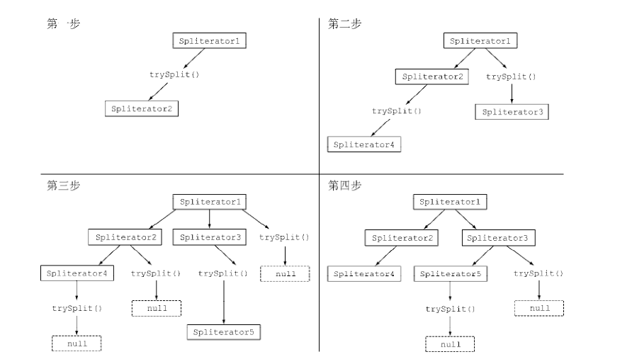

# Java8实战笔记（三）

## 并行数据处理

对顺序流调用 parallel 方法可以将其转换为并行流：

``` java
public static long parallelSum(long n) {
  return Stream.iterate(1L, i -> i + 1)
    .limit(n)
    .parallel()
    .reduce(0L, Long::sum);
}

// LongStream.rangeClosed 直接产生原始类型的 long 数字，没有装箱拆箱的开销
// 会生成数字范围，很容易拆分为独立的小块
public static long rangedSum(long n) {
  return LongStream.rangeClosed(1, n)
    .parallel()
    .reduce(0L, Long::sum);
}

// 最后调用的是 parallel，所以它会并行执行
stream.parallel()
  .filter(...)
  .sequential()
  .map(...)
  .parallel()
  .reduce();
```

这样就会将其分成几块流同时进行计算，最后，归纳操作会将各个子流的部分归纳结果合并起来，得到整个原始流的归纳结果。

在现实中，对顺序流调用 parallel 方法并不意味着流本身有任何实际的变化。它在内部实际上就是设了一个 boolean 标志，表示你想让**调用 parallel 之后**进行的所有操作都并行执行。

类似地，你只需要对并行流调用 sequential 方法就可以把它变成顺序流。请注意，你可能以为把这两个方法结合起来，就可以更细化地控制在遍历流时哪些操作要并行执行，哪些要顺序执行，**但最后一次 parallel 或 sequential 调用会影响整个流水线**。

> 并行流内部使用了默认的 ForkJoinPool （分支/合并框架），它默认的线 程 数量就是你的处理器数量 ，这个值是由 `Runtime.getRuntime().availableProcessors()` 得到的。
>
> 我们很难把 iterate 分成多个独立块来并行执行，因为每次应用这个函数都要依赖前一次应用的结果。

所以，在上面一开始展示的代码中，整张数字列表在归纳过程开始时没有准备好，因而无法有效地把流划分为小块来并行处理。把流标记成并行，你其实是给顺序处理增加了开销，它还要把每次求和操作分到一个不同的线程上。

---

但是，并行化并不是没有代价的。并行化过程本身需要对流做递归划分，把每个子流的归纳操作分配到不同的线程，然后把这些操作的结果合并成一个值。但在多个内核之间移动数据的代价也可能比你想的要大，所以很重要的一点是要保证在内核中并行执行工作的时间比在内核之间传输数据的时间长。

总而言之，很多情况下不可能或不方便并行化。然而，在使用并行 Stream 加速代码之前，你必须确保用得对；如果结果错了，算得快就毫无意义了。

---

使用建议：

把顺序流转成并行流轻而易举，但却不一定是好事，并行流并不总是比顺序流快，所以测试一下很有必要。

**留意装箱**。自动装箱和拆箱操作会大大降低性能。Java 8中有原始类型流（ IntStream 、LongStream 、 DoubleStream ）来避免这种操作，但凡有可能都应该用这些流。

**有些操作本身在并行流上的性能就比顺序流差**。特别是 limit 和 findFirst 等依赖于元素顺序的操作，它们在并行流上执行的代价非常大。

对于较小的数据量，选择并行流几乎从来都不是一个好的决定。

要考虑流背后的数据结构是否易于分解。例如， ArrayList 的拆分效率比 LinkedList 高得多，因为前者用不着遍历就可以平均拆分，而后者则必须遍历。另外，用 range 工厂方法创建的原始类型流也可以快速分解。

流自身的特点，以及流水线中的中间操作修改流的方式，都可能会改变分解过程的性能。

终端操作中合并流的成本。

---

流的数据源和可分解性：

|       源        | 可分解性 |
| :-------------: | :------: |
|    ArrayList    |   极佳   |
|   LinkedList    |    差    |
| IntStream.range |   极佳   |
| Stream.iterate  |    差    |
|     HashSet     |    好    |
|     TreeSet     |    好    |

按照可分解性总结了一些流数据源适不适于并行。

## 分支/合并框架

Java7 中新加入的分支/合并框架的目的是以递归方式将可以并行的任务拆分成更小的任务，然后将每个子任务的结果合并起来生成整体结果。它是 ExecutorService 接口的一个实现，它把子任务分配给线程池（称为 ForkJoinPool ）中的工作线程。

### RecursiveTask

要把任务提交到这个池，必须创建 `RecursiveTask<R>` 的一个子类，其中 R 是并行化任务（以及所有子任务）产生的结果类型，或者如果任务不返回结果，则是 RecursiveAction 类型。

要定义 RecursiveTask， 只需实现它唯一的抽象方法：`protected abstract R compute();`

这个方法同时定义了将任务拆分成子任务的逻辑，以及无法再拆分或不方便再拆分时，生成单个子任务结果的逻辑，伪代码：

``` java
if (任务足够小或不可分) {
  // 顺序计算该任务
} else {
  // 将任务分成两个子任务
  // 递归调用本方法，拆分每个子任务，等待所有子任务完成
  // 合并每个子任务的结果
}


// 求和示例
public class ForkJoinSumCalculator
  extends java.util.concurrent.RecursiveTask<Long> {
  // 要求和的数组
  private final long[] numbers;
  // 子任务处理数组的开始与结束位置
  private final int start;
  private final int end;
  // 任务不可再分的阀值
  public static final long THRESHOLD = 10_000;

  public ForkJoinSumCalculator(long[] numbers) {
    this(numbers, 0, numbers.length);
  }

  private ForkJoinSumCalculator(long[] numbers, int start, int end) {
    this.numbers = numbers;
    this.start = start;
    this.end = end;
  }

  @Override
  protected Long compute() {
    int length = end - start;
    if (length <= THRESHOLD) {
      return computeSequentially();
    }

    // 创建一个子任务来为数组的前一半求和
    ForkJoinSumCalculator leftTask =
      new ForkJoinSumCalculator(numbers, start, start + length/2);
    // 利 用 另 一 个 ForkJoinPool 线程异步执行新创建的子任务
    leftTask.fork();

    ForkJoinSumCalculator rightTask =
      new ForkJoinSumCalculator(numbers, start + length/2, end);
    // 同步执行第二个子任务，有可能允许进一步递归划分
    Long rightResult = rightTask.compute();
    // 读取第一个子任务的结果，如果尚未完成就等待
    Long leftResult = leftTask.join();
    // 合并操作
    return leftResult + rightResult;
  }

  private long computeSequentially() {
    long sum = 0;
    for (int i = start; i < end; i++) {
      sum += numbers[i];
    }
    return sum;
  }
}

// 运行
public static long forkJoinSum(long n) {
  long[] numbers = LongStream.rangeClosed(1, n).toArray();
  ForkJoinTask<Long> task = new ForkJoinSumCalculator(numbers);
  return new ForkJoinPool().invoke(task);
}
```

### 使用分支/合并框架的最佳做法

对一个任务调用 join 方法会阻塞调用方，直到该任务做出结果。因此，有必要在两个子任务的计算都开始之后再调用它。

不应该在 RecursiveTask 内部使用 ForkJoinPool 的 invoke 方法。相反，你应该始终直接调用 compute 或 fork 方法，只有顺序代码才应该用 invoke 来启动并行计算。

对子任务调用 fork 方法可以把它排进 ForkJoinPool 。同时对左边和右边的子任务调用它似乎很自然，但这样做的效率要比直接对其中一个调用 compute 低。这样做你可以为其中一个子任务**重用同一线程**，从而避免在线程池中多分配一个任务造成的开销。

和并行流一样，你不应理所当然地认为在多核处理器上使用分支/合并框架就比顺序计算快。一个惯用方法是把输入/输出放在一个子任务里，计算放在另一个里，这样计算就可以和输入/输出同时进行。

---

分支/合并框架工程用一种称为工作窃取（work stealing）的技术来解决每个子任务花费时间差距过大问题。

在实际应用中，这些任务差不多被平均分配到 ForkJoinPool 中的所有线程上。每个线程都为分配给它的任务保存一个**双向链式队列**，每完成一个任务，就会从队列头上取出下一个任务开始执行。

基于前面所述的原因，某个线程可能早早完成了分配给它的所有任务，也就是它的队列已经空了，而其他的线程还很忙。这时，这个线程并没有闲下来，而是随机选了一个别的线程，**从队列的尾巴上“偷走”一个任务**。

这个过程一直继续下去，直到所有的任务都执行完毕，所有的队列都清空。这就是为什么**要划成许多小任务而不是少数几个大任务**，这有助于更好地在工作线程之间平衡负载。

## Spliterator

Spliterator 是Java 8中加入的另一个新接口；这个名字代表“可分迭代器”（splitableiterator）。和 Iterator 一样， Spliterator 也用于遍历数据源中的元素，但它是为了并行执行而设计的。

Java 8已经为集合框架中包含的所有数据结构提供了一个默认的 Spliterator 实现。集合实现了 Spliterator 接口，接口提供了一个 spliterator 方法。

将 Stream 拆分成多个部分的算法是一个递归过程：

- 第一步是对第一个 Spliterator 调用 trySplit ，生成第二个 Spliterator （此方法会让他们并行处理）。
- 第二步**对这两个** Spliterator 调用 trysplit ，这样总共就有了四个 Spliterator 。这个框架不断对 Spliterator 调用 trySplit 直到它返回 null ，表明它处理的数据结构不能再分割。

 Spliterator 还可通过 estimateSize 方法估计还剩下多少元素要遍历，因为即使不那么确切，能快速算出来是一个值也有助于让拆分均匀一点。



## 高效Java8编程

大多数情况下，如果使用 Java8 肯定会用 Lambda 来代替匿名类的，不过需要注意的是：

**匿名类和 Lambda 表达式中的 this 和 super 的含义是不同的**。在匿名类中， this 代表的是类自身，但是在 Lambda 中，它代表的是包含类。其次，匿名类可以屏蔽包含类的变量，而 Lambda 表达式不能。

``` java
int a = 10;
Runnable r1 = () -> {
  int a = 2;  // 编译错误
  System.out.println(a);
};
```

最后，在涉及重载的上下文里，将匿名类转换为 Lambda 表达式可能导致最终的代码更加晦涩。实际上，匿名类的类型是在初始化时确定的，而 Lambda 的类型取决于它的上下文。

``` java
// 准备重载
interface Task{
  public void execute();
}
public static void doSomething(Runnable r){ r.run(); }
public static void doSomething(Task a){ a.execute(); }

// 无法确定类型
doSomething(() -> System.out.println("Danger danger!!"));
// 使用显式类型转换标识
doSomething((Task)() -> System.out.println("Danger danger!!"));
```

---

Lambda 表达式非常适用于需要传递代码片段的场景。不过，为了改善代码的可读性，也请尽量使用方法引用。因为方法名往往能更直观地表达代码的意图，当代码逻辑过多的时候推荐将其抽取到方法中，然后传递方法过去。

除此之外，我们还应该尽量考虑使用静态辅助方法，比如 comparing 、 maxBy 。这些方法设计之初就考虑了会结合方法引用一起使用。

``` java
// 前
inventory.sort(
  (Apple a1, Apple a2) -> a1.getWeight().compareTo(a2.getWeight()));
// 后
inventory.sort(comparing(Apple::getWeight));

// 前
int totalCalories =
  menu.stream().map(Dish::getCalories)
  .reduce(0, (c1, c2) -> c1 + c2);
// 后
int totalCalories = menu.stream().collect(summingInt(Dish::getCalories));
```

---

从命令式的数据处理切换到 Stream 是个不错的想法，不幸的是，将命令式的代码结构转换为 Stream API 的形式是个困难的任务，因为你需要考虑控制流语句，比如 break 、 continue 、 return ，并选择使用恰当的流操作。好消息是已经有一些工具可以帮助我们完成这个任务。

---

为了增加代码的灵活性，采用函数接口是个不错的想法，因为这样就可以使用 Lambda 了！这里有两种简单的模式可供学习：有条件的延迟执行和环绕执行。

``` java
/**
 * 延迟执行例子
 */
if (logger.isLoggable(Log.FINER)){
  logger.finer("Problem: " + generateDiagnostic());
}
// 1.改为内部判断，省去条件判断逻辑
// 存在问题：日志消息的输出与否每次都需要判断，即使你已经传递了参数，不开启日志
logger.log(Level.FINER, "Problem: " + generateDiagnostic());
// 2.使用延迟构造，日志就只会在某些特定的情况下才开启
public void log(Level level, Supplier<String> msgSupplier){
  if(logger.isLoggable(level)){
    log(level, msgSupplier.get());
  }
}
// 调用测试，generateDiagnostic 方法只有在必要的时候才会被调用
logger.log(Level.FINER, () -> "Problem: " + generateDiagnostic());


/**
 * 环绕执行的例子
 */
String oneLine =
  processFile((BufferedReader b) -> b.readLine());
String twoLines =
  processFile((BufferedReader b) -> b.readLine() + b.readLine());

public static String processFile(BufferedReaderProcessor p) throws IOException {
  try(BufferedReader br 
      = new BufferedReader(new FileReader("/data.txt"))){
    return p.process(br);
  }
}

public interface BufferedReaderProcessor{
  String process(BufferedReader b) throws IOException;
}
```

### 使用Lambda重构设计模式

使用 Lambda 表达式后，很多现存的略显臃肿的面向对象设计模式能够用更精简的方式实现了，除了之前做过笔记的策略模式、模板方法、观察者模式、工厂模式等，主要说下责任链模式。

责任链模式是一种创建处理对象序列（比如操作序列）的通用方案。一个处理对象可能需要在完成一些工作之后，将结果传递给另一个对象，这个对象接着做一些工作，再转交给下一个处理对象，以此类推。

通常，这种模式是通过定义一个代表处理对象的抽象类来实现的，在抽象类中会定义一个字段来记录后续对象。一旦对象完成它的工作，处理对象就会将它的工作转交给它的后继。

``` java
public abstract class ProcessingObject<T> {
  protected ProcessingObject<T> successor;
  public void setSuccessor(ProcessingObject<T> successor){
    this.successor = successor;
  }
  
  // 如何进行工作处理
  public T handle(T input){
    T r = handleWork(input);
    if(successor != null){
      return successor.handle(r);
    }
    return r;
  }
  
  // 需要实现的具体处理逻辑
  abstract protected T handleWork(T input);
}

/**
 * 调用示例
 */
// 首先定义两个处理链
public class HeaderTextProcessing extends ProcessingObject<String> {
  public String handleWork(String text){
    return "From Raoul, Mario and Alan: " + text;
  }
}
public class SpellCheckerProcessing extends ProcessingObject<String> {
  public String handleWork(String text){
    return text.replaceAll("labda", "lambda");
  }
}
// 初始化及其调用
ProcessingObject<String> p1 = new HeaderTextProcessing();
ProcessingObject<String> p2 = new SpellCheckerProcessing();
p1.setSuccessor(p2);
String result = p1.handle("Aren't labdas really sexy?!!");


/**
 * 尝试使用 Lambda
 */
UnaryOperator<String> headerProcessing =
  (String text) -> "From Raoul, Mario and Alan: " + text;
UnaryOperator<String> spellCheckerProcessing =
  (String text) -> text.replaceAll("labda", "lambda");
// 将前两个操作连起来
Function<String, String> pipeline =
  headerProcessing.andThen(spellCheckerProcessing);
String result = pipeline.apply("Aren't labdas really sexy?!!");
```

看上去显得十分优雅，不过对于复杂逻辑的处理还是封装一下比较好，并且想要熟练的运用还是得多多练习的。

工厂模式中，使用 `ClassName::new` 的方式来创建对象也确实优雅了不少，不过它的局限性也比较大，只适合简单的对象构造。

## 默认方法

这里我学到了一个知识点：

向接口添加新方法是二进制兼容的，这意味着如果不重新编译该类，即使不实现新的方法，现有类的实现依旧可以运行。

变更对 Java 程序的影响大体可以分成三种类型的兼容性，分别是：

1. 二进制级的兼容
2. 源代码级的兼容
3. 函数行为的兼容

二进制级的兼容性表示现有的二进制执行文件能无缝持续链接（包括验证、准备和解析）和运行。比如，为接口添加一个方法就是二进制级的兼容，这种方式下，如果新添加的方法不被调用，接口已经实现的方法可以继续运行，不会出现错误。

源代码级的兼容性表示引入变化之后，现有的程序依然能成功编译通过。比如，向接口添加新的方法就不是源码级的兼容，因为遗留代码并没有实现新引入的方法，所以它们无法顺利通过编译。

函数行为的兼容性表示变更发生之后，程序接受同样的输入能得到同样的结果。

---

既然有了默认方法，就不得不考虑一个问题：多重继承，因为接口是可以多继承的，所以这样就会导致默认方法也会多继承。

我们知道 Java 语言中一个类只能继承一个父类，但是一个类可以实现多个接口。随着默认方法在 Java 8 中引入，有可能出现一个类继承了多个方法而它们使用的却是同样的函数签名。这种情况下，类会选择使用哪一个函数？在实际情况中，像这样的冲突可能极少发生，但是一旦发生这样的状况，必须要有一套规则来确定按照什么样的约定处理这些冲突。

解决问题的三条规则：

1. 类中的方法优先级最高。**类或父类中声明的方法的优先级高于任何声明为默认方法的优先级**。
2. 如果无法依据第一条进行判断，那么**子接口的优先级更高**：函数签名相同时，优先选择拥有最具体实现的默认方法的接口，即如果 B 继承了 A ，那么 B 就比 A 更加具体。
3. 最后，如果还是无法判断，继承了多个接口的类**必须通过显式覆盖和调用期望的方法，显式地选择使用哪一个默认方法的实现**。

下面来看一个例子：

``` java
// 准备工作
public interface A {
  default void hello() {
    System.out.println("Hello from A");
  }
}
public interface B extends A {
  default void hello() {
    System.out.println("Hello from B");
  }
}
public class D implements A{ }

// 测试类
public class C extends D implements B, A {
  public static void main(String... args) {
    new C().hello();
  }
}
```

依据规则 (1)，类中声明的方法具有更高的优先级。但是 D 并未覆盖 hello 方法，虽然它实现了接口 A ，它拥有接口 A 的默认方法。

规则 (2) 说如果类或者父类没有对应的方法，那么就应该选择提供了最具体实现的接口中的方法。因此，编译器会在接口 A 和接口 B 的 hello 方法之间做选择。由于 B 更加具体，所以程序会选择 B 的默认方法。

如果接口 A 和 B 之间没有继承关系，那么规则 (2) 就无法进行判断了，因为从编译器的角度看没有哪一个接口的实现更加具体，两个都差不多。所以，Java 编译器这时就会抛出一个编译错误。

解决这种两个可能的有效方法之间的冲突，没有太多方案；你只能显式地决定你希望在 C 中使用哪一个方法，你可以覆盖类 C 中的 hello 方法，Java 8 中引入了一种新的语法 `X.super.m(…)` ，其中 X 是你希望调用的 m 方法所在的父接口。

``` java
public class C implements B, A {
  void hello(){
    // 显式地选择调用接口 B 中的方法
    B.super.hello();
  }
}
```

---

下面来看一种特殊情况，菱形继承！

``` java
// 准备工作
public interface A{
  default void hello(){
    System.out.println("Hello from A");
  }
}
public interface B extends A { }
public interface C extends A { }

// 测试类
public class D implements B, C {
  public static void main(String... args) {
    new D().hello();
  }
}
```

结果其实很好猜，编译没问题，正常打印“Hello from A”，如果 B、C 任意一方也定义了一样的 hello 方法，那么按照规定 2 会选择 B 或者 C 方法，如果他们都定义了相同的默认方法那么编译错误。

如果 B 或 C 任意一方定义了抽象的 hello 方法那么 D 中必须要显式实现，否则编译错误。

解决冲突只需要注意这三条规则即可：

1. 类或父类中显式声明的方法，其优先级高于所有的默认方法。
2. 如果用第一条无法判断，方法签名又没有区别，那么选择提供最具体实现的默认方法的接口。
3. 如果冲突依旧无法解决，你就只能在你的类中覆盖该默认方法，显式地指定在你的类中使用哪一个接口中的方法。

## 其他

这里介绍一个调试 Stream 中可能会用到的一个方法 peek， peek 的设计初衷就是在流的每个元素恢复运行之前，插入执行一个动作。

``` java
List<Integer> result =
  numbers.stream()
  .peek(x -> System.out.println("from stream: " + x))
  .map(x -> x + 17)
  .peek(x -> System.out.println("after map: " + x))
  .filter(x -> x % 2 == 0)
  .peek(x -> System.out.println("after filter: " + x))
  .limit(3)
  .peek(x -> System.out.println("after limit: " + x))
  .collect(toList());
```

