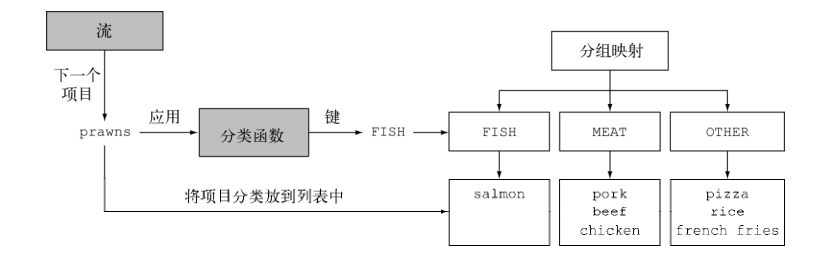
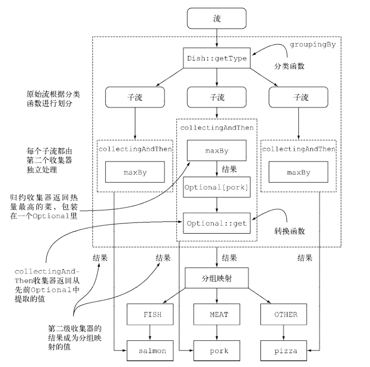

# 函数式数据处理

## 引入流

为了提高性能，我们需要并行处理，那么什么是流？

> 流是 Java API 的新成员，它允许你**以声明性方式处理数据集合**（通过查询语句来表达，而不是临时编写一个实现）。
> 就现在来说，你可以把它们看成遍历数据集的高级迭代器。此外，流还可以透明地并行处理，你无需写任何多线程代码了！

入门例子：

``` java
List<String> lowCaloricDishesName =
  menu.stream()
  // 选出400卡路里以下的菜肴
  .filter(d -> d.getCalories() < 400)
  // 按照卡路里排序
  .sorted(comparing(Dish::getCalories))
  // 提取名称
  .map(Dish::getName)
  // 收集到 List 中
  .collect(toList());

// 并行模式只需要 menu.parallelStream()
```

代码是以声明性方式写的，也就是侧重点在要干什么，而不是如何做。你可以把几个基础操作链接起来，来表达复杂的数据处理流水线，因为 filter 、 sorted 、 map 和 collect 等操作是与具体线程模型无关的高层次构件，所以它们的内部实现可以是单线程的，也可能透明地充分利用你的多核架构！

使用 Stream API 带来的好处有：

- 声明性——更简洁，更易读
- 可复合——更灵活
- 可并行——性能更好

JDK8 后，集合提供了一个 stream 方法来返回一个流，那么流和集合有什么关系呢？

简单来说，**集合讲的是数据，流讲的是计算**，流会使用一个提供数据的源，如集合、数组或输入/输出资源。 请注意，**从有序集合生成流时会保留原有的顺序**。由列表生成的流，其元素顺序与列表一致。

流的数据处理功能支持类似于数据库的操作，如 filter 、 map 、 reduce 、 find 、 match 、 sort、distinct、limit 等，可以顺序执行也可以并行执行。

另外，流还有两个特点：流水线-很多流操作本身会返回一个流，这样多个操作就可以连接起来；第二个就是内部迭代，与使用迭代器显式迭代的集合不同，流的迭代操作是在背后进行的。

> 外部迭代与内部迭代：
>
> 传统上我们对流的迭代其实就是用的迭代器，这个应该很熟悉，每次需要判断是否有下一个元素，然后取出来各种操作，这就是外部迭代，**显式地取出每个项目再加以处理**。
>
> 而内部迭代，类似与前面流水线的最终操作，只是说一声我要这个集合做XX，内部迭代时，项目可以透明地并行处理，或者用更优化的顺序进行处理。
>
> Streams 库的内部迭代可以**自动选择**一种**适合你硬件的**数据表示和并行实现。

常用的例如：
 filter ——接受Lambda，从流中排除某些元素；
map ——接受一个Lambda，将元素转换成其他形式或提取信息；
limit ——截断流，使其元素不超过给定数量；
collect ——将流转换为其他形式。

> 关于流与集合：
>
> 粗略地说，集合与流之间的差异就在于**什么时候进行计算**。
>
> 集合是一个内存中的数据结构，它包含数据结构中目前所有的值——集合中的每个元素都得先算出来才能添加到集合中。
>
> 流则是在概念上固定的数据结构（你不能添加或删除元素），其元素则是按需计算的，从另一个角度来说，流就像是一个延迟创建的集合：**只有在消费者要求的时候才会计算值**，与此相反，集合则是急切创建的，例如你可以用流来构建质数集合，但是用集合却做不到。
>
> 和迭代器类似，**流只能遍历一次。遍历完之后，我们就说这个流已经被消费掉了。**
>
> 你可以认为流是在时间上分布的一组值，而集合是在空间上分布的。

### 流操作

流操作可以分为两大类：

1. 中间操作
   filter 、 map 和 limit 可以连成一条流水线
2. 终端操作
   collect 触发流水线执行并关闭它

除非流水线上触发一个终端操作，否则中间操作不会执行任何处理——它们很懒，这是因为中间操作一般都可以合并起来，在终端操作时一次性全部处理（极好的优化）。

例如，如果你~~使用了 limit 操作可以作为一种短路的技巧~~，尽管 filter 和 map 是两个独立的操作，但它们合并到同一次遍历中了（我们把这种技术叫作循环合并）。

终端操作会从流的流水线生成结果。其**结果是任何不是流的值**，比如 List 、 Integer ，甚至 void 。

---

总而言之，流的使用一般包括三件事：

1. 一个数据源（如集合）来执行一个查询；
2. 一个中间操作链，形成一条流的流水线；
3. 一个终端操作，执行流水线，并能生成结果。

流的流水线背后的理念类似于构建器模式，最后调用的 built 方法就类似于流的终端操作。

## 使用流

其中大部分都和数据库操作很像，类比 SQL。

### 筛选和切片

Streams 接口支持 filter 方法。该操作会接受一个谓词（一个返回 boolean 的函数）作为参数，并返回一个包括所有符合谓词的元素的流。

流还支持一个叫作 distinct 的方法，它会返回一个元素各异（根据流所生成元素的 hashCode 和 equals 方法实现）的流。

流支持 `limit(n)` 方法，该方法会返回一个不超过给定长度的流， 也可以用在无序流上，比如源是一个 Set 。这种情况下， limit 的结果不会以任何顺序排列。

流还支持 `skip(n)` 方法，返回一个扔掉了前 n 个元素的流。如果流中元素不足 n 个，则返回一个空流。请注意， `limit(n)` 和 `skip(n)` 是互补的！

### 映射

流支持 map 方法，它会接受一个函数作为参数。这个函数会被应用到每个元素上，并将其映射成一个新的元素。

其中，有个很重要的概念就是流的扁平化：举个例子，例如给你一个单词集合，将其拆分为单个字母的集合，第一次大概会这样写：

``` java
// in:["Hello","World"]  期望 out:  ["H","e","l", "o","W","r","d"]
words.stream()
  .map(word -> word.split(""))
  .distinct()
  .collect(toList());
```

第一眼还是挺正常的， 然而，map 返回的是 `Stream<String[]>` 类型，我们期望的是  `Stream<String>` 类型，这样最终只能得到 `List<String[]>` 类型的数据，并不是我们想要的。

这种情况就需要使用 flatMap 来处理流了：

``` java
List<String> uniqueCharacters =
  words.stream()
  .map(w -> w.split(""))
  // 使用 flatMap 方法的效果是，各个数组并不是分别映射成一个流，而是映射成流的内容。
  // 所有使用 map(Arrays::stream) 时生成的单个流都被合并起来，即扁平化为一个流。
  .flatMap(Arrays::stream)
  .distinct()
  .collect(Collectors.toList());
```

首先我们把数组转换成一个个的流（只是这样的话最后收集到的是流的集合），再将各个生成流扁平化为单个流。

一言以蔽之， flatmap 方法让你把一个流中的每个值都换成另一个流，然后把所有的流连接起来成为一个流。

``` java
// 给定两个数字列表，如何返回所有的数对呢?
// in: [1, 2, 3]  [3, 4]
// out: [(1, 3), (1, 4), (2, 3), (2, 4), (3, 3), (3, 4)]
List<Integer> numbers1 = Arrays.asList(1, 2, 3);
List<Integer> numbers2 = Arrays.asList(3, 4);
List<int[]> pairs =
  numbers1.stream()
  .flatMap(i -> numbers2.stream()
           .map(j -> new int[]{i, j})
          )
  .collect(toList());

// 返回所有交易员的姓名字符串，按字母顺序排序
String traderStr =
  transactions.stream()
  .map(transaction -> transaction.getTrader().getName())
  .distinct()
  .sorted()
  .collect(joining());
```

### 查找和匹配

Stream API通过 allMatch 、 anyMatch 、 noneMatch 、 findFirst 和 findAny 方法提供了这样的工具。

至少匹配一个元素：anyMatch 方法返回一个 boolean ，因此是一个终端操作。

匹配所有元素：与前面类似，它会看看流中的元素是否都能匹配给定的谓词。

匹配不到所有元素：和 allMatch 相对的是 noneMatch 。它可以确保流中没有任何元素与给定的谓词匹配。

anyMatch 、 allMatch 和 noneMatch 这三个操作**都用到了我们所谓的短路**，这就是大家熟悉的 Java 中 `&&` 和 `||` 运算符短路在流中的版本。

---

findAny 方法将返回当前流中的任意元素：

``` java
Optional<Dish> dish =
  menu.stream()
  .filter(Dish::isVegetarian)
  .findAny();
```

流水线将在后台进行优化使其只需走一遍，并在利用短路找到结果时立即结束.

Optional 这个对象在 BLOG 和 Guava 笔记中都有介绍，这里不多说。

findFirst 方法可以返回第一个元素，对于顺序的流还好说，否则 findAny 在并行上的限制要更少。

### 归约

例如，元素求和你可以使用下面的代码（当然可以直接用 sum）：
`int sum = numbers.stream().reduce(0, (a, b) -> a + b);`
或者使用 Java8 提供的静态方法：
`int sum = numbers.stream().reduce(0, Integer::sum);`

reduce 接受两个参数：一个初始值，这里是0；一个 `BinaryOperator<T>` 来**将两个元素结合起来产生一个新值**。

reduce 还有一个重载的变体，它不接受初始值，但是会返回一个 Optional 对象。

最大值和最小值也是一样的。

> map 和 reduce 的连接通常称为 map-reduce 模式，因Google用它来进行网络搜索而出名，因为**它很容易并行化**。
>
> 使用 reduce 的好处在于，这里的迭代被内部迭代抽象掉了，这让内部实现得以选择并行执行 reduce 操作。
>
> 这种计算的并行化需要另一种办法：将输入分块，分块求和，最后再合并起来。
>
> 现在重要的是要认识到，可变的累加器模式对于并行化来说是死路一条。你需要一种新的模式，这正是 reduce 所提供的。
>
> **无状态和有状态：**
>
> 诸如 map 或 filter 等操作会从输入流中获取每一个元素，并在输出流中得到0或1个结果。
> 这些操作一般都是 无状态的：它们没有内部状态（假设用户提供的Lambda或方法引用没有内部可变状态）。
>
> 但诸如 reduce 、 sum 、 max 等操作需要内部状态来累积结果。在上面的情况下，内部状态很小。在我们的例子里就是一个 int 或 double 。不管流中有多少元素要处理，内部状态都是有界的。

从流中排序和删除重复项时都需要知道先前的历史。例如，排序**要求所有元素都放入缓冲区后**才能给输出流加入一个项目，这一操作的**存储要求是无界的**。要是流比较大或是无限的，就可能会有问题（把质数流倒序会做什么呢？它应当返回最大的质数，但数学告诉我们它不存在）。我们把这些操作叫作 有状态操作。

### 数值流

前面说过求和可以直接使用 sum，但是有要求的，map 方法返回的是 Stream 类型的，而 stream 中没有定义 sum 这个方法，Java 8 引入了三个原始类型特化流接口来解决这个问题： IntStream 、 DoubleStream 和 LongStream ，分别将流中的元素特化为 int 、 long 和 double ，从而避免了暗含的装箱成本，这样就可以得到数值流了，还有在必要时再把它们转换回对象流的方法，主要是为了装箱拆箱的问题。

- 映射到数值流：
  将流转换为特化版本的常用方法是 mapToInt 、 mapToDouble 和 mapToLong 。
  和 map 的工作方式类似，只不过它们返回的是一个特化流，而不是 `Stream<T>` ；
  例如可能是 IntStream，然后可以使用 sum、max、min 等方法。
  **如果流是空的， sum 默认返回 0** ，当然你也可以使用 Optional 类。
- 转换回流对象：
  IntStream 上的操作只能产生原始整数： IntStream 的 map 操作接受的 Lambda 必须接受 int 并返回 int （一个 IntUnaryOperator ）；
  所以，可以使用 boxed 方法来将数值流转换为原始的 Stream。

和数字打交道时，有一个常用的东西就是数值范围，比如我想要 1-100 之间的数，Java 8 引入了两个可以用于 IntStream 和 LongStream 的静态方法，帮助生成这种范围：range 和 rangeClosed 。

这两个方法都是第一个参数接受起始值，第二个参数接受结束值。**但 range 是不包含结束值的，而 rangeClosed 则包含结束值。**

`IntStream evenNumbers = IntStream.rangeClosed(1, 100).filter(n -> n % 2 == 0);`

使用 `Stream.rangeClosed` 让你可以在给定区间内生成一个数值流（适当使用 mapToObj 配合强转来转换类型）。

Tips：Java 中你可以使用  `expr % 1 == 0` 来表示是否是个小数。

### 构建流

**由值创建流：**

你可以使用静态方法 `Stream.of` ，通过显式值创建一个流。它可以接受任意数量的参数，例如构建一个字符串流：
`Stream<String> stream = Stream.of("Java 8 ", "Lambdas ", "In ", "Action");`

**由数组创建流：**

使用静态方法 `Arrays.stream` 从数组创建一个流。它接受一个数组作为参数。

**由文件生成流：**

Java 中用于处理文件等 I/O 操作的 NIO API（非阻塞 I/O）已更新，以便利用 Stream API。
`java.nio.file.Files` 中的很多静态方法都会返回一个流。例如，一个很有用的方法是 `Files.lines` ，它会返回一个由指定文件中的**各行构成**的字符串流。

``` java
long uniqueWords = 0;
// 自动关闭流
try(Stream<String> lines =
    Files.lines(Paths.get("data.txt"), Charset.defaultCharset())){
  // 生成单词流
  uniqueWords = lines.flatMap(line -> Arrays.stream(line.split(" ")))
    .distinct()
    .count();
} catch(IOException e){}
```

**由函数生成流：**

Stream API 提供了两个静态方法来从函数生成流： `Stream.iterate` 和 `Stream.generate` 。
这两个操作可以创建所谓的无限流：不像从固定集合创建的流那样有固定大小的流。由 iterate 和 generate 产生的流会用给定的函数按需创建值，因此可以无穷无尽地计算下去！一般来说，应该使用 `limit(n)` 来对这种流加以限制，以避免打印无穷多个值。

迭代：

``` java
Stream.iterate(0, n -> n + 2)
  .limit(10)
  .forEach(System.out::println);
```

iterate 方法接受一个初始值（在这里是 0 ），还有一个依次应用在每个产生的新值上的 Lambda（ `UnaryOperator<t>` 类型）。

生成：

``` java
Stream.generate(Math::random)
  .limit(5)
  .forEach(System.out::println);
```

与 iterate 方法类似， generate 方法也可让你按需生成一个无限流。但 generate 不是依次对每个新生成的值应用函数的。它接受一个 `Supplier<T>` 类型的 Lambda 提供新的值。

PS：在并行代码中使用有状态的供应源是不安全的（可能需要全部 load 进内存）.

## 用流收集数据

之前都是用 collect 终端操作来合成一个 List，你会发现 collect 是一个归约操作，就像 reduce 一样可以接受各种做法作为参数，将流中的元素累积成一个汇总结果。具体的做法是通过定义新的 Collector 接口来定义的，因此区分 Collection 、 Collector 和 collect 是很重要的。

使用分组：

``` java
Map<Currency, List<Transaction>> transactionsByCurrencies =
  transactions.stream().collect(groupingBy(Transaction::getCurrency));
```

除了常用的 toList、groupingBy 外，Collectors 这个工具类提供了不少好方法，例如求和 counting 和 maxBy、minBy，这两个收集器接收一个 Comparator 参数来比较流中的元素。

不过很多时候，你可能想要得到两个或更多这样的结果，而且你希望只需一次操作就可以完成。在这种情况下，你可以使用 summarizingInt 工厂方法返回的收集器。

``` java
IntSummaryStatistics menuStatistics =
  menu.stream().collect(summarizingInt(Dish::getCalories));
// menuStatistics 输出如下：
// IntSummaryStatistics{count=9, sum=4300, min=120, average=477.777778, max=800}
```

joining 工厂方法返回的收集器会把对流中每一个对象应用 toString 方法得到的所有字符串连接成一个字符串。
 joining 在内部使用了 StringBuilder 来把生成的字符串逐个追加起来，如果不是字符串对象，默认调用的是 toString 方法。
`String shortMenu = menu.stream().collect(joining());`

---

其实所有的收集器都是一个可以用 reducing 工厂方法定义的归约过程的特殊情况而已。 `Collectors.reducing` 工厂方法是所有这些特殊情况的一般化，仅仅是为了方便程序员而已。

一般来说 reducing 需要三个参数：

1. 归约操作的起始值，也是流中没有元素时的返回值，所以很显然对于数值和而言 0 是一个合适的值。
2. 一个汇总之类的**转换函数**，可用于标识要处理对象的属性
3. 一个 BinaryOperator ，将两个项目累积成一个同类型的值的**积累函数**

当然，它也有单参形式：

``` java
int totalCalories = menu.stream().collect(reducing(
  0, Dish::getCalories, (i, j) -> i + j));

// 单参形式获得最高热量的菜
Optional<Dish> mostCalorieDish =
  menu.stream().collect(reducing(
  (d1, d2) -> d1.getCalories() > d2.getCalories() ? d1 : d2));

// 实现 toListCollector 的工作
Stream<Integer> stream = Arrays.asList(1, 2, 3, 4, 5, 6).stream();
List<Integer> numbers = stream.reduce(
  new ArrayList<Integer>(),
  (List<Integer> l, Integer e) -> {
    l.add(e);
    return l; },
  (List<Integer> l1, List<Integer> l2) -> {
    l1.addAll(l2);
    return l1; });
```

你可以把单参数 reducing 工厂方法创建的收集器看作三参数方法的特殊情况，它把流中的**第一个项目作为起点**，把恒等函数（即一个函数仅仅是返回其输入参数）作为一个转换函数。这也意味着，要是把单参数 reducing 收集器传递给空流的 collect 方法，收集器就没有起点；它将因此而返回一个 `Optional<Dish>` 对象。

 reduce 方法旨在把两个值结合起来生成一个新值，它是一个不可变的归约。

### 分组

关于分组的处理，这幅图我觉得很能说明问题：



然后这里有一段代码，可以来进行自定义分组的逻辑：

``` java
public enum CaloricLevel { DIET, NORMAL, FAT }
Map<CaloricLevel, List<Dish>> dishesByCaloricLevel = menu.stream().collect(
  groupingBy(dish -> {
    if (dish.getCalories() <= 400) return CaloricLevel.DIET;
    else if (dish.getCalories() <= 700) return CaloricLevel.NORMAL;
    else return CaloricLevel.FAT;
  }));
```

然后就是重量级的多级分组了！

要实现多级分组，我们可以使用一个由双参数版本的 `Collectors.groupingBy` 工厂方法创建的收集器，它除了普通的分类函数之外，还可以接受 collector 类型的第二个参数。那么要进行二级分组的话，我们可以**把一个内层 groupingBy 传递给外层 groupingBy** ，并定义一个为流中项目分类的二级标准.

``` java
Map<Dish.Type, Map<CaloricLevel, List<Dish>>> dishesByTypeCaloricLevel =
  menu.stream().collect(
  groupingBy(Dish::getType,
             groupingBy(dish -> {
               if (dish.getCalories() <= 400) return CaloricLevel.DIET;
               else if (dish.getCalories() <= 700) return CaloricLevel.NORMAL;
               else return CaloricLevel.FAT;
             })
            )
);

// 结果：
// {MEAT={DIET=[chicken], NORMAL=[beef], FAT=[pork]},
// FISH={DIET=[prawns], NORMAL=[salmon]},
// OTHER={DIET=[rice, seasonal fruit], NORMAL=[french fries, pizza]}}
```

这种多级分组操作可以扩展至任意层级，n 级分组就会得到一个代表 n 级树形结构的 n 级 Map 。

但进一步说，传递给第一个 groupingBy 的第二个收集器可以是任何类型，而不一定是另一个 groupingBy 。

``` java
// 要数一数菜单中每类菜有多少个，可以传递 counting 收集器作为 groupingBy 收集器的第二个参数
Map<Dish.Type, Long> typesCount = menu.stream().collect(
  groupingBy(Dish::getType, counting()));
// 输出类似
// {MEAT=3, FISH=2, OTHER=4}

// 把收集器的结果转换为另一种类型
Map<Dish.Type, Dish> mostCaloricByType =
  menu.stream()
  .collect(groupingBy(Dish::getType,
                      collectingAndThen(
                        maxBy(comparingInt(Dish::getCalories)),
                        // 转换函数
                        Optional::get)));
```

普通的单参数 `groupingBy(f)` 实际上是 `groupingBy(f, toList())` 的简便写法。

其中 `Collectors.collectingAndThen` 工厂方法接受两个参数：要转换的收集器以及转换函数，并返回另一个收集器.

也就是 collectingAndThen 收集器会对其结果应用 `Optional:get` 转换函数。



### 分区

分区是分组的特殊情况：由一个谓词（返回一个布尔值的函数）作为分类函数，它称分区函数。分区函数返回一个布尔值，这意味着得到的分组 Map 的**键类型是 Boolean** ，于是它最多可以分为两组—— true 是一组， false 是一组。

``` java
Map<Boolean, List<Dish>> partitionedMenu =
  menu.stream().collect(partitioningBy(Dish::isVegetarian));

List<Dish> vegetarianDishes = partitionedMenu.get(true);

// 使用多个收集器
Map<Boolean, Map<Dish.Type, List<Dish>>> vegetarianDishesByType =
  menu.stream().collect(
  partitioningBy(Dish::isVegetarian,
                 // 第二个收集器
                 groupingBy(Dish::getType)));
// 输出的二级 Map
// {false={FISH=[prawns, salmon], MEAT=[pork, beef, chicken]},
//     true={OTHER=[french fries, rice, season fruit, pizza]}}

// 综合使用
Map<Boolean, Dish> mostCaloricPartitionedByVegetarian =
  menu.stream().collect(
  partitioningBy(Dish::isVegetarian,
                 collectingAndThen(
                   maxBy(comparingInt(Dish::getCalories)),
                   Optional::get)));
```

Collectors 类常用的静态工厂方法：

- toList
  把流中所有项目收集到一个 List
- toSet
  可删除重复项
- toCollection
  把流中所有项目收集到给定的供应源创建的集合；
  示例：`Collection<Dish> dishes = menuStream.collect(toCollection(), ArrayList::new);`
- summarizingInt
  收集关于流中项目 Integer 属性的统计值，例如最大、最小、总和与平均值
- joining
  连接对流中每个项目调用 toString 方法所生成的字符串
- reducing
  从一个作为累加器的初始值开始，利用 BinaryOperator 与流中的元素逐个结合，从而将流归约为单个值
- collectingAndThen
  包裹另一个收集器，对其结果应用转换函数
- groupingBy
  根据项目的一个属性的值对流中的项目作问组，并将属性值作为结果 Map 的键
- partitioningBy
  根据对流中每个项目应用谓词的结果来对项目进行分区

你可以为 Collector 接口提供自己的实现，从而自由地创建自定义归约操作。

不过这部分我就暂时先跳过啦~