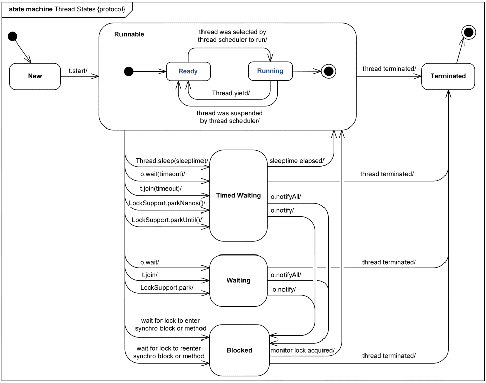

# Java基础复习计划（三）

## 散碎知识点

- Math.round() 方法进行四舍五入计算，实现是：`Math.floor(a + 0.5f)`

  floor ： 意为地板，指向下取整，返回**不大于**它的最大整数

  ceil ： 意为天花板，指向上取整，返回**不小于**它的最小整数 

  round ： 意为大约，表示“四舍五入”，而四舍五入是往大数方向入.

- 关于方法区溢出：

  经常动态生成大量 Class 的应用中，Spring、hibernate 对类进行增强的时候使用 CGLib 类字节码技术 ，其他运行在 JVM 的动态语言；

  常见的还有大量 JSP 或动态产生 JSP 文件的应用（JSP 第一次运行时需要编译）

- `public Method[] getDeclaredMethods()` 返回类或接口声明的**所有方法**，包括 public, protected, default (package) 访问和 private 方法的 Method 对象，但**不包括继承的方法**。当然也包括它所实现接口的方法。

  `public Method[] getMethods()` 返回类的所有 public 方法，包括其继承类的公用方法，当然也包括它所实现接口的方法。

- 关于类加载器的简要分类：

  引导类加载器（bootstrap class loader）：它用来加载 Java 的核心库，是用原生代码来实现的。

  扩展类加载器（extensions class loader）：它用来加载 Java 的扩展库。

  系统类加载器（system class loader）：它根据 Java 应用的类路径（CLASSPATH）来加载 Java 类。

  tomcat 为每个 App 创建一个 Loader，里面保存着此 WebApp 的 ClassLoader。需要加载 WebApp 下的类时，就取出 ClassLoader 来使用。

- 方法内不能使用 static 修饰变量


## 线程

线程的五大状态：

1. 新生（Born）
2. 就绪（Runnable）
3. 运行（Running）
4. 消亡（Dead）
5. 阻塞（Blocking）

创建线程的方式：

1. extends Thread
2. implements Runnable

控制线程的几种常见方法：

- setPriority(int)

  设置线程的优先级，可选范围 1- 10，默认为 5，越大优先级越高；

  没什么意义，因为只是概率而已
- static sleep(long)
- join()

  **当前线程**邀请另一个线程优先执行，比如主线程里写 `xx.join();` 意思就是主线程让 xx 线程执行完成后再执行，否则一直处于阻塞状态。
- static yield()

  让**当前线程**放弃持有的时间片，直接回到就绪，当然也有可能出现放弃时间片后又被 Cpu 选中的情况。 
- setName() + getName()
- static activeCount()

  得到程序中所有活跃线程的总数，活跃线程：就绪 + 运行 + 阻塞；

  这个方法永远不可能返回 0，至少是 1.
- static currentThread()

  得到当前线程对象，比如获得主线程的对象，在 run 方法调用的其他方法中使用；

  在 run 方法中没必要，直接 this 就是了。
- setDaemon(true)

  设置成为守护进程，当程序中只剩下守护线程时会自动终结自己；

  Java 中著名的守护线程 GC，一般的特性：

  1. 通常是无限循环的
  2. 守护线程一般有极低的优先级
  3. 设置守护线程必须在 start 之前
- interrupt()

  中断线程的阻塞状态，比如 sleep 时间还没到可以用 interrupt() 强制唤醒，但是会抛出一个异常。

**线程中所有静态方法不关注谁调用的，而是关注出现在哪里，出现在哪里就是操作那个线程。**

**线程中所有涉及主动进入阻塞状态的方法都需要进行异常处理**

### 关于锁

锁的出现就是为了解决并发错误，当多个线程共享同一个对象的时候，某一个线程未处理完成时 CPU 时间片就用尽了，然后就会出现并发错误。

然后就需要加锁来保证不会出现错误，通常有两种方案：

- 使用 synchronized 关键字

  叫做互斥锁，或者互斥锁标记，它可以修饰方法或者代码块，用在代码块上要显式的声明锁，用在方法上默认是 this。

  还有就是 **synchronized 特性本身不会被继承**
- java.util.concurrent.locks.ReentrantLock

  可翻译为可重用锁，JDK1.5 加入的，遵循了 OO 思想，有两个方法：lock() 和 unlock()

锁如果使用不当就会形成死锁，要解决死锁一般需要用到 Object 的三个方法：

- wait()

  让当前线程放弃已持有的锁标记，并且进入调用方对象的等待池。
- notify()

  唤醒调用方对象中等待池中的某个线程，是随机的。
- notifyAll()

  唤醒调用方对象中等待池中的全部线程

这三个方法都必须在已经持有锁标记的前提下才能使用，**所以它们都必须出现在synchronized(){当中}**

### 锁池和等待池

利用每一个对象都有一个锁旗标，拥有这个旗标后才可以访问此对象的资源，当线程无法获取此对象的锁旗标时就会发生阻塞进入此对象的锁池，等待旗标的释放，当释放后所有的等待旗标的线程会被唤醒，进入就绪状态争夺旗标。

使用 wait 会进入等待池，遇到 synchrnized 会进入锁池；

进入等待池会释放当时持有的锁，而锁池不会；

锁池中，只要锁标记再度可用 线程自动离开，等待池 必须要 notify() 或者 notifyAll()；

关于离开的去向：离开锁池前往就绪；离开等待池前往锁池（之前释放了锁，必须得重新获取锁，既然有人唤醒它，说明此时旗标肯定在别人手里）



### 关于线程池

关于这一块，之前在 [这里](https://bfchengnuo.com/2017/12/21/JavaSE%E4%BA%8C%E5%91%A8%E7%9B%AE%E8%AE%A1%E5%88%92%EF%BC%88%E4%BA%8C%EF%BC%89/) 已经写过了，这次提提怎么使用就够了：

常规使用，用 ExecutorService 这个接口来写吧，以及线程的几种定义方式：

``` java
public class TestThreadPool{
  public static void main(String[] args) throws Exception{
    ExecutorService es = Executors.newFixedThreadPool(2);
    //             newCachedThreadPool();
    //			   newSingleThreadExecutor()
    ThreadOne t1 = new ThreadOne();
    es.submit(t1);
    ThreadTwo t2 = new ThreadTwo();
    es.submit(t2);
    ThreadThree t3 = new ThreadThree();
    Future<String> f = es.submit(t3);
    System.out.println(f.get());
    //es.shutdown();
    es.shutdownNow();
  }
}
class ThreadThree implements Callable<String>{//JDK5.0
  @Override
  public String call() throws Exception{
    for(int i = 0;i<6666;i++){
      System.out.println("我是第三种方式");
    }
    return "End";
  }
}

class ThreadTwo implements Runnable{
  @Override
  public void run(){
    for(int i = 0;i<6666;i++){
      System.out.println("我是第二种方式");
    }
  }
}

class ThreadOne extends Thread{
  @Override
  public void run(){
    for(int i = 0;i<6666;i++){
      System.out.println("我是第一种方式");
    }
  }
}
```

线程池的创建官方推荐使用 Executors 来创建，常见的有 newFixedThreadPool、newCachedThreadPool、newSingleThreadExecutor；

第一种就是最简单的，也是最常用的，会事先维护几个线程，等任务来直接执行；

第二种是当有任务的时候再创建线程（避免浪费），任务执行完后会等待一分钟（默认），如果一分钟内没有新任务，那么此线程就会被终结；

第三种是同一时间只允许一个线程执行，其他的任务都排队等着，适合用在秒杀的情况。

> shutdown 和 shutdownNow 的区别：
>
> shutdown ：不再接受新的任务，当线程池中的任务（包括等待中的和正在执行的）执行完毕后销毁线程池。
>
> shutdownNow：试图停止所有正在执行的活动任务（一般情况正在执行的任务都会正常跑完的），暂停处理正在等待的任务，不再接受新任务，并返回等待执行的任务列表。

还有就是通过实现 `Callable<>` 的 call 方法来定义线程，这种方式定义的线程解决了其他方式无法实现的问题：

- run() 被定义为 void 无法返回数据
- run() 没有任何 throws 声明

这种方式定义的线程，只能通过线程池的方式来启动，并且 submit 的时候会返回一个 Future 对象，利用这个对象可以获得线程的返回值，就是调用其 get 方法，注意：**当线程未执行完时，此方法一直是阻塞状态**；当线程被意外终止那么 get 方法可能会一直卡在阻塞中（当然有重载可以指定等待的最大时间）。

## IO

这就是通常我们所说的 IO 流了，流可分为三类：

1. 方向分： 输入流  or  输出流
2. 单位分： 字节流  or  字符流
3. 功能分： 节点流  or  过滤流（包装流、处理流）

### File对象

创建 File 对象的三种常见形式：

``` java
new File(String 完整路径);
new File(String 父目录,String 文件名);
new File(File 父目录对象,String 文件名);
```

然后介绍常用的几个方法：

- `static listRoots()` : 得到当前计算机所有根目录

- `String[] list()` : 动态的列出一个目录当中所有的文件名字

- `File[] listFiles()` : 动态的列出一个目录当中所有的文件对象

- `exists()` : 判断 File 对象指代的文件或者目录是否存在

- `isFile()` : 判断 File 对象指代的是不是一个文件

- `isDirectory()` : 判断 File 对象指代的是不是一个目录

- `length()` : 得到文件的字节个数；只能对文件调用，对目录调用得到的没有意义

- `mkdirs()` : 创建多层不存在的目录结构

- `getName()` : 得到文件或者目录的名字

- `getParent()` : 得到文件或者目录的父目录

- `getAbsolutePath()` : 得到文件或者目录的绝对路径

- `setLastModified()` : 设置文件的最后一次修改时间，设置的是时间戳

- `lastModified()` : 得到文件的最后一次修改时间

- `delete()` : 删除目录或者文件

  如果要删除的是一个目录 则必须保证目录是空的

- `renameTo()` : 重命名文件或者目录

  例如：`a.renameTo(c);` a 代表源文件，必须存在；c 代表目标文件，必须不存在；

  其中 a 和 c 可以是不同的目录结构，从而实现剪切。

#### 过滤器

使用 File 的 listFiles() 方法的时候可以传入一个文件过滤器（FileFilter），用来过滤指定的文件，这样能减轻接下来遍历的压力。

FileFilter 是个接口，并且它只定义了一个方法：`boolean accept(File pathname)` 比如：

``` java
class JavaFilter implements FileFilter{
  private JavaFilter(){}
  private static JavaFilter jf = new JavaFilter();
  public static JavaFilter getFilter(){
    return jf;
  }

  @Override
  public boolean accept(File f){
    return f.isFile() && f.getName().toLowerCase().endsWith(".java");
  }
}

class DirFilter implements FileFilter{
  private DirFilter(){}
  private static DirFilter df = new DirFilter();
  public static DirFilter getFilter(){
    return df;
  }

  @Override
  public boolean accept(File f){
    return f.isDirectory();
  }
}

// 使用 lambda
File[] files = file.listFiles(f -> f.isFile() && f.getName().endsWith(".java"));
File[] dirs = file.listFiles(f -> f.isDirectory());
if(files == null) return;
```

一个来过滤 Java 文件，一个来过滤目录，这里使用单例模式就比较适合了，另外，还可以直接使用 lambda 表达式，更加的爽

### 字节流

首先要认识的两个对象是：InputStream 和 OutputStream，他们分别是：所有字节输入流统一的父（抽象）类、所有字节输出流统一的父（抽象）类。

方法一览：

``` java
// 一次读一个字节，并返回这个字节
int read();
// 一次读一个数组，返回读取的长度
int read(byte[] data);
// 一次读一个数组，从 off 开始填充，填充 len 个
int read(byte[] data,int off,int len);

write(int data);
write(byte[] data);
write(byte[] data,int off,int len);
```

需要注意：一次读一个字节但是返回的是 int，这是为了确保返回值 `-1` 表示文件的结束，假设读到了一个字节是 -1，那么先会进行类型提升到 int，这里的提升是 `&0xff` 来确保前面补的是 0 而不是 1。

读取数组时，如果读到最后不足一个数组的大小，那么返回的 int 就不是 data.length，所以说并不是绝对的。

---

上面说的是顶级的抽象类，下面就来说说最常用的两个具体类：FileInputStream 和 FileOutputStream。

- 它们作为节点流，构造方法可以指定连接 String 文件名 File 对象

- 虽然贵为节点流，但是它们只能连接文件 不能连接目录

- 节点输出流连接的文件即便不存在在，创建流的时候也会被自动创建出来，但是如果连接的目录结构都不存在 则直接异常【File 类还有个 mkdirs()】

- 节点输出流连接的文件即便已经存在，在创建流的一刻 也会被新的空白文件直接替换。

  如果我们的需求是想要在最后追加内容，那么构造方法：`new FileOutputStream("abc.txt",true);`

- FileInputStream 最常用的是 `read(byte[] data);`；FileOutputStream 最常用的却是 `write(byte[],int,int)`

- FileInputStream 以 -1 作为读取结束的标识

下面看经典的复制文件的例子：

``` java
public class FileCopy{
  public static void main(String[] args){
    FileInputStream fis = null;
    FileOutputStream fos = null;
    try{
      fis = new FileInputStream("1.mp3");
      fos = new FileOutputStream("2.mp3");
      // 2^10 = 1024 也就是字节 <<10 是 kb，再 <<10 是 mb
      byte[] data = new byte[5<<20];  // 5MB
      int len = 0;
      while((len = fis.read(data)) != -1){
        fos.write(data,0,len);
      }
    }catch(Exception e){
      e.printStackTrace();
    }finally{
      try{
        fis.close();
      }catch(Exception e){
        e.printStackTrace();
      }finally{
        try{
          fos.close();
        }catch(Exception e){
          e.printStackTrace();
        }
      }
    }
  }
}

// 简写
public class FileCopy2{
	public static void main(String[] args){
		// JDK7+ 特性。
		try(FileInputStream fis = new FileInputStream("1.mp3");
			FileOutputStream fos = new FileOutputStream("3.mp3")){
			byte[] data = new byte[5<<20];
			int len;
			while((len = fis.read(data)) != -1){
				fos.write(data,0,len);
			}
		}catch(Exception e){e.printStackTrace();}
	}
}
```

设置缓冲大小使用位运算效率更高哦，只需要记住 x<<20 就是 xMB 大小的缓冲区。

JDK7 后有了特性，就不用在 finally 里写这么恶心的代码了。。。。

#### 过滤流

之所以称它们为过滤流是因为他们接收的对象是 stream，并不能直接传 file 或者路径，对于字节流来说，有几个还算用的多的字节流过滤流：

BufferedInputStream、BufferedOutputStream、DataInputStream、DataOutputStream、ObjectInputStream、ObjectOutputStream。

经过过滤（包装）后，后面的操作只需要对这个过滤流操作就行了，因为是装饰（包装）模式，最后关流的时候只关过滤流就 OK 了。

---

前两个：

作为过滤流的它们是为了给原本的节点流添加缓冲空间，从而提高每次读写的吞吐量 进而提高效率。它们构造方法的第二个参数可以指定缓冲空间大小（默认只有8192字节，也就是 8k）；一定记得及时清空缓冲空间 防止数据滞留缓冲区，其中有三种情况会刷新缓冲区：1、当缓存空间满了的时候自动刷新；2、当关闭流操作时会自动刷新；3、手动调用 flush。

这样，即使你调用 read 方法一个字节一个字节的读其实它会一次读指定的大小到缓冲区，然后一个个的给你；写也是，并不是一个个的写，而是写到缓冲区，满了以后一次性 flush 到硬盘。

---

中间两个：

是为了给原本的节点流添加读写基本数据类型的功能；DataInputStream 提供了一组方法 `readXxxx();`，DataOutputStream 提供一组方法 `writeXxxx();` ，这时候不再以 -1 作为读取结束的标识了，而是如果已经到达文件结尾还继续读取，则直接出现 EOFException（End of File）。

``` java
public static void main(String[] args){
  try(DataOutputStream dos = new DataOutputStream(new FileOutputStream("t.data"))){
    dos.writeInt(4545);
  }catch(Exception e){e.printStackTrace();}

  try(DataInputStream dis = new DataInputStream(new FileInputStream("t.data"))){
    int x = dis.readInt();
    System.out.println(x);
  }catch(Exception e){e.printStackTrace();}
}
```

---

最后两个：

给原本的节点流添加读写对象的功能的，与上面类似，对应的方法就是 `readObject();` 和 `writeObject();` 。

同样不以 -1 作为结束，而也会 EOFException。

要写出的对象必须先要序列化 （implements Serializable），如果要持久化的对象当中有其它引用类型的属性，那么也要进行序列化标识；但是如果某些属性无关紧要，不需要保存（那就相当于是 null 了），**可以直接使用 transient 修饰。**

如果要持久化的是一个使用了比较器的 TreeSet 或者 TreeMap，就连比较器的类型也要实现序列化接口。

### 字符流

和字节流一样，两大鼻祖：Read 和 Writer；接口中定义的方法也和字节流中的那三个对应，就不写了。

两个常用的具体类：FileReader 和 FileWriter，描述也不多说了，和上面 FileInputStream 和 FileOutputStream 一样一样的

#### 过滤流

对于字符流来说，最常用的还是莫过于这里说的过滤流，因为对于字符操作，过滤流提供了更方便的方法。

**BufferedReader 和 BufferedWriter：**

通过对原有的字符流添加缓冲空间，使其可以支持一次读取一行（readLine），和一次写入一个字符串(write + newLine 换行)。其中 BufferReader 使用的非常频繁，必须要熟练的。

**PrintStream 和 PrintWriter：**

像是一对姐妹，他们的方法一致，不同的是一个输出字节，一个输出字符；PrintStream 我们最长见的就是打印语句中的 out，它就是 PrintStream 类型的，然后 PrintWriter 在 IO 操作中用的非常频繁，相比 BufferedWriter 它更加的好用。

既然说好用，那就来看看它的特点吧：

- 既可以作为节点流，又可以作为过滤流；也就是可以直接往构造函数里扔文件对象、路径、节电流

- 既可以连接字节流，又可以连接字符流；是的，构造函数里都可以扔，不需要转换流

- 当做节点流的时候，构造方法第二个参数可以指定字符集

- 当做过滤流的时候，构造方法第二个参数可以指定自动清空缓冲

  例如：`new PrintWriter(new FileWriter("a.txt",true),true);`

  第一个 true 是开启追加模式，第二个是自动刷新（flush）

- 拥有 println() 方法，等价于 write() + newLine()

---

转换流（桥转换器）：InputStreamReader 和 OutputStreamReader ，其中最常用的是 InputStreamReader，实际用法例如：

`new BufferedReader(new InputStreamReader(new FileInputStream("a.txt")))`

而 OutputStreamReader  基本不怎么用，因为有 PrintWriter 啊，它可以字符流字节流通吃，也就是说内部会内置一个转换流，就是这个 OutputStreamReader ，所以让我们方便了。

---

再来补充个 RandomAccessFile 用来支持随机文件的读取和写入，通常可以用它来占空间，然后用流来对其进行写：

``` java
RandomAccessFile raf = new RandomAccessFile("d:\\abc.mp4","rw");
File d = new File("d:\\");
long free = d.getFreeSpace();//得到d盘的剩余空间
raf.setLength(free);
raf.close();
```

这只是个简单的使用，这里先 TODO

## 原码反码补码

对于一个数, 计算机要使用一定的编码方式进行存储. 原码, 反码, 补码是机器存储一个具体数字的编码方式.

原码就是符号位加上真值的绝对值, 即用第一位表示符号, 其余位表示值，原码是人脑最容易理解和计算的表示方式。

  ```
[+1]原 = 0000 0001

[-1]原 = 1000 0001
  ```

正数的反码是其本身；负数的反码是在其原码的基础上, 符号位不变，其余各个位取反.

  ``` 
[+1] = [00000001]原 = [00000001]反

[-1] = [10000001]原 = [11111110]反
  ```

正数的补码就是其本身；负数的补码是在其原码的基础上, 符号位不变, 其余各位取反, 最后+1. (即在反码的基础上+1)

  ``` 
[+1] = [00000001]原 = [00000001]反 = [00000001]补

[-1] = [10000001]原 = [11111110]反 = [11111111]补
  ```
那么为何要使用原码, 反码和补码？

首先， 因为人脑可以知道第一位是符号位， 在计算的时候我们会根据符号位， 选择对真值区域（可理解为不加符号位的二进制表示）的加减。

但是对于计算机，加减乘数已经是最基础的运算，要设计的尽量简单； 计算机辨别 "符号位" 显然会让计算机的基础电路设计变得十分复杂!

于是人们想出了将符号位也参与运算的方法； 我们知道, 根据运算法则减去一个正数等于加上一个负数, 即:  1-1 = 1 + (-1) = 0 , 所以**机器可以只有加法而没有减法，这样计算机运算的设计就更简单了**.

于是人们开始探索 将符号位参与运算， 并且只保留加法的方法， 首先来看原码:

计算十进制的表达式: 1-1=0

> 1 - 1 = 1 + (-1) = [00000001]原 + [10000001]原 = [10000010]原 = -2

如果用原码表示， 让符号位也参与计算， 显然对于减法来说， 结果是不正确的；这也就是为何计算机内部不使用原码表示一个数.

为了解决原码做减法的问题， 出现了反码:

计算十进制的表达式: 1-1=0

> 1 - 1 = 1 + (-1) = [0000 0001]原 + [1000 0001]原= [0000 0001]反 + [1111 1110]反 = [1111 1111]反 = [1000 0000]原 = -0

发现用反码计算减法， 结果的真值**部分是正确的**. 

而唯一的问题其实就出现在 "0" 这个特殊的数值上， 虽然人们理解上 +0 和 -0 是一样的，但是 0 带符号是没有任何意义的， 而且会有 [0000 0000]原 和 [1000 0000]原 两个编码表示 0.

**于是补码的出现， 解决了 0 的符号以及两个编码的问题**:

> 1-1 = 1 + (-1) = [0000 0001]原 + [1000 0001]原 = [0000 0001]补 + [1111 1111]补 = [0000 0000]补=[0000 0000]原

这样 0 用 [0000 0000] 表示， 而以前出现问题的 -0 则不存在了；而且可以用 [1000 0000] 表示 -128:

> (-1) + (-127) = [1000 0001]原 + [1111 1111]原 = [1111 1111]补 + [1000 0001]补 = [1000 0000]补

-1-127 的结果应该是 -128， 在用补码运算的结果中  [1000 0000]补 就是 -128， 但是注意因为实际上是使用以前的 -0 的补码来表示 -128， 所以 -128 并**没有原码和反码表示**（所以可以多表示一个最低数）.(对 -128 的补码表示 [1000 0000]补 算出来的原码是 [0000 0000]原, 这是不正确的)

使用补码, 不仅仅修复了 0 的符号以及存在两个编码的问题， 而且还能够多表示一个最低数； 这就是为什么 8 位二进制， 使用原码或反码表示的范围为 [-127, +127]， 而使用补码表示的范围为 [-128, 127].

因为机器使用补码, 所以对于编程中常用到的 32 位 int 类型，可以表示范围是: [-231, 231-1] 因为第一位表示的是符号位.而使用补码表示时又可以多保存一个最小值.

出自：https://www.cnblogs.com/zhangziqiu/archive/2011/03/30/ComputerCode.html

## 其他

查找一个字符串出现多少次？

可以使用 `(str + "l").split("abc").length - 1` ，源字符串加任意一个字符防止被 split 的字符在最后会导致少一个，然后它的 length - 1 就是个数。