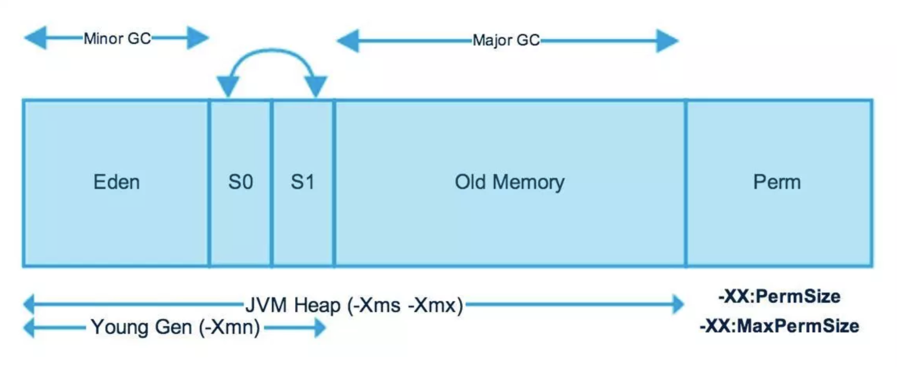
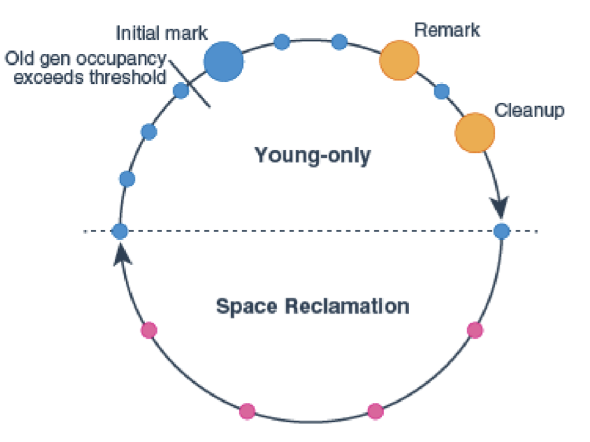

# 一入Java深似海

记录学习小马哥课程的心得，还是课程笔记了。

这里只记录一般接触不到或者容易忽略的知识，常见的那些就直接一笔带过或者忽略了。

## 第一期-语言基础与代码设计

### Java 语言基础

在 Java **面向过程**编程中，核心要素有：

- 数据结构：原⽣生类型、对象类型、数组类型、集合类型

- ⽅方法调⽤用：访问性、返回类型、⽅方法参数、异常等

- 执⾏行行流程：赋值、逻辑、迭代(循环)、递归等

Java 中的方法的访问性常规来说就四种，分别对应“四个”修饰符，具体就不展开了；但是从 Java9 开始，模块化的引入打破了这个限定，所以严禁来说，四种修饰符要分版本了。

至于面向对象的核心要素，就不多说了，封装、继承、多态（、抽象）嘛～

对于抽象类，一般规范是以 Abstract 或者 Base 开头。

---

对于异常，从 JDK1.4 开始，就有了 cause 的概念，通过它可以确定异常链，而它靠的就是 fillInStackTrace 方法的填充，这是一个 native 方法，为了避免它消耗过多的性能，可以通过 JVM 参数来限制堆栈的深度，或者调整日志框架的配置（如果使用的日志框架处理异常的话）

还有一种方案就是继承 Throwable 后有一个 boolean 的 writableStackTrace 构造，通过这个也可以进行控制。

---

一些容易忽视的问题：

- **Java 是否是完全面向对象的语言？**

  否，因为有原生类型。

- **String 是不可变的么？**

  严格来说不是，Java1.5 之后可以使用反射的方式修改（替换）里面的 char 数组，准确来说里面的引用数组的值（字面量）是不可变的。

- **评价 Java 中的 clone 方法？**

  这是一个 native 方法，是浅克隆，并且需要实现 Cloneable 这个标记接口，new 操作其实是非常复杂的，例如第一次需要 load，执行类型检查等等。

  实际中，轻量级对象 new 的速度远远快于 clone（属性非常少），但是如果在构造方法中进行了复杂运算，例如截取字符串之类或者普通的含有一定数量属性的 Bean 对象，那么 clone 的速度会远远快于 new。

  虽然 clone 的速度可能具有很大优势，但是因为前置条件复杂，概念也比较模糊，主要还是设计上的缺陷，还是不推荐使用，或者你可以考虑使用构造函数手动 new 操作来达到复制的效果。

- **集合的线程安全**

  例如，ArrayList 是线程安全么？

  首先明确的是，线程安全指的是读或写是数据一致的，如果不存在写的情况，它也是线程安全的。

  PS：一般方法带 View 的就是只读的。

- **可以在 final 修饰的类中定义抽象方法么？**

  严格来说字节码层面可以，如枚举类型，属于字节码提升。

  任何枚举类都扩展了抽象类 Enum ，values 方法是属于编译器进行的字节码提升。

  枚举其实是一个 final class 修饰的类，它的成员为 `public static final` 修饰，它可以定义抽象方法。

然后说一下泛型，这里都知道有个擦除的说法，具体什么时候擦除呢，编译还是运行，根据字节码，反编译可以得知泛型，所以可以确定，泛型是保存到字节码中的，只是在 JVM 运行时会被擦除。

## 第二期-集合框架

集合框架的比较中，一个容易忽视的问题是 ConcurrentHashMap 也不允许 key 或者 val 为空，原因也很简单，在 get 的时候，因为要考虑并发，如果可以存在 null，就会产生歧义，是不可见呢还是本来就是 null，所以直接限制不为空好。

另外，对于线程安全，严格来说，无论是那个集合对于读操作，都是线程安全的，不存在多线程操作的情况下也都是安全的。

| 接口  | 哈希表  | 可变数组   | 平衡树  | 链表       | 哈希表+链表   |
| ----- | ------- | ---------- | ------- | ---------- | ------------- |
| Set   | HashSet |            | TreeSet |            | LinkedHashSet |
| List  |         | ArrayList  |         | LinkedList |               |
| Deque |         | ArrayDeque |         | LinkedList |               |
| Map   | HashMao |            | TreeMap |            | LinkedHashMap |

对于集合方法的入参：

- 如果能用 Iterable 尽量用
- 其次可以考虑使用 Collection
- 再其次的选择是 List 或者 Set
- 禁止使用具体类型

另外，对于参数应该做到对自己严格（禁止返回 null），对他人宽容（检查 null 值）。

---

对于集合框架，可以留意一下工具包中的 Navigable 开头的，比如 NavigableList、NavigableMap，直接翻译就是可导航的，简单说的话就是为了便于寻找，例如头部、尾部、中间的范围区间，这些方法返回的都是一个视图对象，也就是只读的。

### 集合扩展

接口类型的分类：

- 单例集合接口：`Collections.singleton*`
- 空集合接口：`Collections.empty*`
  特殊的几个：枚举（`Collections.emptyEnumeration()`）
  迭代器（`.emptyIterator()`、`.emptyListIterator()`）
- 转换集合接口：`Collections.*、Arrays.*`
- 列举集合接口：`*.of(...)`

而单例集合的设计原则是不可变（Immutable）集合，所以记得不要做插入等操作。

集合包装实现：

- 同步包装接口：`java.util.Collections.synchronized*`
- 只读包装接口：`java.util.Collections.unmodifiable*`
- 类型安全包装接口：`java.util.Collections.checked*`

关于类型安全接口，虽然看起来没啥卵用，主要是来校验泛型的，因为泛型在运行时会被擦除，当你将其赋值给一个没有标注泛型的对象时，它就可以随意进行增加其他类型的对象，而经过类型安全包装后，就能规避这个风险。
准确说是构造时不做检查，添加时会进行类型检查。

> 在 ThreadLocal.ThreadLocalMap 中使用到了弱引用 Map；
>
> 其他特殊集合还有：优先级队列 PriorityQueue，枚举 Set： EnumSet

### 补充

首先看下面一段代码：

``` java
private static void demoMap(Map<String, Integer> map) {
  map.put("A", 1);
  map.put(new String("A"), 1);
  System.out.println(map.size());


  System.out.println("A" == new String("A")); // false
  System.out.println("A".equals(new String("A"))); // true
  System.out.println("A".hashCode() == new String("A").hashCode()); // true
}
```

结果我以为是 2，然而可能是 1，也可能是 2，这要看你传入的 Map 类型，这就要牵扯到一些知识：

- 如果类覆盖了 Object 的 `equals(Object)` 方法，那么 `hashCode()` 方法需不需要覆盖？
  不强制覆盖，建议实现，注意不要将 hashCode() 作为 equals 方法的实现；
  可参考：`Objects.hash(Object...)` 以及 `Arrays.hashCode(Object[])`，hashCode() 是一个计算较重的实现，内部需要迭代计算，成本很高。
  而 equals 通常是做对象属性的比较
- 如果类覆盖了 Object 的 `hashCode()` ，那么 `equals(Object)` 方法需不需要覆盖？
  用于哈希计算，由于不同对象的 hashCode() 方法可能返回相同的数据，当不同对象 hashCode() 相同是，再做对象 equals(Object) 方法比较，所以必须覆盖。

然后，就要说到一个不太常用 Map，就是 IdentityHashMap，或者叫对象鉴定 Map，他的 key 逻辑可不是按照 hashCode 来算的而是 `System.identityHashCode()`，所以当传入的 Map 类型是 IdentityHashMap，那么就是 2，否则就是 1 了。

既然有了 hashCode，那么为啥还要 identityHashCode，在多数情况下他们是一致的；字符串就会比较特殊了，但是需要考虑一种情况，当对象覆盖了 hashCode 方法怎么办，就会各种无法预测的方向，而这个方法这时就保证了稳定性。
PS：拓展下，可以看看 MethodHandle 这个类。

### 排序

这里简单提一下 JDK 中的排序实现，在 Arrays 工具类中，逻辑是非常复杂的，它会根据你传入的数组长度选择不同的排序算法，这个也是有讲究的，例如在 7 以下就是插入排序，大于 7 就是快排，再大可能就是 Tim 排序（只适用于对象类型，1.7 之后默认，如果想使用合并排序，就需要手动激活），没有冒泡排序的内建实现，可能是效率太低吧。
另外，也对类型进行了区分，如果是原生类型，基本就选择插入这种了。
除此之外，还提供了一些并行实现。

### 重写hash与eq

一般来说，如果你要使用 Map，对于一般的 POJO hashcode 和 equals 是肯定要重写的，如果使用了顺序的，还要顺便重写下排序的接口。

默认的比较方法太重了，层层嵌套，所以重写非常有必要，提高效率。

## 第三期-并发基础

创建线程的最简单方式就是直接搞一个 Thread 对象，虽然并不推荐，尽量用线程池，因为这样搞生命周期不好控制。
在 new Thread 对象的时候，如果使用空构造，相当于空跑，也许可以作为停止线程的方案。

从 JDK1.2 开始，线程的挂起、恢复等操作都被标记为废弃，原因是在之前，其实 OS 并没有提供线程函数，那时候的机器，单核，这方面并不是刚需。
为了支持多线程，是 JDK 自己实现了一套，叫绿色线程，所以有这些方法，但是从 JDK1.2 开始，OS 已经支持，这些自然就没有必要了。

在并发控制上，现在的 CPU 架构来说，如果是 64 位的，会拆成两个 32 高低位，然后分别写入，这样就会有风险，所以要使用 CAS 操作完成，而 32 位的，不会有这样的问题，所以看源码实现时，不会使用 CAS，而是直接加个 volatile 赋值即可。

Spring 框架是个非常成功的框架，或者说是个成功的重复发明轮子的案例，不过也有其硬伤，分好多方面，例如再 JUC 方面就没太多的设计，基本都是 JDK 的稍微包装（夸一下 Servlet 的设计简直超神）。

### 关于Synchronized

说起加锁最常用的是 Synchronized 关键字了，经过不断的优化，现在版本的 JVM 已经控制的比较好了，此方式可以推荐，尤其是 Java6 之后，优化很给力。

然后再说对于使用 Synchronized 的方法，在没有线程竞争的情况下，跟不使用 Synchronized 的方法效率差距很小，不需要过度担心，即使数据量很大的情况下，也是可以达到忽略不计的程度（因为偏向锁）。

关键字 Synchronized 使用在方法上与代码块中反应到字节码层面是不一样的，在方法上使用会使用一个 ACC_SYNCHRONIZED 来对方法进行标记，而使用代码块下就是 monitorenter 和 monitorexit 指令操作了。

Synchronized 在设计上非常精巧，并且支持可重入，在 Java 对象头中进行了标记，标记分为：无锁、偏向锁、轻量级锁、重量级锁；锁会由 JVM 根据运行情况来自动升级（锁膨胀），升级后不可回退；

在 Synchronized 的轻重锁中，CAS 才是耗费时间的大户，并且 CPU 的核心越多时间越久；就是因为研究发现大多数时候是不存在锁竞争的，常常是一个线程多次获得同一个锁，因此如果每次都要竞争锁会增大很多没有必要付出的代价，为了降低获取锁的代价，才引入的偏向锁。

正是因为偏向锁，当发现还是这个线程获取锁时，就不需要 CAS 操作了，直接放行；当其他线程来获取时，检查之前的线程是否还需要持有锁，如果需要则 CAS 操作，同时取消偏向锁升级轻量级锁（自旋，IBM 首先实现）；如果之前的线程已经死亡或者不需要锁了就置为无锁标记。

当轻量级锁自旋到一定程度老是获取不到，就升级为重量级锁，避免自旋带来的性能损耗，不过响应时间就长了。

PS：如果对大数据量测试，为了避免 GC 带来的干扰，相隔代码之间最好手动调一下 GC。

参考：https://blog.csdn.net/tongdanping/article/details/79647337

### 并发锁

Java 中的并发锁大致可以分为这三类：

- ReentrantLock 重进入锁
  简单说就是 synchronized 的 API 版本。
  相同点：互斥、重进入、隐性 Monitor 机制。
  不同点：公平锁与非公平锁可选、限时锁定（tryLock 方法）、条件对象支持（`lock.newCondition()`）
  PS：公平锁可以理解为 FIFO，非公平就是随机了，非公平锁速度更快，效率更高，ReentrantLock 默认就是非公平锁，想要公平锁构造的时候手动传入 false；而 synchronized 是非公平锁。
- ReentrantReadWriteLock 重进入读写锁
  继承 ReentrantLock 的特性，并且增加了读写锁控制，读锁就是共享，写锁即互斥。
  在写锁中，还会有一个锁降级。
- StampedLock 邮票锁
  简单说就是乐观锁，加了版本记录的那种。
  适用于读多写少的情况。

CAS 操作相比 MB 也就是内存屏障来说是轻量级的，但本身也是比较耗费资源的。

在并发限制方面，提供了 CountDownLatch、CyclicBarrier、Semaphore 好用的类；线程池也划分了普通类型与周期类型的 ThreadPoolExecutor 和 ScheduledExecutorService。
而作为实际的执行者，分 Runnable 和 Callable，不带返回值与带返回值（Future），其实根本都是 Runnable 的实现。

### 线程池

在阿里巴巴规范中，是禁止用工具类创建线程池的，建议是手动指定各个参数，最主要的原因是工具类创建的一般都太大了，某些类型还好，队列用一个有限的链表，但是比如 **newCachedThreadPool** 这种使用无限队列的，并且最大大小还是 int 的最大值，就有点坑了，但是呢，JDK 那么牛逼的源码不可能不考虑这点，所有他有一个 60S 的回收时限。

即使用了，其实也没那么恐怖，因为外部基本会挡掉大部分，例如 tomcat 这种容器；但是如果用在定时任务这种情景，还是有点风险的。

### 并发集合框架

在 JUC 的实现中，集合框架中 size 一般是需要计算的，至于一般的集合为啥会单独设置一个变量来存储 size ，还是为了效率考量，那么 JUC 为啥不用，因为要保证一致性所花费的得不偿失。

#### CopyOnWrite 系列

并发特征：

- 读：无锁（volatile）、快速（O(1)）
- 写：同步（synchronized，注意偏向锁）、复制（慢，内存消耗）

例如 CopyOnWriteList、CopyOnWriteArraySet（底层实现还是 CopyOnWriteList）

这里还会有一个很有意思的东西，集合迭代操作时的 CME 异常肯定都见过，也就是不能一边删，一边加；但是这里就是个特例了，内在的弱一致性导致不会抛出异常（非 fail-fast）。

#### ConcurrentSkipList 系列

并发特征也是无锁，数据结构就比较有意思了：
有序（指的是自然顺序，ConcurrentNavigableMap 实现）、跳表（Skip List）变种。
这是典型的空间换时间，适合数据量小速度要求快的，时间复杂度搜索和插入都是  O(log(n))。

例如：ConcurrentSkipListMap、ConcurrentSkipListSet（使用 ConcurrentSkipListMap 实现）

需要注意的几个问题：

量量操作⽆无法保证原⼦子执⾏行行，如 putAll、equals、toArray、containsValue 以及 clear ⽅方法。
非 null 约束，也就是键和值都不能为 null，原因还是那个，并发下存在歧义（是 null 还是不可见）

#### ConcurrentHashMap

并发特征：

在 JDK1.5-1.6：读锁（部分）+ 写锁；
1.7+：读无锁 + 写锁（段锁，或者分离锁，只锁一部分）；

数据结构方面与 hashMap 差不多：

1.8 之前：桶，1.8+ 就是 桶 + 平衡树（红黑树）

---

既然读是无锁的，那么自然是比较适合读多写少的情况，但是对于 ConcurrentSkipList 它直接无锁，读多写多的情况下效率也很可观，前提是你有足够的内存。

#### BlockingQueue

并发特征：读锁、写锁。

经典实现：ArrayBlockingQueue、LinkedBlockingQueue、SynchronousQueue
子接口实现：BlockingDeque - LinkedBlockingDeque、TransferQueue - LinkedTransferQueue (⽆锁)

#### Fork/Join 框架

从 Java7 之后，新增了 **Fork/Join** 框架，编程模型：
扩展 ExecutorService 的 ForkJoinPool。
Future 扩展 - ForkJoinTask、RecursiveTask、**RecursiveAction**

#### CompletableFuture

从 Java8 开始，新增了 **CompletableFuture**，主要原因是之前 Future 的限制：

- 阻塞式返回结果
- 无法链式多个 Future
- 无法合并多个 Future 结果
- 缺少异常处理

综上，所以出现了 CompletableFuture。

#### Flow 框架

这是 Java9 新增的功能，主要还是用于 Reactive Streams 编程的，
它有几个核心接口可以适当了解一下：

- Publisher
- Subscriber
- Subscription
- Processor

用的人还是很少的，处于早期阶段，不过，谁能知道未来是不是主流呢。

## 第四期-并发原理

在并发编程中，当你在外围捕获到 InterruptedException 异常时，框架中一般需要对状态进行重置；**因为当抛出这个异常时，状态一般会改变**，所以要重新设置中断状态：`Thread.currentThread().interrupt() ` ，当然有时候也需要手动指定；配合线程内的 `Thread.interrupted()` 方法可以对状态的改变进行感知。

当 wait() 方法所属对象没有被 synchronized 关键字修饰，将抛出 IllegalMonitorStateException。

对于 Volatile 关键字，很多时候我们都回答的是保证可见性，其实，对于原生类型，也是可以保证原子性的。

### happens-before

JDK 5 开始，JMM 就使用 happens-before 的概念来阐述多线程之间的内存可见性。

> 在 JMM 中，如果一个操作执行的结果需要对另一个操作可见，那么这两个操作之间必须存在 happens-before 关系。

happens-before 原则非常重要，它是判断数据是否存在竞争、线程是否安全的主要依据。

happens-before原则定义如下：

1. 如果一个操作 happens-before 另一个操作，那么第一个操作的执行结果将对第二个操作可见，而且第一个操作的执行顺序排在第二个操作之前。
2. 两个操作之间存在 happens-before 关系，并不意味着一定要按照 happens-before 原则制定的顺序来执行。如果重排序之后的执行结果与按照 happens-before 关系来执行的结果一致，那么这种重排序并不非法。

参考：https://www.cnblogs.com/chenssy/p/6393321.html

### AQS

这一节有点过于深奥，基本是完全无法理解的状态。

以可重入锁为例，默认是非公平的，在 AQS 中维护了一个等待队列，头一般是指向获得锁的线程（Node，只保存了状态信息，没有线程信息），然后 next 后的 Node 就是等待的线程，里面存储了线程对象信息。

值得注意的是 AQS 中的队列一般是双向引用的。

AQS 的另一大重点是内含条件判断也就是  Condition 接口。

## 第五期-存储管理

### Java 类层次

编译器 javac 是 Java 程序编写的可执行程序（since 6 开始，通过 Java 实现，6 之前，native 实现）（Maven 编译器插件）

另外一个 ecj - eclipse 编译器，JSP 编译器，在 Tomcat 中就能看到，需要注意的是 javac 与 eclipse 编译器不一定完全兼容。

#### ClassLoader 基础

双亲委派类加载实际是通过 `parent` 字段递归，找到根 ClassLoader。实际上，根 ClassLoader = Bootstrap ClassLoader`

`loadClass(String)`  方法不仅可被 Java 程序调用，比如：Spring BeanFactory 类加载时；也可能被 JVM 调用，比如：new XXX()时，XXX 将作为类被加载。

JVM 调用 loadClass 方法的时机：

- new XXX() 时
- 调用 XXX.yyy 静态字段
- 通过反射 API - `Class.forName` 或者 `ClassLoader.loadClass`

原生类型也有类对象：

```java
Class<?> intClas = int.class;
```

Bootstrap ClassLoader 是无法获取，最接近 Java 程序的 ClassLoader 是 System ClassLoader

##### 系统 ClassLoader

通过 `java.lang.ClassLoader#getSystemClassLoader` 方法获取。它是只读的。

##### 应用 ClassLoader

可以通过当前 Thread 上下文 ClassLoader 获取（不完全一定）：`java.lang.Thread#getContextClassLoader`

这个是可以修改的，提供了 set 方法。

> 通常，系统或者应用（包括自定义实现） ClassLoader 都是 URLClassLoader 子类。

##### 与Class关系

ClassLoader#loadClass 是用于加载 Class 对象，相反，ClassLoader 可以通过 Class 的 getClassLoader() 获取。

### 自定义ClassLoader

不同的 ClassLoader 加载的同一份对象也是不等的。通过修改 Thread 上下文 ClassLoader 实现类隔离。

``` java
public class ClassLoaderDemo {
  public static void main(String[] args) {
    // 系统 ClassLoader
    // Java 8 结果：sun.misc.Launcher$AppClassLoader@18b4aac2
    // Java 12 结果：jdk.internal.loader.ClassLoaders$AppClassLoader@3fee733d
    System.out.println(ClassLoader.getSystemClassLoader()); // 只读
    // 应用 ClassLoader
    // Java 8 结果：sun.misc.Launcher$AppClassLoader@18b4aac2
    // Java 12 结果：jdk.internal.loader.ClassLoaders$AppClassLoader@3fee733d
    System.out.println(Thread.currentThread().getContextClassLoader()); // 可修改


    // 当前 main 线程 ClassLoader
    ClassLoader classLoader = Thread.currentThread().getContextClassLoader();
   
    // 当前工程相对路径：stage-5/stage-5-lesson-1
    // 当前工程绝对路径：${user.dir}/stage-5/stage-5-lesson-1
    // 当前工程ClassPath ：${user.dir}/stage-5/stage-5-lesson-1/target/classes
    // User 类全名：com.segmentfault.deep.in.java.User
    // User.class 文件路径：${ClassPath}/com/segmentfault/deep/in/java/User.class

    String className = "com.segmentfault.deep.in.java.User";
    String classFileName = className.replace('.', '/').concat(".class");
    String classPath = System.getProperty("user.dir") + "/stage-5/stage-5-lesson-1/target/classes";
    // User.class 类文件的绝对路径
    File classFile = new File(classPath, classFileName);

    // ClassLoader 也是对象，也会被 GC 管理
    MyClassLoader myClassLoader = new MyClassLoader();
    // .class 文件变为字节流 byte[]，再定义 Class 对象
    Class<?> userClass = myClassLoader.defineClass(className, classFile);

    System.out.println("当前类对象：" + userClass);
    Stream.of(userClass.getDeclaredFields())
      .forEach(field -> {
        System.out.println("当前字段信息：" + field);
      });

    
    
    Class<?> userClassFromThreadContextClassLoader = classLoader.loadClass(className);
    // User.class 被 MyClassLoader 加载后，是否与线程上下文加载的 User.class 对象是否一致？ false
    // 这个现象能够解释 Spring spring-boot-devtools 模块 Class!=Class 问题
    System.out.println("userClass == userClassFromThreadContextClassLoader ? "
                       + (userClass == userClassFromThreadContextClassLoader));

    // 重新替换掉线程上下文 ClassLoader
    Thread.currentThread().setContextClassLoader(myClassLoader);
    // 老的线程上下文 ClassLoader 是 MyClassLoader 的 parent，由于双亲委派（loadClass 方法），即使是 MyClassLoader 重新调用
    // loadClass(String) 方法，也不会重新加载   false
    Class<?> userClassFromMyClassLoader = classLoader.loadClass(className);
    System.out.println("userClass == userClassFromMyClassLoader ? " +
                       (userClass == userClassFromMyClassLoader));

    // 已加载 Class 是如何实现，目标方法： java.lang.ClassLoader.findLoadedClass0  true
    System.out.println(
      "userClassFromThreadContextClassLoader == userClassFromMyClassLoader ? " +
      (userClassFromThreadContextClassLoader == userClassFromMyClassLoader));

  }

  static class MyClassLoader extends ClassLoader {
    public MyClassLoader() {
      // 当前线程上下文 ClassLoader 作为 Parent
      super(Thread.currentThread().getContextClassLoader());
    }

    public Class<?> defineClass(String name, File classFile) {
      // File classFile -> byte[]
      byte[] bytes = loadBytes(classFile);
      // 利用 ClassLoader defineClass 方法来定义 Class
      // 可用于动态加载
      return super.defineClass(name, bytes, 0, bytes.length);

    }

    private byte[] loadBytes(File classFile) {
      byte[] bytes = null;
      try {
        // 使用 Apache 的 Commons-io
        bytes = FileUtils.readFileToByteArray(classFile);
      } catch (IOException e) {
        throw new RuntimeException(e);
      }
      return bytes;
    }
  }
}
```

ClassLoader 类加载顺序：

- 尝试获取已加载的类（ ClassLoader 层次性，要不当前 ClassLoader，要不其 Parent）
- 尝试双亲委派加载类（直到 Bootstrap ClassLoader 加载不到）
- 执行 findClass(String) 方法（ClassLoader 是一个抛出 ClassNotFoundException 实现，子类可覆盖该方法）
  - jdk.internal.loader.BuiltinClassLoader#findClass
    - ClassPath = URLClassPath

某个特定的类加载器在接到加载类的请求时，首先将加载任务委托给父类加载器，依次递归，如果父类加载器可以完成类加载任务，就成功返回；只有父类加载器无法完成此加载任务时，才自己去加载。

### Java内存分配

首先，要确认 Java 的内存结构，这个在 深入 JVM 里说的很详细。

- Java 堆（Heap）
- 方法区（Method Area）
- JVM 栈（JVM Stack）
- 本地⽅方法栈（Native Method Stack）
- PC 寄存器器（PC Registers）

下面是一张 Java 堆的经典图：



下面再说一下 Java ⾮堆内存（Non-Heap）的概念，虽然在 JVM 规范里叫做非堆内存，但是其实物理上还是在堆里。

- Metaspace
- Code Cache
- Method Area
- Run-time Constant Pool

对于 code cache 做一点解释，在 java 编译的时候，大体流程是 java 源码 -> java 字节码 -> Native Code（c1、c2），当然需要达到一定的条件，其中有一个 Inline 内联的说法，简单说就是两个代码块之间切换也是有时间消耗的，为了减少这个，使用了 A + B = A1 的方式，就是把东西复制到另一个的 body 中，这样就不用切换了嘛，典型的空间换时间。

### 垃圾收集

具体运作看深入 JVM，主要就是老年代标记、清理；年轻代标记、复制，两个步骤，因为是分代收集，在 Young 区，分为一个 Eden 和 两个 Survivor，新对象一般直接就进 Eden，放不下的直接就老年代了（或者 15 次后）。

在 Eden 中，可能划分为了⼀个或多个 Thread Local Allocation Buffer（TLAB），总大小占用 Eden 的不超过 1%，主要是用空间换时间，提高效率；因为在对象分配时，有的对象之间是包含关系，甚至非常复杂，这样对象分配的顺序等问题就非常麻烦，这样我们采用 Thread Local 的方式让线程自己有一个空间在里面搞，这样就避免了使用锁。

#### 永久代or元空间

在 Java8 之前存在，它的作用是：

- 存储：元数据（metadata），如 Class 信息，String.intern() 对象（不建议使用）

- GC： FGC 将会回收该区域

- 空间：⾮堆区域，‐XX:MaxPermSize 参数调整最⼤值
- 异常：java.lang.OutOfMemoryError: Permgen space
- 场景：Java 8 开始移除该区域，使⽤ Metaspace 代替

在 Java8 之后，使用元空间替代了它，主要是空间方面的区别，元空间的空间是：堆区域（操作系统的那个堆），本地内存，默认情况，仅受限于 Java 进程可⽤的本地内存‐ XX:MaxMetaspaceSize 参数调整最⼤值。

#### 垃圾收集器

具体的几种处理器与能处理的范围：

- Serial GC 能够处理新⽣代和⽼年代
- Parallel GC 能够处理新⽣代和⽼年代
- Parallel New 仅处理新⽣代
- Concurrent Mark and Sweep (CMS) 仅处理⽼年代
- G1 ⽐较特殊不区分新⽣代和⽼年代

在 Java9 的时候，直接把 CMS 干掉了，默认 G1，也许这也是不愿升级的原因之一吧

### 关于G1

G1 垃圾收集器器由两个周期轮替，即 Young-only 和 Space-reclamation。Young-only 阶段的垃圾收集是逐渐地将⽼年代的对象填充到当前可⽤的内存。

Space-reclamation 阶段则是回收老年代的空间，附加处理新生代。随后的收集周期又从 Young-only 开始。



需要注意 Young-only 阶段可不是只处理年轻代，虽然 G1 保留了分代，但是实际其实已经不太重要了；当老年代的空间占用到一个阈值后，G1 才开始调用 Initial Mark 的 Young-only 收集，要不然就是 Young-only 的常规收集（蓝色点）

其中 Remark （执⾏全局应用处理理以及类的卸载）和 Cleanup （更新内部数据结构）都是 Stop-The-World 停顿，其中会计算出一份对象存活性报告。

Initial Mark 收集阶段它会并发标记决定所有在老年代区域中可达的存活对象是否保留留到 Space-reclamation 阶段。

Cleanup 除了回收空间，还决定 Space-reclamation 阶段是否将继续跟随，如果继续，Young-only 阶段的完成仅为 Young-only 收集。

Space-reclamation 阶段：当 G1 认为撤出更多的⽼年代 区域也⽆法满⾜空闲的空间时，G1 将中⽌本阶段。 如果应⽤消耗完内存时，G1 将执⾏ Stop-The-World 的全堆 压缩（Full GC）

G1 的分块 Regions 避免了超大对象的移动，所以对于超大对象是友好的，也说因为分块带来的资源浪费需要有大内存。

## 第六期-垃圾回收

关于 GC 调优，这是个经验活，所以指导也是给个大概方向，毕竟每一个应用的体量都不太一样。

选择 GC 的指导原则：

- 如果应⽤属于⼩规模数据应⽤（内存资源⼤概在 100 MB 左右）的话，那么串⾏收集器是⼀种不错的选择（-XX:+UseSerialGC）
- 如果应⽤运⾏在单处理器并对停顿时间不敏感的话，那么它可以考虑串⾏收集器（XX:+UseSerialGC）
- 如果应⽤属于性能敏感但停顿时间要求不⾼（如停顿⼀秒以上）的话，那么它可以选择并⾏收集 器（-XX:+UseParallelGC） 
- 如果应⽤认为响应时间⽐吞吐量和停顿时间更为重要的话，那么它可以考虑 CMS 或 G1 收集器

当应⽤在单处理器中运⾏时，Parallel Collector 不会⽐ Serial Collector 表现更好，因为并⾏ 执⾏反⽽需要额外的开销（如同步和线程切换等）

当应⽤在双处理器中运⾏时，即使 Heap 达到中型或⼤型的空间，Serial Collector 可能是最 合适的选择。

Parallel Collector ⽬标调整：

- 最⼤垃圾收集停顿时间（Pause Times），默认无限制
- 吞吐量（Throughput），决定于垃圾收集与其他应⽤执⾏时间的占⽐
  通过 JVM 参数 `-XX:GCTimeRatio=<N>` 调整 GC 时间与⾮ GC 时间的⽐重，GC 停顿时间等于 1 / N+1
  N 默认值为 99，意味着 GC 时间占 1/100 的应⽤执⾏时间
- 内存⾜迹（Footprint），指定各空间的大小。

JVM 默认的优先级顺序就是如上，Parallel Collector 每次垃圾收集过后，收集器将会保存并更新相关的统计信息，如平均的停顿时间。

### CMS

并发执行，致力于减少停顿时间，常用于 Web 服务，不会压缩分代空间，所以快。

由于不压缩，内存空间会不连续，导致 GC 比较频繁，并且存在并发失效的问题，就是并行时老年代不够了，这样只能停下来，降级使用串行整理了，这个时间相对来说是非常长的。

### G1

对于 G1 收集器，配置非常多，非常复杂，从 Java9 来看与 CMS 比并不快多少，但是毕竟现在 J14 都要出来了。。。。

要使用 G1 就需要有大内存，至少得 16G 以上，G1 有个比较好的特性就是会自动清除重复的字符串。

## 第七期-Java元编程

在使用反射中，最耗时的其实是检查，或者说安全检查，这就要说到 Java 的安全框架（JavaSecurity），在 JDK 的安装目录，有个 JRE 的文件夹，其中有个 `lib/security/java.policy` 文件是配置权限的，默认是全开，通过这些权限可以限制反射的功能。

想要提高速度，可以禁用反射的检查功能，也就是通过 `setAccessible(false)` 这个方法，不过还是跟直接调用是没法比的，虽然 ASM 速度比反射快得多，但是毕竟还是用的少，Spring 也用 JDK 的反射 API，不过大部分是 ASM 。

通过反射来准确获取泛型类型是比较复杂的，在 Spring 中有大量使用，配合包扫描，可以看一下这节课的相关代码。

一个使用反射来获取具体泛型的例子：

``` java
public static void main(String[] args) throws ClassNotFoundException {
  Class<?> scanBasePackageClass = JavaGenericDemo.class;
  String scanBasePackage = scanBasePackageClass.getPackage().getName();
  // 类所在的 class path 物理路径
  String classPath = getClassPath(scanBasePackageClass);
  File classPathDirectory = new File(classPath);
  File scanBasePackageDirectory = new File(classPathDirectory, scanBasePackage.replace('.', '/'));
  // 获取所有的 Class 文件 -> *.class
  File[] classFiles = scanBasePackageDirectory.listFiles(file -> {
    return file.isFile() && file.getName().endsWith(".class");
  });
  ClassLoader classLoader = Thread.currentThread().getContextClassLoader();

  List<Class<?>> targetClasses = new LinkedList<>();
  for (File classFile : classFiles) {
    String simpleClassName = classFile.getName().substring(0, classFile.getName().lastIndexOf("."));
    String className = scanBasePackage + "." + simpleClassName;
    // 加载所有类
    Class<?> loadedClass = classLoader.loadClass(className);
    // 判断是否存在 @Repository 注解
    if (loadedClass.isAnnotationPresent(Repository.class)) {
      targetClasses.add(loadedClass);
    }
  }

  // 判断 targetClasses 是否 CrudRepository 类的实现类
  targetClasses.stream()
    .filter(JavaGenericDemo::isConcrete) // 筛选具体类
    .filter(JavaGenericDemo::isCrudRepositoryType) // 筛选 CrudRepository 类的实现类
    .forEach(type -> { // CrudRepository 泛型类型
      Type[] superInterfaces = type.getGenericInterfaces(); // 获取泛型父接口
      Stream.of(superInterfaces)
        .filter(t -> t instanceof ParameterizedType)// 判断接口是否 ParameterizedType 类型
        .map(t -> (ParameterizedType) t)             //  转换为 ParameterizedType
        .filter(parameterizedType -> CrudRepository.class.equals(parameterizedType.getRawType())) // 判断 ParameterizedType 原始类型是否 CrudRepository
        .forEach(parameterizedType -> {
          // 获取第一个泛型参数
          String argumentTypeName = parameterizedType.getActualTypeArguments()[0].getTypeName();
          try {
            System.out.println(classLoader.loadClass(argumentTypeName));
          } catch (ClassNotFoundException e) {
            e.printStackTrace();
          }
        });
    });
}


private static boolean isCrudRepositoryType(Class<?> type) {
  return CrudRepository.class.isAssignableFrom(type);
}

private static boolean isConcrete(Class<?> type) {
  return !Modifier.isAbstract(type.getModifiers());
}
```

在继承情况下使用，称为泛型的具体化。

### JavaBeans

最开始的 JavaBeans 规范其实是为了 GUI 来设计的，里面有自定义（外观等）、事件、属性（强迫属性、勉强属性）等概念，只不过现在用的最多的是 POJO 了，可以说是 JavaBeans 的简化版本。

当然，在 Spring 中也大量的使用了事件机制，参考 ApplicationContextEvent。在 Guava 中也有类似的设计。

说到这里也想到了 内省 技术，用来解析 JavaBeans，通过反射的方式，在 JDK 中有完整的 API 可用（见 Introspection 类），这一套完整的体系其实是蛮复杂的，感兴趣的可以研究下 `java.beans` 包。

### APT

简单说就是一个注解处理的工具，它是只读的一个工具，不能用于修改（注解）。

当然，它可以根据注解帮我们动态执行一些东西，或者生成代码，例如我们常用的 Lombok 就是利用的 APT 技术。

还有我们常用的一些标记接口，基本都是使用 APT（Annotation Processing Tool） 获取信息后，分类过滤，最后通过 ClassLoader 加载，然后做一些事。

与之相关的类库支持放这 tools.jar 文件中，在线代码生成的类似框架应该用的也是 APT。

在 Spring 中也大量使用了 APT，我们常用的那些注解，都是这么处理的，在编译后，都会产生相应的『缓存』文件（META-INF）。这样在运行的时候就能直接读取这个文件的信息，避免扫描注解从头解析，速度会快很多。

PS：小马哥[源码参考](https://github.com/mercyblitz/segmentfault-lessons/blob/master/%E3%80%8C%E4%B8%80%E5%85%A5%20Java%20%E6%B7%B1%E4%BC%BC%E6%B5%B7%20%E3%80%8D/%E4%BB%A3%E7%A0%81/segmentfault/deep-in-java/stage-7/stage-7-lesson-3/src/main/java/com/segementfalut/deep/in/java/annotation/processing/RepositoryAnnotationProcessor.java)

## 第八期-I/O

关于 IO 的类在设计的时候使用了大量的装饰模式，不过主要说一下序列化相关。

在 ArrayList 的源码可见，内部的存储元素的数组被标注的是不可序列化的，至于原因是在序列化的时候，如果是数组（确实比较特殊）除了内部的元素要进行序列化，数组本身这个壳也得写出去，但是这是没必要的，并且浪费空间。

所以，这个壳被标注为瞬时，配合序列化的一个 UUID 进行比对，这个号码的意义就在于判断是不是兼容，当你类结构修改后这个号码也是应该相应的变化的；如果号码不变，这说明数组这种对象的壳肯定也是有的，直接把数据搞进去就行了。

还有，静态方法也不需要序列化，毕竟它是属于类的不是具体对象。

### 文件系统

在创建文件对象时，会发现路径的容错率很高，它有一个 normalize 规范化的方法，会把你多余的东西去掉，例如 `//abc/a//b` 这种斜线反斜线都会处理（所以 win 平台都可以），在文件的 eq 方法，也是对比的文件路径。

尽量别手写路径，分隔符的使用 `File.pathSeparator` 这种无系统差异的。

jar 包跟 zip 其实没什么区别，在 Java 中，如果使用 zipFile 来读取，内容是扁平化的，避免了递归，虽然你解压后是目录结构。

### NIO2新文件系统

这里的 N 指的是 New 的意思，不是非阻塞 IO，在 Java 中基本所有的 IO 都是阻塞的。

这个 NIO 的概念是从 Java7 开始的，其中新增了一个 Path 接口，对应 Paths 工具类（可以记录分层路径，支持合并、比较等），并且开始流行：

1. Fluent API（Builder API、Chain API）
2. 工具 API（Objects、Files 这类加 s 的）

另外，对于获取工程路径的推荐写法：

``` java
public class Demo {
  private static final String userDir = System.getProperty("user.dir")
}
```

因为 getProperties 方法是同步的，为了避免线程竞争，还是放到类静态变量里比较好。

---

Java 7 中，最让人记得住的特性之一应该是 try-with-resources，省去了不少复杂的代码，本质也是字节码提升，其他的例如 switch 支持 string 的也还挺知名的。

那么，它是如何做到的，就要说起新增的一个 Closeable 接口，这个接口又继承自 AutoCloseable。

---

下面是一个 Java7 NIO 读取文件的例子：

``` java
public static void main(String[] args) {
  Charset charset = Charset.forName("UTF-8");
  Path pomXmlPath = Paths.get(USER_DIR_LOCATION, "pom.xml");
  Path pomCopyXmlPath = Paths.get(USER_DIR_LOCATION, "pom-copy.xml");
  try (SeekableByteChannel sourceByteChannel = Files.newByteChannel(pomXmlPath);
       SeekableByteChannel targetByteChannel = Files.newByteChannel(pomCopyXmlPath, StandardOpenOption.CREATE_NEW, StandardOpenOption.WRITE);
      ) {
    // 最好是 8 的倍数，和机械硬盘扇区有关，尽量少读跨区
    ByteBuffer byteBuffer = ByteBuffer.allocate(16);  // 16 个字节 byte
    while (sourceByteChannel.read(byteBuffer) > 0) {
      // 游标复位
      byteBuffer.flip();
      //  System.out.print(charset.decode(byteBuffer));
      targetByteChannel.write(byteBuffer);
      byteBuffer.clear(); // 并不会清空内容
    }
  } catch (IOException e) {}
}
```

看着比传统的稍微复杂点，这也是 NIO2 的基础。总之，NIO 都是用 Path 作为基础的，跟传统的相比。

### NIO

这里的主要三个内容：

1. 缓冲（Buffers）

   capacity：最大容量

   limit：限定大小

   position：游标索引

   mark：记录当前位置（与游标的区别是，它只会指向当前位置，游标是可以手动来移动的）

   数值关系：0 <= mark <= position <= limit <= capacity

2. 管道（Channels）

3. 选择器（Selectors）

针对于缓冲，对于游标的操控，常用的有：

- 抛出（flip），从头开始到此时的 position 处。

  limit 设置为 position

  position 设置为 0

  mark 设置为 -1

- 倒带（rewind），从头开始

  position 设置为 0

  mark 设置为 -1

其他的，还有压缩（compact）、标记（mark，mark 设置为 position）、复制（duplicate）等操作。

抛出的作用即当内容未填充满 buffer 的时候，调用 flip 能缩短 limit 到 position，省去了后面不必要的循环，提高效率；如果时申请的 heap 里的空间也许不明显，即使几 KB 也很快，如果时堆外空间，需要 Unsafe 的调用 JVM 的交换信息，这开销就大了。

---

对于管道，对应的是之前的输入输出流。同样，它也有对应的工具类 Channels。

下面是一个管道与传统 IO 的对比示例：

``` java
public static void main(String[] args) throws IOException {
  // 传统 InputStream 和 OutputStream
  // copy(System.in, System.out);

  ReadableByteChannel readableByteChannel = Channels.newChannel(System.in);
  WritableByteChannel writableByteChannel = Channels.newChannel(System.out);
  copy(readableByteChannel, writableByteChannel);
}

private static void copy(ReadableByteChannel readableByteChannel, WritableByteChannel writableByteChannel) throws IOException {
  ByteBuffer buffer = ByteBuffer.allocate(4 * 1024); // 4 K字节数组（堆内存）
  while (readableByteChannel.read(buffer) != -1) {
    buffer.flip(); // 记录当前 buffer limit = position (已读数据长度）
    // 优化写入
    if (buffer.hasRemaining()) {
      writableByteChannel.write(buffer);
    }
    buffer.clear();
  }

}

private static void copy(InputStream inputStream, OutputStream outputStream) throws IOException {
  byte[] buffer = new byte[4 * 1024]; // 4 K字节数组（堆内存）
  int readLength = -1;
  while ((readLength = inputStream.read(buffer)) != -1) {
    outputStream.write(buffer, 0, readLength);
  }
}
```

使用管道，因为内含了 position 所以不需要手动来记录了。这一块内容并不简单，也很复杂，深入还需要下很大的精力。

下面是一个 Socket 的例子：

``` java
/**
 * 服务端
 */
public class ChannelServerDemo {
  // select 和 epoll
  public static void main(String[] args) throws IOException, InterruptedException {
    // 服务端 SocketChannel
    try (ServerSocketChannel serverSocketChannel = ServerSocketChannel.open();) {
      // 绑定服务端
      serverSocketChannel.socket().bind(new InetSocketAddress(8080));
      // 设置为非阻塞
      serverSocketChannel.configureBlocking(false);
      System.out.println("当前服务器地址：" + serverSocketChannel.socket().getLocalSocketAddress());
      String message = "Hello,World";
      ByteBuffer buffer = ByteBuffer.wrap(message.getBytes());

      while (true) {
        SocketChannel socketChannel = serverSocketChannel.accept();
        if (socketChannel != null) {
          // 当连接建立时
          System.out.printf("接受客户端[%s] 的连接...%n", socketChannel.getRemoteAddress());
          buffer.rewind();
          socketChannel.write(buffer); // 写入管道到发送 Socket 请求客户端
          socketChannel.close();

        } else { // 非阻塞时，执行逻辑
          Thread.sleep(500);
        }
      }
    }
  }
}


/**
 * 客户端
 */
public class ChannelClientDemo {
  // select 和 epoll
  public static void main(String[] args) throws IOException, InterruptedException {
    // 客户端 SocketChannel
    try (SocketChannel socketChannel = SocketChannel.open();) {
      // 设置为非阻塞
      socketChannel.configureBlocking(false);
      // 连接服务端
      socketChannel.connect(new InetSocketAddress(8080));
      while (!socketChannel.finishConnect()) {
        System.out.println("等待连接到达...");
      }
      ByteBuffer buffer = ByteBuffer.allocate(8);
      while (socketChannel.read(buffer) != -1) {
        buffer.flip();
        while (buffer.hasRemaining()) {
          System.out.print((char)buffer.get());
        }
        buffer.clear();
      }
    }
  }
}
```

它与 Selectors 的实现方式还是有一定相似的，也可以对比传统实现来看，重要区别是非阻塞吧。

---

对于选择器，这里有一个简单的例子，分服务端与客户端，依赖于底层的 SPI：

``` java
/**
 * 服务端
 */
public class SelectorServerDemo {
  public static void main(String[] args) throws IOException {
    // 服务端 SocketChannel
    try (ServerSocketChannel serverSocketChannel = ServerSocketChannel.open();) {
      // 绑定服务端
      serverSocketChannel.socket().bind(new InetSocketAddress(8080));
      // 设置为非阻塞
      serverSocketChannel.configureBlocking(false);
      System.out.println("当前服务器地址：" + serverSocketChannel.socket().getLocalSocketAddress());
      // 打开 Selector
      Selector selector = Selector.open();
      // 注册 OP_ACCEPT
      serverSocketChannel.register(selector, SelectionKey.OP_ACCEPT);
      while (true) {
        int n = selector.select();
        if (n == 0) {
          continue;
        }
        Set<SelectionKey> keys = selector.selectedKeys();
        Iterator<SelectionKey> iterator = keys.iterator();
        while (iterator.hasNext()) {
          SelectionKey key = iterator.next();
          if (key.isAcceptable()) {
            ServerSocketChannel ssc = (ServerSocketChannel) key.channel();
            SocketChannel socketChannel = ssc.accept();
            if (socketChannel == null) {
              continue;
            }
            System.out.printf("接受客户端[%s] 的连接...%n", socketChannel.getRemoteAddress());
            ByteBuffer buffer = ByteBuffer.allocate(8);
            // 将服务器当前 timestamp 传递到客户端
            buffer.putLong(System.currentTimeMillis());
            buffer.flip();
            while (buffer.hasRemaining()) {
              socketChannel.write(buffer);
            }
            socketChannel.close();
            System.out.println("当前服务器时间已发送到客户端");
          }
          iterator.remove(); // 移除已接受 SelectionKey
        }
      }
    }
  }
}


/**
 * 客户端
 */
public class SelectorClientDemo {
  public static void main(String[] args) throws IOException {
    // 客户端 SocketChannel
    try (SocketChannel socketChannel = SocketChannel.open();) {
      // 设置为非阻塞
      socketChannel.configureBlocking(false);
      // 连接服务端
      socketChannel.connect(new InetSocketAddress(8080));
      while (!socketChannel.finishConnect()) {
        System.out.println("等待连接到达...");
      }
      ByteBuffer buffer = ByteBuffer.allocate(8);
      while (socketChannel.read(buffer) != -1) {
        buffer.flip();
        while (buffer.hasRemaining()) {
          System.out.print(new Date(buffer.getLong()));
        }
        buffer.clear();
      }
    }
  }
}
```

这就是通过 Socket 的使用方式，让我想起了 WebSocket 吧，现在用的其实也还可以，不过大部分还是没赶上。

## 其他

assert 是 Java1.4 新增的关键字或者说功能，使我们可以使用断言，但是一般情况是关闭的，需要使用 `-ea` 参数来开启。

双向迭代器：ListIterator

快速失败（fail-fast）：简单说，就是失败就抛异常，这样自然就终止了，上层可以通过捕获异常来感知。

失败安全（fail-safe）：简单说，就是失败不抛异常，跳过后继续执行，上层一般感知不到。

AQS：AbstractQueuedSynchronizer，JUC 中的，还有一个 Long 实现。

---

JDK 升级核心性能优化关注点：

- 数组
- String

---

工程的绝对路径：`${user.dir}`（在 System.java 中有描述，可以通过这个对象的 getProp 方法获得） + 相对路径，classpath 再加 `/target/classes` 对于 IDEA 来说。

---

不记得 JVM 的参数？只需要记一个就好，它会在启动的时候打印出所有的：`-XX:+PrintFlagsFinal` 。基本的规范，+ 就相当于 true 的缩写，相应的 false 也知道了吧。

另外可以通过 `jinfo -flags pid` 的方式查看正在运行的程序启动参数。

---

类属性中使用 static 和 transint 是多此一举，static 本身就是 transint 的。

除了泛型的擦除，还需要知道在发生继承时，所谓的泛型具体化。

### 问答

题目：

``` java
public class Confusing {
  public Confusing(Object o) {
    System.out.println("Object");
  }
  public Confusing(double[] dArray) {
    System.out.println("double array");
  }
  public static void main(String args[]) {
    new Confusing(null);
  }
}
```

答案是 double array，因为数组其实也是继承 Object 的，所以它更具体。

另一个比较难的题：

``` java
public class Lazy {

  private static boolean initialized = false;

  static {
    Thread t = new Thread(() -> initialized = true);
    t.start();
    try {
      t.join();
    } catch (InterruptedException e) {
      throw new AssertionError(e);
    }
  }

  public static void main(String[] args) {
    System.out.println(initialized);
  }
}
```

程序没有输出，直接锁死。

原因要从 ClassLoader 说起，原本的题目中，使用的是 Runnable 实现，结果是一样的；在 ClassLoader 加载 Lazy 的时候，就会初始化静态代码块的那一段，然后碰到了个 Runnable 的匿名类，于是就得初始化这个匿名类，但是这个匿名类还依赖于 Lazy 的 initialized 变量，于是就互相等待锁死了（sopt 没问题，因为它已经被加载了，顶级 ClassLoader）。

使用 Java8 的 Lambda 有点区别，虽然本质也是匿名类，但是它用了 JVM 新增的一个指令 invokeaynammic，这个指令也是需要等待当前类加载完毕，所以也是锁死了。

当然，如果换成引用的是外部类的方法引用，不是本身，那类加载的时候就不会冲突了。