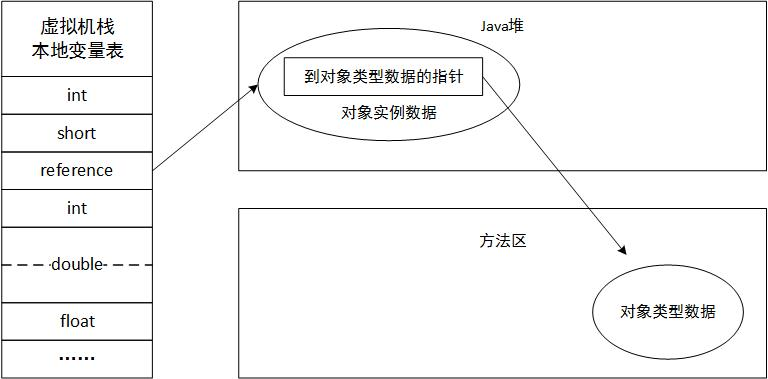

# 深入理解JVM

最近在看周志明的《深入理解Java虚拟机》，写的真是太棒了，简直是让我打开了新世界的大门，JVM 的世界真是丰富多彩啊！还有......特别的复杂。

## 运行时数据区域

首先从 JVM 运行时数据区域的划分来说起


### 程序计数器

程序计数器是一块**较小的**内存空间，可以看作是当前线程所执行的字节码的**行号指示器** ，字节码解释器工作时就是通过改变这个计数器的值来**选取下一条需要执行的字节码命令**，分支、循环、跳转、异常处理、线程恢复等基础功能都需要依赖这个计数器来完成。

Java 虚拟机的多线程是通过线程轮流切换并分配处理器执行时间的方式来实现的，在任意的一个确定的时刻，一个处理器（对于多核处理器来说就是一个内核）都只会执行一条线程中的指令，为了能使线程切换后能恢复到正确的执行位置，每条线程都需要有一个独立的程序计数器，各条线程之间计数器互不影响，独立存储，我们称这类内存区域为“**线程私有**”的内存。

特别的，如果正在执行的是 Native 方法，这个计数器值则为空。

### Java虚拟机栈

与程序计数器一样，**Java虚拟机栈也是线程私有的，它的生命周期与线程相同**，虚拟机栈是描述 Java 方法执行的内存模型。
每个方法在执行的时候会创建一个栈帧，用于存储局部变量表、操作数栈、动态链接、方法出口等信息。

很多人把 Java 内存区分为堆内存和栈内存，这种方法比较粗糙，**这里的栈指的就是虚拟机栈了**，或者说是虚拟机栈中局部变量表部分。

> 局部变量表存放了编译期可知的各种基本数据类型、对象引用和 returnAddress 类型（指向了一条字节码指令的地址）

**局部变量所需的内存空间在编译期间完成分配**，当进入一个方法时，这个方法需要在栈中分配多大的局部变量空间是**完全确定的，在方法的运行期间不会改变局部变量表的大小**。

在 Java 虚拟机规范中，对这个区域规定了两种异常状况，一种是线程请求栈深度超过了允许的最大深度抛出 StackOverflowError 异常；现在的虚拟机大多支持动态扩展，如果扩展时无法申请到足够的内存就会抛出 OutOfMemory 异常。

### 本地方法栈

本地方法栈与虚拟机栈所发挥的作用是非常相似的，他们之间的区别不过是**虚拟机栈为虚拟机执行 Java 方法（也就是字节码）服务，而本地方法栈则为虚拟机使用到的 Native 方法服务。**

虚拟机规范中对本地方法栈中方法使用的语言、使用方式和数据结构没有强制规定，虚拟机可自由实现它，有的虚拟机（比如 Sun HotSpot）**直接就把本地方法栈和虚拟机栈合二为一**。

与虚拟机栈一样，也会抛出两个异常，和上面一致。

### Java堆

对于多大数的应用，**Java 堆是 Java 虚拟机所管理的内存中的最大的一块**。

Java 堆是被**所有线程共享的一块内存区域**，**在虚拟机启动时创建，此内存区域的唯一目的就是来存放对象实例，几乎所有的对象实例都在这里分配内存。**

> Java 虚拟机规范中：所有对象实例以及数组都要在堆上分配

但是随着 JIT 编译器的发展与逃逸分析技术逐渐成熟，栈上分配、标量替换优化技术将会导致一些微妙的变化发生，所有对象都分配在堆上也渐渐变得不是那么绝对了。

Java 堆是 GC 管理的主要区域，因此很多时候称作 GC堆（不叫垃圾堆），现在的**收集器大部分都采用的是分代收集算法**，所以 Java 堆中还可以细分为：**新生代和老年代**。

线程共享的 Java 堆中可能划分出多个线程私有的分配缓冲区，**进一步划分的目的是为了更好的垃圾回收，或者更快的分配内存。**

> 根据 Java 虚拟机的规范：**Java 堆可以处于物理上不连续的内存空间中，只要逻辑上连续就可以了**，就像我们的磁盘空间一样；
>
> 在实现时，可以是固定的大小，也可以是可扩展的，不过主流的虚拟机都是安装可扩展来实现的（通过 -Xmx 和 -Xms 控制）

### 方法区

方法区**与 Java 堆一样，是各个线程共享的内存区域，它用于存储已被虚拟机加载的类信息、常量、静态变量、即时编译器编译后的代码等数据。**

Java 虚拟机规范把**方法区描述为堆的一个逻辑部分**，但是它却有一个别名叫 Non-Heap （非堆），目的是与 Java 堆区分开来。

很多开发者更愿意把方法区称为“永久代”，本质上两者并不等价，仅仅是因为 HotSpot 虚拟机的设计团队选择把 GC 分代收集扩展至方法区，或者说使用永久代来实现方法区而已，这样 HotSpot 的 GC 就可以像管理 Java 堆一样来管理这部分内存了，能够省去·专门为方法区编写内存管理代码的工作。

对于其他虚拟机来说（比如 J9），是不存在永久代的概念的。

> 使用永久代来实现方法区，现在看来并不是一个好主意，因为这样更容易遇到内存溢出问题

对于 HotSpot 现在也基本**放弃永久代并逐步改为采用 Native Memory 来实现方法区，在 JDK7 的 HotSpot 中，已经把原本放在永久代的字符串常量池移出到了堆中。**

Java 虚拟机规范对方法区的限制非常宽松，除了和 Java 堆一样不需要连续的内存和可以选择固定大小或者可扩展外，还可以选择不实现垃圾收集。

相对而言，GC 在这里较少出现，但**并非**数据进入方法区就如同永久代名字一样永久存在了，这个区域的内存回收主要针对常量池的回收和类型的卸载（回收效果比较难令人满意），所以这部分区域的回收确实是必要的。

### 运行时常量池

**运行时常量池是方法区的一部分**。

**Class 文件中**除了有类的版本、字段、方法、接口、等描述信息，**还有一项信息是常量池**，用于存放编译期生成的各种字面量和符号引用，**这部分内容将在类加载后进入方法区的运行时常量池中存放**。

一般来说，除了保存 Class 文件中描述的符号引用外，还会**把翻译出来的直接引用也存储在运行时常量池中**。

**运行时常量池**对于 Class 文件常量池的另外一个重要特征是**具备动态性**，Java 语言**并不是要求常量一定只有编译期才能产生**，也就是并非预置入 Class 文件中常量池的内容才能进入方法区运行时常量池，**运行期间也可能将新的常量放入池中**。

### 直接内存

**直接内存并不是虚拟机运行时数据区的一部分，也不是 Java 虚拟机规范中定义的内存区域**，但是这部分内存也被频繁的使用，也会导致 OOM。

在 JDK1.4 加入了 NIO，可以使用 Native 函数库直接分配堆外内存，通过一个存储在堆中的 DirectByteBuffer 对象作为这块内存的引用进行操作，性能有了显著提高，因为避免了在 Java 堆和 Native 堆中来回复制数据。

显然，本机直接内存的分配不会受到 Java 堆大小的限制（很多管理员经常忽略直接内存的配置，导致出现 OOM）

## 对象的创建

这里讨论的是普通的 Java 对象，不包括数组和 Class 对象。

**当虚拟机遇到一条 new 指令时，首先去检查这个指令的参数是否能在常量池中定位到一个类的符号引用，并且检查这个符号引用代表的类是否已被加载、解析、和初始化过，如果没有，那必须先执行相应的类加载过程。**

在类加载检查通过后，然后就是给新生对象分配内存了，**对象所需的内存大小在类加载完成后便可以完全确定**，那么接下来就是从堆中划分一块空间了：

- 假设 Java 堆中的内存是绝对规整的，就是所有用过的在一边，空闲的在另一边，中间放个指针作为指示器，这样只需要移动这个指针就可以分配指定的内存，这种方式也称为“指针碰撞”。
- 如果 Java 堆中的内存并不是规整的，虚拟机就必须维护一个列表，记录那些内存块是可用的，在分配时，从列表中找到一块足够大的空间划分给对象实例，并更新列表上的记录，这种方式称为“空闲列表”。

选择那种方式由 Java 堆是否规整来决定，是否规整又与采用的垃圾收集器是否带有压缩整理的功能决定，对象创建在虚拟机中是非常频繁的行为

（虚拟机采用 CAS 配上失败重试的方式保证更新操作的原子性）

内存分配完成后，虚拟机需要将分配到的内存空间都初始化为零值（不包括对象头），保证了对象的实例字段在 Java 代码中可以不赋初始值就可以使用。

接下来，虚拟机要对对象进行必要的设置，例如这个对象是那个类的实例、如何才能找到类的元数据信息、对象的哈希码、对象的GC分代年龄等信息，这些信息存放在对象的对象头中。

上面的工作完成后，从虚拟机的角度来看，一个新的对象就已经产生了，但从 Java 程序的视角来看，对象的创建才刚刚开始，然后会执行 init 方法，把对象按照程序员的意愿进行初始化。

## 对象的访问定位

建立对象是为了使用对象，我们的 Java 程序需要通过栈上的 reference 数据来操作堆上的具体对象。

目前主流的访问方式由使用句柄和直接指针两种：


---



- 如果使用**句柄访问**的话，那么 Java 堆中将会划分出一块内存来作为句柄池，reference 中存储的就是对象的句柄地址，而句柄中包含了对象实例数据与类型数据各自的地址信息。
- 如果使用**直接指针**访问，那么 Java 堆对象的布局中就必须考虑如何放置访问类型数据的相关信息，而 reference 中存储的直接就是对象地址。

这两种对象访问方式各有优势，**使用句柄最大的好处是 reference 中存储的是稳定的句柄地址，在对象被移动（垃圾收集时移动对象是非常普遍的行为）时只会改变句柄中的实例数据指针，而 reference 本身不需要修改。**

**使用直接指针访问方式最大的好处就是速度更快，它节省了一次指针定位的时间开销（对象访问在 Java 中非常频繁，这类开销极少成多是很可观的执行成本）。**

就 Sun HotSpot 来说，使用的是第二种方式进行对象访问，第一种也很常见。

> 在 Windows 平台的虚拟机中，Java 的线程是映射到操作系统的内核线程上的

## 垃圾收集器

其中，程序计数器、虚拟机栈、本地方法栈这三个区域随线程而生，随线程而灭；这几个区域的内存分配和回收都具备确定性，在这几个区域内就不需要过多考虑回收的问题，因为方法结束或者线程结束时，内存自然就随着回收了。

所以我们着重来研究下 Java 堆的垃圾收集

### 判断对象死活

常见的判断对象是否还有用的方法有两种，引用计数算法和可达性分析算法；在流行的 JVM 中，都是选用的后者，前者的实现更简单些。

#### 引用计数算法

很多教科书中是这样写的，给对象添加一个引用计数器，当一个地方引用它时，计数器的值就加一，当引用失效时就减一，任何时刻计数器为 0 的对象就是不可能再被使用的。

引用计数法的实现很简单，判定率也很高，微软的 COM 技术用的就是它，但是至少主流的 JVM 里面没有选用引用计数算法来管理内存，其中主要的原因是它很难解决对象之间互相循环引用的问题。

比如：对象 A 和对象 B 都有字段 instance ，赋值 `A.instance = B; B.instance = A;` ，除此之外两个对象再无任何引用，实际上这两个对象已经不可能再被访问了，但是它们互相引用着对方，导致引用计数器不为 0 ，于是引用计数算法无法通知 GC 回收它们。

#### 可达性分析算法

在主流的商用程序语言的主流实现中，都是通过可达性分析来判定对象是否存活的，基本思路是：

通过一系列称为 `GC Roots` 的对象作为起始点，从这些节点开始往下搜索，搜索所走过的路径称为引用链，当一个对象到 `GC Roots` 没有任何相连的引用链（不可达），则证明此对象是不可用的。

在 Java 语言中，可作为 GC Roots 的对象包括下面几种：

- 虚拟机栈（栈帧中的本地变量表）中引用的对象
- 方法区中类静态属性引用的对象
- 方法区中常量引用的对象
- 本地方法栈中 JNI（即一般说的 Native 方法）引用的对象

#### 关于引用

判定对象是否存活都与引用有关

还有一类对象：当内存空间还足够时，则能保留在内存中；如果内存空间在进行垃圾回收后还是非常紧张，则可以抛弃这些对象，缓存功能就很符合这样的场景。

在 JDK1.2 后，Java 对引用的概念进行了扩充，将引用分为：**强引用、软引用、弱引用、虚引用**。

- 强引用是指在程序代码中普遍存在的，类似 `Object o = new Object();` 这类引用，只要强引用还存在，垃圾收集器永远不会回收掉被引用的对象。

- 软引用来描述一些还有用但非必须的对象。

  在系统将要发生内存溢出异常之前，将会把这些对象列进回收范围之中进行第二次回收，在 JDK1.2 后，提供了 WeakReference 类来实现弱引用。

- 虚引用也称为幽灵引用或者幻影引用，是最弱的一种引用关系。

  一个对象是否有虚引用的存在，完全不会对其生存时间构成影响；也无法通过虚引用来取得一个对象实例。

  设置虚引用的唯一目的就是能在这个对象被垃圾收集器回收时收到一个系统通知。

  在 JDK1.2 之后，提供了 PhantomReference 类来实现虚引用。

#### 生存还是死亡

即使在可达性算法中不可达的对象也并非是“非死不可”的，这时候他们暂时处于“缓刑”阶段，要真正宣告一个对象的死亡，**至少要经历两次标记过程**：如果对象在进行可达性分析后发现没有与 GC Roots 相连接的引用链，那它就会被第一次标记且进行一次筛选，筛选的条件是此对象是否有必要执行 finalize 方法，当对象没有覆盖 finalize 方法或者此方法已经被虚拟机调用过，虚拟机将这两种情况视为“没有必要执行”。

如果这个对象被判定为有必要执行 finalize 方法，那么这个对象将会放置在一个叫做 **F-Queue** 的队列中，并在稍后由一个虚拟机自动建立、低级优先级的 Finalizer 线程去执行它。**但是并不会承諾会等待方法运行结束**。

> 如果一个对象在 finalize 方法执行缓慢，或者发生了死循环，可能会导致 F-Queue 队列中其他对象永久处于等待，甚至整个内存回收系统的崩溃。

finalize 方法是对象逃脱死亡命运的最后一次机会，稍后 GC 会对队列中的对象进行第二次小规模的标记，如果对象在 finalize 方法中成功拯救自己（比如把自己 this 赋值给某个类变量或者对象的成员变量），那么在第二次标记时就会把它移出“即将回收”的集合，**但是一个对象的 finalize 方法只会被调用一次**。

> 建议尽量避免使用它，它的运行代价高昂，不确定性大，无法保证各个对象的调用顺序；
>
> 有些人说适合做“关闭外部资源”之类的工作，这其实是一种自我安慰，使用 try-finally 或者其他方式都可以做到更好、更及时。

#### 回收方法区

在堆中，尤其是在新生代中，常规应用进行一次垃圾收集一般可以回收 70% - 95% 的空间，永久代（方法区）的效率远低于此。

**永久代的垃圾收集主要回收两部分内容：废弃常量和无用的类。**

例如一个字符串 “abc” 进入了常量池中，但是当前系统没有任何一个 String 对象叫做 "abc" 的，就是没有任何对象引用它，这时候就可以进行回收了，常量池中的其他类（接口）、方法、字段的符号引用也与此类似。

如何判断一个类是无用类呢：

- 该类所有的实例都已经被回收，也就是 Java 堆中不存在该类的任何实例
- 加载该类的类加载器已经被回收了
- 该类对应的 `java.lang.Class` 对象没有在任何地方被引用，无法在任何地方通过反射访问该类的方法。

虚拟机可以对满足上述三个条件的无用类进行回收，这里仅仅是说的可以，而并不是和对象一样，不使用了就必然会被回收。

在大量使用反射、动态代理、CGLib 等字节码技术的框架、动态生成 JSP 等场景都需要虚拟机具备类卸载的功能，以保证永久代不会溢出。

### 垃圾收集算法

常见的垃圾收集算法有四种，准确的说其实是三个，他们都各有用处

#### 标记清除算法

最基础的收集算法是 “标记-清除” 算法，如它的名字，分为标记和清除两个阶段：

首先标记出所有需要回收的对象，在标记完成后统一回收所有被标记的对象，标记过程在上面已经说了（可达性分析），它主要有两个不足的地方：

- 效率问题，标记和清除两个过程的效率都不高；
- 空间问题，标记清除之后会产生大量的不连续的内存碎片，空间碎片太多可能会导致以后在程序运行过程中需要分配较大的对象时，无法找到足够连续的内存而不得不提前触发另一次垃圾收集动作。


#### 复制算法

为了解决效率问题，一种称为复制的收集算法出现了，它将可用内存按照容量划分为大小相等的两块，每次只使用其中的一块。

当这一块的内存用完了，就将还存活着的对象复制到另一块上面，然后把已使用过的内存空间一次清理掉。

这样使得每次都对整个半区进行内存回收，不用考虑碎片等复杂情况，实现简单运行高效。

但是这种算法的代价是将内存缩小为了原来的一半，未免也太高了点。


现在商业虚拟机都采用这样收集算法来回收新生代，IBM 公司研究表明，新生代中的对象 98% 是“朝生夕死”的，所以并不需要 1:1 的比例来分配内存空间，而是**将内存分为一块较大的 Eden 空间和两块较小的 Survivor 空间，每次使用 Eden 和其中一块 Survivor** （IBM 的研究只是说明了这种布局的意义所在，HotSpot 一开始就是这种布局）。

当回收时，将 Eden 和 Survivor 中还存活的对象一次性的复制到另一块 Survivor 空间上，最后清理掉 Eden 和刚才用过的 Survivor 空间，HotSpot 虚拟机默认 Eden 和 Survivor 的大小比例是 8:1，也就是每次新生代中可用内存空间为整个新生代的 90%（80% + 10%），也就是说只有 10% 的内存会被浪费。

我们没有办法保证每次回收都只有不多于 10% 的对象存活，当 Survivor 空间不够用时，需要依赖其他内存（老年代）进行分配担保。

如果有一块 Survivor 空间没有足够的空间存放上一次新生代收集下来的存活对象时，这些对象将直接通过分配担保机制进入老年代，这个我们稍后再继续说。

#### 标记整理算法

复制收集算法在对象存活率较高时就要进行较多的复制操作，效率将会变低（所以它适合存活率较低的情景）。

在老年代一般不能直接选用这种算法，因为没地方做担保了，根据老年代的特点，有人提出了另外一种“标记-整理”算法，标记过程是一样的，在对对象回收时，是让所有存活的对象都向一端移动，然后直接清理掉端边界以外的内存。


#### 分代收集算法

**当前商业虚拟机的垃圾收集都采用“分代收集”算法**，这种算法并没有什么新的思想，只是根据对象存活的周期不同将内存划分为几块，一般是**把 Java 堆分为新生代和老年代**，根据各个年代特点采用最适当的收集算法。

在新生代中，每次垃圾收集时都发现有大批的对象死去，只有少量存活，那就选用复制算法；

在老年代中，对象的存活率较高、没有额外的空间对它进行分配担保，就必须使用“标记-清理”或者“标记-整理”算法来进行回收。

### HotSpot的实现

#### 枚举根节点

可达性分析中，主要是以 GC Roots 开始检查，但是现在很多应用，仅仅方法区就有数百兆，如果逐个检查这里面的引用，那么必然会消耗很多的时间。

另外，可达性分析对执行时间的敏感还体现在 GC 停顿上，因为这项工作必须在一个能确保一致性的快照中进行，也就是说整个分析期间，整个执行系统看起来就像被冻结在某个时间点上，不可以出现分析过程中对象引用关系还在不断变化的情况，如果不满足就无法保证准确性。

这点是导致 GC 进行时必须停顿所有的 Java 执行线程的其中一个重要原因，也就是说，在枚举根节点时必须要停顿的。（Sun 将这件事情称为 Stop The World）

目前主流的 JVM 使用的都是准确式 GC，当执行系统停顿下来后，并不需要一个不漏的检查完所有执行上下文和全局引用的位置，虚拟机应当是有办法直接得知那些地方存放着对象的引用。

在 HotSpot 实现中，是使用一组称为 OopMap 的数据结构来达到这个目的的，在类加载完成的时候，HotSpot 就把对象内什么类型的数据给计算出来了，在 JIT 编译过程中也会确定

#### 安全点

在 OopMap 的帮助下，HotSpot 可以快速准确的完成 GC Roots 枚举，为了解决引用关系的变化问题，HotSpot 并不是为每条指令都生成 OopMap ，只是在特定的位置记录了这些信息，这些位置称之为“安全点”，即程序执行时并非在所有地方都能停顿下来开始 GC，只有在到达这些安全点时才能暂停。

安全点的选定基本上是以程序“**是否具有让程序长时间执行的特征**”为标准进行选定的，比如方法调用、循环跳转、异常跳转等。

另外一个需要考虑的问题是如果在 GC 发生时让所有线程都跑到最近的安全点上再停顿下来。

- 抢先式中断。

  不需要线程的执行代码去主动配合，在 GC 发生时，首先把所有的线程中断，如果发现有的线程不在安全点上就恢复这个线程，让它跑到安全点上。现在几乎没有虚拟机实现采用抢占式中断来解决响应 GC 事件的。

- 主动式中断。

  不直接对线程操作，仅仅简单的设置一个标志，各个线程执行的时候主动去轮询这个标志，发现中断标志为真时就自己中断挂起，轮询标志的地方和安全点是重合的（还包括创建对象分配内存的地方，会产生一个自陷异常信号）

#### 安全区域

使用安全点机制保证了程序执行时，在不太长的时间内就会遇到可进入 GC 的安全点，但是程序“不执行”的时候呢？

也就是没有分配 CPU 时间的时候，经典的例子就是当线程处于 sleep 或者 Blocked 状态，这时候线程无法响应 JVM 的中断请求，JVM 也不太可能等待线程重新分配 CPU 时间。对于这种问题就需要安全区域来解决。

安全区域就是指在一段代码中，**引用关系不会发生改变，在这个区域的任何地方开始 GC 都是安全的**。可以看作是把安全点扩展了一下。

线程执行到安全区域中的代码时，首先标识自己已经进入安全区域，当在这段时间 JVM 要发起 GC 的时候，就不需要管标识自己为安全区域状态的线程了。

在线程要离开安全区域时，它要检查系统是否已经完成了 GC 过程，如果完成了就继续执行，否则就必须等待直到收到可以安全离开安全区域的信号为止。

### 垃圾收集器

虚拟机中不止有一种垃圾收集器，不同的厂商、不同的版本也会有一定的差别，这里的以 HotSpot 为例：


这些垃圾收集器作用于不同的分代，如果两个收集器之间连线，就说明他们可以搭配使用。

直到现在为止还没有最好的收集器出现，更加没有万能的收集器，所以我们选择的只是对具体应用最合适的收集器，这也是提供这么多收集器的原因。

#### Serial收集器

Serial 收集器是最基本、发展历史最悠久的收集器。

看名字就知道，这**是一个单线程收集器**，它在进行垃圾收集时，必须暂停其他所有的工作线程，直到它收集结束。

（如果你的计算机每运行一个小时就会暂停响应五分钟，那真是不太好）

但是，到现在为止，它依然是**虚拟机运行在 Client 模式下的默认新生代收集器**。它简单高效（与其他收集器的单线程比），对于限定的单个 CPU 的环境来说，它没有线程交互的开销，专心做垃圾收集自然可以获得最高的单线程收集效率。

在用户桌面应用场景中，分配给虚拟机管理的内存一般来说不会很大，停顿时间完全可以控制在几十毫秒最多一百多毫秒内，只要不是频繁的发生，这点停顿还是可以接受的，所以 Serial 收集器对于运行在 Client 模式下的虚拟机来说是一个很好的选择。


#### ParNew收集器

ParNew 收集器是 Serial 收集器的**多线程版本**，除了使用多条线程进行垃圾收集之外，其他方面基本和 Serial 保持一致，事实上这两种收集器也共用了很多代码。

它是许多**运行在 Server 模式下**的虚拟机中首选的新生代收集器，另外一个原因是，除了 Serial 外，目前只有它能与 CMS 收集器配合工作。

ParNew 收集器在单 CPU 的环境中绝对不会比 Serial 收集器更好的效果，随着可以使用的 CPU 的数量的增加，他对于 GC 时系统资源的有效利用还是有好处的。

它默认开启的收集线程数与 CPU 的数量相同，在 CPU 非常多（如 32 个，服务器超过 32 个逻辑 CPU 的情况越来越多了）的环境下，可以使用 `-XX:ParallelGCThreads` 参数来限制垃圾收集的线程数。


#### Parallel Scavenge收集器

Parallel Scavenge 收集器是一个**新生代收集器**，它也是使用**复制算法**的收集器，又是**并行的多线程收集器**。

> 这里的并发和并行结合语境应该是：
>
> 并行：多条垃圾收集器并行工作，但此时用户线程仍然处于等待状态。
>
> 并发：用户线程与垃圾收集线程同时执行（但不一定是并行的，也有可能是交替执行），用户程序在继续运行，而垃圾收集程序运行在另一个 CPU 上。

CMS 等收集器关注点是尽可能缩短垃圾收集时用户线程的停顿时间；**而 Parallel Scavenge 收集器的目标则是达到一个可控制的吞吐量。**

吞吐量 = 运行用户代码时间 / （运行用户代码时间 + 垃圾收集时间）

停顿时间越短就越适合需要与用户交互的程序，良好的响应速度能提升用户体验，而高的吞吐量则可以高效率的利用 CPU 时间，尽快完成程序的运算任务，主要适合在后台运算而不需要太多交互的任务。

通过一些参数可以设置 GC 的停顿时间等，GC 的停顿时间缩短是以牺牲吞吐量和新生代空间来换取的。

比如：系统把新生代设置的小一点，收集速度肯定会快吧，但这也导致垃圾收集发生的更频繁一些，停顿时间的确在下降，但是吞吐量也降下来了。

PS：它支持 GC 自适应调节策略，如果对其不太了解，手动设置存在困难的时候可以使用这种模式，这也是它与 ParNew 收集器的一个重要区别。

#### Serial Old收集器

Serial Old 是 Serial 收集器的老年代版本，它同样是一个单线程的收集器，使用“标记-整理”算法，主要意义也是给 Client 模式下的虚拟机使用。

在 Server 模式下，它作为 CMS 收集器的后备预案


#### Parallel Old收集器

Parallel Old 是 Parallel Scavenge 收集器的老年代版本，使用多线程和“标记-整理”算法，从 JDK1.6 开始提供，从这开始“吞吐量优先”收集器终于有了比较名副其实的应用组合。

在注重吞吐量以及 CPU 资源敏感的场合，都可以优先考虑 Parallel Scavenge 加 Parallel Old 收集器。


#### CMS收集器

CMS 收集器是一种**以获取最短回收停顿时间为目标的收集器**。

目前很大一部分 Java 应用集中在 B/S 系统的服务端上，这类应用尤其重视服务的响应速度，希望系统停顿时间最短，CMS 就非常符合这类应用的需求。

CMS 收集器是**基于“标记-清除”算法实现的**，运作比较复杂，整个过程可分为四个步骤：

1. 初始标记
2. 并发标记
3. 重新标记
4. 并发清除

其中，初始标记、重新标记这两个步骤仍然需要“Stop The World”。

初始标记仅仅只是标记一下 GC Roots 能直接关联到的对象，速度很快；

并发标记阶段就是进行 GC Roots Tracing 的过程；

而重新标记阶段则是为了修正并发标记期间因为用户程序继续运作而导致标记产生变动的那一部分对象的标记记录，这个阶段的停顿时间一般会比初始标记阶段稍长一些，但远远比并发标记的时间短。

由于整个过程中耗时最长的并发标记和并发清除过程收集器线程都可以与用户线程一起工作，所以从总体上来讲，CMS 收集器的内存回收过程是与用户线程一起并发执行的。


CMS 是一款优秀的收集器，它的优点有并发收集、低停顿，但 CMS 还远远达不到完美的程度，它有 3 个明显的缺点：

1. CMS 收集器对 CPU 资源非常敏感。

   其实，面向并发设计的程序都对 CPU 资源比较敏感，在并发阶段，它虽然不会导致用户线程停顿，但是会占用一部分线程或者说 CPU 资源从而导致应用程序变慢，总吞吐量降低。

   CMS 默认启动的回收线程数是 （CPU 数量 + 3）/ 4，也就是说当 4 个 CPU 以上时，并发回收时垃圾收集线程不少于 25% 的 CPU 资源，并且随着 CPU 数量的增加而下降；当 CPU 数量达不到 4 个时，CMS 对用户程序的影响就可能变得很大（执行速度可能会瞬间降低 50%）。

2. CMS 收集器无法处理浮动垃圾。

   可能出现 “Concurrent Mode Failure” 失败而导致另一次 Full GC 的产生，由于 CMS 并发清理阶段用户线程还在运行着，伴随程序运行自然就会还有新的垃圾不断产生，这一部分垃圾未被标记过，CMS 无法在本次处理它们，只能等到下次 GC，这一部分垃圾就称为浮动垃圾。

   由于在垃圾收集阶段用户线程还需要运行，那么就得预留有足够的内存空间给用户线程使用，因此 CMS 不像其他收集器哪样等到老年代几乎被填满了再进行收集，需要预留一部分空间提供并发收集时的程序运作使用。

   在 JDK1.6 中，CMS 收集器的启动阀值已经提升到 92% ，要是 CMS 运行期间预留的内存无法满足程序的需要，就会出现一次 “Concurrent Mode Failure” 失败，这时虚拟机就会启动后备预案：临时启用 Serial Old 收集器来重新进行老年代的垃圾收集，这样停顿的时间就更长了。

3. 会产生大量空间碎片。

   CMS 是基于“标记-清除”算法实现的，如果还记得这个算法，那么就会理解了。

   空间碎片过多时，将会给大对象分配带来很大的麻烦，往往是老年代还有很大的空间剩余，但是无法找到足够大的连续空间来分配当前对象，不得不提前触发一次 Full GC。

   为了解决这个问题，CMS 提供了一个默认开启的参数用于在 CMS 收集器顶不住要进行 FullGC 的时候开启内存碎片的整理合并过程，内存整理的过程是无法并发的，空间碎片的问题没有了，但停顿时间不得不变长。

#### G1收集器

G1 收集器是当今收集器技术发展的最前沿成果之一，G1 是一款面向服务端应用的垃圾收集器（未来可能会替换掉 CMS 收集器）。

G1 所具有的特点有：

- 并行与并发。

  G1 能够充分利用多 CPU、多核环境下的硬件优势，使用多个 CPU 来缩短 Stop-The-World 停顿时间，还可通过并发的方式让 GC 工作时 Java 程序继续执行。

- 分代收集。

  与其他收集器类似，虽然 G1 可以不需要其他收集器配合就能独立管理整个 GC 堆，但它能够采用不用的方式去处理新创建的对象和已经存活一段时间、熬过多次 GC 的旧对象以获取更好的收集结果。

- 空间整合。

  与 CMS 的“标记-清理”算法不同，**G1 从整体来看是基于“标记-整理”算法实现的收集器，从局部上来看是基于“复制”算法实现的**，无论如何，这两种算法都意味着 G1 运作期间不会产生内存空间碎片。

- 可预测的停顿。

  这是 G1 相对于 CMS 的另一大优势，降低停顿时间是他们的共同关注点，能够指定消耗在垃圾收集上的时间不能超过 N 毫秒。

G1 中的堆布局和其他收集器有很大差别，**它将整个 Java 堆划分为许多个大小相同的独立区域，虽然还保留有新生代和老年代的概念，但新生代和老年代不再是物理隔离的，他们都是一部分 Region（不需要连续）的集合。**

G1 之所以能建立可预测的停顿时间模型，是因为它可以有计划的避免整个 Java 堆进行全区域的垃圾收集，它在后台维护一个优先级列表，每次根据允许的收集时间，优先回收价值最大的 Region，保证了 G1 收集器在有限的时间内可以获取尽可能高的收集效率。

当然听着听简单的，实现起来远远没有这么简单，其中还设计到了一个 Remembered 来避免全堆扫描，就不详细说了。

G1 收集器的运作大致可划分为：

- 初识标记
- 并发标记
- 最终标记
- 筛选回收

可以看出和 CMS 有很多的相似之处，最终标记阶段需要停顿线程，但是可以并行执行，在筛选回收阶段会先进行排序，然后根据用户所期望的时间来制定回收计划，这个阶段其实可以做到与用户程序一起并发执行，但是因为只回收一部分，时间是用户控制的，而且停顿用户线程将大幅提高收集效率。


> 日志中的 GC 和 Full GC 说明了垃圾收集的停顿类型，如果有 Full 就说明这次 GC 是发生了 Stop-The-World 的。
>
> 方括号内部的 xxK->xxK(xxK)，含义是 GC 前该内存区域已使用->GC 后该内存已使用的容量（该区域的总容量）
>
> 方括号之外的 xxK->xxK(xxK)，表示 GC 前 Java 堆已使用容量 -> GC 后堆已使用容量（Java 堆总容量）

### 内存分配与回收策略

对象的内存分配，往大方向讲就是在堆上分配，对象主要分配在新生代的 Eden 区上，少数情况下也可能会直接分配在老年代中，分配的规则并不是百分百固定的，其细节取决于当前使用的是哪一种垃圾收集器组合，以及虚拟机中与内存相关的参数设置。

**对象优先在 Eden 分配**，当 Eden 区没有足够的空间进行分配时，虚拟机会发起一次 Minor GC，如果期间 Survivor 空间不足，就会启动担保机制，把对象提前转移到老年代去。

> **新生代GC（MinorGC）**：指发生在新生代的垃圾收集动作，因为 Java 对象大多数都具备朝生夕灭的特性，所以 MinorGC 非常频繁，一般回收速度也比较快。
>
> **老年代GC（MajorGC/FullGC）**：指发生在老年代的 GC，出现 FullGC 经常会伴随至少一次的 MinorGC，FullGC 的速度一般会比 MinorGC 慢十倍以上。

**大对象直接进入老年代**，所谓对象就是指需要大量连续内存空间的 Java 对象，最典型的大对象就是那种很长的字符串以及数组，大对象对虚拟机内存分配来说是一个坏消息，这会导致内存还有不少空间时就提前触发垃圾收集以获取足够的连续空间来安置它们。另外可以设置虚拟机参数来规定大于某个值的对象直接在老年代分配，但是只对部分收集器有效。

**长期存活的对象进入老年代**，虚拟机给每个对象都定义了一个对象年龄计数器，如果对象在 Eden 出生并经过一次 MinorGC 后仍然存活，并且被 Survivor 容纳的话，将被移动到 Survivor 空间中，并且将对象的年龄设为 1；对象在 Survivor 区每熬过一次 MinorGC 年龄就加一，当年龄超过一定程度（默认是 15），就会被转移到老年代中，这个值可以通过 `-XX:MaxTenuringThreshold` 设置。

**动态对象年龄判定**，为了更好的适应不同程度的内存状况，可以设置为如果在 Survivor 空间中相同年龄的所有对象大小的总和大于 Survivor 空间的一半，年龄大于或者等于该年龄的对象就可以直接进入老年代，无需等到规定的年龄。

**空间分配担保**：发生 MinorGC 之前，虚拟机会先检查老年代最大可用的连续空间是否大于新生代所有对象总空间，如果这个条件成立，那么 MinorGC 可以确保是安全的，如果不成立，那么就会检查老年代最大可用的连续空间是否大于历次晋升到老年代对象的平均大小，如果大于就尝试进行一次 MinorGC，尽管这次 GC 是有风险的；如果小于那这时也要改为进行一次 FullGC。

因为一共有多少对象会存活下来在实际完成内存回收之前是无法明确知道的，所以只好取前几次的平均值作为经验，与老年代剩余的空间进行比较，决定是否进行 FullGC 来让老年代腾出更多的空间。

## 虚拟机监控与分析

JDK 中不止带了 javac 、 java，还有很多的有助于我们监控分析的软件，这些工具（bin 目录下），大多数是 `lib/tools.jar` 类库的一层薄包装而已，所以会非常的小，并且大多参考了 Linux 的命令模式。

- jps

  虚拟机进程状况工具

- jstat

  虚拟机统计信息监视工具

- jinfo

  Java配置信息工具

- jmap

  Java内存映像工具

- jhat

  虚拟机堆转储快照分析工具

- hsdis

  JIT生成代码反汇编

- jstack

  Java堆栈跟踪工具

然后还有两个重量级工具，可视化的工具，应该也是用的最多的

- JConsole

  Java监视与管理控制台

- **VisualVM**

  多合一故障处理工具，对应用程序的实际性能影响很小，使得它可以直接应用在生产环境中。

  支持插件扩展，并且支持在线一键安装、生成、浏览堆转储快照、分析程序性能、BTrace 动态日志追踪。

这里不做详细解释了，一般最后两个就足够了。

## 拓展

`String.intern()` 是一个 Native 方法，它的作用是：

如果字符串常量池中已经包含一个等于此 String 对象的字符串，则返回代表池中这个字符串的 String 对象；

否则将此 String 对象包含的字符串添加到常量池中，并返回此 String 对象的引用。

``` java
public class TestStringIntern{
  public static void main(String[] args){
    String s1 = new StringBuilder("计算机").append("软件").toString();
    System.out.println(s1.intern() == s1);

    // 运行时常量池已经存在 Java
    String s2 = new StringBuilder("ja").append("va").toString();
    System.out.println(s2.intern() == s2);
  }
}
```

在 1.6 中得到两个 false，在 1.7 中得到的是一个 true 一个 false；原因是：

- JDK1.6 中，intern 方法会把首次遇到的字符串实例复制到永久代中，返回的也是永久代中这个字符串实例的引用，sb 创建的字符串实例在 Java 堆上。
- JDK1.7 中，intern 的实现不会再复制实例，只是在常量池中记录首次出现的实例引用，因此 intern 返回的引用和 sb 创建的字符串实例是同一个

---

Java 调用外部程序是非常耗费资源的操作，过程是：首先克隆一个和当前虚拟机拥有一样环境变量的进程，再用这个新的进程去执行外部命令，最后再退出这个进程，尤其是反反复复的执行外部命令，更加的耗费资源。

---

在 JDK1.2 以后，虚拟机内置了两个运行时编译器，如果有一段 Java 代码方法被调用次数达到一定程度，就会被判定为热代码交给 JIT 编译器即时编译为本地代码，提高运行速度（这也是 HotSpot 名字的由来），甚至有可能在运行期动态编译的比 C/C++ 的编译器静态编译出来的代码更优秀。

因为运行时期可以收集很多编译器无法知道的信息，甚至可以采用一些很激进的优化手段，在优化条件不成立的时候再逆优化退回来，所以随着代码被编译的越来越彻底，运行速度应当是越运行越快的；

Java 的运行期编译最大的缺点就是它进行编译需要消耗程序正常的运行时间。