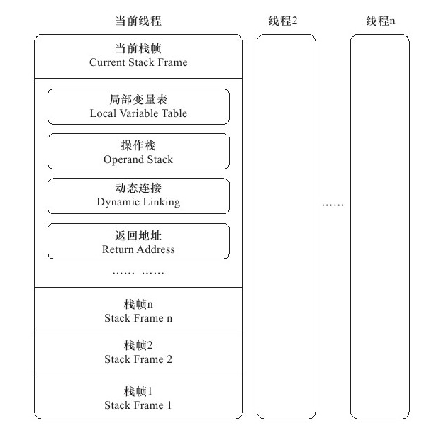
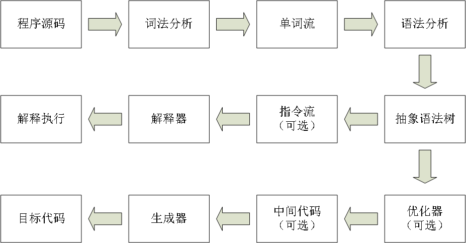
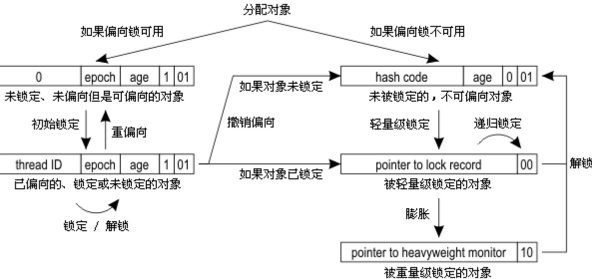

# 深入理解JVM(内容补全)

前面两篇主要介绍了 GC 相关的知识，接下来就补全，终于把第二版看完了，真是本好书，读下来感觉不错，接下来有时间会把第三版再过一遍。

## Class文件结构

JVM 的语言无关性，字节码的描述必然比 Java 强大，例如支持动态性；

字节码是跨平台的，class 文件是**一组 8 字节为单位的二进制流**，严格的排列在 class 文件中，中间没有分隔符，使得 class 文件非常紧凑，几乎全是必要数据；

> 当遇到需要 8 字节以上的数据时，会按照高位在前的方式分割成若干个 8 位字节存储。

class 文件统一使用一种类似 c 的伪结构存储数据，这种结构只有两种类型，无符号和表；

无符号属于基本的数据类型，以 u1、2、4、8 分别表示 1、2、4、8 个字节的无符号数，它可以用来描述 数字、索引引用、按照 u8 编码的字符串等；

表是由无符号数或其他表组成的复合类型；习惯上以 `_info` 结尾，整个 class 本质就是一张表；

### 魔数

class 文件的开头四个字节，判断是否是 JVM 的可执行文件（非扩展名），`0xCAFEBABE`；

紧接着的 4 个字节是 class 文件的版本号，5、6 字节依次是次版本号，7、8 字节是主版本号；

版本号从 45 开始，依次 +1，用于 JVM 向下兼容；

### 常量池

**紧接着主版本号是常量池入口**，或者说资源仓库，是关联最多的数据类型，也是占用 class 文件空间**最大的数据项目之一**，是第一个出现的表类型的数据项目；

常量池中的数据是**不固定**的，所以在入口放一个 **u2** 表示常量池的容量计数（从 1 开始），将 0 空出来是有意义的，可以来表示不指向任意一个常量池项目；其他的类型的编号一般就是从 0 开始了。

常量池中存放两大类型常量：

1. 字面量（文本字符串、final 常量）
2. 符号引用

符号引用包含：

- 类和接口的全限定名
- 字段名称和描述符
- 方法名称和描述符

在 JVM 加载 class 的时候才会进行『连接』这个步骤，所以说是动态连接；

常量池中的每一个常量都是一个表，每一种表的结构都是不同的；

PS：字节码工具 javap

### 访问标志

在常量池之后，接着是 2 个字节代表的访问标志，包括是接口还是 class，是 public 还是 final，是不是抽象，等等。

通过类索引、接口索引、父类索引，来确定继承关系；这些索引按一定顺序排列在访问标志之后；

### 字段表

描述接口或者类中定义的变量，但是**不包括方法中的局部变量**；

字段的一些基本属性，例如权限修饰符，是不是静态，是不是可序列化，并发可见、final 等都可以用布尔描述，而对于字段类型和名称都是不确定的，都是要从常量池中进行引用；

描述符标识字符：

| 标识字符 | 含义                           |
| -------- | ------------------------------ |
| B        | byte                           |
| C        | char                           |
| D        | double                         |
| F        | float                          |
| I        | int                            |
| J        | long                           |
| S        | short                          |
| Z        | boolean                        |
| V        | void                           |
| L        | 对象类型，如 Ljava/lang/Object |

如果是数组，前面会有 `[` 标识，多维数组也一样。

顺序是先参数列表，后返回值的顺序，参数列表会放在小括号中，还会保存一些扩展信息；

继承的字段属性不会放在字段表中，**java 字段不允许重载，字节码层面，如果两个字段描述符不一致，字段重名也是合法的**。

### 方法表

方法表的描述跟字段表几乎一致，而方法中的具体代码会被**放在方法属性表集合的 Code 属性中。**

在字节码中，重载的特征会更宽泛一些，**即使是仅仅是返回值不同，也可以共存。**

### 属性表

属性表集合的限制相比其他表要宽松一些，不要求有严格的顺序，**任何人实现的编译器都可以往里面写入自己的属性信息，JVM 运行时会自动忽略不认识的属性**；

属性表中定义来很多名称，例如上面提到的 Code，还包含字段表、方法表、类文件等等；

属性值的结构是完全自定义，相当于其他属性的聚合体，不需要引用常量池，只需要指明一个 u4 的长度即可（主要是 Code 中的具体方法代码占用空间），具体的属性可以自己额外添加。

Code 属性中包括了操作数栈深度值，JVM 会按照这个值来分配栈帧；以及所需要的容量，单位 Slot，不超过 32 位的数据使用 1 个，64 位数据类型使用 2 个；

并不是局部变量使用了多少 Slot 就加起来是最大值，因为**局部变量的 Slot 是可以重用的；**

虽然 JVM 使用一个 u4 来表示方法长度，但是 Javac 规范只用了 u2，一般情况也是够用了，只要不是 JSP 那种混合输出编译后可能会超出。

实例方法总会有一个 Slot 来保存 this 变量，class 中实现就是这么简单，当作一个普通的属性。

PS：其中有个 LineNumberTable 属性，记录字节码与源码对应的行号，可以通过一些参数来禁止记录，但是异常堆栈就不会提示行号了，并且也无法设置断点了；还有一些其他类似的属性，例如记录方法参数名的，泛型信息（1.5 中新增了专门的属性，用来解决反射无法获取泛型信息的问题）等。

关于初始化：

Sun javac 中，当标识为 final 和 static 的时候会立即初始化，当没有 final 或者并非基本数据类型（不包括 str）的时候一般会放到 cinit 中，也就是类构造器中；而非 static 就用实例构造器 init 来做了。

### 字节码指令

JVM 的指令是由一个字节长度代表某种操作的数字（操作码）以及随后 0 或多个参数（操作数）构成；

采用面向操作数栈而不是寄存器的架构；所以大多数指令只有操作码；

放弃了编译后操作数长度对齐；

- 可以省略很多填充和符号
- 读取超过一个字节的数据时，需要重建具体数据类型，有所消耗

因为只有一个字节，所以给包含数据类型的指令集带来了压力，所以最终的方案是并非每种数据类型和每一种操作都有对应的指令，很可能是一对多；

因此，**比 int 小的数据结构最终其实都是被转为 int 的字节码指令来处理；**

PS：一个 Java 的 char 类型表示一个 utf-16 编码的代码单元，也就是两个字节，对于当时来说，用了还不到一半，认为足够了；谁能想到后来汉语、日语、韩语直接给撑爆了，所以只能用两个 char 表示一个字符（保留字符），编译器也做了一定的处理，就像随着 java 版本的升级还进行了扩充；在 utf-16 中，大部分汉字 2 个就能表示，少部分 4 个。

#### 同步指令

方法级别的同步是隐式的，无需通过字节码指令来控制，只需要在方法调用和返回的时候加一个标识符即可；

**字节码中的 JVM 指令集由 monitorenter 和 monitorexit 来支持 sync 同步。**

 PS：至于 JVM 的 C 实现，是由 lock 实现，并且因为部分 CPU 不支持内存屏障，所以都是用 lock 来实现。

## JVM 类加载机制

主要工作在运行时完成，好处是灵活性（动态性，例如多态，运行时确定类型），缺点是性能的损耗；

加载时机：

加载 - ｛验证 - 准备 - 解析｝- 初始化 - 使用 - 卸载；

大括号的内容是『连接』，解析阶段可能在初始化之前也可能之后（运行时绑定）；

什么时候加载 JVM 规范并没有强制规定，对于初始化阶段，做了一定要求，下面五种情况必须立即对类进行『初始化』：

1. 遇到 new、getstatic、putstatic 或 invokestatic 这 4 条字节码指令时，如果类没有进行 过初始化，则需要先触发其初始化，对应的就是 new 对象、调用静态方法或者使用静态类字段的时候；
2. 对类进行反射调用的时候
3. 当初始化一个类的时候，发现父类还没有进行初始化，则先触发父类进行初始化
4. 虚拟机启动时，需要指定一个 main 类，要先初始化这个类
5. 1.7+ 的动态语言支持的情况

规范中使用的是 『有且仅有』，这五种场景可理解为是对一个类进行主动引用；除此之外的类引用不会触发初始化操作。

- 子类引用父类的静态字段，不会导致子类的初始化（对于 Hotspot     会触发子类的加载）
- 通过数组定义来引用类，不会导致此类的初始化
- 常量在编译期会存入调用类的常量池中，本质上没有直接引用到定义常量的类，所以不会触发其初始化（转化为对自身常量池的引用）

### 加载

加载是『类加载』的第一个阶段，JVM 需要完成三件事：

1. 通过类的全限定名获取定义的二进制流（非常灵活，例如 zip 包的 jar、war，网络获取，运行时产生的动态代理等）
2. 将字节流代表的静态存储结构转化为方法区的运行时数据结构
3. 在内存中生成一个代表这个类的     class 对象，作为方法区中这个类的各种数据项的访问入口

加载阶段是开发者可控性最强的，既可以使用系统提供的引导类加载器也可以自定义类加载器，去自由控制字节流的获取方式；

对于数组类型有点特殊，不通过类加载器创建，由 JVM 直接创建，当然如果存储的是引用类型对象最终还是要靠类加载器去加载；

加载阶段之后，class 文件就按照 JVM 所需格式被存放到方法区，具体的格式没有强制规定，与之对应的 class 对象也没有明确放到那个区域，对于 Hotspot 是放到方法区，虽然它是一个对象。

加载阶段与连接的部分阶段是交叉进行的，例如验证，往往是加载还未完成，连接阶段已经开始；

### 验证

验证是必要的阶段，确保字节流符合 JVM 的要求，不会危害 JVM 自身的安全，虽然 java 编译层面不会让这类危险动作通过编译，但是文件不一定是 javac 编译出来的，甚至直接用 16 进制编辑器写都可以，只要语法正确；

验证主要分为四个阶段：

1. 文件格式验证（针对字节流的验证，通过后进入方法区存储，下面的验证就是基于方法区了）
2. 元数据验证（语义分析，例如继承、抽象、final 等定义是否合规）
3. 字节码验证（最复杂的阶段，对流程的控制分析，确保类的方法不会执行危险动作，但是并不能完全保证，参考离散数学-停机问题）
4. 符号引用验证（解析阶段发生，将符号引用转换为直接引用，例如 public     等权限的验证）

上面的过程其实非常非常复杂，不会具体说，知道个大概就好；安全问题从来就没有绝对的安全，都是建立在一定的基础之上，并且还要考虑速度的问题；

验证阶段并不是必须的，对运行时没有影响，如果你能确保加载的字节码都是安全的，关闭验证来提高 JVM 的加载时间也是可以的。

### 准备

简单说就是为类变量（static）分配内存和设置初始值（零值），在方法区进行分配，注意，这里是初始零值，如果 `public static int x = 123` 那么此时 x 是 0，具体的赋值要等到 cinit 中；

当然也不是绝对，上面提到过，如果是 final 的，那么会直接赋值。

### 解析

此阶段 JVM 将常量池的符号引用替换为直接引用的过程；

符号引用：引用一组符号来表示所描述的引用目标，可以是任何形式的字面量，只要使用时能定位到目标即可，引用的目标也不一定在内存中；与 JVM 布局无关；

直接引用：直接指向目标的指针，或者说句柄，与 JVM 布局有关，目标必然已存在内存中。

因为时机并未明确规定，可以等到遇到符号引用时再去解析；在 1.7 版本的时候加入了一个动态指令，java 中并没有用到，用来支持动态语言的，如果遇到它，那就只能等具体遇到再解析；

通常对于一个符号引用的解析会出现多次，所以一般会缓存在运行时常量池，避免重复解析；

#### 类与接口解析

简化说，如果遇到一个从未解析过的符号引用指向一个类或者接口，那么会先去加载初始化这个类，这个过程可能又遇到其他的类，一直顺着走下去，之后还会有验证阶段，确保权限问题，对于数组比较特殊，由 JVM 直接处理；

如果一切顺利，最终这个符号引用就变成具体的一个类或者接口了。

#### 字段与方法解析

字段解析也差不多，现在本身范围寻找，找不到继续自下而上去父类或者接口中寻找，也会进行权限验证，如果发现重复定义，编译器可能都不会通过（实现两个接口，都有相同字段）

类方法和接口方法也差不多，不再多说；

### 初始化

这是类加载的最后一个步骤，却是真正开始执行我们定义的代码的时候；

可以简单理解为是调用 cinit 的过程，至于这个方法的内容，编译器会自动收集静态赋值语句和静态代码块的内容，按照定义顺序合在一起；

它不需要显式的调用父类 cinit ，因为 JVM 会保证先执行父类的 cinit，所以第一个执行的肯定是 object 的 cinit；

JVM 会保证在执行 cinit 的时候是线程安全的，也就是多线程下会正确的加锁；

### 类加载器

前面说过，就是如何获取二进制流的过程，类加载器可以说是 Java 的一项创新，起初是为了 JavaApplet（在浏览器领域已死），但是在热部署、OSGi-模块化、代码加密等领域大放异彩；

每一个类加载器都有一个独立的名称空间，确立了类的唯一性，所以当相同的一份 class 由不同的类加载器加载，对象是不等的，无论是 equals、instanceof 还是其他方式比较，都是不等的。

#### 双亲委派模型

这个应该很熟了，不多说了，简单说就是：如果一个加载器收到了加载请求，先不自己去尝试加载，而是转给父类去完成，当父类无法处理（搜索范围内没有）的时候才交给子类，例如 Object 在 `rt.jar` 中，总是由启动类加载器加载，即使你手动写了个一样的，包名也一样，放在 classpath 下，也不会加载；解决类基础类统一的问题。

对于 JVM 类加载器之分为两类，一类是启动类加载器（Bootstrap ClassLoader，属于 JVM 的一部分）另一类是其他。

启动类加载器负责加载 `JAVA_HOME/lib` 下的文件，并且名字是固定的，例如 `rt.jar`，应用程序中无法引用，如需它进行加载，直接返回 null 即可。

扩展类加载器负责 `JAVA_HOME/lib/ext` 下的内容；

双亲委派模型不是一个强制的约束模型，只是建议；并且遭遇到几次破坏，是为了向前兼容；

具体的逻辑写在 loadClass 中，JVM 会调用**私有**方法 loadClassInternal，这个方法的作用就是调用自己的 loadClass；仅仅是为了向前兼容；

同时为了避免覆盖，官方不建议覆盖 loadClass 方法，而是建议使用 findClass 方法。

另一个问题就是基础类如果需要回调用户的代码怎么办，例如 JDBC、JNDI（SPI），解决这个问题只好使用不太优雅的线程上下文类加载器。

第三次破坏就是 OSGi，也是为了追求动态性，例如代码热替换、模块热部署，在不停机的情况下，做到刷新代码。

OSGi 模块化的机制，就是每一个模块（Bundle）都有一个自己的类加载器，当需要替换一个 Bundle 的时候，会连类加载器一起替换，弄懂了 OSGi 可以说是理解了类加载器的精髓，但是 OSGi 可不简单，因为没用过，也不想去了解，就酱。

## 字节码执行引擎

执行引擎是个很复杂的东西，表现上就是输入字节码文件，输出执行结果；

它可能是解释执行或者编译执行，也可能是两者混合。

### 运行时栈帧

栈帧的概念在计算机基础的笔记中讲过了，对应了一个方法的执行过程，在编译代码的时候，栈帧中需要多大的局部变量表，多深的操作数栈都已经完全确定了，并且会写入到方法表的 Code 属性中；



局部变量表：一组变量值存储空间，用于存放方法参数和方法内部定义的局部变量；

Java 语言的数据类型和 JVM 的数据类型是完全不同的一个东西；

对于 64 位数据类型，JVM 会连续分配两个 Slot 空间，long 和 double 是 64 位，是非原子性协定，操作的时候分割为两次 32 位读写操作。

重用 Slot 的问题就是 GC，因为需要重用可能并不会进行 GC，所以有推荐手动置为 null，但是并没有什么必要，因为经过 JIT 后就无效了，所以不用太在意。

局部变量不存在『准备阶段』也就是没有两次初始值，不存在零值的情况，在没有赋值的情况下不能使用。

> 关于 Slot 的大小，规范中并没有规定具体的大小，按照规范用 32 位就可以实现；它运行 Slot 随着系统和处理器不同的变化，只要保证即使在 64 位虚拟机中使用了 64 位物理内存空间去实现一个 slot，虚拟机要使用对齐和补白的手段让 slot 看起来与 32 位虚拟机中的一致。

### 操作数栈（操作栈）

一种栈结构，先进后出，每一个元素可以是任意的 Java 类型，32 位所占的容量为 1，64 位所占的容量为 2，方法开始执行时，操作数栈是空的；

每一个栈帧都是独立的，但是大多数的实现中，会让其出现一部分重叠，达到共用数据的目的，避免参数的复制；


JVM 的执行引擎就是基于栈的，说的就是操作数栈；

### 动态连接

每个栈帧都包含一个指向运行时常量池中该栈帧所属方法的引用；持有这个引用是为了进行动态连接，常量池中存在大量的符号引用，有一部分在类加载就转换为直接引用，而另一部分需要在执行期间进行转换，这个过程就是动态连接。 

PS：方法的返回不多说，很简单，参考之前的 PC 计数器。

### 方法调用

方法调用不等于方法执行，它是来确定调用哪一个方法的，一切方法调用在 class 文件中都是符号引用，这也给 java 带来了更多的灵活性，直到类加载期间甚至到运行期间才能确定目标方法的直接引用。

这里也出现了两种概念，虚方法和非虚方法；非虚方法就是编译就能确定，类加载就可以直接进行连接，后面不会发送变化的方法；例如静态、final、cinit 之类。

关于方法的重载，编译器无法获得具体的类型，只会按照定义的类型去编译选择方法；依赖静态类型来定位方法执行版本的称为静态分派，发生在编译阶段，可变参数的优先级是最低的。

反之就是动态分派，那就是重写或者覆盖了，不多说。分派这里还是蛮复杂的，TBD。

### 基于栈的执行引擎



java 编译器完成了词法分析、语法分析、抽象语法树，再遍历语法树生成线性字节码指令的过程；

基于栈的指令集：

- 可移植
- 代码相对紧凑
- 编译器实现简单
- 执行速度稍慢

## 早期(编译期)优化

javac 是由 java 编写的，从编译原理来看，是词法分析与语法分析过程；

接下来是填充符号表，从 1.5 加入了注解后，可以实现许多原本只能在编码中完成的事情，例如 lombok；

除了分析检查，有几个比较吸引人的优化：

- 常量折叠（1+2 这种字面量会直接折叠成 3，不需要担心运行时的消耗）
- final 校验（因为局部变量不会保存符号引用到常量池，所以字节码层面局部 final     加不加没区别，这一点要靠编译器来进行检验和去除）
- 解语法糖（例如自动装箱拆箱、可变参数、泛型、内部类等）
- 字节码生成（构造函数的优化，字符串拼接的替换 SB）
- 条件编译（if 中的条件如果是常量，会把不成立的分支消除掉，也就是去 if）

泛型的擦除很有意思，因为是伪泛型，所以重载会有一定的局限性，但是对部分编译器来说返回值不同却可以（之前说过字节码层面是没有限制的），这跟其他类型出现了不符的情况，算是不优雅的解决方式；

自动装箱拆箱也是，因为 == 比较不会自动拆箱，而 eq 比较也不会，所以尽量不要使用这个语法糖；

虽然泛型会擦除，指的是 Code 属性擦除，字节码中还是有所保留，以便反射的时候能获取到泛型信息；

foreach 会被解糖为迭代器实现；最开始的 Java 是『低糖』语言，后来才渐渐加入了一些『糖』

## 晚期(运行时)优化

现代的商用 JVM 基本都是混合模式，即既有解释执行又有编译执行，使用 `java -version` 可以看到；

两者各有优势：

- 解释器可以让其快速启动，占用更少的内存
- 编译器可以提高代码的执行效率

同时，解释器可以作为编译器激进优化的一个逃生门，当编译器的优化效果不好时，可以退回到解释执行，这叫逆优化；

对于 HotSpot，有两个即时编译器：

1. Client Compiler，简称 c1
2. Server Compiler，简称 c2

默认会采用一个解释器加一个编译器的模式运行，至于选择哪一个，JVM 会动态根据机器和环境来决定；

为了达到更好的优化，有时候解释器还要替编译器收集性能监控信息，这当然会对解释执行有一定影响；

为了达到最佳平衡，HotSpot 会逐渐启动『分层编译』：

- 第 0 层：程序解释执行，解释器不开启监控，可触发第一层编译；
- 第 1 层：也称为 c1 编译，将字节码编译成本地代码，进行简单、可靠的优化，如有必要会加入监控逻辑；
- 第 2 层：也称为 c2 编译，同样是编译为本地代码，但是会启用一些编译耗时较长的优化，甚至会根据监控信息进行一些激进的优化；

进行分层编译后，c1 和 c2 会同时工作，许多代码会进行多次编译，用 c1 获取更快的编译速度，用 c2 获取更好的编译质量；

这样在解释执行阶段就不需要监控逻辑了。

### 热点代码

热点代码才会触发 JIT，那么什么算热点代码：

- 多次调用的方法
- 多次执行的循环体

第一种情况，毫无疑问会将这个方法进行 JIT 编译，第二张情况，也会将其方法进行编译（方法还在栈上，方法就被替换了——栈上替换，OSR 编译）；

那么这个多次是多少次，如何检测？

- 基于采样的热点探测（周期性检查那个方法经常出现在栈顶，简单高效，可分析调用链，缺点是很难做到精确）
- 基于计数器的热点探测（维护一个计数器，统计执行次数，严谨）

在 HotSpot 中，默认采用的是第二种，对于 c1 和 c2 有不同的阈值，也可以手动指定；参考是 1500 和 10000，具体版本具体对待。

调用方法时，判断是否存在 JIT 编译的代码，不存在计数器加一，直到到达阈值，提一个 JIT 编译请求，然后继续解释执行，JIT 编译完成会自动替换执行地址；

另外这个计数器并不是精确表示方法的调用次数，而是相对的，在一个周期内的次数，当超过一定时间没有调用时，会进行减半处理，称为热度衰减，这个过程是 GC 的时候顺便做的，可以使用 JVM 的参数来关闭衰减。

除了方法调用计数器另一个计数器称为回边计数器，来统计循环的执行次数，超过阈值就提交 OSR 编译请求，并且适当降低一些数值以便于可以继续解释执行，这个就没有衰减的过程；

以上是一个 Client VM 编译过程，对于 Server VM 还会更复杂一些；

### 编译过程

c1 和 c2 的过程是不一样的，对于 c1 来说，就是简单的三段式编译，简单的优化；

c2 是一个充分优化过的高级编译器，几乎能达到 C++ 的优化强度，它会执行所有经典的优化动作，甚至会根据监控信息进行激进的优化，虽然说它的速度是缓慢的，但是依然远超传统的静态优化编译器；

这一部分过于抽象，没有相关硬基础的听起来就是云里雾里，所以我也不打算继续深究了，它对开发者是透明的。

PS：优化例如：方法内联、消除访问冗余、复写传播、无用代码消除；

``` java
class Opt{
  class B {
    int val;
    final int get(){
      return val;
    }
  }

  public void cmp(){
    y = b.get();
    // ... 逻辑处理
    z = b.get();
    sum = y + z;
  }

  /**
   * 1. 内联后的代码，去除方法调用成本
   */
  public void cmp(){
    y = b.val;
    // ... 逻辑处理
    z = b.val;
    sum = y + z;
  }

  /**
   * 2. 冗余存储消除，尽量本空间引用
   */
  public void cmp(){
    y = b.val;
    // ... 逻辑处理
    z = y;
    sum = y + z;
  }

  /**
   * 3. 复写传播优化
   */
  public void cmp(){
    y = b.val;
    // ... 逻辑处理
    y = y;
    sum = y + y;
  }

  /**
   * 4. 无用代码消除
   */
  public void cmp(){
    y = b.val;
    // ... 逻辑处理
    sum = y + y;
  }
}
```

以上伪代码仅供参考。

### 优化方案

介绍几个代表性的优化：

#### 公共子表达式消除

简单说，一个表达式反复出现，并且所含变量没有发生变化，那么会直接用之前的计算过的代替；

并且还会进行代数简化，可以理解为去小括号；

PS：javac 只能处理字面量简化，含有变量的要靠 JIT

#### 数组边界检查消除

我们都知道 Java 会帮我们检查数组是否越界，规避各种风险，但是每一次都判断开销还是有的，部分确定的长度的数组在编译器就可以完成检验，运行时不需要进行检查，如果 for 循环中判断不会超过 len 也没必要进行检查；

另一种思路就是用异常来代替 if，这样一切正常的情况下，少了一次判断长度，但是如果出现越界，异常的处理需要从用户态到内核态再回到用户态，消耗比判断多得多，这种情况就不划算，所以它适用于一般不会出现问题的代码，依赖运行时监控信息选择最优方案，java 中的空指针检测和除数 0 检测都是用的这个方法；

无论那一种，都是为了消除数组边界检查的隐式开销；

#### 方法内联

之前也提过一点，是优化的重要手段之一；

它虽然看起来很简单，就是把目标方法的代码复制到调用方中，避免发生真正的调用；然而实际上没这么简单，java 中真正符合条件的情况很少很少（多态、分派），大部分都是虚方法。

其中使用了比较复杂的技术来分析虚方法，例如 CHA，记录版本，使用缓存，当发生变化时会回退或者重新编译，这属于激进优化。

#### 逃逸分析

比较前沿的技术，它并不是直接优化代码，而是为其他手段提供分析技术；

基本行为就是分析对象的动态作用域范围：

- 方法逃逸：被外部方法引用，例如作为调用参数传递到其他方法中
- 线程逃逸：其他线程可能访问到

如果能分析到对象无法进行逃逸，那么就可以执行比较高效的优化；

- 栈上分配：

  对象在堆中分配，由 GC 清理这是常识，但是 GC 必然也是需要消耗时间的，假设一个对象不会发生逃逸，那么直接在栈上分配是一个不错的选择，并且不会逃逸的局部对象占比很大，GC 的压力会小很多；

- 同步消除：

  如果分析出一个变量不会发生线程逃逸，那么就不会被其他线程访问，也不会有竞争，那么就可以将这个同步消除；

- 标量替换（可以看作是一种高度优化后的栈上分配）：

  标量：指一个数据已经无法分解成更小的数据表示了，例如基本数据类型；

  Java 的对象是典型的聚合量，如果将对象拆分，用的时候恢复成原来的类型，就叫标量替换；

  如果逃逸分析证明一个对象不会被外部访问，并且可以拆散，那么程序执行的时候可以不创建这个对象，直接创建若干个用到的标量来替代，这些拆出来的标量可以分配到栈上，也可以分配到物理的高速缓存（寄存器）

虽然看起来非常美好，1999 年就已经发表，但是 1.6 中才实现，刚开始默认还是是关闭状态，就是因为不够成熟，还有很大的改进空间，最大的问题就是：逃逸分析的消耗如果高于带来的收益怎么办？

一顿分析耗费不是资源，结果没几个是不逃逸的，那么就是得不偿失，所以选用时间压力较小的算法，虽然不太准确；

但这是非常诱人的技术，总有一天到成熟的时刻。

由于过于复杂，1.6 中 HotSpot 还没有实现栈上分配，在 JDK 7 中完全支持栈上分配对象。

PS：分层编译和逃逸分析在 1.8 中是默认是开启的。

## 高效并发

并发是必要的，为了尽量压榨 CPU 的运算能力，TPS（每秒事务处理数）是衡量并发性能的一个重要指标；

硬件上来说，为了缓解 CPU 与内存的速度差异，使用了寄存器高速缓存，这就牵扯到另一个问题『缓存一致性』；

因为每个 CPU 都有自己的高速缓存，而它们又都共享同一块主内存，当发生冲突时以谁的为准？诞生了一系列的缓存一致性协议，不同架构的物理机器可能有不同的内存模型；

为了使 CPU 各个模块充分利用，处理器可能会对输入的代码进行乱序执行，它保证结果与顺序执行一致，但是不保证各个语句的计算顺序与输入顺序一致，也就是不保证是按照代码的顺序来执行，类似的 JIT 也有类似的指令重排序优化。

### JMM（Java内存模型）

JVM 规范定义了一种 JMM 来屏蔽各种硬件和操作系统直接内存访问的差异；以实现不同平台一致的效果。

JMM 必须足够严谨，同时还要足够宽松，以满足留有足够的自由空间去让实现者做优化；

JMM 规定了主内存和工作内存的概念，这里区别与 OS 级别的内存，JMM 中的定义都是 JVM 内存的一部分，并且与堆、栈也没用关系；

JMM 规定所有变量都要存储在主存（局部变量不含，因为不会发生竞争），每条线程有自己的工作内存，对变量的操作必须在自己的工作内存内完成，工作内存的变量来源于主内存的拷贝，各线程不允许互相访问对方的工作内存，是独占的；参数的传递必须通过主存来完成。

至于如何拷贝、怎么更新，JMM 定义了一些指令来完成，JVM 要保证下面的指令是原子的、不可再分的：

- lock（锁定）：作用于主存，标识变量为一条线程独占状态
- unlock（解锁）：作用于主存，释放锁定的变量，释放后其他线程可进行锁定
- read（读取）：作用于主存，将变量从主存传输到工作内存
- load（载入）：作用于工作内存，将 read     读取的变量保存到副本中
- use（使用）：作用于工作内存，将变量传递给执行引擎
- assign（赋值）：作用于工作内存，将执行引擎返回的值更新到变量副本
- store（存储）：作用于工作内存，将变量的副本传递给主存
- write（写入）：作用于主存，将传递来的变量副本更新到主存中

其中还有很多细节，例如虽然规定 read、load 和 store、write 必须这个顺序并且成对出现，但是没有规定期间不可以插入其他指令，例如：read a, read b, load b, load a 也是合法的。

不允许丢弃 assign 操作，必须写会主存；没有 assign 操作不允许写回主存；lock 可以多次，但是必须对应相应的 unlock；执行 lock 后会清空工作内存中此变量的值；unlock 之前必须写回主存；

例外情况就是 volatile，这个关键字估计都被面试问烦了，保证可见性与阻止指令重排，不保证并发安全；

volatile 的变量解决了各个工作内存中不一致的问题，因为每次使用前都要先刷新（每次操作之后也要立即同步回主存），但是 Java 里的运算并非原子操作，所以 volatile 下的运算在并发下一样是不安全的，所以在不依赖 volatile 原值的情况下是适合使用的（例如仅修改 volatile 值）。

最简单的测试可以使用自增运算，它就不是原则性的，由四条字节码指令构成；即使是一条字节码指令，在解释执行或者编译执行的时候也可能会转换为多个指令；

例如在线程 flag 的情况下，使用 volatile 就很合适，不参与计算，并且会保证可见性；

另一个特性防止指令重排，例如在初始化完成的标志上，如果不使用 volatile，多线程情况下，因为指令重排可能未完全初始化就已经执行了 flag 的赋值，其他线程可能就拿到了不完全的配置信息，所以这个场景也很必要。

一般来说，volatile 的读操作与一般变量没有什么区别，写操作会稍微慢一点，因为要增加内存屏障指令（JVM 的实现上，为了兼容性，使用 lock）保证不会发生乱序执行；

JMM 对 64 位数据类型定义的比较宽松，允许划分为 2 次 32 位操作，也就是不保证 64 位数据的原子性操作，即 long 和 double；

所以要 volatile 来避免读取到『半个变量』的情况；但是虽然规范没有规定，但是具体的 JVM 商用实现，都是将 64 的 long 和 double 当作原子操作，所以不需要特意加 volatile。

JMM 其实就是围绕在并发中如何处理原子性、有序性、可见性来建立的。

synchronized 全部能保证，也正是这样被滥用的比较厉害，也是重点优化之一。

### 先行发生原则(happens-before)

也就是常说的 happens-before，判断是否存在竞争、线程是否安全的主要依据，如果不存在 happens-before 那么就说明没有顺序，JVM 就可以随意进行排序。

JMM 中规定了一些 happens-before 规则，都是很常见不自觉的（例如代码顺序执行、unlock 必须在 lock 之后等），这里跳过了。

### 线程的实现

实现线程主要由三种方式：内核线程、用户线程、用户线程 + 轻量级进程混合

内核线程就是由内核来完成线程切换，通过操作调度器，程序一般不会直接操作内核线程，而是去使用内核线程的一种高级接口：轻量级进程（LWP），这就是我们通常意义所说的线程；它与内核线程是 1:1 的关系；

由于基于内核实现，都需要进行系统调用，而系统调用的代价比较高，需要在用户态与内核态之间转换，因为需要内核线程支持，所以需要一定的内核资源，因此数量是有限的。

Sun JDK （HotSpot）采用这种方式实现。

用户线程相对就是 1:N 的关系，好处非常明显，不需要内核的帮助，只需要把 CPU 资源输送过来就行了，支持更大规模线程，难处就是需要完全程序自己控制线程创建、调度，如何阻塞、如何分配、如何映射到 CPU，这些都异常困难，Java 曾经使用过，但最终放弃了。

PS：Go 主要是使用这种方式。

而混合模式就是中和了两者，这样即解决了调度和阻塞的难题，又避免了过多的转换，这种用户线程与轻量级进程的数量是 N:M 多对多关系，许多 Unix 系统都提供了此种模型实现。

### 线程调度

线程的调度主要分为两类：

1. 协同式（线程自己决定时间）
2. 抢占式（系统决定时间片）

Java 采用的是抢占式，协同式虽然实现简单，但是不太可靠；另外虽然可以设置优先级，但是不可控因素太多，不要依赖，一般效果也不好。

Java 设置了五种线程状态，这个比较熟了，面试常客：

1. 新建
2. 运行
3. 等待（分为限期等待和无限期等待）
4. 阻塞
5. 结束

## 线程安全与锁优化

不可变对象总是线程安全的，Java 中大多数对象都是相对线程安全的，例如常见的 HashTable，满足对这个对象单独的操作是线程安全的（绝对安全，无论什么状态下调用都安全，Java 中大部分情况即使 HashTable 安全，你外部并发的时候还需要进行一层同步），还有就是线程对立，无论什么方法都无法保证安全性，JDK 中很少见。

那么如何实现线程安全，下面几种常用的方法：

### 互斥同步

互斥锁是最常用的，例如 Synchronized，临界区、互斥量、信号量是主要的实现方式，互斥是因，同步是果，互斥是方法，同步是目的。

对于 Synchronized 不需要讲太多，大部分让都很熟了，支持可重入，有一个计数器来实现，因为阻塞和唤醒一个线程需要转换到内核态，所以对 Synchronized 做了大量优化，例如锁升级（例如最简单的自旋）。

相比 Synchronized 是原生语法实现，也可以试试 API 的实现方案 ReentrantLook，它支持等待中断、公平锁、绑定多个条件等高级方法。

### 非阻塞同步

由于内核状态的转化对效率影响较大，所以有了非阻塞方案，互斥也可以称为悲观锁，总是认为不上锁就会出问题；非阻塞相反，修改完看看是否有竞争，然后更新，称为乐观锁，如果有竞争就通过重试（自旋）的方式来等待，就是比较乐观的，相信等待时间很少。

实现这个检测需要物理机器的支持，保证检测过程是原子操作，CAS 的基础。

Java 1.5 开始支持 CAS 操作，在 Unsafe 这个类下，JUC 的很多方法都使用到了这个类，但是这个类并不提供外部访问，除非使用反射的方法，否则很难直接调用其方法。

CAS 看似很美，但是有个很大的缺点无法解决 ABA 问题，虽然大部分情况下并不会影响结果，JDK 提供了一个鸡肋的 AtomicStampedReference 通过版本记录来解决，用的不多。

### 无同步方案

有个名词『可重入代码』或者称为『纯代码』，意思无论怎么调用，执行一半中断，之后继续执行，依然不会影响结果，一般来说所需要的参数都是通过方法传入，不依赖其他，必然是安全的，这种又称为『函数式』即输入固定，结果固定。

### 锁优化

在 1.6 版本中，JVM 团队做了大量的锁优化，Synchronized 也变得推荐优先使用；

#### 适应性自旋

大部分程序的竞争等待时间其实很短，所以进行状态转换是不值得的，自旋就上了，为了避免过度自旋导致的 CPU 无意义损耗，刚开始是有个默认值的，随着自适应的出现，JVM 会根据监控信息自动设置，如果这个线程经常获得，那么时间就会宽泛，否则就缩紧。

#### 锁消除

指的是在 JIT 运行时，发现同步的代码不会发生竞争，那么会自动去除同步，需要逃逸分析的支持；

例如使用 StringBuffer 的时候，明明不会逃逸到其他线程，那么是没有必要的，会自动消除同步。

#### 锁粗化

这个粗化指的是加锁范围，例如你在循环里使用 StringBuffer 不停的 append，JIT 会认为没必要每次循环都加锁，只需要在循环外面加一次就足够了，这就是锁粗化。

#### 轻量级锁

轻量级锁是相对传统的互斥锁来说，互斥锁也称为重量级锁；

它并不是为了替代重量级锁，而是在没有竞争的时候减少互斥锁的消耗；

与接下来的偏向锁类似，需要了解 JVM 对象头的结构：

HotSpot 的对象头包括两部分：

1. Mark Word，存储对象自身的运行时数据，例如哈希码、GC 分代年龄等，32 位 JVM 大小就是 32 bit，64 就是 64 bit；是实现轻量级锁和偏向锁的关键
2. 另一部分存储指向方法区对象类型数据的指针，如果数组会多一个长度

由于 Mark Word 没有规定具体的数据结构，所以它会根据对象的状态复用自己的存储空间，有锁和无锁就不太一样。

具体的实现不打算细说，简单说就是通过栈帧和 Mark Word 的标志实现一个『锁』，其中使用了 CAS 操作，如果有两个以上线程竞争，那么轻量级锁会膨胀为重量级锁，或者说锁升级（没有降级，硬要说可能在 GC 的时候有，不过那时候已经没有意义了）

轻量级锁是根据『大多数情况下，在整个同步周期不存在竞争』这一经验数据，如果竞争很激烈，不光有 CAS 的开销还有膨胀的开销，反而效率会更低。



偏向锁在 JDK 6 及以后的 JVM 里是默认启用的。可以通过 JVM 参数关闭偏向锁：`-XX:-UseBiasedLocking=false`，关闭之后程序默认会进入轻量级锁状态。

#### 偏向锁

目的是消除数据无竞争情况下的同步原语；在无竞争情况下，把整个同步消除掉，CAS 都不做了；

也是使用 Mark Word 的标记完成，标记过程是 CAS 操作，也只有这个是，之后如果再次遇到，直接放行；

不过一旦有其他线程尝试获取锁，那么偏向模式就宣告结束，进而升级轻量级锁。

同样，适用于通常竞争不强烈的情况，如果你的程序竞争很强烈，可以选择手动关掉。

## 其他补充

JIT 是以方法为单位进行编译；

---

对于 JVM-64bit：

内存问题：指针膨胀和各种数据类型的对齐补白，需要消耗更多的内存；大约多 10%-30% 的内存消耗；

开启压缩指针会导致执行代码的数量增加，时间换空间；

PS：未来多出的这些空间，字节码可以存储更多的头信息，对优化上可能有无限可能。

---

GC 相关补充：管理大堆的时候，如果多是序列化这种产生的大对象，直接进入老年代，Full GC 的时候就卡顿明显，一般的会话都是小对象，并且会被 yang GC 回收，例如十几个小时或者一天才出现一次 Full GC，可以在深夜定时任务手动触发，或者重启；