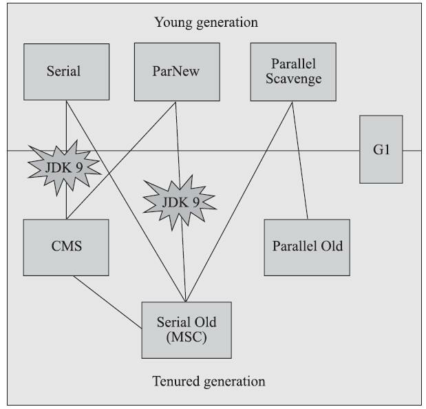
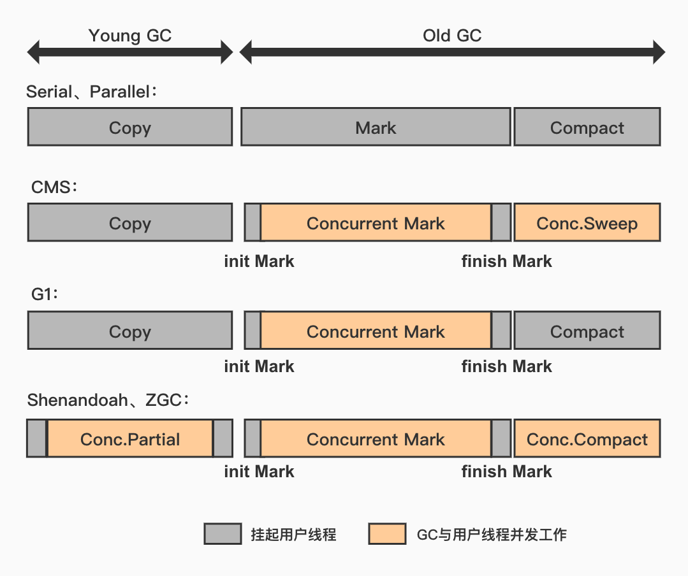
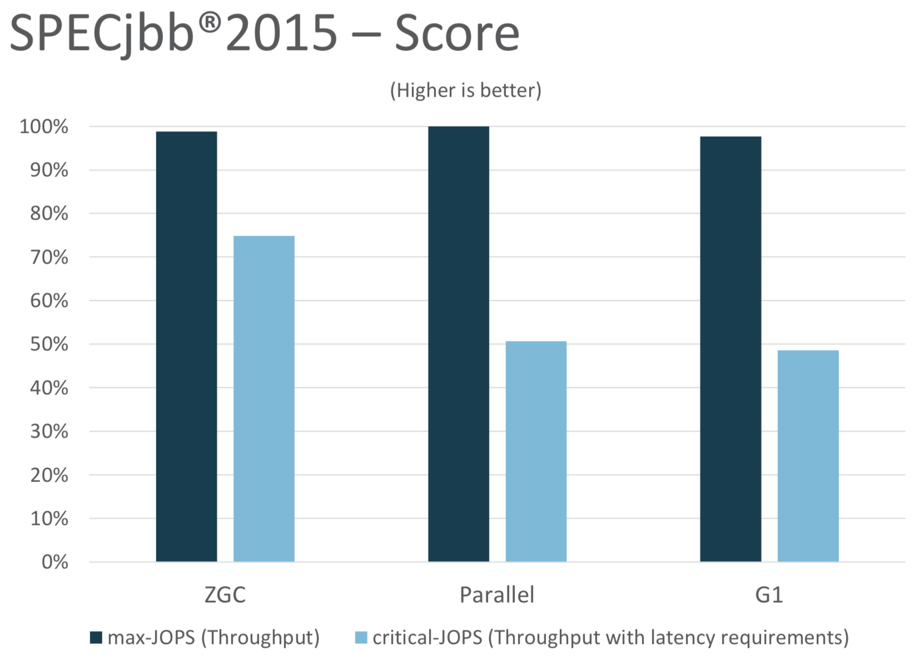
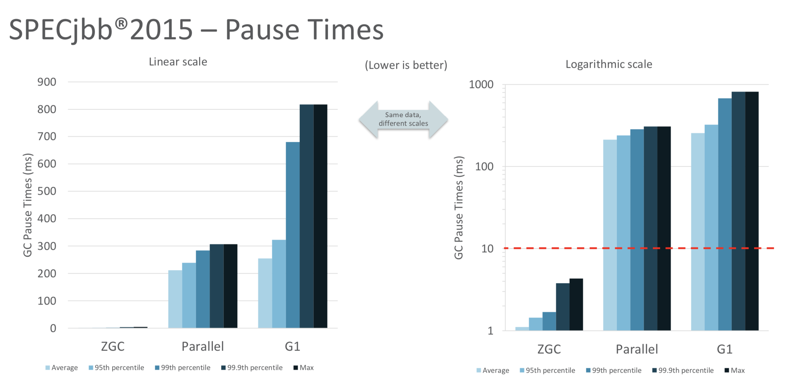

# 深入理解JVM-第三版

从 JDK10 开始，HotSpot 新加入了全新的即时编译器：Graal 编译器，看名字就与 GraalVM 有联系，它的目标是替代 c2 编译器，因为 c2 实在是太复杂了（使用 C++ 编写），Graal 使用 Java 编写，能够做更复杂的优化例如『部分逃逸分析』，也有更激进的预测优化策略，支持自定义的预测性假设；不过目前依然是实验性质，需要手动开启。

在微服务的环境下，Java 运行一个 HelloWorld 都需要百兆的 JRE 是很要命的，并且需要预热后才能达到最佳性能，这在无服务的场景下更是问题，所以也开始对缓存（AppCDS）、AOT（提前编译，缺点是要根据不同的平台分发不同的包，因为没有监控信息支持，效果不一定比 JIT 好）的研究，例如 Java11 的无垃圾收集器可以适用于跑完就停的场景。

PS：参考 Substrate VM、GraalVM。

## 自动内存管理

HotSpot 的栈容量不可以动态扩展（局部变量表大小确定，不会变化），在编译期就决定，之前的 Classic VM 倒是可以，另外 Go 中也是天然支持。 

> 线程私有的分配缓冲区 Thread Local Allocation Buffer（TLAB），通过 `-XX:UseTLAB` 参数打开；
>
> 会在线程初始化时，同时也会申请一块指定大小的内存，**只给当前线程使用**，这样每个线程都单独拥有一个空间，如果需要分配内存，就在自己的空间上分配，这样就不存在竞争的情况，可以大大提升分配效率。

TLAB 空间的内存非常小，缺省情况下仅占有整个 Eden 空间的 1%，当然可以通过参数调整。

当 Buffer 容量不够的时候，再重新从 Eden 区域申请一块继续使用，这个申请动作还是需要原子操作的( CAS + 重试)；

其他线程依然可以访问，只是不能在这块区间进行分配；

它的好处是**避免了分配对象时候的竞争消耗问题**，坏处是浪费空间和碎片化。 

默认情况下，不使用 TLAB 有可能出现并发问题，即分配到一半，指针指过去还没有分配完成另一个线程就用了，所以采用 CAS 来保证原子性。

另外，如果使用了 TLAB 可以提前在分配的时候就顺便初始化零值，否则会在分配完成后立即执行。

PS：直接内存联系虚引用、NIO（Netty）。

### 方法区

在 JDK8 之前，很多人称为『永久代』这是受 HotSpot 的设计影响，它使用永久代来实现方法区，避免单独的写方法区的 GC 逻辑，后来证明这并不是一个好主意，容易导致溢出、String#intern 异常等。

在 Oracle 收购 BEA 获得 JRockitVM 后，将其进行合并，舍去了永久代，使用本地内存（直接内存）实现方法区，在 JDK7 中已经将字符串常量池、静态变量等移出永久代，到 JDK8 已经完全废弃永久代，全部移到元空间。

运行时常量池是方法区的一部分，主要保存 class 文件中常量池表、字面量、符号引用等。

方法区除了上述内容，还保存类型信息（方法、类的定义、版本等）、JIT 的缓存代码等。

### GC

最新的几款垃圾收集器例如 G1、ZGC 等都具备了局部回收的特征（要跟 GCRoots 的定义配合）； 

方法区的回收非常苛刻，所以收益并不高，也是之前称为永久代的原因，ZGC 就没有对方法区回收；

不过在 OSGi、JSP、CGlib 等字节码框架场景，频繁产生自定义类和类加载下，是有必要的。

回收方法区满足的三个条件：

1. 所有的实例对象已经被回收
2. 加载该类的类加载器已经回收
3. 该类的 class 对象没有任何引用

这三个条件过于苛刻所以非常难满足，回收效益很低。

---

分代收集已经是最常见的做法，但是分代也面临不少的问题，例如跨代引用，老年代引用了新生代的情况，还是要去老年代遍历，固定 GCRoots 区域显得很困难。

三个假说：

1. 弱分代假说：绝大多数对象都是朝生夕灭
2. 强分代假说：熬过越多次 GC 就越难以消亡
3. 跨代引用假说：跨代的情况仅占少数

对于所说的跨代问题，因为新生代因为跨代无法回收，最终也会到老年代，加上如果数量很少，收益仍然是可观的。

依据第三条假说，我们可以在老年代建立一个『记忆集』将老年代划分为多个小块，标出那一块会存在跨代引用，这样扫描的时候只扫描这一部分就好了。

---

部分收集（PartialGC）：

- 新生代收集：MinorGC / YoungGC，只是新生代。
- 老年代收集：MajorGC / OldGC，只是老年代，目前只有 CMS 会单独收集老年代，Major 这个词和有混淆。
- 混合收集：MixedGC，整个新生代和部分老年代，目前只有 G1 是。

整堆收集（FullGC）：整个 Java 堆和方法区。

不过最近几年的发展来看，分代的局限性也不小，正在逐步过度到全区域收集的方式，或者全区域不分代的思想。

收集算法回顾：

- 分代收集
- 标记-清除
- 标记-复制
- 标记-整理

整理过程必然要 STW（最新的 ZGC 或 Shenandoah 使用了读屏障技术实现整理过程与用户线程并发执行），而不整理 GC 的频率就会高，吞吐量仍然下降；所以在关注吞吐量的 GC 是用标记整理，关注延迟是标记清除。

GCRoots 的枚举需要 STW，并且现在一个应用的方法区大小就数百上千兆，要是逐个检查需要很长时间；

所以使用一致性快照是一个解决方案，但是 JVM 是准确式收集，必然不能这样干；于是 HotSpot 的实现中使用了一个 OopMap 来保存一些信息，在类加载完成或者 JIT 时期会记录偏移，这样就不需要一个不漏的从方法区等 GCROOTS 开始查找了。

为了避免每条指令都需要更新 OopMap，才加入了安全点的概念。

安全点的选定基本上是以程序“是否具有让程序长时间执行的特征”为标准进行选定的，比如方法调用、循环跳转、异常跳转等。

- 抢先式中断
- 主动式中断（主流）

安全区域也是防止线程 sleep 等情况设立的。

### 记忆集与卡表

前面提到过一点，为了解决跨代引用的问题。

记忆集是一种用于记录从非收集区域指向收集区域的指针集合的抽象数据结构（概念上，抽象的），如果使用这种记录就包含了全部跨代引用对象，无论空间还是维护成本都相当高昂，所以精度方面会妥协。

最常用的是卡精度（比较宽泛的精度），就是记录到一块内存区域，这个区域有对象含有跨代指针，它使用一种叫做『卡表』的方式去实现记忆集。

卡表就是记忆集的一种具体实现，它定义了记忆集的记录精度、与堆内存的映射关系等，它们之间的关系可以比作 Map 和 HashMap；

卡表中每一个元素都对应一块内存，称为卡页，HotSpot 中的实现卡页为 2^9 即 512 字节；

只要卡页中有一个或者多个元素存在跨代引用，那么其中一个标志位则为 1，这样将其加入 GCRoots 扫描即可。

### 写屏障

对象是在不断变化的，维护卡表又是一个问题，尤其是在 JIT 优化之后，对应的解决方案就是写屏障，区别与内存屏障，它们不是一个东西。

写屏障可以简单理解为 JVM 层面的 AOP，分为写前屏障、写后屏障；

当发生赋值操作指令执行时，这个 AOP 就会触发，这样确实会带来一定的消耗，但是比扫描整个老年代划算的多。

同时，卡表在并发环境下还存在『伪共享』的问题，也就是同一个缓存行的问题，导致性能降低。

JVM 中的记录操作大多由写屏障完成，例如 GC 的标记。

PS：简单理解为 CPU 以缓存行为单位操作数据，如果互不干扰的变量读取到了同一个缓存行，那会也会引发并发问题，降低效率。

解决方案可以通过先判断标记再更新，这就多了一次判断的开销，如何选取要根据实际环境，相关参数：`-XX:+UseCondCardMark`

### 并发可达性分析

由于 OopMap 的加持，在 GCRoots 的枚举算是很短了，并且很稳定，不会随堆的大小而增加。

但是大头在接下来的可达性分析上，这个过程肯定是堆越大越慢；

关于这个问题，可参考『三色标记』不再展开说。简单说就是：

- 白色：对象未被 GC 访问过，刚开始都是白的；如果结束后仍是白色代表不可达；
- 黑色：已经被 GC 访问过，但是它是安全存活的；
- 灰色：已经被 GC 访问过，但是至少存在一个还没有被扫描的，也就是正在处理中，或者分叉点。

其中，黑色不能直接指向某个白色对象。

在并发标记过程中，用户线程会修改对象的关系（颜色），我们并不在意『忽略了要清除的对象』这种情况，等下一次 GC 即可，关键是不要把应该存活的对象给清除掉。

会发生『对象消失』的情况必定满足下面的两个条件：

- 插入了一条或多条从黑色到白色的新引用
- 删除了全部从灰色到白色的直接或者间接引用

也就是只要破坏这两个条件的一个，就能解决并发问题，对应的方案就是：

- 增量更新（CMS）：把新插入的引用记录下来，并发扫描结束后再将记录的黑色对象为根，进行扫描；即一旦黑色插入了新引用就变为灰色；
- 原始快照（G1）：将删除的引用记录下来，并发扫描结束后，以灰色为根进行重新扫描；即无论删除与否，都会按照扫描之前的快照图根据灰色节点再来一次。

### 传统垃圾收集器

新版关系图：

其中标记为 JDK9 的意为在 JDK9 中已经废弃，在 JDK8 中不推荐使用。

衡量垃圾收集器的三个重要指标：内存占用、吞吐量、停顿时间；它们构成一个不可能三角，通常只能最多达成其中两项。

大部分在老板就已经介绍过了，这里就不在多说，只做补充。

#### G1

面向服务端应用，CMS 的替代者；JDK9 后默认；与 CMS 比不会产生碎片；

衡量标准不再是它属于那个分代，而是那块内存中的垃圾数量最多，回收收益最大，这就是 G1 的 MixedGC 模式。

支持指定一个在长度为 M 毫秒的时间片段，GC 消耗时间大概率不超过 N 毫秒的目标。

Region 有一些 H 区域存放大对象，G1 认为大小超过 Region 一半的对象就是大对象，而那种超过 Region 大小的超级对象会被存放到连续的 H 中，G1 将 H 区域看作老年代。

它建立了可预测的停顿时间模型。

每个 Region 都有自己的记忆集，记录其他 Region 指向自己的指针，并标记分别在那些卡页范围。

类似卡表却又不是卡表，卡表记录为指向谁，它还记录了谁指向我。

因为结构复杂，占用也大（以至于写屏障需要添加到队列来异步执行），经验上 G1 至少要耗费大约 Java 堆的 10%-20% 的额外内存维持收集器工作。

请注意，G1 在并发标记以外的阶段都是需要暂停用户线程的，它并发注重短停顿，而是可控停顿。

在延迟可控的情况下，尽量获得更高的吞吐量。如果时间过短，会导致回收速度跟不上分配速度，导致 FullGC，默认值 200ms，一两百甚至三四百都是比较合理的。

G1 是里程碑，从它开始方向变为全堆收集、并行和部分收集（用户线程不停顿，只要收集速度跟得上分配速度即可，不追求收集干净）的方向。

与 CMS 相比，虽然官方钦定的替代者，但是资源的消耗让其在小内存的效果并不好，6-8G+ 的堆内存比较适合上 G1，不过随着未来的不断优化，这个值肯定是要降低的。

### 低延迟垃圾收集器

先来看一个直观的比较图：

可以看出 Shenandoah 和 ZGC 基本都是并发的，只有初始、最终标记是短暂的停顿，这部分停顿基本都是固定的，不会随堆大小的增加而增加；

#### Shenandoah

Shenandoah 是 RedHat 研发的收集器，后来贡献给了 OpenJDK，并推动成为 JDK12 的特性；也是有史以来第一个非 Sun/Oracle 的收集器，当然 Oracle 并不愿意，所以在发行 OracleJDK 的时候通过条件编译去除了相关代码，成为第一个 OpenJDK 拥有 OracleJDK 没有的功能。

它的目标是实现一种能在任何堆大小下都可以把垃圾收集停顿时间限制在 10ms 以内的收集器，意味着比 CMS 和 G1 比，不仅并发垃圾标记，还要并发进行对象的整理。

Shenandoah 与 G1 的思路大部分相同，还共享了一部分代码，所以不仅 G1 的优化会反应到 Shenandoah ，Shenandoah 的特性也可能反应在 G1 中，例如 Shenandoah 的加持下 G1 拥有了多线程 FullGC 逃生门的支持。

与 G1 相似的部分就不说了，例如 Region、H 区等等，最大的区别为可以并发整理的算法（指的是与用户线程并行），另外它不采用分代收集的思路，性价比的权衡；

Shenandoah 抛弃了 G1 复杂的记忆集，改名为『连接矩阵』的全局数据结构来记录夸 Region 引用；可以理解为一个二维表格。

- 初始标记：只与 GCRoots     有关，需要 STW；
- 并发标记：与 G1 一样，与用户线程一起；
- 最终标记：与 G1 一样，处理剩余 SATB 扫描，并计算回收价值，会有一小段的 STW；
- 并发清理：清理那些整个区域一个存活对象都没有的 Region，所以不需要 STW；
- 并发回收：核心差异，把回收集存活的对象先复制一份到未使用的 Region，这个阶段如果 STW 会很简单，但是如果不停顿就很难，Shenandoah 通过读屏障和 BrooksPointers 转发指针来解决，时间长短取决于回收集的大小。
- 初始引用更新：并发回收结束后需要把对象指针引用转移到复制的新对象上，这个过程是引用更新；初始状态仅仅是建立一个集合确保分配任务，这个时间很短，但是需要 STW；
- 并发引用更新：与用户线程一起并发，时间长短取决于涉及更新的数量；
- 最终引用更新：虽然对象引用更新了，但是还要修正 GCRoots 中的引用，这个阶段需要 STW，长短取决于 GCRoots 数量；
- 并发清理：这时候整个 Region 已经没有存活对象，再调用一次清理即可。

转发指针：解决对象移动与用户线程并发的问题，在对象头增加一个字段表示转发，默认这个字段指向自己，复制对象后修改为指向新对象即可，这样会多一条转发的指令开销，但是比使用系统中断（内存保护陷阱）来让 OS 处理还是很合算的（如果 OS 有对其专门的优化就另说了，例如 Azul）。

然后就是必然涉及到的并发问题（创建新对象、修改引用并不是原子的），如果并发读取，那么其实无论新旧对象结果都是一样的；如果是并发写入，就必须保证要写入到新对象；Shenandoah 通过 CAS 实现写入的正确性。

现实中对对象的操作还是很常见的，例如对象 hash 计算、对象比较、对象锁等，Shenandoah 使用了读、写屏障来进行拦截，写屏障还好，毕竟少，但是读屏障太多，很容易出现性能问题，在 JDK13 中改进为基于引用访问的屏障，就是只拦截引用类型。

#### ZGC

ZGC 的目标与 Shenandoah 一致，但是实现思路上不同，它同样是基于 Region 布局，不设分代（暂时，工作量的原因），使用读屏障、染色指针、内存多重映射等技术实现的并发的标记-整理算法的，以低延迟为目标的一款收集器。

ZGC 中的 Region 又称为 Page 或者 ZPage，它具有动态性：动态创建和销毁、动态的大小；

- 小型：固定 2MB，放置小于 256K     的对象；
- 中型：固定 32MB，放置     >=256K and < 4MB 的对象；
- 大型：大小不固定，可以动态变化，是 2 的整数倍，放置 >=     4MB 的对象；只会分配一个对象，大小可能低至 4MB；不会被重分配（复制一个大对象消耗太大）

Shenandoah 使用转发指针和读屏障实现并发整理，ZGC 也用到了读屏障，但是却与 Shenandoah 不同；

在对象头增加信息是很普遍的做法，哈希码、分代年龄、锁都是这种实现，但是如果对象存在被移动的可能（不保证对象能访问成功的情况下）如何获得信息呢？有或者有一些根本不会去访问的对象，但是希望获得它的引用信息（例如三色标记，只与引用有关，与对象无关）；

JVM 中不同的收集器有不同的实现，有的直接放对象头，有的放到一个独立的类似 BitMap 的数据结构来存放是否标记（并发标记阶段）；而 ZGC 采用了更纯粹的方式，直接将信息保存到引用对象的指针上（染色指针）；

指针为什么可以存放信息？

在 64 位系统中，理论上可以访问 2^64 字节的内存，而实际上根本用不了那么些，地址越宽，性能和成本也越大；在 AMD64 架构中只支持到 52 位（4PB）的地址总线和 48 位（256TB）的虚拟地址空间；所以理论上最大支持 256TB 的内存，但是操作系统还会进一步限制，Linux 下 64TB，Win 下 16TB；

除去 Linux 高 18 位不能寻址，剩余的 46 位所支持的 64TB 在今天看来也远远超出需求，所以 ZGC 盯上了这一块；将其高 4 位提取出来存储四个标志信息：

- 三色标记状态（使用两位完成 Marked0、Marked1）
- 是否进入了重分配（被移动）
- 是否只能通过     finalize 方法才能访问到

这样剩下的 42 位只能表示 4TB 的内存，所以 ZGC 只能管理小于 4TB 的内存；并且只能支持 64 位，不支持指针压缩。

同时带来的收益也很可观：

- 某个 Region     的存活对象被移走后，这个 Region 立即就能释放和重用掉，不必等到整个堆中指向该区域的引用修正后才能清理；
- 大幅减少 GC 中『内存屏障』的使用数量，目前 ZGC     只使用了读屏障（除了染色指针，因为不支持分代，也没必要记录跨代引用）

接下来就是解决一个大问题，JVM 作为一个进程，是否支持这种『骚操作』，或者操作系统是否支持？

这里需要一些操作系统的基础知识，例如分页与虚拟地址映射；

在 ZGC 中使用了多重映射（多对一）将多个虚拟地址映射到同一个物理地址，经过多重映射后染色指针就能顺利寻址了；

PS：当然，如果能通过某些手段使用那未使用的 18 位，既可以腾出这 4 位，又可以存储更多的信息。

运行过程（以 G1、Shenandoah 相似的地方就不说了）：

- 并发标记（包含初始、最终标记，因为是短暂停顿，直接放这了）：更新染色指针信息
- 并发预备重分配：根据条件查询获得要清理的 Region 组成重分配集，与 G1 的回收集有所区别，ZGC 划分 Region 的目的是像 G1 那样做收益优先分析，但是 ZGC 每次都会扫描所有 Region，用扫描换 G1 的记忆集维护成本；
- 并发重分配：核心阶段，把重分配集的对象复制到新 Region 中，并且要在 Region 维护一个转发表，记录旧对象到新对象的转向关系，因为染色指针，从指针就能得知是否处于重分配中，这个访问会被读屏障截获，然后根据转发表的记录转到新对象，并且修正该引用的值，使其直接指向新对象，ZGC 将这种操作称为指针的『自愈』；这样就相当于只慢一次（转发过程），并且复制完对象后可以直接释放原来的老对象用于新的分配，但是转发表还得留着，让那些未更新的指针便于自愈；
- 并发重映射：修正旧对象的引用，与 Shenandoah 的更新引用阶段类似，但 ZGC 中并不是迫切去做的，因为可以自愈，目的是让其不变慢（转发过程），附带回收转发表；因为不是迫切的，所以它机智的合并到了下一次并发标记中去做，反正都是需要遍历所有对象，节省了一次遍历对象图的开销；

ZGC 的设计理念和 Azul 的 PGC 和 C4 收集器一脉相承，算是前沿成果，与 Shenandoah 一样做到了基本全程并发，停顿也主要是 GCRoots 相关，所以敢以小于 10ms 为目标；

G1 需要写屏障维护庞大复杂的记忆集，才能处理跨代指针，所以实现了增量回收；ZGC 中没有记忆集，甚至连 CMS 那样的卡表都没有，因为没有用到写屏障，给用户线程的压力也小的多，毕竟没有分代的概念；

权衡的弊端就是它能承受的对象分配速率不会太高，假设它对一个大堆做一次收集需要 10 分钟，这期间的对象如果分配很快，都是大对象，尽管都是朝生夕灭，但是会产生很大的浮动垃圾，唯一的解决方案就是增加堆大小，获得更多喘息时间，根本上解决问题的话，还是要加入分代的概念，例如 C4；

为了缓解压力，ZGC 支持 NUMA 分配，简单说就是优先在线程当前处理器的本地内存上分配（多核协同的难），保证分配效率，此前针对吞吐量设计的 Parallel Scavenge 也支持；

即使这种情况，ZGC 的表现也非常出色，可以形容为又一次革命。

ZGC 本来是当作 OracleJDK 的商业特性来设计的，但是赶上 JDK11 的授权调整，所有的商业特性直接开源给了 OpenJDK，让普通老百姓也能用上，在之后的不断优化下，肯定是有力的竞争者。

---

吞吐量测试：

停顿测试：

#### 如何选择

首先，肯定没有『银弹』要不就不会准备这么多收集器让你选择；具体的配置要根据实际情况；

如果是数据分析、科学计算等任务，目标是尽快算出结果，那吞吐量就是主要关注点；

如果是 SLA 应用（服务级别协议），那么停顿时间会直接影响服务质量，甚至导致事务超时，那么延迟就是主要关注点；

如果是客户端、嵌入式应用，那么垃圾收集的内存占用是不可忽视的。

如果没有什么调优经验，但有充足的预算去使用商业方案，可以试试 Azul 的 ZingVM，使用传说的 c4 收集器（与硬件捆绑）；

如果没有足够的预算，但是能控制硬件，使用较新的版本，同时注重延迟，那么 ZGC 是个不错的选择；

如果对实验状态的收集器有顾虑，或者需要运行在 Win，那么可以试试 Shenandoah；

如果是遗留系统，JDK 也比较落后，在 4-6G 以下的堆内存，CMS 是个不错的选择，更大的内存可考虑 G1；

## 工具

从 JDK9 开始，模块化的原因，原来的 tools.jar、rt.jar 等都去除了，放到 jmods 目录下；

这样是解决无服务盛行的今天 Java 启动一个 HelloWorld 程序就需要 JRE 上百 Runtime 的内存；

相比上一版增加的：

- JHSDB：基于服务性代理的调试工具；
- JMC：可持续的在线监控软件（影响不会高于 1% 的吞吐量），配合 JFR 使用，原本需要购买商业支持，JDK11 后免费；停止和启动都可以动态进行，不需要重启应用，JFR     的监控对应用完全透明；相比其他工具，它的信息更加的详细；

## 后期优化

为了达到最佳平衡，HotSpot 会逐渐启动『分层编译』：

- 第 0 层：程序解释执行，解释器不开启监控，可触发第一层编译；
- 第 1 层：使用 c1 编译器，将字节码编译成本地代码，进行简单、可靠的优化，不加入监控逻辑；
- 第 2 层：使用 c1 编译器，仅开启方法、回边次数统计等有限监控；
- 第 3 层：使用 c1 编译器，开启全部监控逻辑，除了第二层外外还有分支跳转、虚方法版本等统计信息；
- 第 4 层：使用 c2     编译器，同样是编译为本地代码，但是会启用一些编译耗时较长的优化，甚至会根据监控信息进行一些激进的优化；

分层并不是固定的，根据运行参数和版本 JVM 可能会调整分层数量，这时候解释器、c1 和 c2 会同时工作，并且并不一定按照层级顺序进行编译，某段热点代码可能会被编译多次，可能从 0 直接到 4（c1 忙的时候），也可能 0 到 3，3 到 1 等等。

## Graal 编译器

虽然 Graal 虚拟机和编译器仍然是实验阶段，但是未来有望代替或成为 HotSpot 的下一代基础；

Graal 目标是成为一款高编译效率、高输出质量、支持提前编译和即时编译，并且支持不同的 JVM；

它是由 Java 编写的，JVM 团队曾说 c2 目前就是一潭死水，在它上面开发、维护实在是太难了，原作者也表示不想维护，它是 c/c++ 实现的。

Graal 在 JDK9 加入，以提前编译器的身份；到 JDK10 可以替换 c2，也得意于 HotSpot 的模块化设计（JVMCI）。

## 其他

JDK9 之后 GC 相关的 JVM 参数也有所调整，当然 GC 相关的也是，具体的变化参考 《深入理解JVM 第三版》