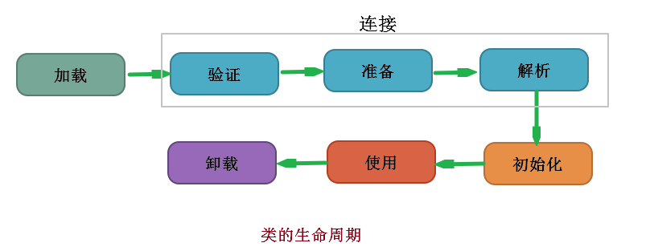
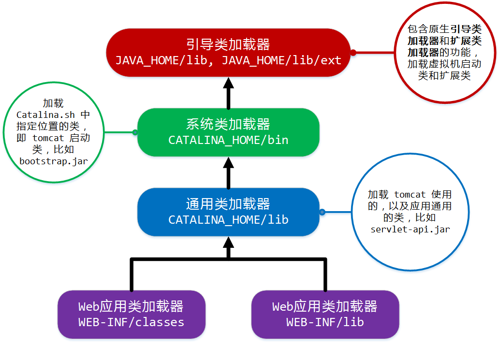

# 深入理解JVM(二)

## 类文件结构

这里就到了类文件结构相关的内容了，看了下，这方面以目前的功力看着确实比较吃力，类文件结构这块就基本先跳过吧，记录几个我感觉挺不错的、能看懂的....

### ConstantValue 属性

ConstantValue 属性的作用是**通知虚拟机自动为静态变量赋值**，只有被 static 关键字修饰的变量（类变量）才可以使用这项属性；

对于非 static 类型的变量的赋值，是在实例构造器 init 方法中进行的；而对于类变量，则有两种方式可以选择：

- 在类构造器 clinit 方法中
- 使用 ConstantValue 属性

Sun Javac 的选择是：

如果同时使用 final 和 static 来修饰一个变量，并且这个变量的数据类型是基本类型或者 String 的话，就生成 ConstantValue 属性来进行初始化； 

如果这个变量没有被 final 修饰，或者并非基本类型及字符串，则将会选择在 clinit 方法中进行初始化。

## 虚拟机类加载机制

虚拟机把描述类的数据从 Class 文件加载到内存，并对数据进行校验、转换解析和初始化，最终形成可以被虚拟机直接使用的 Java 类型，这就是虚拟机的加载机制。

Java 语言中，类型的加载、连接和初始化过程都是在应用程序运行期间完成的，这种策略虽然会令类加载时稍微增加一些性能开销，但是会为 Java 应用程序提供高度的灵活性；

比如面向接口的程序中可以等到运行时再指定其实际的实现类；通过自定义类加载器让一个本地的应用程序可以在运行时从网络或者其他地方加载一个二进制流作为程序代码的一部分，这种组装应用程序的方式目前已广泛应用于 Java 程序中。

### 类加载的时机

类加载的整个生命周期可概括为：加载、验证、准备、解析、初始化、使用、卸载七个阶段。

其中，验证、准备、解析三个部分统称为连接；加载、验证、准备、初始化和卸载这五个阶段的顺序是确定的，而解析阶段则不一定，它在某些情况下可以在初始化阶段之后再开始，这是为了支持 Java 语言的运行时绑定。

PS：这些阶段通常都是互相交叉地混合式进行的，通常会在一个阶段执行的过程中调用、激活另外一个阶段。



在 JVM 规范中，严格规定了五种情况必须立即对类进行初始化（而加载、验证、准备自然需要在此之前开始）

1. 遇到 new、getstatic、putstatic、invokestatic 这四条字节码指令时，如果类还没有进行过初始化，则需要先触发其初始化。

   生成这四条指令最常见的 Java 代码场景是：

   使用new关键字实例化对象时、

   读取或设置一个类的静态字段（static）时（被static修饰又被final修饰的，已在编译期把结果放入常量池的静态字段除外）、

   以及调用一个类的静态方法时。

2. 使用 `Java.lang.refect` 包的方法对类进行反射调用时，如果类还没有进行过初始化，则需要先触发其初始化。

3. 当初始化一个类的时候，如果发现其父类还没有进行初始化，则需要先触发其父类的初始化。

4. 当虚拟机启动时，用户需要指定一个要执行的主类，虚拟机会先执行该主类。

5. 当使用 JDK1.5 支持时，如果一个 `java.langl.incoke.MethodHandle` 实例最后的解析结果 REF_getStatic、REF_putStatic、REF_invokeStatic 的方法句柄，并且这个方法句柄所对应的类没有进行过初始化，则需要先触发其初始化。

这五种是有且仅有修饰的场景，除此之外，所有引用类的方式都不会触发初始化，称为被动引用，下面举几个例子：

- 通过子类引用父类的静态字段不会导致子类初始化。

  对于静态字段，**只有直接定义这个字段的类**才会被初始化，因此通过其子类来引用父类中定义的静态字段，只会触发父类的初始化而不会触发子类的初始化。
- 通过数组定义来引用类，不会触发此类的初始化。
- 常量在编译阶段会存入调用类的常量池中，本质上并没有直接引用到定义常量的类，因此不会触发定义常量类的初始化。

对于接口来说，也有初始化过程，这一点和类是一致的，区别在于：

当一个类初始化时，要求父类全部都已经初始化过了，但是一个接口在初始化时，并不要求其父接口全部都完成了初始化，只有在真正使用到父接口的时候（如引用接口中定义的常量）才会初始化。

### 类加载的过程

#### 加载

首先说明，“加载”是“类加载”过程的一个阶段，仅仅是一个阶段，注意这两个很相似的名词。

在加载阶段，JVM 需要完成三件事情：

1. 通过一个类的全限定名来获取定义此类的二进制字节流
2. 将这个字节流所代表的静态存储结构转化为方法区的运行时数据结构
3. 在内存中生成一个代表这个类的 `java.lang.Class` 对象，作为方法区这个类的各种数据的访问入口。

JVM 对这三点的实现并没有做具体的规范，就第一条而言，根本没有指定要从哪里获取，比如可以从 zip、jar、war 包中，从网络获取（Applet），运行时生成（动态代理），由其他文件生成（JSP），从数据库中读取等。

相对类加载过程的其他阶段，非数组类的加载阶段（准确说是获取二进制字节流的动作）是开发人员可控性最强的，因为加载阶段既可以使用系统提供的引导类加载器来完成，也可以由用户自定义的类加载器去完成，就是重写类加载器的 loadClass 方法。

PS：对于数组而言，有些不同，因为数组类本身不通过类加载器创建，它是由 Java 虚拟机直接创建的。

> 加载阶段完成后，虚拟机外部的二进制字节流就按照虚拟机所需的格式存储在方法区之中，数据存储格式由虚拟机自行定义，规范中并没有明确的规定。
>
> 然后在内存中实例化一个 java.lang.Class 对象（并没有指定存放在 Java 堆中，对于 HotSpot 而言，Class 对象比较特殊，它虽然是对象，但是存放在方法区里面），这个对象作为程序访问方法区中这些类型数据的外部接口。

加载阶段与连接阶段的部分内容是交叉进行的，加载阶段尚未完成，连接阶段可能就已经开始了，但是这两个阶段的开始时间仍然保持固定的先后顺序。

#### 验证

**验证是连接阶段的第一步**，目的是确保 Class 文件的字节流包含的信息符合当前虚拟机的要求，并且不会危害虚拟机自身的安全。

PS：虽然编译器会拒绝编译一部分破坏性的代码，但是 class 文件并不一定是用 Java 源码编译而来的，如果虚拟机不检查输入的字节流，对其完全信任的话，很可能就会因为载入了有害的字节流而导致系统崩溃。

验证阶段的工作量在虚拟机的类加载子系统中又占了相当大的一部分。到 2011 年发布的 SE7 规范各种约束和验证规则才具体起来，从 10 页增加到了 130 页。

从整体上看，验证阶段大致上会完成下面四个阶段的校验动作：

1. 文件格式验证

    比如：是否以魔数 0xCAFEBABE 开头；主次版本号是否在当前虚拟机处理范围之内等等。

    用来保证输入的字节流能够正确的解析并存储于方法区之内，这阶段的验证是基于二进制字节流进行的，只有通过了这个阶段的验证后，字节流才会进入内存的方法区中进行存储。

    后面的3个验证阶段全部是基于方法区的存储结构进行的，不会再直接操作字节流。

2. 元数据验证

    这一阶段是对字节码描述的信息进行语义分析，保证符合 Java 语言规范的要求。

    比如：这个类是否有父类（除了 Object 其他类都应该有父类）、是否继承了不允许被继承的类（比如 final 修饰的）、如果不是抽象类是否实现了父类或者接口中需要实现的方法等等。

3. 字节码验证

    这是整个验证过程中最复杂的一个阶段，目的是通过数据流和控制流分析，确定程序语义是合法的、符合逻辑的。

    比如会对类的方法体进行校验分析，确保运行时不会做出危害 JVM 的安全事件（比如保证跳转指令不会跳转到方法体以外的字节码指令上）。

    但是，就算一个方法通过了字节码验证，也不能说明其就一定是安全的。

    对于这个阶段，虚拟机设计团队为了避免过多的时间消耗在字节码验证阶段，在 JDK1.6+ 的 javac 和 JVM 中做了一些优化，比如在属性表中增加 stackMapTable 属性避免进行类型推导。

4. 符号引用验证

    最后一个阶段的校验发生在虚拟机将符号引用转换为直接引用的时候，这个转换动作在连接的第三阶段解析阶段中发生。

    可以看作是对类自身以外（常量池中的各种符号引用）的信息进行匹配性校验。

    比如：通过字符串描述的全限定名是否能够找到对应的类，符号引用中的类、字段、方法的访问性是否可以被当前类访问。
    符号引用验证的目的是确保解析动作能正常执行。

对于虚拟机的类加载机制来说，验证阶段是一个非常重要的、但不一定必要（因为对程序的运行期没有影响）的阶段。

如果所运行的全部代码都已经被反复使用和验证过，那么在实施阶段就可以考虑使用 `-Xverify:none` 参数来关闭大部分的类验证措施，以缩短虚拟机类加载的时间。

#### 准备

准备阶段是正式为**类变量**分配内存并设置类变量初始值的阶段，这些变量所使用的内存都将在方法区中进行分配。

这时候进行内存分配的仅包括类变量（被 static 修饰过的变量），而不包括实例变量，实例变量将会在对象实例化时随着对象一起分配在 Java 堆中。

PS：通常情况下，这里所说的初始值是数据类型的零值，我们指定的值是在后面的类构造器（clinit）中进行完成的；既然这是通常情况，那么也就有特殊情况，如果类字段的字段属性表中存在 ConstantValue 属性，那么准备阶段变量就会被初始化为 ConstantValue 属性所指定的值（final）

#### 解析

解析阶段是虚拟机将常量池内的符合引用替换为直接引用的过程。

- 符号引用

    用一组符号来描述所引用的目标，符号可以是任何形式的字面量，只要使用时能无歧义的定位到目标即可。

    符号引用与虚拟机实现的内存布局无关，引用的目标并不一定已经加载到内存中。

    各种虚拟机实现的内存布局可以不相同，但是他们能接受的符号引用必须是一致的。
- 直接引用

    直接引用可以是直接指向目标的指针、相对偏移量或是一个能够间接定位到目标的句柄。

    直接引用是和虚拟机实现的内存布局相关的，同一个符号引用在不同的虚拟机实例上翻译出来的直接引用一般不会相同；另外如果有了直接引用，那引用的目标肯定已经在内存中存在了。

虚拟机实现可以根据需要来判断到底是在类被加载器加载时就对常量池中的符号引用进行解析，还是等到一个符号引用将要被使用前才去解析它。

 对同一个符号引用进行多次解析请求是很常见的一件事情，除了 invokedynamic 指令以外，虚拟机实现可以对第一次解析的结果进行缓存，从而避免解析动作的重复进行。

对于 invokedynamic 指令，是用来支持动态语言的（使用 Java 语言一般不会生成这条字节码指令），必须等到程序实际运行到这条指令的时候才会进行解析。

解析动作主要针对类或者接口、字段、类方法、接口方法、方法类型、方法句柄和调用点限定符七类符号引用进行。

关于解析的解释这里就不写了，需要再去翻书吧（7.3.4），主要就是在解析时要先确保父类已经被解析，字段解析就是向上递归搜索是否被定义，并且没有出现异常。

解析完成后还需要进行符号引用验证，确认拥有相应的访问权限，如果是接口就省事了，因为默认都是 public 的所以就不存在访问权限的问题了。

#### 初始化

类初始化是类加载过程的最后一步，到了初始化阶段，才真正开始执行类中定义的 Java 代码（或者说是字节码）；初始化阶段是执行类构造器（clinit）方法的过程。

clinit 方法是由编译器自动收集类中的所有类变量的赋值动作和静态语句块中的语句合并产生的，收集顺序是由语句在源文件中出现的顺序所决定的；静态语句块中只能访问到定义在静态语句块之前的变量，定义在它之后的变量，在前面的静态语句块可以赋值，但是不能访问。

clinit 方法与类的构造函数（或者说实例构造器 init 方法）不同，它不需要显式的调用父类构造器，虚拟机会保证在子类 clinit 方法执行之前父类的 clinit 已经执行完毕；因此，虚拟机中第一个执行的 clinit 方法肯定是 Object。

由于父类 clinit 方法先执行，也就意味着父类中定义的静态语句块要优先于子类的赋值操作。

clinit 方法对于类或者接口来说并不是必须的，如果一个类中没有静态语句块，也没有对变量的赋值操作，那么编译器就可以不为这个类生成 clinit 方法。

接口的 clinit 方法并不需要先执行父接口的 clinit 方法，只有当父接口中定义的变量使用时，父接口才会初始化。

虚拟机会保证一个类的 clinit 方法在多线程环境中被正确的加锁、同步，如果多个线程去初始化同一个类，那么只会有一个线程去执行这个类的 clinit 方法，其他线程都需要阻塞等待（实际应用中，这种阻塞是非常隐蔽的）。

PS：同一个类加载器下，一个类型只会初始化一次。

### 类加载器

虚拟机设计团队把类加载阶段中的 “通过一个类的全限定名来获取描述此类的二进制字节流” 这个动作放到 Java 虚拟机外部去实现，以便让应用程序自己决定如何去获取所需要的类。实现的这个动作的代码模块称为“类加载器”。

类加载器可以说是 Java 语言的一项创新，在类层次划分、OSGI、热部署、代码加密等领域大放异彩。

对于任意一个类，都需要由加载它的类加载器和这个类本身一同确立其在 Java 虚拟机中的唯一性，每一个类加载器，都拥有一个独立的类名称空间。

也就是说，比较两个类是否相等，只有在这两个类是由同一个类加载器加载的前提下才有意义，即使这两个类来源于同一个 class 文件，被同一个 JVM 加载，只要加载它们的类加载器不同，那么这两个类就必定不相等。

#### 双亲委派模型

从 Java 虚拟机的角度来讲，只存在两种不同的类加载器：

1. 启动类加载器，这个类加载器使用 C++ 语言实现（HotSpot），是虚拟机自身的一部分；
2. 所有其他的类加载器，这些类加载器都是由 Java 语言实现，独立于虚拟机外部，并且全都继承自抽象类 ClassLoader

从 Java 开发人员的角度来看，还可以分的更细致一些：

1. **启动类加载器（Bootstrap ClassLoader）**

    这个类加载器负责将存放在 `<JAVA_HOME>/lib` 目录中的，或者被 `-Xbootclasspath` 参数所指定的路径中的，并且是虚拟机识别的（按照文件名识别，如 `rt.jar` ，名字不符合的类库即使放在 lib 目录中也不会被加载）类库加载到虚拟机内存中。

    启动类加载器无法被 Java 程序直接引用，在用户编写自定义类加载器时，如果需要把加载请求委派给引导类加载器，那直接使用 null 代替即可。

2. **扩展类加载器（Extension ClassLoader）**

    它负责加载 `<JAVA_HOME>/lib/ext` 目录下的，或者被 `java.ext.dirs` 系统变量所指定的路径中的所有类库，开发者可以直接使用扩展类加载器。

3. **应用程序类加载器（Application ClassLoader）**

    这个类加载器是 ClassLoader 中的 `getSystemClassLoader()` 方法的返回值，所以一般也称它为系统类加载器。

    它负责加载用户类路径（ClassPath）上所指定的类库，开发者可以直接使用这个类加载器；如果应用程序中没有自定义过自己的类加载器，一般情况下这个是系统中默认的类加载器。

我们的应用程序都是由这三种类加载器互相配合进行加载的，必要时候还可以加入自己定义的类加载器。

这些加载器之间的关系一般是：




这种层次关系称为类加载器的双亲委派模型。

双亲委派模型要求除了顶层的启动类加载器外，其余的加载器都应当有自己的父类加载器（这里的父子关系一般不会以继承的关系来实现，多是以组合的关系来复用父加载器的代码）。

> 类加载器的双亲委派模型在 JDK1.2 被引入，它并不是一个强制性的约束模型，而是 Java 设计者推荐给开发者的一种类加载器实现方式

双亲委派模型的工作过程是：

如果一个类加载器收到了类加载的请求，它首先不会自己去尝试加载这个类，而是会把这个请求委派给父类加载器去完成，每一层次的类加载器都是如此，因此所有的加载请求最终都应该传送到顶层的启动类加载器，只有当父类加载器反馈自己无法完成这个加载请求（它的搜索范围中没有找到所需的类）时，子类加载器才会尝试自己去加载。

这种模式的一个显而易见的好处就是 Java 类随着它的类加载器一起具备了一种带有优先级的层次关系，例如 Object 它存放在 rt.jar 中，无论那个类加载器要加载这个类，最终都是委派给处于顶端的启动类加载器进行加载的，因此 Object 类在程序的各个类加载器环境中都是同一个类。

双亲委派模型对于保证 Java 程序的稳定运行很重要，但它的实现确非常简单，代码都集中在 ClassLoader 中的 loadClass() 方法中：

```java
protected Class<?> loadClass(String name, boolean resolve)
  throws ClassNotFoundException{
  synchronized (getClassLoadingLock(name)) {
    // First, check if the class has already been loaded
    Class<?> c = findLoadedClass(name);
    if (c == null) {
      long t0 = System.nanoTime();
      try {
        if (parent != null) {
          c = parent.loadClass(name, false);
        } else {
          c = findBootstrapClassOrNull(name);
        }
      } catch (ClassNotFoundException e) {
        // ClassNotFoundException thrown if class not found
        // from the non-null parent class loader
      }

      if (c == null) {
        // If still not found, then invoke findClass in order
        // to find the class.
        long t1 = System.nanoTime();
        c = findClass(name);

        // this is the defining class loader; record the stats
        sun.misc.PerfCounter.getParentDelegationTime().addTime(t1 - t0);
        sun.misc.PerfCounter.getFindClassTime().addElapsedTimeFrom(t1);
        sun.misc.PerfCounter.getFindClasses().increment();
      }
    }
    if (resolve) {
      resolveClass(c);
    }
    return c;
  }
}
```

先检查是否已经被加载过，如果没有就调用父类加载器的 loadClass 方法，若父加载器为空（顶层了）则默认使用启动类加载器作为父加载器。

如果父类加载失败，抛出 ClassNotFoundException 异常后，再调用自己的 findClass() 方法进行加载。

#### 破环双亲委派机制

由于双亲委派模型不是一个强制性的约束模型，所以当然会有例外，其中主要出现过3次较大规模的“被破坏”情况。

1. 双亲委派模型出现之前（JDK1.2-）

    面对已经存在的用户自定义加载器的实现代码，做出了一些妥协，JDK1.2+ 的 ClassLoader 添加了一个新的 protected 方法 findClass()，在此之前，用户去继承 ClassLoader 的唯一目的是重写 loadClass 方法，因为虚拟机在进行类加载时会调用加载器的私有方法 loadClassInternal() ，而这个方法唯一逻辑就是去调用自己的 loadClass。

    然而，双亲委派机制的具体逻辑就实现在这个方法中，JDK1.2+ 已**不提倡用户再去覆盖 loadClass 方法，而应当把自己的类加载逻辑写到 findClass 方法中，在 loadClass 方法的逻辑里如果父类加载失败，会调用自己的 findClass 方法来完成加载。**

2. 模型自身的缺陷导致

    基础类之所以被称为基础类，因为它们总是作为被用户调用的 API，但是凡事没有绝对完美，如果基础类又要调用用户的代码怎么办？一个典型的例子就是 JNDI 服务，它的代码由启动类加载器去加载，目的是对资源进行集中管理和查找，它要调用由各厂商实现并部署在应用程序的 ClassPath 下的 JNDI 接口提供者的代码，但启动类加载器不可能认识这些代码，怎么办？

    为了解决这个问题，Java 设计团队只好引入了一个不太优雅的设计：线程上下文类加载器（Thread Context ClassLoader），这个类加载器可以通过 Thread.setContextClassLoader() 方法进行设置，如果创建线程时还未设置，它将会从父线程中继承一个，如果在应用程序的全局范围内都没有设置过的话，那这个类加载器默认就是应用程序类加载器。

    这样 JNDI 服务就可以使用这个线程上下文加载器去加载所需要的 SPI 代码，也就是父类加载器请求子类加载器去完成类加载动作，这种行为实际上是打通了双亲委派模型层次结构来逆向使用类加载器，这实际上已经违背了原则，但这也是无可奈何的事。

    Java 中所有涉及 SPI 的加载动作基本都是用的这种方式：JNDI、JDBC、JCE、JAXB、JBI等。

3. 由于用户对程序动态性的追求而导致

    比如说：代码热替换、模块热部署等，说白了就是希望应用程序能够像计算机外设那样，即插即用，不用重启机器。

    在模块化规范中，Sun 落败给了 OSGI，虽然不甘心失败在独立发展 Jigsaw 项目，但 OSGI 已经成为了业界事实上的 Java 模块化标准。

    OSGI 实现模块热部署的关键则是它自己定义的类加载器机制实现：每一个程序模块（称为 Bundle）都有一个自己的类加载器，当需要替换一个 Bundle 时，就把 Bundle 连同类加载器一起替换掉以实现代码的热替换。

    在 OSGI 环境下，类加载器不再是双亲委派模型中的树状结构，而是进一步发展为更加复杂的网状结构。详细的加载步骤就不写了，用到再翻书。

这里说的被破坏并不含有贬义感情色彩，只有有足够的理由，突破已有的原则就可以认为是一种创新。

弄懂了 OSGI 的实现就可以算是掌握了类加载器的精髓。