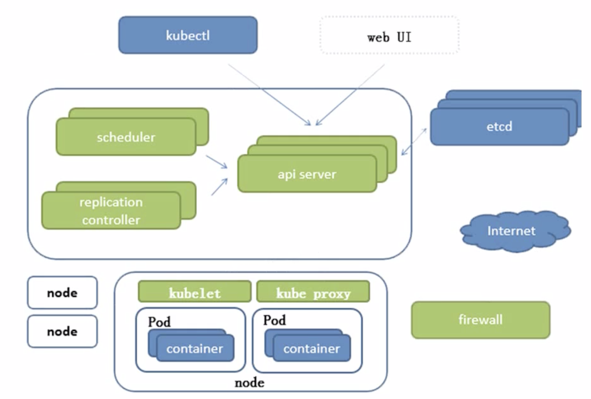

# Kubernetes入门

Kubernetes （简称 "K8S"）是由 Google 设计并捐赠给 Cloud Native Computing Foundation (CNCF) 的**开源容器编排系统**，旨在提供一个**跨集群的自动部署、扩展以及管理容器化应用的平台**。
自从 Docker 在 DockerCon 宣布拥抱 Kubernetes，业界普遍认为 Kubernetes 不久将成为容器编排技术的事实标准，以及云原生相关技术的重要组成部分。

最近几年，后端技术的发展也是非常快的，微服务、云计算这几年发展可谓非常迅速，然后还带火了一系列技术；~~以至于现在不会个微服务出去都不好意思说是后端~~，微服务的崛起带火了容器技术，13 年出现的 Docker 可谓大出光彩，然后紧接着 15 年发布了官方的容器编排技术 Docker Swarm，不过随后宣称拥抱 K8S，也就是说.....官方已经放弃 Docker Swarm 转战 K8S，也可以看出他们是搭配使用的，所以学习之前首先需要对 Docker 有一定的了解。

然后再说个现在很火的词，云原生（Cloud Native），简单说它包含了 微服务、DevOps、持续交付、容器化等概念，现在也很火。Docker 还被称为是第三代 PaaS 平台。

使用 Kubernetes 可以：

- 自动化容器的部署和复制（升级）
- 随时扩展或收缩容器规模
- 将容器组织成组，并且提供容器间的负载均衡（LVS）
- 很容易地升级应用程序容器的新版本
- 提供容器弹性，如果容器失效就替换它
- 等等...

特性：

- 自我修复，容器挂掉自动创建新容器
- 弹性伸缩，根据服务器并发自动增加、减少容器
- 回滚，版本记录
- 自动部署
- 服务发现与负载均衡（Etcd、LVS）
- 配置管理（配置中心），配置共享

实际上，使用 Kubernetes 只需一个[部署文件](https://github.com/kubernetes/kubernetes/blob/master/examples/guestbook/all-in-one/guestbook-all-in-one.yaml)，使用一条命令就可以部署多层容器（前端，后台等）的完整集群。
Docker 已经很熟了，它很显然适合无状态服务，但是 DBMS 这种肯定是有状态的，要想做一个平台，肯定要解决有状态的这部分问题，所以 K8S 是有存储这个概念的，并且根据不同的环境分了不同类型的存储。

## 概述

简单贴一下 K8S 的架构图：

分布式和微服务相关的基本知识直接略过了，Node 这种应该都能看懂，etcd 就是负责存储的，主要 K-V 对，并且是针对分布式的，架构为 CP：

> Etcd 的官方将它定位成一个可信赖的分布式**键值存储服务**，它能够为整个分布式集群存储些关键数据，协助分布式集群的正常运转.
>
> etcd 和 k8s 一样，都是采用 HTTP 来进行交互，在操作之前先记录日志（小版本 + 大版本），防止丢失。
>
> etcd 存储了各个节点的信息，是集群的数据核心；
>
> etcd 是一个开源的、分布式的键值对数据存储系统，提供共享配置、服务的注册和发现。主要解决分布式数据一致性的问题，使用简单的 Raft 一致性算法，社区比 zk 活跃的多。

其他的扩展，例如 ELK 是提供 K8S 集群日志统一分析的一个平台；使用 Prometheus 进行状态监控等。

## 基础概念

Pod 是个很重要的概念，Pod 下面就是容器，容器里面运行我们熟悉的镜像，同一个容器里面的镜像可以直接通信；并且每一个 Pod 会有一个基础容器叫 Pause，所有的镜像会共享里面的内容，它的一个作用就是 link 本 Pod 下其他的容器，还会将健康信息等数据发送给监控；
一般来说，Pod 可以简单分为两类：

- 自主式 Pod

- 控制器管理的 Pod

  除此之外都是自主式的 Pod，而控制器管理的意思就是会根据期望值维持 Pod 的数量，挂了的会自动拉起一个，多了会自动回收，通过 副本机制完成；

Pod 是 K8S 最小的调度单元，也可简单理解为一组容器的集合，一般情况有些 Pod 的生命周期是短暂的。

Pod 的上一级就是 ReplicaSet，简称 RS，它负责管理 Pod，当某一个 Pod 挂掉后，会自动创建新的来维持副本数；

新版本中，推荐使用 ReplicaSet 来替代 ReplicationController，使用上没有太大的区别。一般使用 Deployment 来管理 RC/RS，它可以进行滚动更新（一般先创建再删除，如缓存的更新策略）

Deployment 升级步骤：先创建一个新的 RS，然后这个 RS 会创建新版本的 Pod，之后老版本的 RS 会删掉一个老的 Pod，然后新 RS 继续创建新的 Pod，这样下去直到老的 RS 下的 Pod 被清空，然后老的 RS 也会自动删除；

另外，K8S 中的组件大多数都可以打标签，便于识别；就可以使用 ServiceSelect 来对指定的标签进行管理，ServiceSelect 会有一个对外的 IP，客户端就可以通过这个 IP 来连接上来进行访问；它充当来这一组标签的注册中心，即使 Pod 的地址发生变化，Service 不会变化，可以正确路由到对应的 Pod；

默认情况下，各个 Pod 是可以进行访问的，可以使用命名空间来进行隔离；

## 集群

K8S 的集群的节点分为两类：主节点和工作节点；主节点不跑业务，主要处理调度和用户命令相关工作；工作节点是具体的管理 docker 容器和网路映射相关的内容的；

Master 节点包含的一些内容：

- ApiServer：是交互的唯一入口，客户端请求通过它来完成；同时它也是调度其他模块的核心
- Scheduler：调度器它会收集每一个 Work 节点的详细信息，通过一些算法选出最优策略，告诉 ApiServer 可分配到那个节点上，由 ApiServer 存入 Etcd
- ControllerManager：包含了一系列的控制器，例如前身的 RC，具体的给每个工作节点下达命令；并实时监控个节点情况，维持在稳定的状态，最常用的是 Deployment。

而 Work 节点主要通过内部的 Kubelet 来接收来自 Master 的指令和发送 Docker 指令。

---

集群搭建方案还是蛮复杂的，也就衍生出了很多社区脚本，挑选起来还是很费劲的，还是选官方推荐的 Kubeadm 比较好；

如果是搭建高可用集群，那么 Master 要保证大于等于 3 个；

## 认证与授权

因为是使用 Https 来进行通信，原理参考 Https 的原理，也是通过证书来进行认证，确保客户端与 ApiServer 的安全通信；认证过程是双向认证；

除了证书认证，还可以使用 BearerToken，更简单，但是要保证 Token 传输的安全的前提；

Pod 与 ApiServer 交互的认证方式使用 ServiceAccount，也包含 CA，会通过目录挂载的方式载入。

---

关于授权，也支持常用的 RBAC；基于角色的授权。可通过命名空间来进行隔离。

## 拓展

云计算的几个标准：

- Infrastructure as  a Service（IaaS）

  也就是所谓的基础设施级服务，比如阿里云，AWS 之类。

- Platform as a Service（PaaS）

  也就是平台级服务，例如新浪云，你可以上传代码，它负责提供环境和运行，也是 K8S 的主要战场。

- Software as a Service（SaaS）

  软件级别，很常见了，例如在线 Office