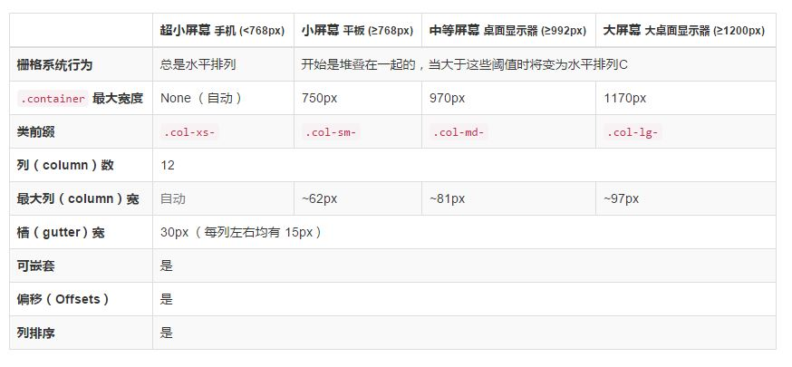

# Bootstrap笔记

**Bootstrap** 是基于 HTML、CSS、JavaScript 的，它简洁灵活，使得 Web 开发更加快捷。 它由 Twitter 的设计师 Mark Otto 和 Jacob Thornton 合作开发，是一个 CSS/HTML 框架。

Bootstrap 是基于 HTML5 和 CSS3 开发的，它在 jQuery 的基础上（所以必须依赖 jQuery）进行了更为个性化的完善，形成一套自己独有的网站风格，并兼容大部分 jQuery 插件。

## 为什么要用？

首先，它很火爆，看看 Github 就知道了，然后它还是 Twitter 搞的....

最主要的其实还是为了**响应式布局设计**，这才是最大的原因，然后它上手还很容易，这就足够了！

对了，这是它的中文官网：http://www.bootcss.com/

## 风格

-   .text-muted：提示，使用浅**灰色（#999）**
-   .text-primary：主要，使用**蓝色（#428bca）**
-   .text-success：成功，使用**浅绿色(#3c763d)**
-   .text-info：通知信息，使用**浅蓝色（#31708f）**
-   .text-warning：警告，使用**黄色（#8a6d3b）**
-   .text-danger：危险，使用**褐色（#a94442）**

---

  ☑   .text-left：左对齐

  ☑   .text-center：居中对齐

  ☑   .text-right：右对齐

  ☑   .text-justify：两端对齐

---

### 代码展示

在 Bootstrap 主要提供了**三种代码风格**：

1.  使用 **`<code></code>`** 来显示单行内联代码
    一般是针对于单个单词或单个句子的代码
2.  使用 **`<pre></pre>`** 来显示多行块代码
    一般是针对于多行代码（也就是成块的代码）
3.  使用 **`<kbd></kbd>`** 来显示用户输入代码
    一般是表示用户要通过键盘输入的内容

不管使用哪种代码风格，在代码中碰到小于号（<）要使用硬编码 `“&lt;”` 来替代，大于号（>）使用 `“&gt;”` 来替代。

---

### 表格

关于表格，Bootstrap 提供了**1种基础样式**和**4种附加样式**以及**1个支持响应式的表格**

  ☑  **.table**：基础表格

  ☑  **.table-striped**：斑马线表格

  ☑  **.table-bordered**：带边框的表格

  ☑  **.table-hover**：鼠标悬停高亮的表格

  ☑  **.table-condensed**：紧凑型表格

  ☑  **.table-responsive**：响应式表格

### 表单

在Bootstrap框架中，通过定制了一个类名**form-control**，也就是说，如果这几个元素使用了类名“form-control”，将会实现一些设计上的定制效果。

**1、宽度变成了100%**

**2、设置了一个浅灰色（#ccc）的边框**

**3、具有4px的圆角**

**4、设置阴影效果，并且元素得到焦点之时，阴影和边框效果会有所变化**

**5、设置了placeholder的颜色为#999**

水平效果可以在 form 标签添加 **form-horizontal** 的 class 属性；表单控件设置 class 为 form-inline 可以将元素设置在一行中显示

## 网格系统

Bootstrap 提供了一套响应式、移动设备优先的流式网格系统，随着屏幕或视口（viewport）尺寸的增加，系统会自动分为最多12列。
网页设计中的网格用于组织内容，让网站易于浏览，并降低用户端的负载。
响应式网格系统随着屏幕或视口（viewport）尺寸的增加，系统会自动分为最多12列。

|    \     |   超小设备手机（<768px）    |  小型设备平板电脑（≥768px）   |  中型设备台式电脑（≥992px）   |  大型设备台式电脑（≥1200px）  |
| :------: | :-----------------: | :-----------------: | :-----------------: | :-----------------: |
|   网格行为   |       一直是水平的        |   以折叠开始，断点以上是水平的    |   以折叠开始，断点以上是水平的    |   以折叠开始，断点以上是水平的    |
|  最大容器宽度  |     None (auto)     |        750px        |        970px        |       1170px        |
| Class 前缀 |    **.col-xs-**     |    **.col-sm-**     |    **.col-md-**     |    **.col-lg-**     |
|   列数量和   |         12          |         12          |         12          |         12          |
|   最大列宽   |        Auto         |        60px         |        78px         |        95px         |
|   间隙宽度   | 30px（一个列的每边分别 15px） | 30px（一个列的每边分别 15px） | 30px（一个列的每边分别 15px） | 30px（一个列的每边分别 15px） |
|   可嵌套    |         Yes         |         Yes         |         Yes         |         Yes         |
|   偏移量    |         Yes         |         Yes         |         Yes         |         Yes         |
|   列排序    |         Yes         |         Yes         |         Yes         |         Yes         |

排版好像有问题，图片：

## 关于单位

-   px
    是相对于屏幕分辨率的单位，其大小无法跟随屏幕放大缩小，所有浏览器都支持 px 单位
-   em
    是参照父级元素大小进行设置，一般来说 1em=16px（但不完全是，不同的浏览器换算不同)，em 会继承**父级元素**的字体大小，IE 的部分浏览器不支持 em
    如果显示的给父元素设置 `font-size：20px`,给子元素设置字体 `font-size:1em;`,子元素其实就是`20px`的大小。
-   rem
    与 em 类似，rem 是 CSS3 中的单位，它（只）会继承**根元素（html）**的字体大小，这样换算就变成了固定值，在做移动开发的时候推荐使用 rem
    `html{font-size：62.5%} ` 这样 1rem=10px（html 默认的 font-size 为 16px；16 * 62.5% = 10px）

如果要写响应式，为了保证兼容，把 rem 写在前面 px 写在后面，用 rem 覆盖 px 就可以

>   在 rem 使用过程中，要时刻注意**字体最小12px**的问题，设置 html 的 font-size 属性时候，最好不要小于 12px，如果设置`font-size:10px` ，元素在使用 1rem 的时候，其实是 12px
>   所以有了使用 62.5% ..