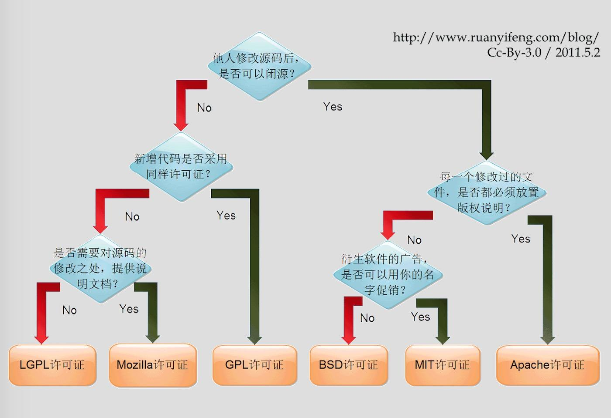
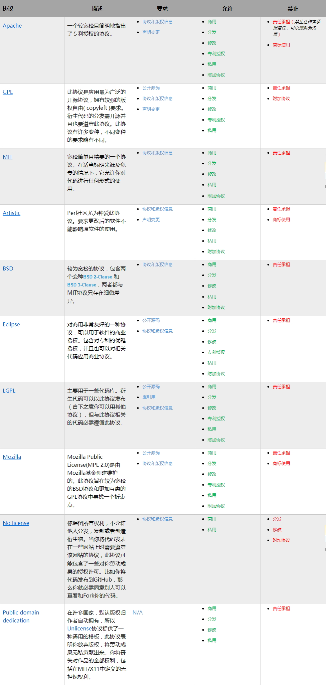

# 关于开源许可协议

对于程序猿来说，了解开源许可协议是非常有必要的，因为解除的比较多

在 Github 逛的时候经常会看到有个单独 License 说明，表明了使用了什么许可协议，那么这些许可协议到底什么用呢，或者说它们有什么作用呢？

1.  首先协议保护了我们的合法权利。保证这些软件不被一些商业机构或个人窃取。
2.  通过协议内容，使用者了解自身拥有的权限。可以方便使用。

**如果我们没有添加协议，那么默认是你保留所有权力，不允许任何人复制，分发或创建衍生作品。**

我们所常用的开源许可协议一般也就是五种，许可的目的是，向使用你产品的人提供一定的权限

>   License 是软件的授权许可，里面详尽表述了你获得代码后拥有的权利，可以对别人的作品进行何种操作，何种操作又是被禁止的。软件协议可分为开源和商业。当然本文要讨论的当然是开源协议。

另外比较重要的一点就是，大部分的许可协议（几乎全部）都是免责的，也就是说他人使用你的代码做了一些违法的事作者并不承担任何责任，这点非常的重要

## BSD

BSD 许可证（英语：Berkeley Software Distribution license），是自由软件中使用最广泛的许可证之一。BSD 软件就是遵照这个许可证来发布，该许可证也因此而得名。

**BSD 开源协议是一个给于使用者很大自由的协议。基本上使用者可以” 为所欲为”, 可以自由的使用，修改源代码，也可以将修改后的代码作为开源或者专有软件再发布。**

但是为所欲为是在一定基础之上的，需要满足三个条件：

1.  如果再发布的产品中包含源代码，则在源代码中必须带有原来代码中的 BSD 协议。
2.  如果再发布的只是二进制类库/ 软件，则需要在类库/ 软件的文档和版权声明中包含原来代码中的 BSD 协议。
3.  不可以用开源代码的作者/ 机构名字和原来产品的名字做市场推广。

该协议有多种版本，最主要的版本有两个，新 BSD 协议与简单 BSD 协议，这两种协议经过修正，都和 GPL 兼容，并为开源组织所认可。 

新 BSD 协议（3条款协议）在软件分发方面，除需要包含一份版权提示和免责声明之外，没有任何限制。另外，该协议还禁止拿开发者的名义为衍生产品背书，但简单 BSD 协议删除了这一条款。

BSD 代码鼓励代码共享，但需要尊重代码作者的著作权。BSD 由于允许使用者修改和重新发布代码，也允许使用或在 BSD 代码上开发商业软件发布和销售，因此是对 商业集成很友好的协议。**而很多的公司企业在选用开源产品的时候都首选 BSD 协议，因为可以完全控制这些第三方的代码，在必要的时候可以修改或者二次开发。**

## MIT

MIT许可协议（The MIT License）是许多软件授权条款中，被广泛使用的其中一种。与其他常见的软件许可协议（如GPL、LGPL、BSD）相比，MIT是相对宽松的软件许可协议。

所以说，**MIT协议可能是几大开源协议中最宽松的一个了** ；和 BSD 其实也差不了多少，作者只想保留版权, 而无任何其他了限制

>   该软件及其相关文档对所有人免费，可以任意处置，包括使用，复制，修改，合并，发表，分发，再授权，或者销售。唯一的限制是，软件中必须包含上述版 权和许可提示。 
>
>   这意味着： 
>
>   你可以自由使用，复制，修改，可以用于自己的项目。 
>
>   可以免费分发或用来盈利。 
>
>   **唯一的限制是必须包含许可声明。** 

## Apache Licence

Apache 许可证（英语：Apache License），是一个由 Apache 软件基金会发布的自由软件许可证，最初为 Apache http 服务器而撰写。**Apache 许可证要求被授权者保留版权和放弃权利的声明，但它不是一个反版权的许可证。**

此许可证最新版本为“版本2”，于2004年1月发布。

和别的开源协议相比，除了为用户提供版权许可之外，还有专利许可，**对于那些涉及专利内容的开发者而言，该协议最适合。**

它有几个需要注意的点就是：

-   **永久权利**

    一旦被授权，永久拥有。
-   **全球范围的权利**

    在一个国家获得授权，适用于所有国家。假如你在美国，许可是从印度授权的，也没有问题。
-   **授权免费，且无版税** 

    前期，后期均无任何费用。
-   **授权无排他性** 

    任何人都可以获得授权
-   **授权不可撤消** 

    一旦获得授权，没有任何人可以取消。比如，你基于该产品代码开发了衍生产品，你不用担心会在某一天被禁止使用该代码。

使用次许可你需要做的是：

- 需要给代码的用户一份 Apache Licence

- 如果你修改了代码，需要再被修改的文件中说明。

- 在延伸的代码中（修改和有源代码衍生的代码中）需要带有原来代码中的协议，商标，专利声明和其他原来作者规定需要包含的说明。

- 如果再发布的产品中包含一个 Notice 文件，则在Notice 文件中需要带有 Apache Licence 。你可以在 Notice 中增加自己的许可，但不可以表现为对 Apache Licence 构成更改。

## GNU GPL

**GNU通用公共许可协议**（英语：**GNU General Public License**，简称 **GNU GPL**、**GPL**）是广泛使用的免费软件许可证，可以保证终端用户得自由运行，学习，共享和修改软件。

历史上，GPL许可证系列一直是免费和开源软件领域最受欢迎的软件许可之一。**根据 GPL 许可的优异自由软件程序的例子有Linux 内核和 GNU 编译器集合 （GCC）。**

**GPL 不允许修改后和衍生的代码做为闭源的商业软件发布和销售**。这也就是为什么我们能用免费的各种 linux ，包括商业公司的linux 和 linux 上各种各样的由个人，组织，以及商业软件公司开发的免费软件了。

GPL 保证了所有开发者的权利，同时为使用者提供了足够的复制，分发，修改的权利：

-   **可自由复制** 

    你可以将软件复制到你的电脑，你客户的电脑，或者任何地方。复制份数没有任何限制。
-   **可自由分发** 

    在你的网站提供下载，拷贝到U盘送人，或者将源代码打印出来从窗户扔出去（环保起见，请别这样做）。
-   **可以用来盈利** 

    你可以在分发软件的时候收费，但你必须在收费前向你的客户提供该软件的 GNU GPL 许可协议，**以便让他们知道，他们可以从别的渠道免费得到这份软件，以及你收费的理由。**
-   **可自由修改** 

    如果你想添加或删除某个功能，没问题，如果你想在别的项目中使用部分代码，也没问题，唯一的要求是，**使用了这段代码的项目也必须使用 GPL 协议。**

因为使用 GPL 协议的产品必须也要使用 GPL 协议，这就是所谓的“传染性”，也就是不允许闭源了，对于使用 GPL 协议的开源代码，商业软件或者对代码有保密要求的部门就不适合集成/ 采用作为类库和二次开发的基础。

>   在国内的大版权时代，人们的版权意识都不太高，有些公司偷偷用 GPL 授权的软件而不公开代码，在国内偷偷摸摸的其实也没多大问题，但是一旦走向国外，就会以侵权被告的满地找牙....
>
>   有很多工具（如：BlackDuck Protex）可以检测你的代码或者二进制文件中是否含有 GPL 协议的代码，以此给予相应的警告

## GNU LGPL

GNU 还有另外一种协议，叫做 LGPL （Lesser General Public Licence），**它对产品所保留的权利比 GPL 少**，总的来说，LGPL 适合那些用于非 GPL 或非开源产品的**开源类库或框架**。

因为 GPL 要求，使用了 GPL 代码的产品必须也使用 GPL 协议，开发者不允许将 GPL 代码用于商业产品。LGPL 绕过了这一限制。

LGPL 允许商业软件通过类库引用(link) 方式使用 LGPL 类库而不需要开源商业软件的代码。这使得采用 LGPL 协议的开源代码可以被商业软件作为类库引用并 发布和销售。

但是如果修改 LGPL 协议的代码或者衍生，则所有修改的代码，涉及修改部分的额外代码和衍生的代码都必须采用 LGPL 协议。

因此 LGPL 协议的开源 代码很适合作为第三方类库被商业软件引用，但不适合希望以 LGPL 协议代码为基础，通过修改和衍生的方式做二次开发的商业软件采用。

## 如何选择

这里可以参考两张图，第一张是 Github 出的，另有[中文翻译版](http://choosealicense.online/)

## 总结

引用[刘哇勇](http://www.cnblogs.com/Wayou/p/how_to_choose_a_license.html)文章的一张表格：

>   **目前使用最多的是 MIT协议，但是 Apache License 2.0 协议也是一种不错的选择，因为这样可以帮助我们知道有哪些开源项目使用了我们的内容，以及进行了何种修改，有利于我们改进自己的项目。**
>
>   **之所以采用这个协议，而不使用 GNU GPLv3 ，是因为 GNU GPLv3 使用者必须按照相同的协议开源，而 Apache License 2.0 相对比较宽松，你可以私用，也可以闭源，但是如果开源项目使用到的时候，只需要放置一下版权声明以及修改声明即可。**

## 补充-知识共享协议

上面说的是自由软件的许可协议，还有就是平时我们写的文章也是有版权的，一般最常见的是采用知识共享协议，典型代表就是维基百科，各大博客用的也很多

>   知识共享协议也属于版权协议的一种，常用于数据、多媒体、网站、文章等内容，是作者保障自己权益的一道屏障。
>
>   知识共享协议(Creative Commons，也称为CC协议) 有很多版本，不过需要注意的是，知识共享协议不适用于开源软件。
>
>   **注意：虽然你可以采用知识共享协议来保护你的内容，但是一旦你在某些平台上发布你的内容，你就默认接受了该平台的协议，这一点尤其需要注意。**
>
>   举个栗子（可在它们的用户协议-知识产权上找到）：
>
>   **你在百度上发表的任何东西，不论是百度知道，百度文库或者是贴吧，百度自动拥有版权，可以随意使用这些内容，而在知乎上的回答，文章等则是作者拥有版权，知乎拥有使用权，当然了，前提是你为原创作者。**

它一般包括几部分，可以叠加使用：

-   署名

    作品上必须附有作品的归属。如此之后，作品可以被修改，分发，复制和其它用途。

-   相同方式共享

    作品可以被修改、分发或其它操作，但所有的衍生品都要置于CC许可协议下。

-   非商业用途

    作品可以被修改、分发等等，但不能用于商业目的。但语言上对什么是“商业”的说明十分含糊不清 (没有提供精确的定义)，所以你可以在你的工程里对其进行说明。

    例如，有些人简单的解释“非商业”为不能出售这个作品。而另外一些人认为你甚至不能在有广告的网站上使用它们。 还有些人认为“商业”仅仅指你用它获取利益。

-   禁止衍生作品

    这意味着你可以复制和分发它们，但你不能以任何方式修改它们，或基于它们进行二次创作。

| 标志                                       | 英文            |   缩写   | 全称         | 说明                                       |
| ---------------------------------------- | :------------ | :----: | :--------- | :--------------------------------------- |
|  | Attribution   | **BY** | **署名**     | 您（用户）可以复制、发行、展览、表演、放映、广播或通过信息网络传播本作品；您必须按照作者或者许可人指定的方式对作品进行署名。 |
|  | NonCommercial | **NC** | **非商业性使用** | 您可以自由复制、散布、展示及演出本作品；您不得为[商业](https://zh.wikipedia.org/wiki/%E5%95%86%E4%B8%9A)目的而使用本作品。 |
|  | NoDerivs      | **ND** | **禁止演绎**   | 您可以自由复制、散布、展示及演出本作品；您不得改变、转变或[更改](https://zh.wikipedia.org/w/index.php?title=%E6%9B%B4%E6%94%B9&action=edit&redlink=1)本作品。 |
|  | ShareAlike    | **SA** | **相同方式共享** | 您可以自由复制、散布、展示及演出本作品；**若您改变、转变或更改本作品**，仅在遵守与本作品相同的授权条款下，您才能散布由本作品产生的[派生作品](https://zh.wikipedia.org/wiki/%E8%A1%8D%E7%94%9F%E4%BD%9C%E5%93%81)。 |

如果使用（署名权，非商业用途，禁止衍生）算是比较严格的一种了，只要你遵守许可协议条款，许可人就无法收回你的这些权利。

更多可访问：https://creativecommons.org/choose/

### 关于参考链接

如果你的文章参考了其他人的思路或者成果，建议加上参考链接，除了能够帮助读者更好理解知识的来源外，也可以顺便给这些人带来一些名气。

参考部分内容往大了说其实也要受 CC 的约束，比如禁止演绎，摘抄部分或者全部内容可以但是不允许进行任何的修改

我认为，某些条件下，链接就是署名的作用了（不是常说以链接的形式注明作者）正规的应该是标明作者名以及链接

## 参考

https://juejin.im/entry/58abf75a2f301e006c3ce0f1

http://www.jianshu.com/p/cceeafb019ed

http://www.gcssloop.com/tips/choose-license

https://zh.wikipedia.org/wiki/%E8%87%AA%E7%94%B1%E5%8F%8A%E9%96%8B%E6%94%BE%E5%8E%9F%E5%A7%8B%E7%A2%BC%E8%BB%9F%E9%AB%94%E8%A8%B1%E5%8F%AF%E8%AD%89%E6%AF%94%E8%BC%83