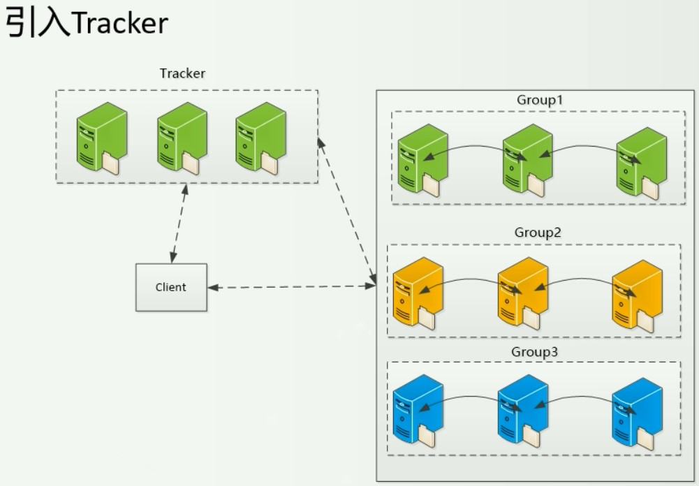
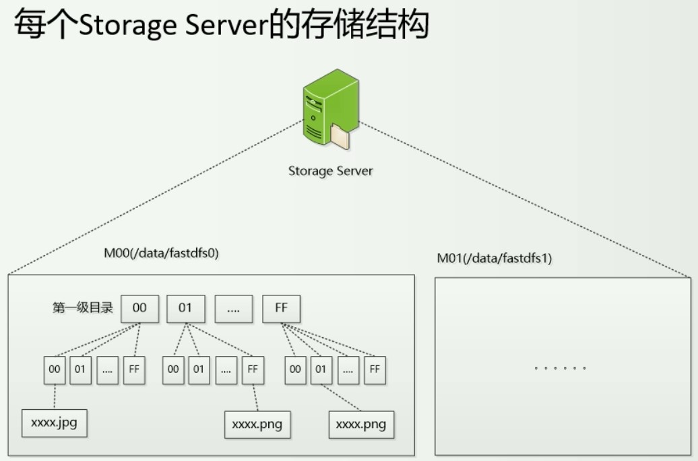
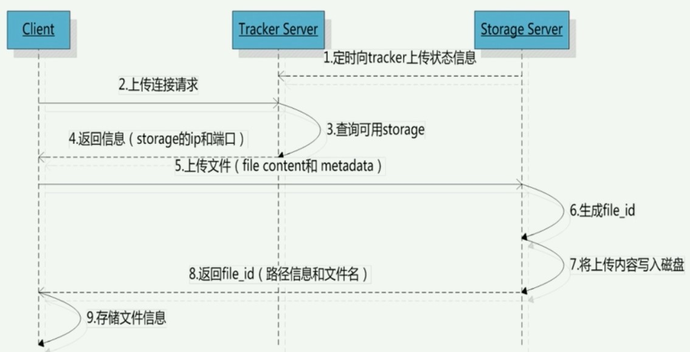
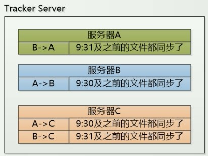
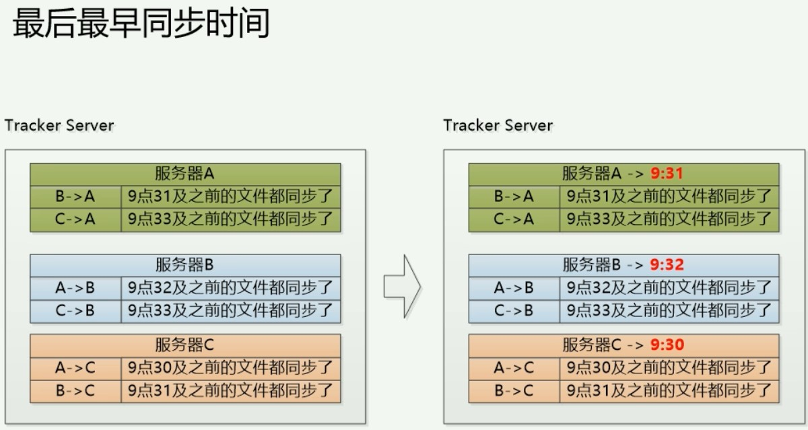
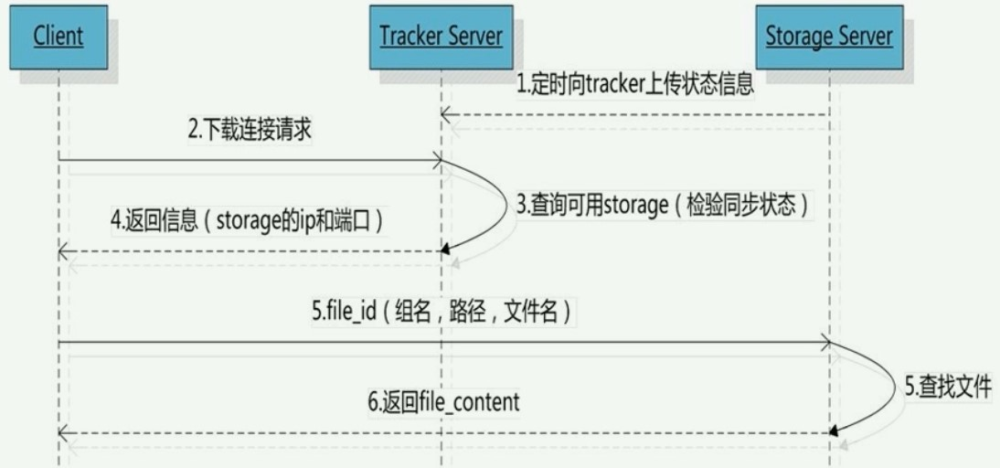
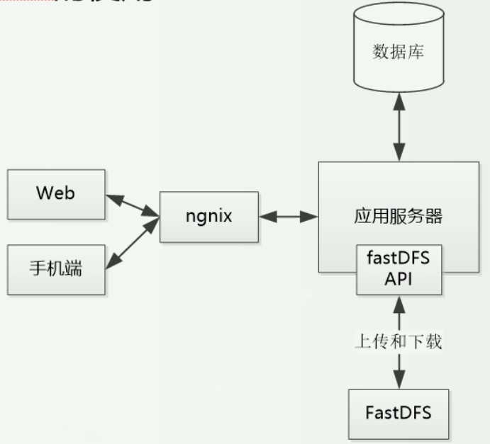
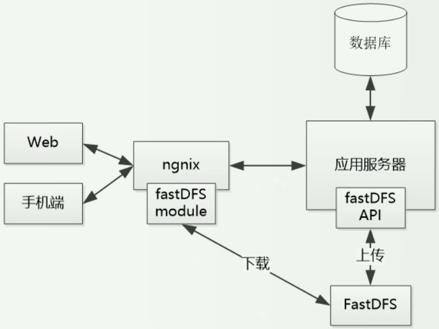

# 分布式文件系统FastDFS

分布式文件系统就以 FastDFS 为例了，国内用的好像也蛮多的，简单的系统直接用 FTP 就够了 o(￣▽￣*)ゞ))￣▽￣*)o

关键词：海量文件，冗余备份（高可用），高并发（分布式存储）。

下面来看看 FastDFS 的基本架构，以及运行原理。

为了保证高可用，要进行冗余备份，也就是每个 Group 中的服务器会相互同步，建议每个 Group 中的服务器数量最少需要 3 台。

引入跟踪服务器 Tracker 的目的就是解决客户端到底选择那一个 Group，这个组里面的那一台存储服务器。

在 Tracker 中记录了每个组、每个组内每台存储服务器的信息，这些信息是由存储服务器主动汇报给 Tracker 服务器的，保持长连接来实时汇报。这样 Tracker 就能进行合理的分配了。

Tracker 可以多台，在某一时间可以是不一致的，但最终要保持一致性。由于 Tracker 存储的信息比较少，还在内存中维护，所以 Tracker 的速度很快，基本可理解为是一致的。

**特点：**

- Group 之间相互独立

- 同一 Group 中的存储服务器之间互相备份

- **Tracker 之间不进行交互**

- 每个存储服务器都需要定时向所有的 Tracker 汇报信息

存储服务器的结构：

一般情况下，用一个 M00 就足够了，一个就已经有 256*256 个目录了，在服务器启动的时候这些目录就会被创建出来。 

文件经过两次 hash 最终确定位置。

## 上传文件

上传文件的过程可以看这张图：

可以看出文件名会重新生成，就是 file_id 这里还涉及到几个问题：

如果选定 Tracker？

Tracker 如何选定是哪一个 Group？

Group 如何选择那个数据服务器？

Tracker 的选择可以在客户端维护一个 Tracker 的列表，最终选择那一台 Tracker 也是可以达到目的的。

通常的做法有轮询（一般默认值）、选择最大空间、指定组（分类型）。

然后还可以按照优先级啊，ip 地址的排序啊等等。

再来看看是如何生成 file_id 的，文件名采用的是 Base64 编码，包含主存储服务器的 ip、创建时间、大小、CRC32 校验、随机数等。

每个存储目录下都有两个 256*256个子目录（例如M00），然后存储服务器会把文件名进行两次 hash 运算，最终选择一个子目录以 file_id 的名字放进去。

PS：每一个目录可以存多个文件，**返回的文件名客户端必须进行处理和存储**。路径信息中包含了在那个组那个 Mxx，每个组因为是互相复制，所以没必要指定是那个存储服务器，但文件名中有源服务器。

## 文件的同步

同一组内的数据服务器之间是对等的，上传、删除可在任意一台服务器上进行。

只有源头的数据才需要同步，备份/更新后的数据不需要同步，要不然就闭环了。

同步时，都会向 Tracker 进行汇报，并且是按照时间进行排序的。

比如 B 向 A、C 同步文件 Y，可看作在 Tracker 中维护一张这样的表：

查找文件时，先去源服务器，然后挨着查，对比时间，根据同步时间就可以确定这台服务器是否有该文件。

例如如果文件 y 在 9:31 上传，源服务器是 B（这些信息可以从文件名中获得），那么根据这张表，三台服务器都拥有 y 文件。

还有另一种方案：

查找的时候会先根据创建时间来对比最小时间，时间不到的一律不考虑（源服务器除外）

但是这个有个弊端，虽然简单，但是有可能已经进行了同步，由于最小时间不符还是会认为没有。

这个表是存在一个文件中的，一般不会涉及到数据库，那就太重型了。

## 文件下载

流程图：

根据的就是那个路径来定位文件（路径类似：`group1/M00/00/0C/xxxx.jpg`），选择一个可下载的文件服务器，如何选择？

可以直接选择源服务器；

同时也可以根据上面同步说的那两种方案确定已经同步的服务器，然后来下载。

同时，还可以设置一些阀值，会计算 （当前时间 - 文件创建时间） 的值，看看是否大于这个阀值，大于可认为文件已经同步（也就是设置了认为文件同步的最长时间）

## 应用

两幅图来说明：

为了防盗链，可以使用加 token 参数的形式。

在业务层，获取图片可能不需要加参数，但是返回给前端的时候就有这些参数了。

合法用户？比如你只有在访问它指定的网站才会下发 token。

## 合并存储

这一块是比较复杂的，牵扯到的问题太多了，比如计算容量啊（要考虑块中的剩余容量了）、同步（要考虑块中的小文件同步情况）啊等等。

简单了解下就好。

并且合并文件后的文件 ID（文件名）也是要变化的，文件名中要记录偏移量、占用空间啊等等信息。

### 海量小文件的缺点

- 元数据管理低效，磁盘文件系统中，目录项（dentry）、索引节点（inode）和数据（data）保存在存储介质的不同位置上。
- 数据存储分散
- 磁盘的大量随机访问降低效率

### FastDFS提供的合并存储功能

- 默认大文件 64 M
- 每个文件空间称为 slot（256bytes <= slot <= 16MB）

## 总结

FastDFS 是穷人的解决方案；

它把简洁和高效做到了极致，非常节约资源，中小网站完全用的起。

C 语言写的，很深。

其他的还有淘宝的 TFS，重量级的。