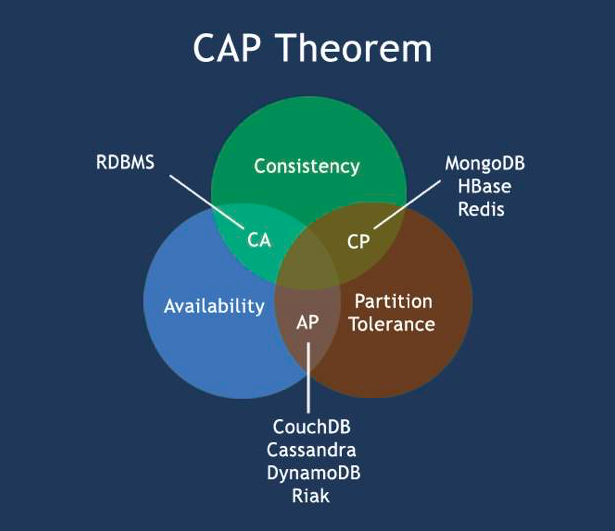
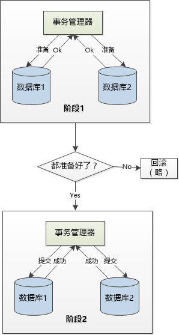
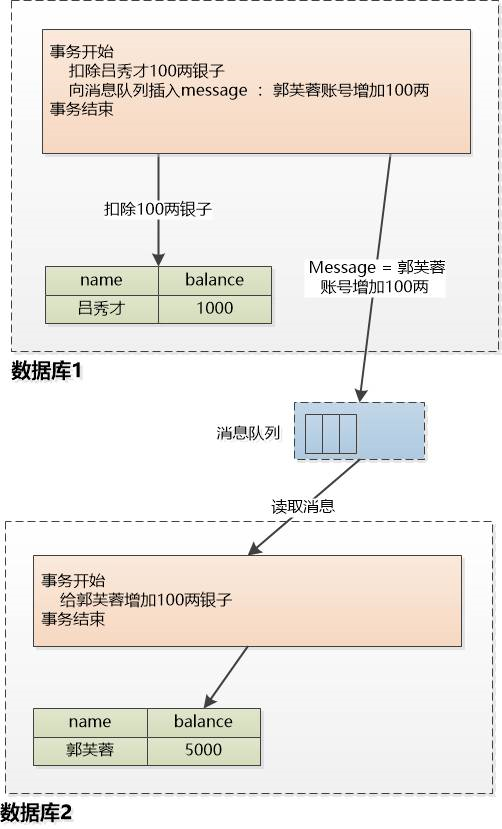
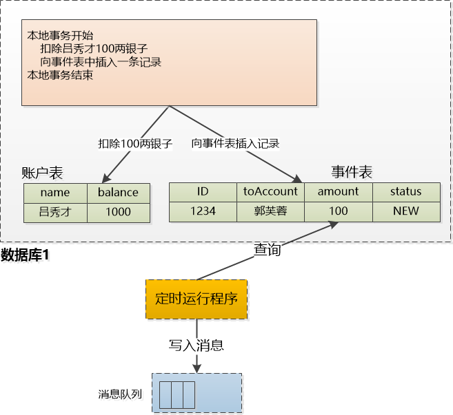
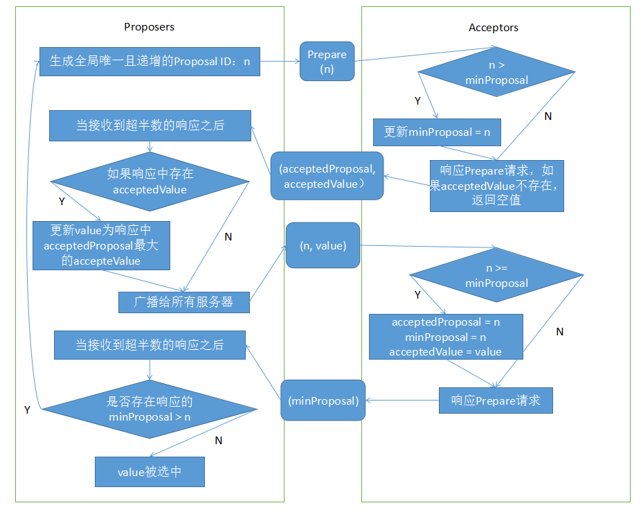

# 分布式如何保证数据一致性

## CAP定理

> 在理论计算机科学中，CAP 定理（CAP theorem），又被称作布鲁尔定理（Brewer's theorem），它指出对于一个**分布式计算系统来说**，不可能同时满足以下三点：
>
> - **一致性（Consistency）**
>   等同于所有节点访问同一份最新的数据副本
> - **可用性（Availability）**
>   每次请求都能获取到非错的响应，但是不保证获取的数据为最新数据
> - **分区容错性（Partition tolerance）**
>   以实际效果而言，分区相当于对通信的时限要求。
>   系统如果不能在时限内达成数据一致性，就意味着发生了分区的情况，必须就当前操作在 C 和 A 之间做出选择。
>
> **根据定理，分布式系统只能满足三项中的两项而不可能满足全部三项**。

如果我们选择的是**可用性(Availability，简称A)**， 就是系统能提供服务就好， 数据不一致可以忍受。

在网络节点之间无法通信的情况下,  和数据复制相关的功能， 要么选择可用性(A) , 要么选择一致性(C)， 不能同时选择两者。

如果选择了可用性(A) + 分区容错性(P) ,  就要放弃一致性(C)。

如果选在一致性(C) + 分区容错性(P) , 就得放弃可用性(A) 。

在选择 CP 的情况下，虽然系统的有些功能是不能使用的（放弃了 A）， 因为需要等待数据的同步， **但是那些和数据同步无关的功能还是可以访问的 ， 相当于系统做了功能的降级。**

既然有 AP 和 CP,    会不会出现仅仅是 CA（一致性+可用性）这种组合呢？ 就是没有分区容错性， 只保留可用性和一致性？ 仔细想想， 这种情况其实就退化成了单机应用， 没有意义了。

---

然后，既然要做分布式，P 是肯定的，那么只能从 C 和 A 里再选择一个了，常见的有：


其中，常用的 Zookeeper 保证的是 CP，而 Eureka 则是 AP

> 当向注册中心查询服务列表时，我们可以容忍注册中心返回的是几分钟以前的注册信息，但不能接受服务直接 down 掉不可用。也就是说，服务注册功能对可用性的要求要高于一致性。
>
> 但是 zk 会出现这样一种情况，当 master 节点因为网络故障与其他节点失去联系时，剩余节点会重新进行 leader 选举。问题在于，选举 leader 的时间太长，30 ~ 120s, 且选举期间整个 zk 集群都是不可用的，这就导致在选举期间注册服务瘫痪。
>
> 在云部署的环境下，因网络问题使得 zk 集群失去 master 节点是较大概率会发生的事，虽然服务能够最终恢复，但是漫长的选举时间导致的注册长期不可用是不能容忍的。
>
> ------
>
> Eureka 看明白了这一点，因此在设计时就优先保证可用性。Eureka 各个节点都是平等的，几个节点挂掉不会影响正常节点的工作，剩余的节点依然可以提供注册和查询服务。
>
> 而 Eureka 的客户端在向某个 Eureka 注册或时如果发现连接失败，则会自动切换至其它节点，只要有一台 Eureka 还在，就能保证注册服务可用(保证可用性)，只不过查到的信息可能不是最新的(不保证强一致性)。除此之外，Eureka 还有一种自我保护机制，如果在 15 分钟内超过 85% 的节点都没有正常的心跳，那么 Eureka 就认为客户端与注册中心出现了网络故障，此时会出现以下几种情况： 
>
> 1. Eureka 不再从注册列表中移除因为长时间没收到心跳而应该过期的服务 
> 2. Eureka 仍然能够接受新服务的注册和查询请求，但是不会被同步到其它节点上(即保证当前节点依然可用
> 3. 当网络稳定时，当前实例新的注册信息会被同步到其它节点中

因此， Eureka 可以很好的应对因网络故障导致部分节点失去联系的情况，而不会像 zookeeper 那样使整个注册服务瘫痪。

Eureka 作为单纯的服务注册中心来说要比 zookeeper 更加“专业”，因为注册服务更重要的是可用性，我们可以接受短期内达不到一致性的状况。不过 Eureka 目前 1.X 版本的实现是基于 servlet 的 java web 应用，它的极限性能肯定会受到影响。期待正在开发之中的 2.X 版本能够从 servlet 中独立出来成为单独可部署执行的服务（虽然闭源了）。

## 二阶段提交

事务我们非常熟悉，特性 ACID，回滚非常的好用，但是一般只对单个数据库有用，如果需要夸数据库就会比较尴尬。

---

在计算机网络以及数据库领域内，二阶段提交（英语：Two-phase Commit）是指，为了使基于分布式系统架构下的所有节点在进行事务提交时保持一致性而设计的一种算法(Algorithm)。

通常，**二阶段提交也被称为是一种协议(Protocol)**。在分布式系统中，每个节点虽然可以知晓自己的操作时成功或者失败，却无法知道其他节点的操作的成功或失败。

当一个事务跨越多个节点时，为了保持事务的 ACID 特性，需要引入一个作为协调者的组件来统一掌控所有节点(称作参与者)的操作结果并最终**指示这些节点是否要把操作结果进行真正的提交**(比如将更新后的数据写入磁盘等等)。

因此，二阶段提交的算法思路可以概括为： **参与者将操作成败通知协调者，再由协调者根据所有参与者的反馈情报决定各参与者是否要提交操作还是中止操作。**

> 需要注意的是，二阶段提交(英文缩写：2PC)不应该与并发控制中的二阶段锁(英文缩写：2PL)进行混淆。

wiki：https://zh.wikipedia.org/wiki/%E4%BA%8C%E9%98%B6%E6%AE%B5%E6%8F%90%E4%BA%A4

---

两阶段提交协议：

由于涉及到多个分布式的数据库， 我们特设一个全局的事务管理器，它来负责协调各个数据库的事务提交， 为了实现分布式事务，需要两个阶段：

- **阶段一**
  全局的事务管理器向各个数据库发出准备消息。 各个数据库需要在本地把一切都准备好，执行操作，锁住资源， 记录 redo/undo 日志， 但是并不提交。
  总而言之，要进入一个时刻准备提交或回滚的状态， 然后向全局事务管理器报告是否准备好了。
- **阶段二**
  如果所有的数据库都报告说准备好了， 那全局的事务管理器就下命令： 提交！这时候各个数据库才真正提交，由于之前已经万事具备，只欠东风，只需要快速完成本地提交即可。
  如果有任何一个数据库报告说没准备好， 事务管理器就下命令： 放弃！这时候各个数据库要执行回滚操作， 并且释放各种在阶段1锁住的资源。



阶段1就是让大家都准备好，阶段2就是迅速提交。

但是，一旦涉及到分布式，事情就不会那么简单，任何地方都有失败的可能。

比如在第二阶段，那个事务管理器要是出了问题怎么办？ 人家各个数据库还在等着你发命令呢？ 你迟迟不发命令，大家都阻塞在那里，不知所措，到底是提交呢？还是不提交呢， 我这里还锁着资源呢， 迟迟不能释放，多耽误事啊 ！

还是第二阶段，事务管理器发出的提交命令由于网络问题，数据库１收到了，数据库２没收到，这两个数据库就处于不一致状态了， 该怎么处理？

---

> 拓展：
>
> X/Open 组织（即现在的 Open Group ）定义了分布式事务处理模型，或者叫 XA 规范， X/Open DTP 模型（ 1994 ）包括应用程序（ AP ）、事务管理器（ TM ）、资源管理器（ RM ）、通信资源管理器（ CRM ）四部分。一般，常见的事务管理器（ TM ）是交易中间件，常见的资源管理器（ RM ）是数据库，常见的通信资源管理器（ CRM ）是消息中间件。
>
> **二阶提交协议**和**三阶提交协议**就是根据这一思想衍生出来的。

## XA规范

XA 是由 X/Open 组织提出的分布式事务的规范。XA 规范主要定义了（全局）事务管理器（Transaction Manager）和（局部）资源管理器（Resource Manager）之间的接口。

XA 接口是双向的系统接口，在事务管理器（Transaction Manager）以及一个或多个资源管理器（Resource Manager）之间形成通信桥梁。

XA 引入的事务管理器充当上文所述全局事务中的“协调者”角色。事务管理器控制着全局事务，管理事务生命周期，并协调资源。资源管理器负责控制和管理实际资源（如数据库或 JMS 队列）。

目前，Oracle、Informix、DB2、Sybase 和 PostgreSQL 等各主流数据库都提供了对 XA 的支持。

## JTA

> Java 事务 API（Java Transaction API，简称 JTA ） 是一个 Java 企业版 的应用程序接口，在 Java 环境中，允许完成跨越多个 XA 资源的分布式事务。JTA 是在 Java 社区过程下制定的规范，编号 JSR 907。

作为 Java 平台上事务规范 JTA（Java Transaction API）也定义了对 XA 事务的支持，实际上，**JTA 是基于 XA 架构上建模的**。

在 JTA 中，事务管理器抽象为 `javax.transaction.TransactionManager` 接口，并通过底层事务服务（即 Java Transaction Service）实现。像很多其他的 Java 规范一样，**JTA 仅仅定义了接口，具体的实现则是由供应商(如 J2EE 厂商)负责提供**，目前 JTA 的实现主要有以下几种：

- J2EE 容器所提供的 JTA 实现(如JBoss)。
- 独立的 JTA 实现：如 JOTM（Java Open Transaction Manager），Atomikos。
  这些实现可以应用在那些不使用 J2EE 应用服务器的环境里用以提供分布事事务保证。

JTA 的使用示例（伪代码）：

``` java
UserTransaction userTx = null;
Connection connA = null;
Connection connB = null;

try{
  userTx = getContext().lookup("java:comp/userTransaction");
  // connA = 从数据库 A 获取连接
  // connB = 从数据库 B 获取连接
  
  // 启动分布式事务
  userTx.begin();
  // 在数据库 A 中执行操作
  // 在数据库 B 中执行操作
  
  // 提交事务
  userTx.commit();
} catch(SQLException e) {
  // 回滚
  userTx.rollback();
}
```

JTA 并没有取得像 JDBC 那样的广泛应用，分布式事务伴随着大量节点的通信交换， 协调者要确定其他节点是否完成， 加上网络带来的超时，导致 JTA 性能低下， 在高并发和高性能的场景下举步维艰。

很多应用服务器 Websphere , Weblogic 等都支持 JTA， 可是使用者确是寥寥无几， 都快成摆设了。

这个标准太理想化，完全不符合实情，总是想着让两个数据库保证实时的一致性（强一致性）， 为了达到这个目标，JTA 付出的代价太高了。

## 最终一致性

知道了上面的知识，我们可以退一步，也就是我们可以忍受一段时间的不一致，只有最终一致就行。 比方说 A 给 B 转 100 元， A 中的钱已经扣除， 但是 B 中不会实时地增加，过段时间能保证增加就行了。

> “ 假设两个账户（吕秀才和郭芙蓉）在两个独立的数据库中， 我们原来设计的 JTA 是要求从吕秀才账户减去 100 两银子， 然后在郭芙蓉账户加上 100 两银子， 这两个操作要么全部做完，要么全部不做， 但是在网络的环境下， 这是不大容易做到的， 或者说在高并发的情况下做到的代价太高。”



我们想从吕秀才账户转 100 两银子给郭芙蓉， 需要在数据库 1 发起一个事务， 从吕秀才账户扣除 100 两， 然后还得向消息队列插入一条给郭芙蓉账号增加 100 两的消息， 然后这个数据库 1 的事务就结束了！

消息队列中的消息会在某一刻被读取出来，进行处理，给郭芙蓉的账号增加 100 两。

至于这个加钱的操作什么时候执行，这个时间不确定， 就看具体怎么实现了， 比如有个后台程序定期运行，读取消息来处理，消息队列的数据都是持久化到硬盘上的， 不用怕宕机会丢失。

假设数据库 2 down 机了， 对郭芙蓉有两种选择：　一种是由于系统原因，转账操作完全不能操作，另外一种是可以转账，但是钱稍后到账，你说郭芙蓉会选哪一种？

这就是最终一致性，数据在某些时候看起来不一致，但是同步内容都在消息队列中暂存着，等数据处理完成，数据还是一致的。

第一种情况是完全不可用， 第二种只是是部分可用，对于高并发的场景，转账的时候扣完钱， 向消息队列插入消息，事务就结束了，根本不用什么两阶段提交，性能很好。

---

上面的方案看似非常完美，但是，还隐藏有一个重大问题：

> 这个事务同时操作了数据库和一个消息队列， 这两个东西是完全不同的， 怎么实现？难道再用 JTA？
>
> JTA 不仅仅可以支持数据库， 只要是支持XA协议的数据源都可以。

解决方案：



在这里，我们可以添加一个‘**事件表**’， 转账开始的时候，把吕秀才的100两银子扣除， 同时还向事件表插入一行记录： 需要向郭芙蓉转100两， **由于这两个表是在同一个数据库中，所以直接使用本地事务就行**。不用什么分布式事务。

而那个定时运行程序就是个定时任务，它会定期从事件表中取出记录， 向 MQ 写入消息， 然后把记录的状态改成 ‘DONE’， 这样下次就不用再去取去处理了。

这里还有一个坑，读数据后，向消息队列写入了消息， 如果还没来得及把事件表的 status 改为 ‘DONE’ 就崩溃了，等到定时运行程序重启以后，**会再次读取， 再次向 MQ 写入消息**，这样整个系统就不一致了。所以必须要做到幂等性。

> 当你对一个事物操作的时候，**可以一直重复地操作，那个事物不受影响**， 例如对郭芙蓉的账号你查询一千次，一万次，账户余额还是那么多，不会变化。 
>
> 转账操作就不是一个幂等性操作，每次操作都会导致账号的变化。
>
> 简单理解：read 是幂等的， modify 不是幂等的

也就是那个定时运行的程序可以出错，**可以向消息队列写入多次重复消息** ， 但是消费方那边在执行的时候， 肯定也要判断之前是否执行过了， 如果没有的话就执行， 如果执行过了就简单的抛弃这个消息即可。

所以消费方在判断是否已经执行过的时候（可以设置一个 id 来进行区分），**也需要查询之前的执行记录**， 这就意味着之前执行过的也需要用一个表保存下来才行。

> 有人说，可以消息内容直接为账户值 + 100，这样，无论任务操作多少次，郭芙蓉账户都是账户值 +100。
>
> 但是这样首先要保证顺序，并且还是得标记这个事儿已经做过了，并且对于日志不是很友好，采用的不是很多吧。

如果遇到是对方账号输入错误，钱老是转不进去，也就是消息无法消费，只能使用补偿机制了（手动 or 自动？）。

这些都是建立在 MQ 是稳定、高可用的前提下。。。。

这种方法也就是 BASE 模型，BASE 模型反 ACID 模型，完全不同 ACID 模型，牺牲高一致性，获得可用性或可靠性。

## 三阶段提交

> 三阶段提交（英语：Three-phase commit），也叫三阶段提交协议（英语：Three-phase commit protocol），是在计算机网络及数据库的范畴下，使得一个分布式系统内的所有节点能够执行事务的提交的一种分布式算法。
>
> **三阶段提交是为解决两阶段提交协议的缺点而设计的。**

与两阶段提交不同的是，三阶段提交是**“非阻塞”协议**。三阶段提交在两阶段提交的第一阶段与第二阶段**之间插入了一个准备阶段**，使得原先在两阶段提交中，参与者在投票之后，由于协调者发生崩溃或错误，而导致参与者处于无法知晓是否提交或者中止的“不确定状态”所产生的可能相当长的延时的问题得以解决。

---

与 2PC 想比，3PC 主要有两个改动点：

1. 引入超时机制。同时在协调者和参与者中都引入超时机制。
2. 在第一阶段和第二阶段中插入一个准备阶段。保证了在最后提交阶段之前各参与节点的状态是一致的

### 第一阶段CanCommit

这一阶段和 2PC 的准备阶段很像：

1. **事务询问** 
   协调者向参与者发送 CanCommit 请求。询问是否可以执行事务提交操作。然后开始等待参与者的响应。

2. **响应反馈** 
   参与者接到 CanCommit 请求之后，正常情况下，如果其自身认为可以顺利执行事务，则返回 Yes 响应，并进入预备状态。否则反馈 No

### 第二阶段PreCommit

协调者根据参与者的反应情况来决定是否可以执行事务的 PreCommit 操作。根据响应情况，有以下两种可能。

**假如协调者从所有的参与者获得的反馈都是 Yes 响应，那么就会执行事务的预执行。**

1. **发送预提交请求** 
   协调者向参与者发送 PreCommit 请求，并进入 Prepared 阶段。

2. **事务预提交** 
   参与者接收到 PreCommit 请求后，会执行事务操作，并将 undo 和 redo 信息记录到事务日志中。

3. **响应反馈** 
   如果参与者成功的执行了事务操作，**则返回 ACK 响应**，同时开始等待最终指令。

---

**假如有任何一个参与者向协调者发送了 No 响应，或者等待超时之后，协调者都没有接到参与者的响应，那么就执行事务的中断。**

1. **发送中断请求** 
   协调者向所有参与者发送 abort 请求。

2. **中断事务** 
   参与者收到来自协调者的 abort 请求之后（或超时之后，仍未收到协调者的请求），执行事务的中断。

### 第三阶段doCommit

该阶段进行真正的事务提交，也可以分为以下两种情况。

**执行提交：**

1. **发送提交请求** 
   协调接收到参与者发送的 ACK 响应（第二阶段发送的），那么他将从预提交状态进入到提交状态。并向所有参与者发送 doCommit 请求。

2. **事务提交** 
   参与者接收到 doCommit 请求之后，执行正式的事务提交。并在完成事务提交之后释放所有事务资源。

3. **响应反馈** 
   事务提交完之后，**向协调者发送 Ack 响应**。

4. **完成事务** 
   协调者接收到所有参与者的 ack 响应之后，完成事务。

---

**中断事务** 协调者没有接收到参与者发送的 ACK 响应（可能是接受者发送的不是 ACK 响应，也可能响应超时），那么就会执行中断事务。

1. **发送中断请求** 
   协调者向所有参与者发送 abort 请求

2. **事务回滚** 
   参与者接收到 abort 请求之后，利用其在阶段二记录的 undo 信息来执行事务的回滚操作，并在完成回滚之后释放所有的事务资源。

3. **反馈结果** 
   参与者完成事务回滚之后，**向协调者发送 ACK 消息**

4. **中断事务** 
   协调者接收到参与者反馈的 ACK 消息之后，执行事务的中断。

---

> 在 doCommit 阶段，如果参与者无法及时接收到来自协调者的 doCommit 或者 rebort 请求时，会在等待超时之后，会继续进行事务的提交。
>
> 其实这个应该是基于概率来决定的，当进入第三阶段时，说明参与者在第二阶段已经收到了 PreCommit 请求，那么协调者产生 PreCommit 请求的前提条件是他在第二阶段开始之前，收到所有参与者的 CanCommit 响应都是  Yes。
>
> 一旦参与者收到了 PreCommit，意味他知道大家其实都同意修改了；
>
> 所以，一句话概括就是，**当进入第三阶段时，由于网络超时等原因，虽然参与者没有收到 commit 或者 abort 响应，但是他有理由相信：成功提交的几率很大。**

### 与2PC的区别

相对于 2PC，3PC **主要解决的单点故障问题，并减少阻塞**，因为一旦参与者无法及时收到来自协调者的信息之后，**他会默认执行 commit**。而不会一直持有事务资源并处于阻塞状态。

**但是这种机制也会导致数据一致性问题**，因为，由于网络原因，协调者发送的 abort 响应没有及时被参与者接收到，那么参与者在等待超时之后执行了 commit 操作。这样就和其他接到 abort 命令并执行回滚的参与者之间存在数据不一致的情况。

了解了 2PC 和 3PC 之后，我们可以发现，**无论是二阶段提交还是三阶段提交都无法彻底解决分布式的一致性问题。**

Google Chubby 的作者 Mike Burrows 说过：

> there is only one consensus protocol, and that’s Paxos” – all other approaches are just broken versions of Paxos. 

意即**世上只有一种一致性算法，那就是 Paxos**，所有其他一致性算法都是 Paxos 算法的不完整版。

## Paxos算法

> Paxos算法是莱斯利·兰伯特（英语：Leslie Lamport）于1990年提出的一种**基于消息传递**且**具有高度容错特性的一致性算法**。
>
> 为描述 Paxos 算法，Lamport 虚拟了一个叫做 Paxos 的希腊城邦，这个岛按照议会民主制的政治模式制订法律，但是没有人愿意将自己的全部时间和精力放在这种事情上。
> 所以无论是议员，议长或者传递纸条的服务员**都不能承诺别人需要时一定会出现，也无法承诺批准决议或者传递消息的时间**。
> 但是这里假设没有拜占庭将军问题（Byzantine failure，即虽然有可能一个消息被传递了两次，但是绝对不会出现错误的消息）；只要等待足够的时间，消息就会被传到。
> 另外，Paxos 岛上的议员是不会反对其他议员提出的决议的。

主要目的是通过这个算法，让参与分布式处理的每个参与者逐步达成一致意见。用好理解的方式来说，就是在一个选举过程中，让不同的选民最终做出一致的决定（少数服从多数）。 

paxos 是个分布式一致性协议，它的事件需要多个节点共同参与，一个事件完成是指**多个节点上均完成了自身负责的单机子事件**(就让我门把这样的事件称为"分布式事件")，这样的分布式事件可以看作是多个单机子事件的复合，但是**即不能从两个分布式事件的先后推导出某个节点上它们的单机子事件的先后，也不能根据某个节点上两个单机子事件的先后断言它们对应的分布式事件的先后**。

自 Paxos 问世以来就持续垄断了分布式一致性算法，Paxos 这个名词几乎等同于分布式一致性。
Google 的很多大型分布式系统都采用了 Paxos 算法来解决分布式一致性问题，如 Chubby、Megastore 以及 Spanner 等。开源的 ZooKeeper，以及 MySQL 5.7 推出的用来取代传统的主从复制的 MySQL Group Replication 等纷纷采用 Paxos 算法解决分布式一致性问题。

然而，Paxos 的最大特点就是难，不仅难以理解，更难以实现。

---

Paxos 算法运行在允许宕机故障的异步系统中，不要求可靠的消息传递，可容忍消息丢失、延迟、乱序以及重复。它利用大多数 (Majority) 机制保证了 2F+1 的容错能力，即 2F+1 个节点的系统最多允许 F 个节点同时出现故障。

一个或多个提议进程 (Proposer) 可以发起提案 (Proposal)，Paxos 算法使所有提案中的某一个提案，在所有进程中达成一致。系统中的多数派同时认可该提案，即达成了一致。最多只针对一个确定的提案达成一致。

Paxos 将系统中的角色分为提议者 (Proposer)，决策者 (Acceptor)，和最终决策学习者 (Learner):

- **倡议者（Proposer）**：倡议者可以提出提议（数值或者操作命令）以供投票表决
- **接受者（Acceptor）**：接受者可以对倡议者提出的提议进行投票表决，提议有超半数的接受者投票即被选中
- **学习者（Learner）**：学习者无投票权，只是从接受者那里获知哪个提议被选中

---

花费一晚上来看 Paxos ，本来想简单写写这个算法的原理，但是发现太难了！并且我也不确定是否真正看懂了，不过找到了两篇感觉比较好的文章，有能力的请去看作者论文。。。



## NWR模型

引用一句话：

> **要想让数据有高可用性，就得写多份数据。**
>
> **写多份的问题会导致数据一致性的问题。**
>
> **数据一致性的问题又会引发性能问题**
>
> 这就是软件开发，按下了葫芦起了瓢。

一致性模型：

- **Weak 弱一致性**：
  当你写入一个新值后，读操作在数据副本上可能读出来，也可能读不出来。
- **Eventually 最终一致性**：
  当你写入一个新值后，有可能读不出来，但在某个时间窗口之后保证最终能读出来。
- **Strong 强一致性**：
  新的数据一旦写入，在任意副本任意时刻都能读到新值。

---

NWR 模型是 Amazon Dynamo 系统中提出的一个概念，非常的有意思，也值得学习分布式系统的人进行好好的思考。所谓 NWR 模型，N 代表 N 个备份，W 代表要写入至少 W 份才认为成功，R 表示至少读取 R 个备份。

**配置的时候要求 W+R>N**。因为 W+R>N，所以 R>N-W，这指的是**读取的份数一定要比总备份数减去确保写成功的倍数的差值要大**。也就是说，每次读取，都至少读取到一个最新的版本。

当我们需要高可写的环境的时候，我们可以配置 W=1，这个时候只要写任何节点成功就认为成功，但是读的时候必须从所有的节点都读出数据。

如果我们要求读的高效率，我们可以配置 W=N，R=1。这个时候任何一个节点读成功就认为成功，但是写的时候必须写所有三个节点成功才认为成功。

NWR 模型的一些设置会造成脏数据的问题，因为这很明显不是像 Paxos 一样是一个强一致的东西，所以，可能每次的读写操作都不在同一个结点上，于是会出现一些结点上的数据并不是最新版本，但却进行了最新的操作。所以，Amazon Dynamo **引入了数据版本的设计**。

也就是说，如果你读出来数据的版本是 v1，当你计算完成后要回填数据后，却发现数据的版本号已经被人更新成了 v2，那么服务器就会拒绝你。版本这个事就像“乐观锁”一样。但是，对于分布式和 NWR 模型来说，版本也会有恶梦的时候 --- 就是版本冲的问题，不过这里不多探讨了。

Amazon Dynamo 的 **NWR** 模型，把 **CAP** 的选择权交给了用户，让用户自己选择 CAP 中的哪两个。

- 如果 W+R>N ，是可以保证强一致性的。
   因为 W+R > N， 所以 R > N-W，什么意思呢？
   就是读取的份数必须要大于未成功写的份数，这样至少能读到一份最新值。
 - 如果 W+R<=N，则能够保证最终一致性。
 - 如果我们要高可写的环境，我们可以配置 W=1，R=N。
   这个时候只要写任何节点成功就认为成功，但是读的时候必须从所有的节点都读出数据。
 - 如果我们要求读的高效率，我们可以配置 W=N，R=1。
   这个时候任何一个节点读成功就认为成功，但是写的时候必须写所有三个节点成功才认为成功。

---

- **优化写性能(AP)**
  当我们需要优化写性能（写多读少）的时候，可以配置 W = 1 （写完一个副本就成功，其他的副本就异步去慢慢复制）；
  如果 N=3，那么根据公式 W+R>N，则 R = 3（读取数据的时候需要读 3 个副本以判断数据是否有冲突）。
  这种情况只要写任何节点成功就认为成功，但是读的时候必须从所有的节点都读出数据。
- **优化读性能(CP)**
  当我们需要优化读性能（读多写少）的时候，可以配置 W=N（写完所有的副本才成功，只能同步复制）；
  根据公式 W+R>N，则 R=1（只需读一个副本即可）。
  这种情况任何一个节点读成功就认为成功，但是写的时候必须写所有三个节点成功才认为成功。
- **平衡读写性能(AC)**
  当我们数据不多，单台能搞定，且不需要容错和扩展性的时候，可以配置 N=1（只有一份数据）；
  根据公式 W+R>N，则 W=1，R=1。这种情况就简化为单机问题了。

## 数据库中的事务

要谈到事务的实现方式，最重要的要属 Undo 日志了，简单来聊一聊就是：

事务开始后，**在做具体的操作之前**，会先写入日志，例如来一个经典的转账例子：

> [事务T1,  旺财原有余额 ， 200]
>
> [事务T1, 小强原有余额， 50 ] 

如果事务执行到一半，就断电了，那数据库重启以后可根据 undo 的日志文件来恢复。

并且，记录的日志是可以做到幂等性的，也就是可以一直做恢复，恢复过程中断电也不怕，只要把恢复做完就行。

恢复数据的时候， 那你怎么才能知道一个事务没有完成呢？

> [开始事务 T1]
>
> [事务T1, 旺财原有余额，200]
>
> [事务T1, 小强原有余额，50]
>
> [提交事务 T1]

Undo 日志文件中不仅仅只有余额， **事务的开始和结束也会记录**，如果我在日志文件中看到了 【提交事务 T1】，或者 【回滚事务 T1】， 我就知道这个事务已经结束，不用再去理会它了， 更不用去恢复。 如果我只看到 【开始事务 T1】, 而找不到提交或回滚，那我就得恢复。

特别是，恢复以后， 需要在日志文件中加上一行 【回滚事务 T1】 ， 这样下一次恢复就不用再考虑 T1 这个事务了。

---

Undo 日志文件会面临和数据文件一样的问题， 都是需要加载到内存才能读写， 要不然会太慢。  那要是连日志文件还没写好就断电了呢？

要解决这个问题，也不难，只需要遵守两条规则就好：

- 操作之前要把对应的日志写入硬盘的日志文件
- 像“提交事务”这样的日志，一定要在操作完成后写入到硬盘

通常把日志记录也放到了内存的 Undo 日志缓冲区，伺机写入硬盘。

## 参考

https://mp.weixin.qq.com/s/J1WH4ZYyVWGgXx9g2siocw

https://mp.weixin.qq.com/s/59iztoTssmIVri7UkZeGzw

https://mp.weixin.qq.com/s/92SghOorf10dm3pM0DWzIg

http://www.hollischuang.com/archives/681

http://blog.xiaohansong.com/2016/09/30/Paxos/

https://segmentfault.com/a/1190000013478009

http://lemon0910.github.io/%E7%B3%BB%E7%BB%9F/2016/04/29/distributed-summary.html