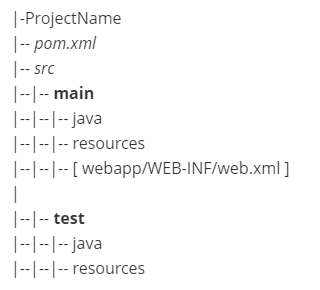
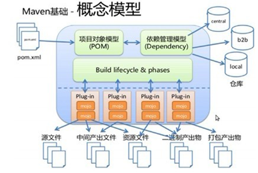

## Maven简介

Maven 是一个强大的 **Java 项目构建工具。** 对于其他语言也是可以的，但是主要是 Java，是由 Apache 开发的。
主要作用就是：**项目的构建和依赖管理**

项目构建体现在：在项目编码完成后，要对项目进行编译、测试、打包、部署；这些工作 Maven 都可以做到

依赖管理它的好处体现于：
不需要再导入 jar 包，大大降低了项目文件的占用大小（它会根据配置的“坐标”去 Maven 仓库里去寻找对应的 jar 包）

## 安装

Maven 是用 Java 开发的，所以它的运行需要 JDK 支持，和 Java（JAVA_HOME） 类似，只需要把解压后的目录放进环境变量就行了，名称可以叫 **MAVEN_HOME**，然后再配进 path 里
然后在 CMD 命令行中输入 `mvn -v` 测试下是否正常

## 配置本地仓库

Maven 仓库存的是各种各样的 jar 包，可以在本地搭建也可以在局域网中搭建，或者直接用互联网上的中央仓库

配置本地仓库去修改 Maven 目录下的 conf 目录下的 `settings.xml` 文件，将 localRepository 标签配好即可

## Maven项目目录结构

和一般的项目也没啥区别，都有 src 源码文件夹，只是多了一个 `pom.xml` 文件，这个是 Maven 项目的核心配置文件，里面可以配置 JDK 的版本、jar 包的相关信息

另外，Maven 下的 src 文件夹是有一定结构的，里面分为两个文件夹，main 和 test，从名字可以看出一个是主要，一个是测试；main 里面继续分，分为 java、resources(项目所需的配置文件) 和 webapp 文件夹；没有 lib 了，因为没有 jar 包什么事了

|-ProjectName
|-- *pom.xml*
|-- *src*
|--|-- **main**
|--|--|-- java
|--|--|-- resources
|--|--|-- [ webapp/WEB-INF/web.xml ]
|
|--|-- **test**
|--|--|-- java
|--|--|-- resources

Github 的渲染好像有点问题，那就来个图片：

## Maven常用命令

-   `mvn clean` 清理编译后的文件，也就是 targen 目录
-   `mvn compile` 编译；编译后的文件在 targen 目录下
-   `mvn test` 进行测试；运行测试目录下类的所有测试方法
    注意类名的规范：`xxxTest.java`
-   `mvn package` 打包；默认会先编译再进行测试，最后执行打包，如果是 web 项目会自动打成一个 war 包，放在 targen 目录下
-   `mvn install` 安装；把 jar 包安装到本地仓库中去，便于其他项目使用
    过程还是先编译再测试，然后打包，最后再安装。也可以说是打包到本地仓库
-   `mvn tomcat:run` 部署到 Tomcat （通过 war 包），并且启动

## Maven项目生命周期

在 Maven 中存在三套生命周期，它们相互独立，互不影响（不同周期里的命令不会互相调用），**在一套生命周期中，执行后面的命令，前面的命令会自动执行**

-   CleanLifeCycle：清理生命周期
    包含命令：clean
-   DefaultLifeCycle：默认生命周期
    包含命令：compile --> test --> package -->install -->deploy
-   siteLifeCycle：站点生命周期
    包含命令：site

## 依赖范围

依赖范围可分为：编译依赖范围、测试依赖范围、已提供依赖范围、运行依赖范围、系统依赖范围、导入依赖范围

|   依赖范围   | 对于编译有效 | 对于测试有效 | 对于运行有效 |     栗子      |
| :------: | :----: | :----: | :----: | :---------: |
| compile  |   √    |   √    |   √    | spring-core |
|   test   |   -    |   √    |   -    |    junit    |
| provided |   √    |   √    |   -    | servlet-api |
| runtime  |   -    |   √    |   √    |   JDBC 驱动   |
|  system  |   -    |   -    |   √    |      -      |
|  import  |   -    |   -    |   -    |      -      |

系统依赖范围通过 systemPath 显式指定；再说导入依赖范围，它不会对 classpath 产生影响。

依赖范围除了控制 classpath，还会对依赖传递产生影响。如果 A 依赖 B，B 依赖 C，则 A 对于 B 是第一直接依赖。B 对于 C 是第二直接依赖。 A 对于 C 是传递性依赖。**结论是：第一直接依赖的范围和第二直接依赖的范围决定了传递性依赖的范围。**

| 第一依赖\第二依赖 | compile  | test | provided | runtime  |
| :-------: | :------: | :--: | :------: | :------: |
|  compile  | compile  |  -   |    -     | runtime  |
|   test    |   test   |  -   |    -     |   test   |
| provided  | provided |  -   | provided | provided |
|  runtime  | runtime  |  -   |    -     | runtime  |

第一列是第一直接依赖，第一行是第二直接依赖，中间表示传递性依赖范围。
可以理解为：第一行为 B 和 C 的范围；第一列为 A 和 B 的范围；中间围起来的区域就是 A 和 C 的范围

## 传递依赖冲突

根据上面的传递依赖，比如项目同时依赖 A 和 B，A 又依赖于 C 并且版本是 1.0；B 也依赖于 C ，但是版本是 2.0；如果都导入肯定会发生冲突

Maven 会自动处理一些冲突，其遵循两个原则：

1.  第一声明者优先
    就是谁先定义的就用谁的
2.  路径近者优先
    如果在后面还有一个独立的 C 的依赖，那么就会安装这个独立的依赖（第一依赖）的版本来

或者可以手动**排除**掉其中一个，这样就相当于只有一个，具体在 **pom.xml** 文件中配置，使用 exclusion 标签

还可以进行**版本锁定**这样就能确保只使用某一个版本：使用的是 dependencyMangedent 标签；它只起一个锁定的作用，不会进行导入包操作

**注意：在 pom.xml 文件中可以定义属性，并且可以使用 OGNL 表达式，详细的栗子不表**

## 概念模型

用一幅图片来表示就是：

上面的部分是处理依赖关系，下面的就是项目构建了...

## 项目拆分

对于传统的 SSH 架构，可以对每一层进行拆分，然后还需要一个父工程来进行统一

### 关于父工程

创建父工程和创建普通的 Maven 项目一样，就是选择打包的时候选择 pom
**父工程不进行编码，只有一个 pom.xml 文件**
既然不进行编码，那么它的作用是什么呢？

1.  定义所需要的依赖信息，子模块可以直接继承使用
2.  将各个子模块聚合到一起

一般都是把父工程安装到版本库中去的，就是前面的 install 命令

**注意：创建子工程的时候就要选择 Module 了，新建模块！**

对于 service 和 dao 层，打成 jar 包就可以了，为了避免报错在 service 中引用 dao 层的依赖就行了，在 pom.xml 文件里配置，和一般的加依赖一样。执行的 install 命令其实就是打包到本地仓库啦~
对于 web 层，打包选择打 war 包

### 运行

运行调试的时候可以直接运行父工程，也可以运行 web 层的子工程，还可以传统方式部署到 Tomcat 运行

## 私服搭建

关于局域网（私服）的搭建工具可以使用 **nexus**
`nexus install/start` 可以安装、启动服务（nexus.properties 中可更改端口）

启动后可以通过浏览器来访问管理界面，默认账户、密码为：admin / admin123

仓库类型分为四种，一种已经废弃了，就不说了

-   hosted 宿主仓库
    一般存放本公司开发的 jar 包，包括正式版、测试版、第三方版等
-   proxy 代理仓库
    中央仓库（主仓库）以及 Apache 下的测试版本 jar 包
-   group 组仓库
    组嘛，可以包含其他的仓库，比如上面的两个

上传命令：`mvn deploy` ; 
当然在上传的前面需要先配置下 pom.xml 文件确定上传路径，还有在 Maven 客户端的配置文件中 写入认证信息（**settings.xml**）
下载同理，也需要配置本地找不到的时候从那个远程仓库去寻找找

需要配的东西有很多....都省了了，到时看看再补充吧

## 参考

[木杉](http://mushanshitiancai.github.io/2016/07/29/java/%E8%AF%B4%E8%AF%B4maven%E4%BE%9D%E8%B5%96%E5%86%B2%E7%AA%81-%E4%BE%9D%E8%B5%96%E8%B0%83%E8%A7%A3-%E4%BE%9D%E8%B5%96%E4%BC%A0%E9%80%92%E5%92%8C%E4%BE%9D%E8%B5%96%E8%8C%83%E5%9B%B4/)