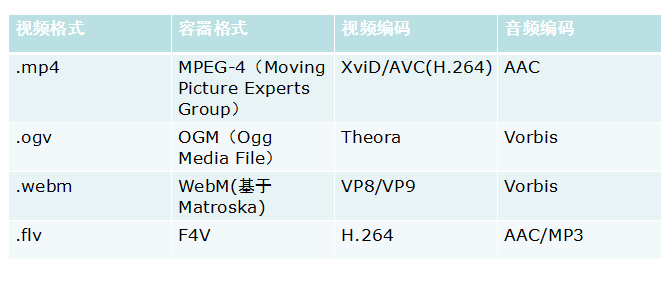
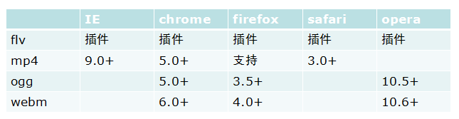

# HTML5中的视频播放

HTML5 留给我印象最深的之一就是 Video 标签了，毕竟之前在被 Flash 统治下确实非常难受，现在使用 HTML5 播放器别提多爽了。
但是，我对视频这块了解真的并不是很深，于是稍微研究了下。

## 预备知识

最近几年 HTML5 这个词越来越流行，但是别以为 HTML5 最近几年才开始出现，引用 WIKI 上的话：

> HTML 5 草案的前身名为 Web Applications 1.0，是在 2004 年由网页超文本技术工作小组（WHATWG）提出.
> 再于 2007 年获 W3C 接纳，并成立了新的 HTML 工作团队。
> 在 2008 年 1 月 22 日，第一份正式草案发布。

视频并非那么简单。不仅仅是浏览器需要理解 `<video>` 标签，而且需要一个必要的编码译码器来播放视频。明显的解决方法只能是 HTML 5 规范的缔造者们选择一个视频编码译码器，并且让每一个浏览器制造商执行。

总之，这就是所推荐的打算。同时，这也是引起混乱的导火索。对于各种各样编码译码器的争论就已经很烦杂了，但更悲剧的事情是，浏览器制造商们还不能就此达成统一。苹果不愿意使用提议的 Ogg Theora 编码译码器，但 Opera 和 Mozilla 也不愿意支付由于他们的浏览器装载 H.264 编码译码器而造成的许可费用。Google 同时支持两者，微软面对争论，远远的置身事外，因为他现在根本没有计划去支持 HTML 5 的视频元素。

面对浏览器制造商的僵持局面，HTML 5 善意的独裁者 Ian Hickson 甩了甩他的手并说到去他妈的。所以 HTML 5 规范中没有特别指名或规定的视频编码解码器。

后来 Googe 终于在 I/O 大会上发布了开源的视频封装格式 webM 和视频编码格式 VP8。Opera、Mozilla、Chrome 宣布将完全支持 VP8。
苹果决定不支持 VP8，乔布斯认为 VP8 在质量或效率方面不如 H.264，不能满足其产品的要求。另外最新消息表明 VP8 还有可能牵扯到专利的问题（如果真的侵犯专利的话，Opera 和 Firefox 估计马上会无视 VP8 的）。

> 说到媒体内容，就自然地需要谈到媒体的封装格式和编码格式，这里总结一下，原视频文件通过编码来压缩文件大小，再通过封装将压缩视音频、字幕组合到一个容器内.
>
> 我们可以把 `<video>` 标签看做拥有解封装和解码功能的浏览器自带播放器，视频通过**流媒体传输协议**（目前常用的有两种，MPEG-DASH 和 Apple 的 HLS）从服务器端分发给客户端；
> 媒体内容进一步包含在一层传输协议中，这样 `<video>` 就无法识别了。以 HLS 为例，将源文件内容分散地封装到了一个个 TS 文件中。
>
> 仅靠 `<video>` 标签无法识别这样的 TS 文件，那么就引入了 MSE 拓展来帮助浏览器识别并处理 TS 文件，将其变回原来可识别的媒体容器格式，这样 `<video>` 就可以识别并播放原来的文件了。
> 那么支持 HTML5 的浏览器就相当于内置了一个能够解析流协议的播放器。

### 关于视频编码

现在，最流行的视频格式是[H.264](http://en.wikipedia.org/wiki/H.264/MPEG-4_AVC)。它有很多优点，编码后生成的视频文件，体积较小，画质也不错。
蓝光技术（Blu-ray）就采用这种格式，眼下几乎所有的高清摄像机----不管民用的还是商业的----都使用它。互联网上的在线视频播放，采用它的比例也正在不断上升。

不过，H.264 是一种专利视频格式。它的专利被一家 MPEG-LA 公司控制，简单说如果要支持播放，就需要花钱（个人用户免费）。
为了推广 H.264，MPEG-LA 规定，只要你的视频用于互联网上的免费播放，就可以无偿获得使用许可证。这就是为什么 YouTube 可以免费使用 MPEG-LA 许可证的原因。而像 Netflix 这样的付费收看公司，就得不到这种优惠了。
关于专利问题还是很有意思的，感兴趣的可以搜一下，例如 [这一篇](http://www.ruanyifeng.com/blog/2010/05/html5_codec_fight.html) ，苹果微软也是专利池里的所以肯定会大力发展支持。

正事关于专利费的问题，于是有一些人他们决定自行开发一种没有专利的视频格式，生成的文件体积要与 H.264 相仿，画质也要差不多，这种格式就叫做 Theora，也就说所谓的 Ogg，但是会不会有专利侵权的问题不好说，与 Google 的 VP8 是一个道理，处于尴尬的地位。

下面用两张图来说明一下：

### 视频文件格式

视频文件格式实际上，我们常常称作为容器格式，也就是，我们一般生活中最经常谈到的格式，flv，mp4，ogg 格式等。**它就可以理解为将比特流按照一定顺序放进特定的盒子里。**
那选用不同格式来装视频有什么问题吗？ 答案是，没有任何问题，但是你需要知道如何将该盒子解开，并且能够找到对应的解码器进行解码。
我只是将视频理解为一个静态的流。试想一下，如果一个视频需要持续不断的播放，例如，直播，现场播报等。这里，我们就拿 [TS/PS](http://wolfcrow.com/blog/program-stream-vs-transport-stream-the-simple-difference/) 流来进行讲解。

- PS（Program Stream）: 静态文件流
- TS（Transport Stream）: 动态文件流

针对于上面两种容器格式，实际上是对一个视频比特流做了不一样的处理。

- PS: 将完成视频比特流放到一个盒子里，生成固定的文件
- TS: 将接受到的视频，分成不同的盒子里。最终生成带有多个盒子的文件。

那么结果就是，如果一个或多个盒子出现损坏，PS 格式无法观看，而 TS 只是会出现跳帧或者马赛克效应。两者具体的区别就是：**对于视频的容错率越高，则会选用 TS，对视频容错率越低，则会选用 PS。**

常用为：

- AVI：MPEG-2，DIVX，XVID，AC-1，H.264;
- WMV：WMV，AC-1;
- RM、RMVB：RV， RM;
- MOV：MPEG-2，XVID，H.264;
- TS/PS：MPEG-2，H.264，MPEG-4;
- MKV：可以封装所有的视频编码格式。

另外，可以得出，视频的文件格式只是一层皮而已，那些格式转换其实有更快速的方法，只要编码不变，并且格式相融，可以达到一秒换格式的目的，毕竟只需要换一层皮。

## 为什么HTML5普及慢

视频源存在兼容性问题。原生的 HTML5 `<video>` 元素在 Windows PC 上仅支持 mp4 （H.264 编码）、webm、ogg 等格式视频的播放。
而由于历史遗留问题（HTML5 视频标准最终被广泛支持以前，Flash 在 Web 视频播放方面有着统治地位），视频网站的视频源和转码设置，很多的高清源都是适用于 Flash 播放的 FLV 格式，只有少量低清晰度视频是 mp4 格式，webm 和 ogg 更是听都没听说过。比如之前优酷只有高清和标清才有 MP4 源，超清、1080P 等，基本都是 FLV 和 HLS（M3U8）的视频源（在 Windows PC 上支持 M3U8 比支持 FLV 更复杂，我们不做过多赘述）。

而腾讯视频，因为转型 MP4 比较早，视频源几乎全部都是 MP4 和 HLS，所以现在可以在 Mac OS X 上率先支持 PC Web 端的 HTML5 播放器（Safari 下 HLS、Chrome 下 MP4）。

但是 HTML5 是不是就真的没办法播放 FLV 等格式视频了呢？不是。解决方案是 MSE，Media Source Extensions，就是说，HTML5 `<video>` 不仅可以直接播放上面支持的 mp4、m3u8、webm、ogg 格式，还可以支持由 JS 处理过后的视频流！

这样我们就可以用 JS 把一些不支持的视频流格式，转化为支持的格式（如 H.264 的 mp4）。
B 站开源的 flv.js 就是这个技术的一个典型实现。B 站的 PC HTML5 播放器，就是**用 MSE 技术，将 FLV 源用 JS 实时转码成 HTML5 支持的视频流编码格式**（其实就一个容器的差异），提供给 HTML5 播放器播放。

一些人问我为什么不直接采用 MP4 格式，并表示对 FLV 格式的厌恶。这个问题一方面是历史遗留问题，由于视频网站前期完全依赖 Flash 播放而选择 FLV 格式；另一方面，如果仔细研究过 FLV/MP4 封装格式，你会发现 FLV 格式非常简洁，而 MP4 内部 box 种类繁杂，结构复杂固实而又有太多冗余数据。
FLV 天生具备流式特征适合网络流传输，而 MP4 这种使用最广泛的存储格式，设计却并不一定优雅。

## MediaSourceExtensions

根据上面的介绍，MSE 的主要工作是可以创建 media stream，并且喂给 video/audio 进行播放。
~~从此，前端可以和写 C++、Java 的人有了共同的话题：二进制流的操作。~~

> MSE 是实际上是一系列 API 的集合。它的全称为：`Media Source Extensions`，看名字差不多都可以知道，MSE 就是一系列接口的拓展集合，里面包括了一系列 API：Media Source，Source Buffer 等。

原生的 video 标签，只能满足一次播放整个曲目的需要，无法实现拆分/合并数个缓冲文件，MSE 使我们可以把通常的单个媒体文件的 src 值替换成引用 MediaSource 对象（一个包含即将播放的媒体文件的准备状态等信息的容器），以及引用多个 SourceBuffer 对象（代表多个组成整个串流的不同媒体块）的元素。
MSE 让我们能够根据内容获取的大小和频率，或是内存占用详情（例如什么时候缓存被回收），进行更加精准地控制。 它是基于它可扩展的 API 建立自适应比特率流客户端（例如 DASH 或 HLS 的客户端）的基础。

不过，iOS 的 Safari 是不支持 MSE 的，为了支持 iOS 设备，我们必须要使用 Apple 的 HLS 流媒体格式，这是苹果在 HTML5 中强推的另一种方式。Apple 并不喜欢支持开放标准（如 MSE），不过 Mac OSX 上的 Safari 还是支持 MSE 的。

## HLS与DASH

HLS （HTTP Live Streaming）, 是由 Apple 公司实现的基于 HTTP 的媒体流传输协议。HLS 以 ts 为传输格式，m3u8 为索引文件（文件中包含了所要用到的 ts 文件名称，时长等信息，可以用播放器播放）。

hls 实际会先通过 ajax（loader 是可以完成自定义的） 请求 **m3u8** 文件，然后会读取到文件的分片列表，以及视频的编码格式，时长等。
随后会按照顺序(非 seek )去对分片进行请求（ts 文件），这些也是通过 ajax 请求二进制的文件，然后借助 Media Source Extensions 将 buffer 内容进行合流，然后组成一个可播的媒体资源文件。

---

DASH（Dynamic Adaptive Streaming over HTTP） ，是一种在互联网上传送动态码率的 Video Streaming 技术，类似于苹果的 HLS，DASH 会通过 media presentation description (MPD)将视频内容切片成一个很短的文件片段，每个切片都有多个不同的码率，DASH Client 可以根据网络的情况选择一个码率进行播放，支持在不同码率之间无缝切换。

Youtube，B 站都是用的这个方案。这个方案索引文件通常是 mpd 文件（类似HLS 的 m3u8 文件功能），传输格式推荐的是 fmp4（Fragmented MP4）,文件扩展名通常为 .m4s 或直接用 .mp4。所以用调试查看 b站视频播放时的网络请求，会发现每隔一段时间有几个 m4s 文件请求。

---

HLS 和 MPEG-4/H.264 以及容器格式 TS/PS 是啥关系？

简单来说，没关系。

**HLS 根本就不会涉及到视频本身的解码问题。它的存在只是为了确保你的视频能够及时，快速，正确的播放。**

HLS 全称是 HTTP Live Streaming。这是 [Apple](https://developer.apple.com/streaming/) 提出的直播流协议。目前，IOS 和 高版本 Android 都支持 HLS。那什么是 HLS 呢？ HLS 主要的两块内容是 `.m3u8` 文件和 `.ts` 播放文件。接受服务器会将接受到的视频流进行缓存，然后缓存到一定程度后，会将这些视频流进行编码格式化，同时会生成一份 `.m3u8` 文件和其它很多的 `.ts` 文件。

- 服务器：后台服务器接受视频流，然后进行编码和片段化。
  - 编码：视频格式编码采用 H.264。音频编码为 AAC, MP3, AC-3，EC-3。然后使用 MPEG-2 Transport Stream 作为容器格式。
  - 分片：将 TS 文件分成若干个相等大小的 `.ts` 文件。并且生成一个 `.m3u8` 作为索引文件（确保包的顺序）
- 分发：由于 HLS 是基于 HTTP 的，所以，作为分发，最常用的就是 [CDN](https://cloud.tencent.com/product/cdn?from=10680) 了。
- 客户端：使用一个 URL 去下载 m3u8 文件，然后，开始下载 ts 文件，下载完成后，使用 `playback software`（即时播放器） 进行播放。

看到这里，基本对 HTML5 的视频这一块有了一定的了解吧。

## 关于直播

关于直播所用的视频格式，首先来看这个图：

然后目前基本采用的都是 RTMP 或者 FLV 方式。这里我就不多研究了，说到底不用 HLS 的原因就说延迟太大，但是在非直播下还是用的非常普遍的。

由于 html5 video 标签支持 mp4，要想也支持 flv，我们就要拆解 flv 了。
**由于 flv 容器封装的是 H264+AAC**，所以我们可以在网页端收到 flv 后，使用 js 代码解析 flv，取出 H264 以及 AAC，然后封装成 mp4 文件，再喂给 video 标签就可以了。
这样我们就可以无插件播放 flv 了，由于 mp4 封装比 flv 复杂多了，所以这样可以减轻服务器压力，服务器不用再专门封装 mp4 文件。
前面说到 youku 用的 hls，跟 flv 类似，也需要一个 js 插件把 hls 转成 mp4。

## 参考

https://shawphy.com/2011/01/how-do-html5-birth.html
https://www.jianshu.com/p/1bfe4470349b
https://cloud.tencent.com/developer/article/1020510