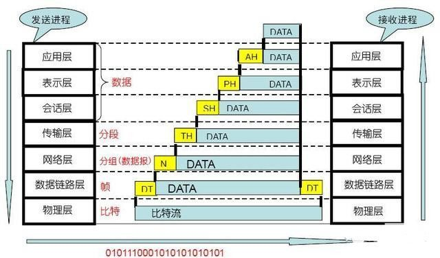

# Socks

SOCKS 是一种网络传输协议，主要用于**客户端与外网服务器**之间通讯的**中间传递**。SOCKS 是 "SOCKetS" 的缩写。

当防火墙后的客户端要访问外部的服务器时，就跟 Socks 代理服务器连接。**这个代理服务器控制客户端访问外网的资格**，允许的话，就将客户端的请求发往外部的服务器。

> 该协议设计之初是为了让有权限的用户可以穿过过防火墙的限制，使得高权限用户可以访问外部资源。
>
> socks 协议的设计初衷是在保证网络隔离的情况下，提高部分人员的网络访问权限，但是国内似乎很少有组织机构这样使用。
>
> 但是由于 socksCap32 和 PSD 这类软件，人们找到了 socks 协议新的用途：突破网络通信限制，这和该协议的设计初衷正好相反。

这个协议最初由 David Koblas 开发，而后由 NEC 的 Ying-Da Lee 将其扩展到版本 4。最新协议是版本 5，与前一版本相比，增加支持 UDP、验证，以及 IPv6。

根据 OSI 模型，SOCKS 是会话层的协议，位于表示层与传输层之间。

## 起源

最早，整个互联网采用的是盲目信任的方式进行连接和组织的。当时，专家们在聚会的时候，讨论的都是怎么让网络更加简单和高效，一台主机在网络上到底怎么才能更可靠的被别的主机所连接。一直到 1988 年，一个叫做 Morris 的蠕虫，给整个互联网一记重拳，后来大家讨论将一个子网络接入到互联网的时候，安全也成了一个必须要讨论的重要话题。

不过，提升网络的安全性可没有什么容易的办法，想出来的大部分办法都是通过减少内网服务器向公网暴露的机会，来最小化攻击的概率，也就是我们常喜欢用的“最小原则”，如果没有必要，就不进行授权。很多网络在接入互联网的时候，都选择了单一出入口的方式。将本地的子网络，置于防火墙的保护之后，再接入到互联网，如此一来就极大减少了被攻击的机会，网络的安全性自然就提高了。

但是本地网络置于防火墙之后，再访问外部网络的资源就会非常不便。为了解决这个问题，人们想出了各种方案。内外网隔离（笨拙，使用极其不便，但是维护成本很低），单一机器授权（只有一台机器可以和外网进行双向访问，使用仍然非常不便，而且维护成本高昂，因为有很多用户的访问权限要分配和收回），还有安全路由器（常见的一种策略是允许所有的出口流量，但是对进口流量禁止所有 1024 以下端口的访问，这种策略的问题是，一旦路由被攻破，整个网络就置于威胁之下）。

在这些方案之外，代理防火墙（Proxy Firewall）解决方案就被提出来了。路由器是在 OSI 模型的“网络层”进行安全过滤，可以降低客户端的成本，但是不够完善，维护起来也比较困难，估计当年的硬件不像现在可以随意修改配置吧。代理防火墙的方案，平衡了使用的便捷和维护的复杂度，是一种折衷。

代理防火墙工作在 OSI 模型的“会话层”，**也就是“传输层”和“应用层”中间的地方**。著名的 SOCKS 就是这样一种“解决方案”。**它是一种非常轻薄的解决方案**，在客户端，提供了一套开发类库，叫 SOCKS 库，对照着标准 socket 的 API，提供了五个 API 函数，名字跟 socket 的一样，只是用 R 作为前缀。

在服务器端，提供了一个叫做 sockd 的伺服软件，这个软件部署在防火墙系统所在的一台主机上，通过简单的配置文件就可以**完成应用层的过滤**（正因为它处于会话层，所以非常方便处理应用层过滤），允许或拒绝哪些目的地址和端口被接入，是非常容易维护的，给网络管理员带来了极大的方便。

在 1992 年公布之前，SOCKS 解决方案已经在 MIPS 内部使用了长达三年之久，没有遇到明显的问题和瓶颈，所以 David 认为这是一个久经烤验的成熟方案。

## 发展

 SOCKS 最初提出的时候，其性质是一个解决方案，包含一个类库和一个服务端后台伺服程序。但是，NEC 公司的李英达？（Ying-da Lee），看到了它的优美之处，把它提炼出来，**发展成了一种协议**，变得更加通用，而且，大家都可以根据协议提出自己的实现。这位李同学，提出了 SOCKS 协议的第四个版本。也是流传非常广泛的版本。

从李同学开始，SOCKS 的定位也变得非常明确，就是**在防火墙服务器上，提供一种 TCP 会话的转发，允许用户可以透明的穿透防火墙的阻拦**。

这种协议的优势在于，它完全独立于应用层的协议，可以用在很多的场景，telnet，http，ftp 都不在话下，并且可以在 TCP 会话开始之前，完成访问权限的检查，之后只要做来回往复的转发即可。而且**由于此协议完全不关心应用层的协议，所以应用层通信可以加密，保护自己通信的内容不被代理所看到**。

最新协议是版本 5，与前一版本相比，增加支持 UDP、验证，以及 IPv6。

## 与HTTP代理的对比

SOCKS 工作在比 HTTP 代理更低的层次：SOCKS 使用握手协议来通知代理软件其客户端试图进行的连接 SOCKS，然后尽可能透明地进行操作，而常规代理可能会解释和重写报头。

虽然 HTTP 代理有不同的使用模式，CONNECT 方法允许转发 TCP 连接；然而，SOCKS 代理还可以转发 UDP 流量和反向代理，而 HTTP 代理不能（HTTP 本质使用的是 TCP 协议），socks 不管应用层是什么协议，只要是传输层是 TCP/UDP 协议就可以代理。

socks 支持多种用户身份验证方式和通信加密方式。

## 不足

由于承担了额外的验证协商的功能，导致 SOCKS5 在建立的时候，需要额外消耗多达三次握手，如果不需要验证身份，也需要两次握手，这就增加连接时候的延迟。

另外，因为 SOCKS5 协议本身完全不关注应用层的内容，所以，客户端和目标服务器的通信，加密完全依赖客户端和服务器的通信协议，如果服务器使用的是 HTTP 协议，那么通过代理走的流量，就相当于是明文在内网传输。安全性上不是很高。

不过，我们可以通过在外面包裹一层 TLS 来解决这个问题，就形成了 SOCKS5 over TLS 的解决方案，有效加密了通信的内容。TLS 负责加密连接，SOCKS5 负责代理协议控制。

互联网上已经公布了 SOCKSv6 的草案，主要内容就是 SOCKS5 的问题修复，第一个就是多次握手已经不太适用于移动互联网和卫星通信等网络环境，需要被优化。客户端会尽可能多的发送信息给服务器，并且要求创建 socket 之前，不等待验证的结论等等

## 端口映射与端口转发

端口映射是 NAT 的一种，功能是**把在公网的地址转翻译成私有地址**

端口映射就是将外网主机的 **IP 地址的一个端口映射到内网中一台机器**，提供相应的服务。当用户访问该 IP 的这个端口时，服务器自动将请求映射到对应局域网内部的机器上。**端口映射有动态和静态之分**。

当用户访问提供映射端口主机的某个端口时，服务器将请求转移到本地局域网内部提供这种特定服务的主机；利用端口映射功能还可以将一台外网 IP 地址机器的**多个端口映射到内网不同机器上的不同端口**。

端口映射功能还可以完成一些特定代理功能，比如代理 POP，SMTP，TELNET 等协议。理论上可以提供 65535（总端口数）- 1024（保留端口数）= 64511 个端口的映射。

---

端口转发（Port forwarding），有时被叫做**隧道**，是安全壳（SSH） 为网络安全通信使用的一种方法。端口转发是**转发一个网络端口从一个网络节点到另一个网络节点的行为**，其使一个外部用户从外部经过一个被激活的 NAT 路由器到达一个在私有内部 IP 地址（局域网内部）上的一个端口。

---

端口转发应该是将**发送到内网机器指定端口**的数据丢给**另外一个**机器的**某个端口**，在转发的过程可以对数据包进行修改和检查；

端口映射就跟路由器一样，你要提供 WEB 服务，那么就得先映射 80 端口，外部用户通过 80 端口访问你的 WEB 服务（外部用户访问 80 端口，就会被翻译为内网 ip 的端口），映射过程只能源数据传输。

## 参考

https://sexywp.com/socks-protocol.htm