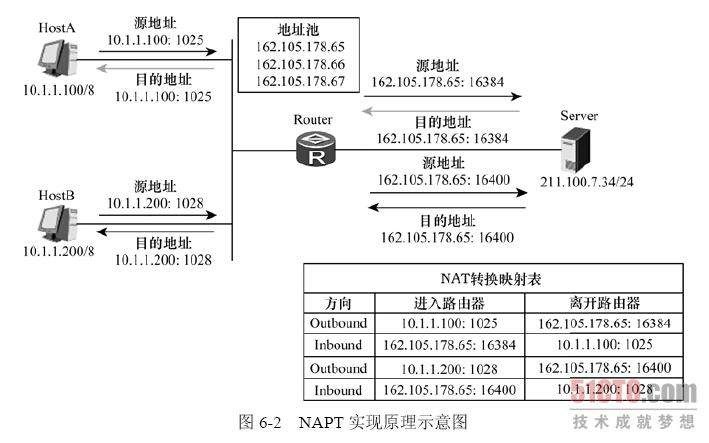

# 内网穿透

在我国，由于网民众多，运营商无法保证为每一个宽带用户提供全球唯一的公网IPv4地址。因此很多用户会发现通过路由器端查看到的WAN端IP与百度“IP”关键词所得到的IP不一致，并且前者的IP为一个私有IP。

而还有一些情况下，公网IP比较昂贵，企业虽然本身也持有少量的独立的公网IP，但是由于成本限制无法为企业内每一台主机都提供一个公网IP，或者内网并不是所有服务都需要暴露到公网中进行访问，那么企业有可能就会使用NAT技术将大量的内网IP通过一定规则映射到公网IP上。而最常见的其中一种技术就是NAPT，也叫“网络端口地址转换”。因为一般一个服务都是通过一个端口来提供，因此通过这种方式可以将特定的服务通过特定的规则开放到少量的公网IP上。

国内家庭宽带 常见的就是100开头的地址，公司学校的网络也可能如此，这种情况无法通过**端口映射DMZ**等方法让内网设备暴露给外网，只能通过内网穿透方式。

## 什么是NAT

在计算机网络中，网络地址转换（Network Address Translation，缩写为NAT），也叫做网络掩蔽或者IP掩蔽（IP masquerading），是一种在IP数据包通过**路由器或防火墙**时重写来源 IP 地址或目的 IP 地址的技术。

这种技术被普遍使用在有多台主机但只通过一个公有 IP 地址访问因特网的私有网络中。根据规范，路由器是不能这样工作的，但它的确是一个方便且得到了广泛应用的技术。当然，**NAT 也让主机之间的通信变得复杂，导致了通信效率的降低**。

NAT 最初发明的一大目的就是解决公网 IP 的 IPv4 地址资源枯竭的问题，所以国内大城市的主流运营商经常会使用这种方法来规避资源枯竭的问题（我国普及 IPV6 可能还需要一定时间），端口 NAT 转换让 IP 地址得到了极大的利用，NAT 的一个特点就是：**对外隐藏了真实地址**

在一个典型的配置中，一个本地网络使用一个专有网络的指定子网（比如192.168.x.x或10.x.x.x）和连在这个网络上的一个路由器。这个路由器占有这个网络地址空间的一个专有地址（比如192.168.0.1），同时它还通过一个或多个因特网服务提供商提供的公有的IP地址（叫做“过载”NAT）连接到因特网上。当信息由本地网络向因特网传递时，源地址从专有地址转换为公用地址。由路由器跟踪每个连接上的基本数据，主要是目的地址和端口。当有回复返回路由器时，它通过输出阶段记录的连接跟踪数据来决定该转发给内部网的哪个主机；如果有多个公用地址可用，当数据包返回时，TCP或UDP客户机的端口号可以用来分解数据包。

当然它是有一些缺点的，**一些需要初始化从外部网络创建的TCP连接和无状态协议（比如UDP）无法实现。除非NAT路由器管理者预先设置了规则，否则送来的数据包将不能到达正确的目的地址。**

在一定程度上，NAT依赖于本地网络上的一台机器来初始化和路由器另一边的主机的任何连接（~~一般的家居路由器就充当这个角色，路由器会给自己分配一个内网地址，一般是 192.168.1.1~~），它可以阻止外部网络上的主机的恶意活动。这样就可以阻止网络蠕虫病毒来提高本地系统的可靠性，阻挡恶意浏览来提高本地系统的私密性。很多具有NAT功能的防火墙都是使用这种功能来提供核心保护的。另外，它也为 UDP 的跨局域网的传输提供了方便。

> 假设我的 PC 机是 192.168.1.100，我的手机是 192.168.1.101，与百度通信的公网 IP 都是 1.1.1.1，但百度服务器无法直接从 IP 判断我访问的设备，这就导致了外网 IP 不能直接地对内网设备发起通信。
>
> 我们可以先对公网设备发起通讯，对方的回复会通过路由器发给我们，但是公网里的主机无法主动跟我们通讯，比如我们的电脑就不能作为 web 服务器，当用户访问 1.1.1.1 的时候，路由器并不能区分到底访问的是那个设备。

### 基本网络地址转换(Basic NAT)

这一种也可称作 NAT 或“静态 NAT”，在 RFC 2663 中提供了信息。它在技术上比较简单，仅支持地址转换，不支持端口映射。

Basic NAT 要求对**每一个当前连接都要对应一个公网IP地址**，因此要维护一个公网的地址池。宽带（broadband）路由器通常使用这种方式来允许一台指定的设备去管理所有的外部链接，甚至当路由器本身只有一个可用外部IP时也如此，这台路由器有时也被标记为 **DMZ主机**。

由于改变了 IP 源地址，**在重新封装数据包时候必须重新计算校验和**，网络层以上的只要涉及到IP地址的头部校验和都要重新计算。

Basic NAT 要维护一个无端口号NAT表，结构如下:

| 内网IP          | 外网IP            |
| ------------- | --------------- |
| 192.168.1.55  | 219.152.168.222 |
| 192.168.1.59  | 219.152.168.223 |
| 192.168.1.155 | 219.152.168.224 |

### 网络地址端口转换(NAPT)

**这种方式支持端口的映射，并允许多台主机共享一个公网 IP 地址。**

支持端口转换的 NAT 又可以分为两类：**源地址转换和目的地址转换**。

前一种情形下发起连接的计算机的 IP 地址将会被重写，**使得内网主机发出的数据包能够到达外网主机**。

后一种情况下被连接计算机的 IP 地址将被重写，**使得外网主机发出的数据包能够到达内网主机**。

实际上，以上两种方式通常会一起被使用以支持**双向通信** ，~~该技术应用于内部网络主机地址与公网上主机地址重叠的情况。~~

NAPT 维护一个带有 IP 以及端口号的 NAT 表，结构如下:

| 内网IP              | 外网IP                 |
| ----------------- | -------------------- |
| 192.168.1.55:5566 | 219.152.168.222:9200 |
| 192.168.1.59:80   | 219.152.168.222:9201 |
| 192.168.1.59:4465 | 219.152.168.222:9202 |

> 简单说：
>
> 在 NAT 网关上会有一张映射表，表上记录了**内网向公网**哪个 IP 和端口发起了请求，然后如果内网有主机向公网设备发起了请求，内网主机的请求数据包传输到了 NAT 网关上，那么 NAT 网关会修改该数据包的**源** IP 地址和**源**端口为 NAT 网关自身的 IP 地址和任意一个不冲突的自身未使用的端口，并且把这个修改记录到那张映射表上。
>
> 最后把修改之后的数据包发送到请求的目标主机，等目标主机发回了响应包之后，再根据响应包里面的目的 IP 地址和目的端口去映射表里面找到该转发给哪个内网主机。
>
> 这样就实现了内网主机在没有公网 IP 的情况下，通过 NAPT 技术借助路由器唯一的一个公网 IP 来访问公网设备。

说一下它的特点吧，也可以说是 NAT 的特点：

1. 网络被分为私网和公网两部分，NAT 网关设置私网到公网的路由出口.
2. 网络只能由私网侧发起，公网无法主动访问私网主机 (是这样设计的,但是可以通过打洞的方式，就是内网穿透)
3. NAT 网关在两个访问方向上完成两次地址的转换，出口替换源地址，入口替换目的地址
4. NAT 网关的存在对通信双方保持透明
5. NAT 网关为了实现双向翻译，需要维持一张关联表，将会话信息保存

从这里我们可以看到，**NAPT 只解决了内网主机在没有公网 IP 的情况下如何访问公网主机的问题，但是并不能解决公网主机如何主动向内网主机发起请求的问题。**

### 其他用途

NAT 还可以用作负载均衡、失效终结、透明代理等。

## 关于私有地址

复习下网络方面的知识，这个肯定都学过，至于还记不记得.....

因特网域名分配组织 IANA 组织（Internet Assigned Numbers Authority）保留了以下三个 IP 地址块用于私有网络。

10.0.0.0 - 10.255.255.255 (10/8比特前缀)

172.16.0.0 - 172.31.255.255 (172.16/12比特前缀)

192.168.0.0 - 192.168.255.255 (192.168/16比特前缀)

主流的家用路由器使用 C 类私有地址作为路由器 LAN 端的 IP 地址较多，所以我们可以看到路由器设置页面的 IP 一般都为 192.168 开头。

一些大型企业就需要使用B类甚至A类地址段作为内部网络的地址段。A类地址的容量最大，可以容纳16777214个主机，B类地址可以容纳65534个主机，C类地址可以容纳254个主机。

## 为什么要内网穿透

先说说家庭宽带的情况吧。家庭宽带如果没有公网 IP，那么意味着你在本机上监听的任何端口，都只能在本机网卡所在的网络中访问，这个网络一般是路由器 LAN 端所在的网络。如果没有做特定的映射规则，那么路由器 WAN 端所连接到的网络将无法正常访问该主机提供的服务。

如果这种情况下想要让 WAN 端（如果运营商为你分配了公网 IP，那么 WAN 端所连接到的网络通常就是公网），那么需要**在路由器上做端口映射**。比如说路由器的 LAN IP 为 192.168.1.1，WAN IP 为23.23.23.23，我想让内网 192.168.1.2 主机的 80 端口提供的 HTTP 服务器直接能够在公网中通过 `http://23.23.23.23` 访问，那么就要将 `192.168.1.2:80` 映射到 `23.23.23.23:80` 上。

但是通常情况下，运营商是不会给普通用户公网IP的。那么用这种方法映射，在公网仍然是无法访问的，因为你的路由器WAN端连接的又是运营商更上一级的路由器LAN端，严重一点，甚至是层层连接最后才到公网，这种行为称作**流量穿透**。国内某电，某动的宽带就有大量这种行为。通过流量穿透的方式来提供的宽带服务，看似便宜，实则影响很大，由于大家公用一个IP，可能会导致很多网站的反SPAM策略伤及无辜，或者内部为了节省带宽，使用缓存，导致一些不该缓存的敏感安全页面被缓存起来，甚至导致部分网站缓存失效完全打不开。

有的人发现，即使自己有公网IP，但是仍然无法通过常规方法架设服务器，这是怎么回事呢？这是运营商为了防止个人随意开设各种非法服务，也防止黑客通过扫描器进行抓鸡和批量扫描，将一些常用端口进行了封禁，比如说我们这的中国电信就将 80，8080 等端口封禁了。这样封禁，虽然一定程度上保证了我们的网络安全，比如说前段时间的勒索病毒正因为国内大部分用户没有独立的公网IP，并且操作系统最容易爆发漏洞的一些，135，139 等端口被运营商封禁了，使得国内个人家庭电脑中招的概率小了很多；但是导致即使有公网IP，也无法使用常用端口向外网提供服务，只能更换到其他端口。这样有什么不好呢？比较典型的问题就是WEB网站默认使用80端口，那么在输入网址的时候可以不用带上端口号，显得比较美观。

还有的时候我们在对企业做渗透测试的时候，发现企业某台公网服务器只对公网开放了常见的 80 端口，而我们提权时需要用到的3389等端口没有对公网开放，这个时候又该怎么办呢？

如果我们没有一台公网服务器，我们可以使用国内大名鼎鼎的“花生壳”，“nat123”等服务来实现，但是他们背后的原理是什么呢？

我们如果在自己拥有一台具有公网IP服务器的情况下，我们可以借助这台公网IP服务器提供服务。解决这些问题的方式就是内网穿透了。

## 内网穿透原理

先假设我们自己有一台**公网服务器**，他的 IP 为 45.45.45.45。我们又有一台内网服务器 IP 为 23.23.23.23.我们现在想把23.23.23.23:80，即内网服务器上的 HTTP 服务开放到 45.45.45.45 上。

最简单粗暴的方式就是，我们可以直接将整个内网服务器环境在公网服务器上重新搭建一遍。

但是这样做很麻烦，我们有的时候并不想这样做，我们只是想简单的**借助公网服务器的网络来发布一个内网服务**。

前面我们通过 NAPT 原理得知：

NAPT 实现了内网主机在没有公网 IP 的情况下访问公网主机。那么我们可以这样做：

假设分配的公网 IP 为 23.23.23.23，内网IP为 192.168.1.2。公网主机（45 那台）先监听 80 端口，监听这个端口是用于向外部提供一个 HTTP 服务。

同时其他任意一个端口（这里我们假设为 7777），监听这个端口是用于**让内网服务器主动连接进来打通一个隧道** ，使用心跳连接来维持，这样看起来就像公网主机直接向内网主机发送消息。接着内网再主动向公网主机（45 那台）的 7777 发起一个请求，这样内网就成功与公网主机建立了一个连接通道。

然后当有任何客户端主动连接公网的 80 端口时，公网接收到连接请求之后马上把这连接请求通过先前建立好的隧道转发到内网主机，内网主机接收到来自隧道的数据包后再主动连接内网主机自身的 80 端口，连接成功之后将数据包原封不动地转发数据包给 80 端口，待 HTTP 服务器程序处理完这个数据包，生成了响应报文之后再原路转发回去，最终到达公网的 80 端口，然后返回给最开始请求公网服务器 80 端口的客户端。

看起来是不是比较绕呢？事实上大名鼎鼎的花生壳内网版以及nat123等内网穿透工具的原理基本就是如此，但是并不完全是这样。因为一个运输层端口只能同时提供一种服务，但是我们会发现花生壳这种内网穿透服务是借助一个公网IP同时给很多用户提供了服务，这是因为花生壳在流量转发这一层上并不是像我之前所说的原封不动的将报文进行转发，而是在转发之前加了一些控制协议的内容，用于指明该转发到哪个花生壳客户端所在的内网主机上。前者这种原封不动的转发方式通常叫做透明传输或者透明代理。

这种方法基本适用于所有的网络环境，只要你的设备能上互联网，前提是你得拥有一台拥有"公网IP"的主机充当"跳板"

## 穿透防火墙

为了安全起见，通常会在网络中加入防火墙，防火墙有入站规则和出站规则。如果不是非常严格的安全管控，通常是不会设置出站规则的，但是入站规则一般都会设置的，比如说外部可以通过80端口传入内网的WEB服务器访问网页，但是不能通过3389端口登陆内网的远程桌面。

而在内网渗透的过程中碰到这种情况，我们也可以借助上面内网传统的方式实现穿透防火墙的入站规则。因为防火墙通常只拦截了入站，没有拦截出站，那么我们可以让内网服务器主动出站（主动连接到黑客的服务器），与黑客自己的服务器打通隧道，最终绕过防火墙连上3389远程桌面。

还有一种情况就是我们已经拿下了内网其中一台并没有做任何防火墙规则的白名单服务器，但是我们想连上内网另一台做了入站规则的目标服务器，那么我们可以让这台白名单服务器作为一个跳板，让他先监听自身任意一个端口，然后在有任何用户连上这个端口之后，白名单服务器就主动连上内网的目标服务器，然后借助这台白名单服务器打通黑客和目标服务器的连接隧道。

而在黑客工具中大名鼎鼎的lcx原理也就是如此，前者的实现是lcx的listen和slave命令，后者的实现是lcx的tran命令。

> IP隧道是指一种可在两网络间用网际协议进行通信的通道。在该通道里，会先封装其他网络协议的数据包，之后再传输信息。
>
> 在IP隧道中，每个IP包、来源/目的地址信息都被封装在一个数据包中，该数据包用于实际物理网络传递。
>
> 因为防火墙的本质及原始数据报文被隐藏了，IP 隧道经常用于绕过简单的防火墙规则，通常需要通过内容控制软件才能对 IP 隧道进行筛查。

## 其他方案

除了内网穿透这个通用的解决方案，还有些其他方案也可以做到，毕竟内网穿透需要一台服务器做跳板是有点成本的。

但如果 ISP 给你分了个内网 IP ，你就只能用内网穿透的方案了。

### DDNS

在路由器的管理界面应该看到过，由于运营商分配的IP地址不断变动，直接操作这个变动的IP地址是相当麻烦的，而操作一个不变的域名（bfchengnuo.com）是相当方便的，DDNS的原理就是内网设备（一般是路由器）每隔一段时间对DDNS服务器发起请求，DNS服务器将**请求的IP**记录下来并且刷新相关 域名的解析记录（一般是A记录），这样每次拨号怎么变动 ，域名bfchengnuo.com总是指向路由器所分配的公网IP。

这个对拥有“公网IP”的宽带才有作用，对于没有“公网IP”的宽带没啥作用，因为拥有"公网IP"的这台网关设备在运营商机房里，你一般没有权限对它进行端口映射等操作。

一般DDNS服务都是免费的，常见的路由器里会集成。

另外DNS解析服务商，国内常见的alidns，cloudxns，dnspod都开放管理域名解析的API，可以定时运行脚本进行DDNS，不过API请求的间隔时间是有限制的。

不过让我想到了以前玩远控时候用的动态域名，肉鸡上线后会自动链接这个域名，然后通过 DDNS 就相当于都在链接你的电脑了（不过需要先进行端口映射，直接拨号上网并且分配的是公网 IP 的话就不需要了）。

应用：解决很多网络视频服务器和网络摄像机通过远程访问时需要一个固定的IP，在家搭建 web 服务器（如果 80 没被封的话）等。

### 端口映射&DMZ

这个方法适用于对公网 IP 网关设备具有控制权并且拥有完整的路由转发。

端口映射的教程网上都找得到，一般拿到"公网IP"的电信宽带(亲测)基本可以，拿不到就去投诉，国内基本上也是“不包含80端口的公网IP”，也就是说，如果你想架设 Web 服务器且不想改变默认端口，那就必须使用内网穿透80

---

至于 DMZ ，因为外网客户端无法直接访问内网的主机，当配置了 DMZ 主机后所有的请求路由器都会直接转发给配置的 DMZ 主机（可以是内网主机）。

在一些家用路由器中，DMZ是指一部所有端口都暴露在外部网络的内部网络主机，除此以外的端口都被转发。严格来说这不是真正的DMZ，因为该主机仍能访问内部网络，并非独立于内部网络之外的。但真正的DMZ是不允许访问内部网络的，DMZ和内部网络是分开的。

###  自建

如果你手上有闲置的 vps，一样可以使用：

- frp(推荐，项目一直在维护)
- ngrok(原作者弃坑)

## 其他

外网的主机无法主动访问内网，这个不是绝对的，比如有个协议叫 P2P .......像 QQ 的视频聊天等都是通过这个来进行穿透的。

对于 QQ 来说，实现应该要简单的多，因为必须要登陆，也就是必须要首先访问公网的服务器，然后服务器会记录 公网IP/内网IP 和端口号，这样两个人直接 P2P 就能找得到映射了。

至于 P2P 是如何穿透 NAT 的其他方法，这个感兴趣的可以搜搜看看。

## 参考

https://www.jianshu.com/p/a6713687bc1d

https://zh.wikipedia.org/wiki/nat

https://zhuanlan.zhihu.com/p/30351943

https://www.sfantree.com/publicip_note/index.html

https://www.zhihu.com/question/30471829