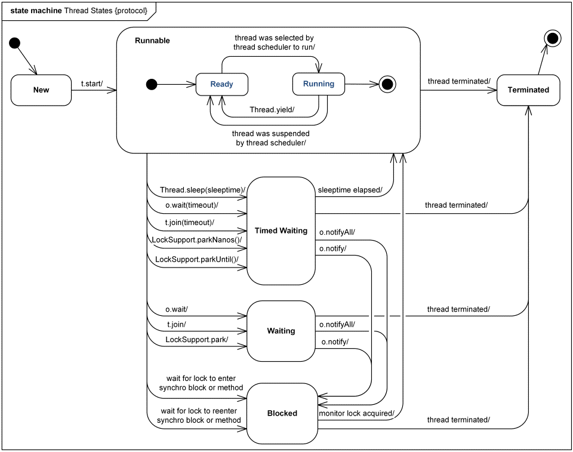

# 操作系统之虚拟存储器&并发编程

> 资料来源：刘哥编程提高课程以及码农翻身微信公众号 

其实就是我们经常所说的虚拟内存（可不是win下配置的那个虚拟内存）。

虚拟存储器的目标：

- 将内存看作硬盘的高速缓存
  - 内存中只保存程序的活动区域
  - 根据需要在硬盘和内存直接传送数据
- 为每一个进程提供一个一致的地址空间
- 保护每一个进程的地址空间不被其他进程破坏

## 关于逻辑地址

然后来看一个问题，由于并发的技术，内存中会装载多个程序，当程序执行完后就释放，如果使用物理地址，维护是很麻烦的，很容易就导致程序操作中地址的冲突，为了解决这个问题可以使用抽象地址：


CPU操作逻辑地址，通过内部的基址寄存器（内存管理单元实现）找到真正的物理地址，再进行操作；

基址寄存器保存了每个程序的开始的物理地址，当操作系统装载程序进内存的时候，基址寄存器就记录了这个程序的开始地址，也就是说，当程序切换时，基址寄存器也在变化。

这样就不管你真实的物理地址了，我操作200这个地址是相对于这个程序的开始地址说的，直接从基址寄存器里找到然后加上逻辑地址就是真实的物理地址了（假设程序载入的内存是连续）

## 分页处理

当程序太大时，一次不可能全部装入内存，多是采用局部性原理来分块装入，这时候就需要进行分页了，这样在物理内存中是不连续的，在虚拟内存中确是连续的：


他们之间通过一个页表来连接，根据局部性原理，有可能一个程序只需要几页数据就能跑的很好，会省不少空间；

上图中，如果读取了第四页的数据，但是在页表中发现没有对应的物理内存地址，于是就会发出一个IO指令，把数据从硬盘读取到内存中来。

CPU处理分页的逻辑地址大体是这样的：


- 每一个进程都会有一个页表，也起到了隔离的作用。

  所以一个进程只能访问自己的地址范围内的数据。

- MMU的处理速度非常快，使用的是硬件缓存：转换缓冲区（TLB）
- 当页表非常大的时候就需要采用多级页表、反向页表等技术来解决了

## 页面的置换

内存是有限的，不可能把所有的页面都装进来，当内存满了并且还缺页的时候就需要页面的置换了，关于如何置换有多种算法，比如FIFO、LRU（最近最少使用）

关于LRU确实可以好好看看。


类似于栈，但绝对不是栈，因为它可以对某个值进行提升。实现可以用双向链表来做。

但是呢，LRU用硬件实现是比较困难的，所以为了方便，搞出来了个近似的算法：Clock算法：

LRU 算法的近似实现：Clock算法

- 每个页加一个引用位，默认值为 0，无论读还是写，都置为 1
- 把所有的页组成一个循环队列
- 选择淘汰页的时候，扫描引用位，如果是 1 则改为 0（相当于再给该页一次存活的机会），并扫描下一个；如果该引用位是 0，则淘汰该页，换入新的页面。


## 分段

一个程序在内存中是分段存储的，这样也便于管理，和分页很相似，一个进程中的多个线程是共享这些数据的。


基址就是开始地址。

## 段页结合

最后的终极方案就是段页结合：


对于程序员分页不可见，那是硬件上关心的，我们只要做好分段就行了。

相当于是做了两次转换，第一次根据段号和偏移得出一个新的逻辑地址（中间会有校验，比如看看偏移是否超过了长度，是否可写），然后根据这个新的逻辑地址再去分页表查真正的物理地址。

## Linux中的虚拟存储器

和上面的流程类似，方向都是一样的，也好理解。


Linux的缺页处理：

1. MMU 试图翻译一个虚拟地址 A，触发了一个缺页处理

2. 虚拟地址 A 是合法的么？
  - 如果 A 在某个区域地址内（vm_start ，vm_end）
  - 如果不存在，segement fault！ 段错误

3. 进程是否可以读、写、执行这个区域内页面的权限？
  如果没有权限，触发保护异常。
4. 开始真正的缺页处理，从硬盘装载数据，修改页表

# Java并发编程

## 进程和线程


在多线程的进程中，每个线程都有自己的一套寄存器和堆栈（当然是逻辑上的，物理上只有一个），因为有虚拟内存的原因，每个程序都认为是自己独享了所有内存，因为逻辑地址嘛~~~

可以看出它们是共享代码和数据的，所以在多线程编程中会需要考虑数据共享的问题，是比较复杂的。

## 多线程的实现

**第一种：完全在用户层实现**


也就是一个用户层面的进程对应一个内核空间的进程，这样的好处是非常快，因为是一一对应的，缺点就是如果一个线程受到了阻塞（比如IO操作），系统会认为你整个进程被阻塞了，然后就可能会把你挂起。

**第二种：**


这种方案用户层面的一个线程对应内核层面的一个线程，最后统一分配给某个CPU去执行。

它需要创建两个栈，一个是用户层面，一个是内核层面；

由于每创建一个线程就要在核心里搞一个，开销太大，一般也不会采用。

**第三种：**


简单看来就是第二种的优化版本，这样就能达到相对平衡。

想深入了解其中是如何映射的需要去看操作系统相关的书了。

**使用那种方式来创建线程应该是由虚拟机来决定的，JVM** **采用的就是第三种，也就是谁运行谁来决定吧。**

## 多线程编程

首先来说说多线程编程的特点：

- 同一份代码可以由多个线程执行
  - 可以在一个CPU核上**并发**执行
  - 可以在多个CPU核上**并行**执行
- 线程的执行默认是乱序的（程序员不能指定次序）
- 线程会共享数据（对象的变量，堆中的数据），需要互斥
- 线程之间也需要合作（同步）

想解决共享数据的问题就是互斥，互斥的最简单做法就是加锁！

只有获得了锁的线程才能对共享资源操作（进入临界区），操作完后一定要释放锁，即使有异常。


锁的实现在软件层面是无法做到的，多核CPU下，发生并行就没法控制了，所以需要硬件指令的支持。 

## 锁的设计

当我们使用锁时，如果遇到锁被别的线程持有的情况，一般选择的方式有两种：

1. 继续尝试，无限循环
   - 时间片用完了，变为就绪状态，等待下次调度
   - **自旋锁**

2.       把线程放到阻塞队列中

需要注意的是：自旋锁无法重入，如下面的伪代码：

``` java
void doSomething(){
  aquire_spin_lock();
  ...
  doSomething();
  ...
  release_spin_lock();
}
```

第一句获取锁，假如成功啦，就进去了，然后是个递归，自己调自己；

然后又执行第一句，还是要获取锁，但是锁已经被它拿着了，这就锁死了………还是被自己锁死的…..

解决方案有：

记录这个锁被谁持有

记录重入的次数(确保释放锁的时机)

## 线程间的通信

最简单的可以通过**共享变量**来实现：

`Volatile Boolean loaded = false;`

**第二种：wait/notify**

用的还是蛮多的


当调用一个对象的 wait方法时，它会释放锁；进入阻塞队列，当被唤醒时，它首先必须要获取锁，然后才能继续执行。

**最后一种：join**

比如：threadB 中调用了 threadA.join(); 

表示线程B必须等待线程A执行完毕后才能继续执行。

其实就相当于调用线程B的wait 方法。

## 线程状态

一幅图说明问题！



## JDK中常用的锁

### 可重入互斥锁：

``` java
Lock lock = new ReentrantLock();
// 获取锁
lock.lock();
try{
  // access the resource protected by this lock
} finally{
  // 释放锁
  lock.unlock();
}
```

通常它比  更精细的控制，现在推荐使用这种方式，但是一般图方便还是用

另外它有些构造函数可以让等待时间长的优先调用，避免有的线程刚等待不久就马上拿到了锁，而有的等了好久却没选中，天意么……

---

### 信号量：


这种情况下的锁就不是互斥的了，因为运行多个线程同时获得锁，某些条件下能用得上吧

---

### 读写锁：


简单理解就是保证让你在只有写了之后才能进行读取数据

### CountDownLatch

	

每执行一次 CountDown 就会减一，等到最终减到0后才会执行下面的业务逻辑。

### CyclicBarrier


与上面一个相似，但是是有区别的，它的特点是互相等待，因为都调用了await，四个线程都完成后**他们再一起执行**。 

## 死锁

死锁是什么就不多解释了，主要来说解决方案：

都按照一样的顺序进行锁定（比较资源的“大小”，比如 hashCode，按照从大到小锁定）

申请锁的时候加上timeout


低并发的情况下可以采用这种方案。

**说一个简单的例子：银行转账**

当A向B转账的同时B也向A转账时，那么 from 和 to 就互换了，并且是同时执行，自然就出现死锁的情况了！

``` java
public void transfer(Account from, Account to, DollarAmount amount){
  synchronized(to){
    if(from.getBalance.compareTo(amount) < 0){
      throw new InsufficientFundsException();
    } else{
      from.debit(amount);
      to.credit(amount);
    }
  }
}
```

解决方案可以是计算两个账户的 hash，然后都是先锁大的，如果出现相等的情况（基本是不可能的，但是银行嘛，很谨慎）就需要引入第三方的锁了，谁抢到算谁的…

``` java
public void transfer(Account from, Account to, DollarAmount amount){
  int fromHash = xxx;
  int toHash = xxx;
  if(fromHash < toHash){
    synchronized(from){
      synchronized(to){
        // 转账
      }
    }
  } else if(fromHash > toHash){
    synchronized(to){
      synchronized(from){
        // 转账
      }
    }
  } else{
    synchronized(lock){
      synchronized(from){
        synchronized(to){
          // 转账
        }
      }
    }
  }
}
```

## CAS(Compare And Swap)

翻译过来是比较并交换，是原子操作的一种

所谓的乐观锁，在硬件层面实现，不需要代码上的加锁。


总结：对比内存中的值是否发生了变化，如果没有则更新（原子操作）；如果有则重复。

CAS 的应用：

``` java
public class Sequence{
  private AtomicInteger count = new AtomicInteger(0);
  
  public int next(){
    while(true){
      int current = count.get();
      int next = current + 1;
      if(count.compareAndSet(current, next)){
        return next;
      }
    }
  }
}
```

> 乐观锁：多个线程都可以读取同一变量，但是当它们使用 CAS 同时更新同一个变量时，只有一个线程能更新变量的值，而其他线程都失败，失败的线程**并不会被挂起**，而是被告知这次竞争中失败，并可以再次尝试。

重点：虽然没加锁，但是只有一个线程能更新成功，其他全部失败；失败的线程并不会被挂起，可以再次尝试。

在next方法上加syc就是悲观锁的一种，相当于串行了。

**CAS的优点：**

- 非阻塞
  线程不会阻塞，只会不停的检查下去
- 不会出现死锁
  线程不会挂起，不会出现互相等待
- 在轻度到中度的竞争情况下，非阻塞算法性能会超过阻塞算法
  只是多了几个循环而已

还需要注意下ABA 的问题：

简单说就是 1 改成了 2 后来又改成了 1；那么另一个线程认为是没改变过，然后可能会有些问题，尤其是在堆栈结构中，假设有 ABC，有可能 B 已经被 pop了，但是由于修改后和修改前栈顶没变（假设 A 又给 push 进去了），那么第二个线程认为没变还是 ABC，其实已经是 AC 了，那么在操作 B 就会有问题。

ABA 问题的解决：

- 可以使用版本戳（Version）来对记录或对象进行标记
- AtomicStampedReference
  先检查当前引用是否等于预期引用，并且检查当前标志是否等于预期标志，如果全部相等，则以原子方式将该引用和标志的值设为给定的更新值。

## 不变类

比如String对象，类是final的，成员变量都是私有的并且是 final 的，值只能是通过构造函数传入，当操作产生新的数值时是创建一个新的对象返回。

不变性对与多线程非常方便。

PS：ThreadLocal 可以创建多个，线程中，threadlocal作为key，set的值作为val存储在当前线程的某个map中。

## 番外：进程&线程

最开始的有批处理系统，就是程序排好队，一个接一个的进入内存让 CPU 运行；

后来，发展到了多道程序：

把正在运行的程序称为进程，每次在内存中多加载几个程序，切换进程的时候需要保存相关信息，比如当前进程执行到那条指令了、寄存器的值是多少、打开的文件、使用了多长时间、等待了多长时间等等，这些信息统称为**进程控制块（PCB）**，由操作系统负责管理。

既然用多个进程，那么内存的分配可不是一件简单事，和硬盘似得，会产生不连续的空闲空间，这是一个问题。

### 地址重定位

为了规避两个程序操作同一个地址的问题，系统的程序指令中引用的都是物理内存地址，在批处理系统中，所有程序都是从地址 0 开始装载的。现在内存有多个程序，第二个程序肯定就不会在 0 位置，但是程序没有变化，它认为还是从 0 开始装载的，那自然就出现问题了。

一种方案是加载第二个程序时修改第二个程序的指令，比如地址统一加 1000，这叫**静态重定位**，直接修改程序的指令。

这种方案做内存紧缩的时候麻烦了，移动程序还要重新计算地址。

另一种思路：

给 CPU 增加一个寄存器（基址寄存器），专门用来保存起始地址，比如，运行第一个程序时，寄存器的值是 0，当切换到第二个程序时，寄存器的值也相应的切换为 1000（假设第二个程序装载位置是 1000），那么只要遇到地址有关的指令，只需要把地址加上寄存器的值就是真正的物理内存地址了。这就是**动态重定位**了。

另外为了程序操作的地址越界而造成安全问题，还需要再加一个寄存器来保存程序的长度，每次访问时都比较下看看是否越界。

将这两个寄存器和计算内存地址的方法封装成一个新的模块，就是 **MMU（内存管理单元）**了，但是因为速度问题，它是由 CPU 管理的哦，别看叫内存xxx

### 分块装入内存

从使用了分时系统后，就是把 CPU 运行时间分成一个个小的时间片，让那些进程使用，当用完后必须让出 CPU；很多程序都期望被加载到内存，但是有的程序太大了，总共也装不了几个，于是就想将程序分块装入内存，运行时用到了没装载的再装载。

根据局部性原理（时间局部性和空间局部性），这样的做法是可行的，性能也不会有太大损失。

我们把这一个个小块叫做页框（比如分个 4KB），装载程序的时候也按照页框的大小来进行。

### 虚拟内存-分页

不妨设想，如果给程序提供一个超大的空间，但是这个空间是虚拟的，程序中的指令使用的就是这些虚拟地址，然后 MMU 把他们映射到真实的物理内存地址上，运行的程序浑然不知。

这种方案需要坚持一点：分块装入程序，把虚拟的地址空间也分块，叫做 页，大小和物理内存的页框一致，这样方便映射。

操作系统负责维护一个页表，用来映射虚拟页面和物理页面，此外还需要记录一个程序那些页已经被装载到物理内存中，那些没有装载，如果程序访问了没有装载的页，还得在内存找一块空闲的地方装载它，如果内存已满，只好把现有的页框中的内容置换部分到硬盘上。

根据虚拟页面的页号查找页表，找到页框号，然后把页框号和偏移量相加，就是物理地址啦！这个过程由 MMU 负责。

为提高效率，把最常访问的页表项放到 CPU 的缓存中。

这样其实就相当于让程序认为自己已经全部（大部分）装载到了内存，~~并且虚拟页面是连续的~~，对应的是不连续的物理页面，通过一个页表更好的进行控制。

### 分段+分页

还有一个看起来不爽的问题就是程序被“分家”了，如代码段、数据段、堆栈段这些被打散了，也不利于控制和安全（只读区的控制）。

于是，引入了段的概念，将一个程序分为代码段、数据段、堆栈段，操作系统记录每个段的起始和结束地址，以及每个段的保护位。

所以操作系统还需要维护一个段表，在每个段里仍然按分页来处理，地址分成了段号和偏移量，通过段号找到段基址，和偏移量相加得到一个线性地址（分页号），这个线性地址在通过分页系统进行转换，最终形成物理地址。

如果有程序想非法访问内存，如访问一个不属于它的段，就立刻抛出 Segmentation Fault！段异常，直接 kill 掉了。

---

### 线程

如果使用一个线程那么当程序有多个功能的时候就会时常“假死”，进程之间的通信开销实在是太大了，他们没有办法高效的操作同一份文档数据，所以多线程是个好的方案！

线程之间共享进程的所有资源，比如地址空间、全局变量、文件源等。

每个线程也有自己独特的部分，那就是要记住自己运行到哪行指令了，有自己的调用栈，自己的态等。