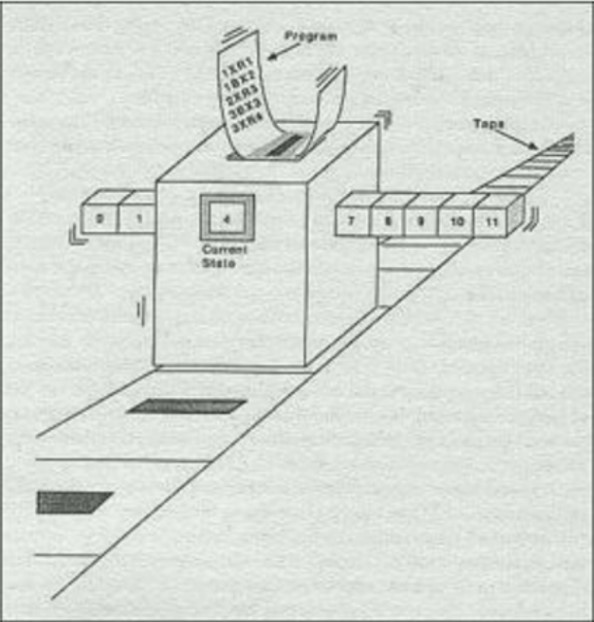
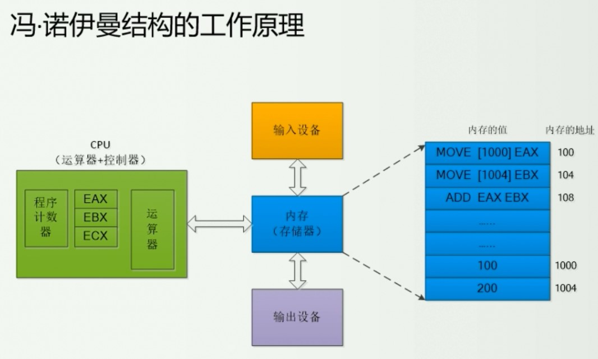
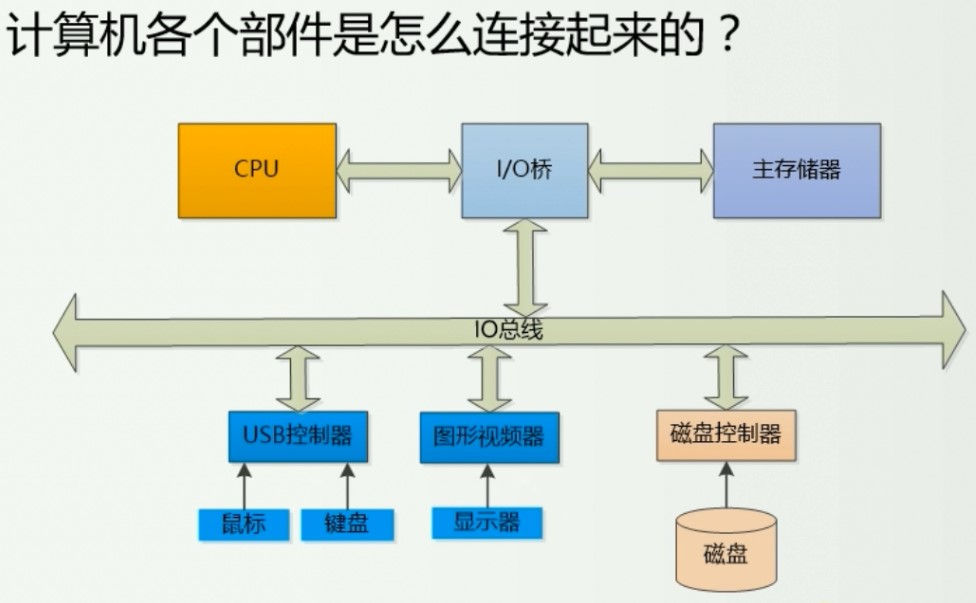
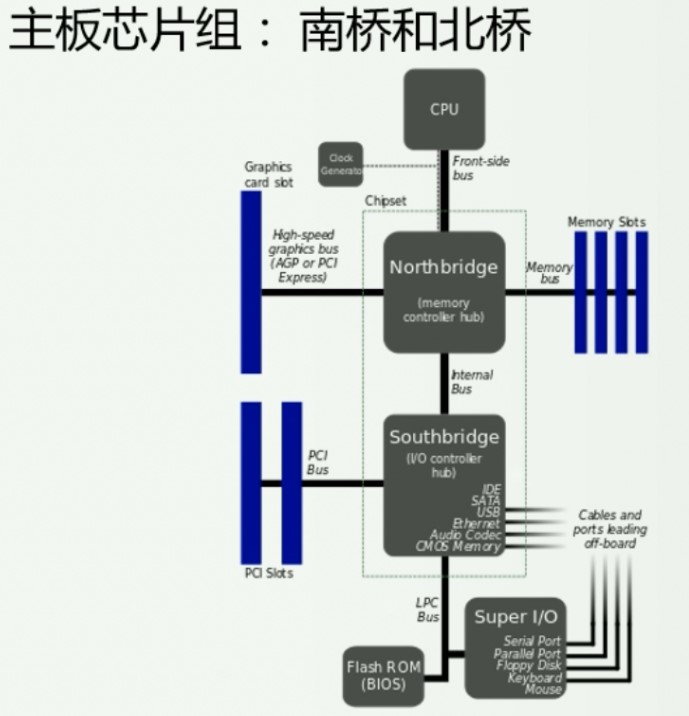
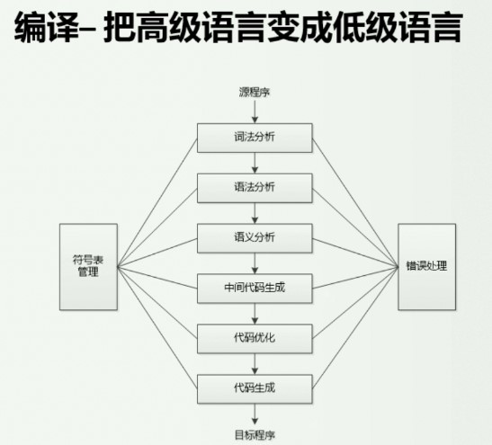
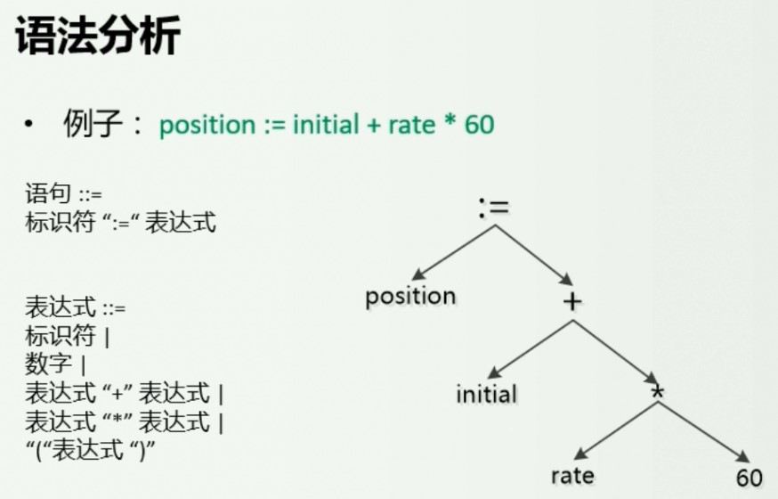
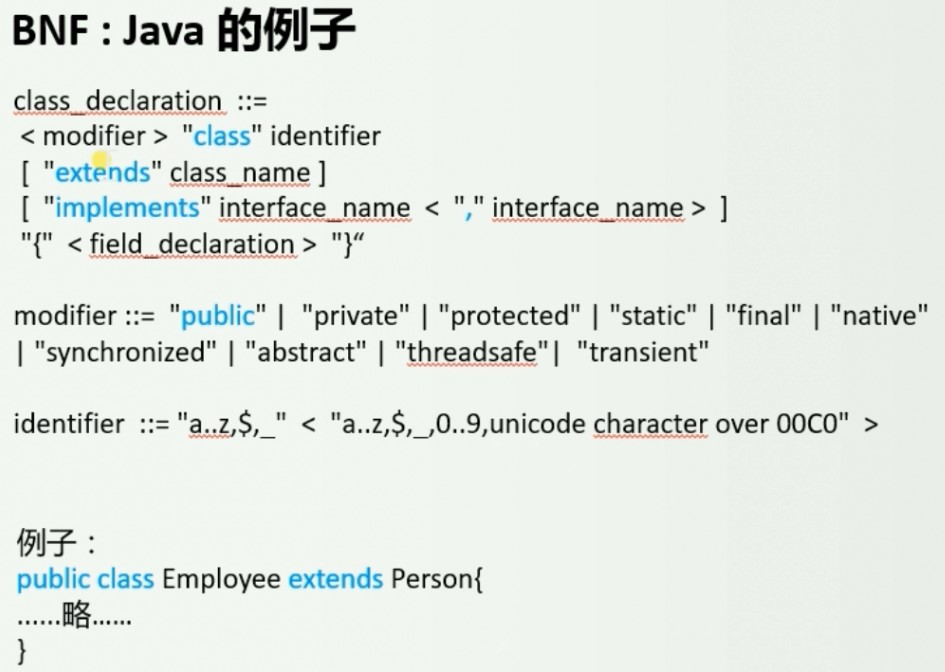
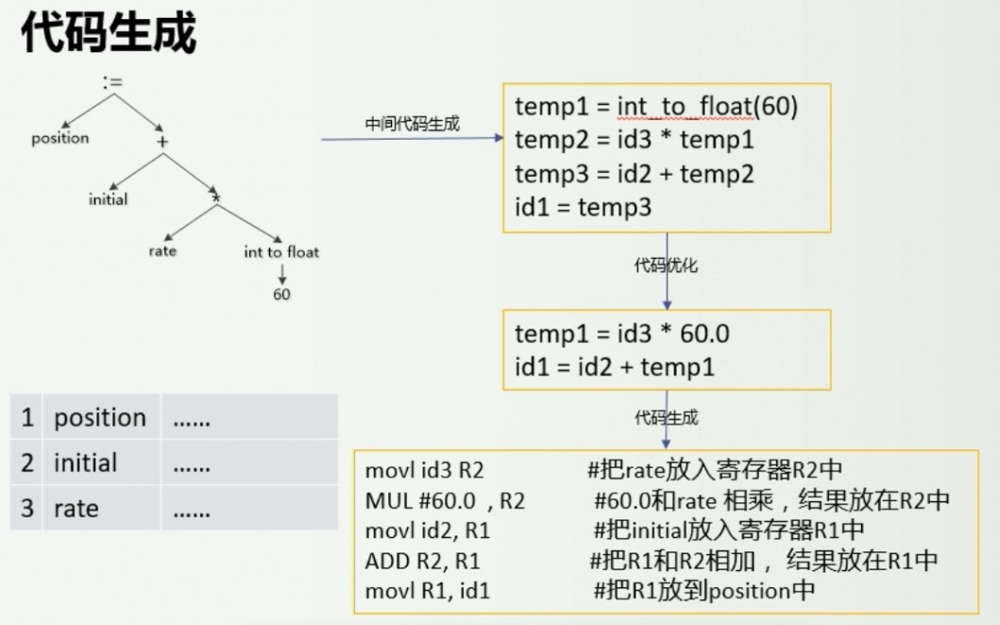
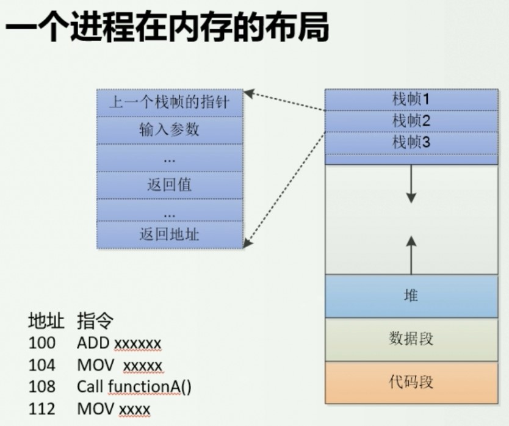
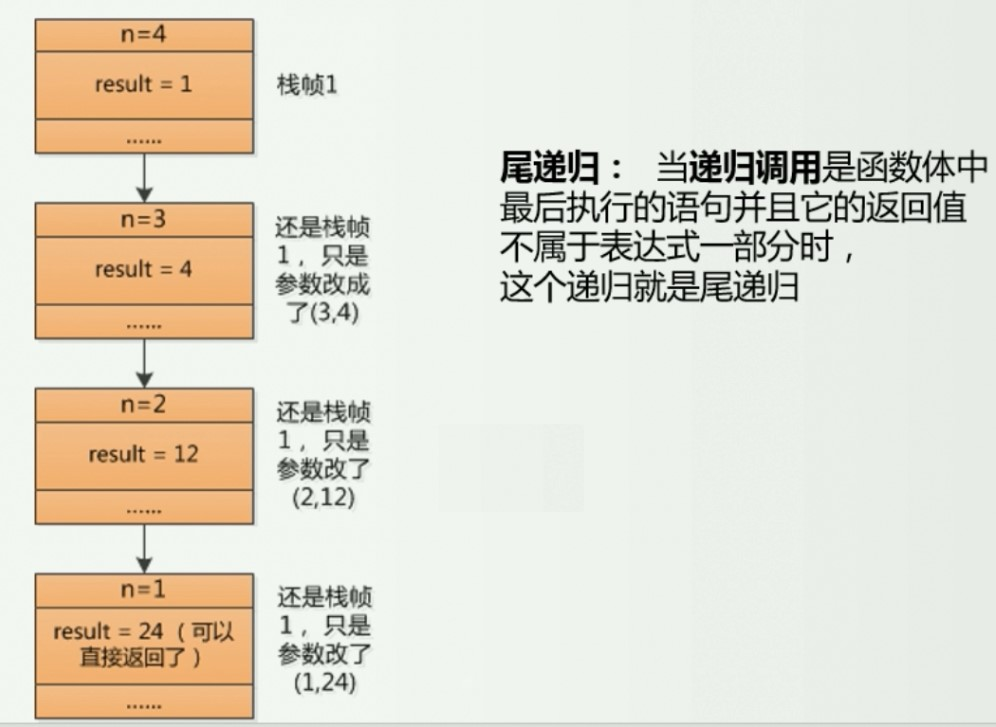

# 计算机组成原理和编程语言

> 资料来源：刘哥编程提高课程以及码农翻身微信公众号

## 图灵机

首先来了解下什么是图灵机：

> 图灵机是英国数学家图灵于1936年提出的一种抽象计算模型，其更抽象的意义为一种数学逻辑机，可以看作等价于任何有限逻辑数学过程的终极强大逻辑机器。

简单描述下图灵机：



首先它有一条（无限长）的带子，其实就相当于我们现在的计算机内存啦；上面有许多格子，每个格子都有一个地址，相当于内存地址啦；

然后它还有一个读写头，能够左右移动，能够读出纸带上的值或者改变纸带上的值，相当于是读写内存啦（类似CPU的寄存器）；

最上面是表示的一套控制规则 TABLE，相当于是程序，它会根据当前内存的值以及寄存器的状态来改变下面带子上的值，或者令机器进入一个新的状态，状态由寄存器来保存，所以状态是有限的，并且还包含一个特殊的状态：停机状态。

## 冯诺依曼结构

然后图灵机作为一个理论上的计算模型，那么冯诺依曼结构可以说是图灵机的一个实现，计算机的五大部分：

- 运算器 + 控制器（CPU）

- 存储器（内存）

- 输入设备

- 输出设备

数据和指令以二进制的形式，**不加区分**的放在存储器中。

来简单看下运行原理：



继续来看，计算机硬件之间是如何联系起来的:



可以看出它是一个总线结构，就像如今流行的 SOA ，上面的图是逻辑上的，关于主板的芯片组这里有张真实的结构：



逻辑上的 I/O桥，其实就是指的南桥和北桥，桥两边匹配的是不同的速度，北桥直接与 CPU 相连，处理的是快速设备（比如：中央处理器、随机存取存储器 RAM、AGP 或 PCI Express），北桥里面通过内部的组件连了一个南桥，南桥处理的是慢速设备（比如 sata控制器、usb、网络、多媒体等）。

PS：不过现在的北桥已经被CPU给吃了，甚至连南桥也吃了，是技术的进步，cpu都内置了pcie控制器和内存控制器，所以现在的大多数主板是没有北桥，甚至也没有南桥。

CPU 在执行指令的时候通常分为这三步，也有说四步的：

取指、译码、执行（4 写回）

**每一步都有一个部件负责（所以可以同时进行）**，为了提高效率，采用流水线的方式，也就是第一条指令在译码时，下一条指令已经进入取指阶段了。

不过牵扯到的跳转情况就不考虑了，cpu 的设计是非常复杂的。

## 速度不匹配问题

这个问题也可以算是核心问题之一，毕竟 CPU 实在是太快了，要解决这个问题一般能想到两个方法：

1. 提升硬盘等的速度，和 CPU 匹配
2. 承认局限，但充分压榨 CPU 的能力，让 CPU 忙死

第一种很显然现阶段是不可能的，现在的 SSD 多贵了？

使用第二种方式的话一般有三种解决方案：

- 同步 –> 异步（例子：直接内存访问 DMA）

- 顺序 –> 并发

-  增加中间层（缓存）

PS：关于这几个词的解释以前的笔记里有。

着重说下关于增加 中间层-缓存，遵循的规则为：**上帝的规则** **–** **局部性原理**

**时间局部性：**

- 如果程序中的某一条指令一旦执行，则不久后这条指令可能会被再次执行；
- 如果某数据被访问，则不久后该数据可能会再次被访问

**空间局部性：**

- 一旦程序访问了某个存储单元，则不久之后，其附近的存储单元也会被访问。

为什么称之为上帝规则呢，因为… 无法解释为什么会有局部性原理，比如 JVM 的hotspot 用的就是这个原理，把经常执行的代码翻译为本地代码，不再解释执行，大大提高了执行效率。

现在大部分CPU都有一级、二级、三级缓存，依次越来越慢，但是越来越大。缓存是很贵的。

## 编译

再来说说编译，就是把高级语言翻译成低级语言的过程。



对于一句代码，首先会进行词法分析（线性分析），形成一个符号表；然后会进行语法分析，最后会形成一颗语法树，就是一颗二叉树，所以二叉树真的很重要。（最后还需要进行语义分析）



要想让编译器能正确编译你的语言，你就要让编译器能够认识你写的代码，让他知道哪里是类名、哪里是修饰符，哪里可以写什么东西，这就是 BNF 做的事，正因为有了它编译器才能正确读取你的代码，IDE 才能检测出你代码的错误不规范。 



到了最后一步就是进行语义分析了，主要是进行**类型检查、控制流检查、类型转换等**

然后就可以进行代码生成了（中间还会涉及代码的优化）：



最后生成的代码就是汇编层面的代码了，然后再转换成机器语言

## 关于递归

为了更好的理解，先了解下一个进程在内存中的布局是怎么样的：



需要注意的是，栈其实是从上往下的，上面是高地址，下面是低地址，栈顶其实在下面；堆正好相反是从下往上的增加。

然后来解释下什么是栈帧，每一个栈帧可以理解为是一个函数调用，比如 A 函数中调用 B 函数，那么栈帧1就是函数A，栈帧2就是函数B。

根据上图，如果functionA创建了栈帧，那么细分中它的返回地址就是 112，也就是接下来执行的命令地址。

现在就能理解为什么递归不能太多层，会导致栈帧特别长，容易内存溢出。

改进的方式就是：**尾递归（当然改成迭代的方式也可）**

``` java
int factorial(int n){
  if(n == 1){
    return 1;
  }
  return n * factorial(n - 1);
}
```

优化后（尾递归）：

``` java
int factorial(int n, int result){
  if(n == 1){
    return result;
  } else{
    return factorial(n - 1, n * result);
  }
}
```

这就是一个尾递归，至于为什么可以起到优化的作用，那就要说内存层面的栈了，尾递归会复用栈帧，也就是只会用到一个栈帧。 



为什么可以复用呢？

首先它是对自己的调用，只是参数不同；

然后最后的 return 没有运算（**返回值没有运算**），只是返回自己的调用。

上次的结果没啥用了，因为上一次的计算结果传入了下一个调用的参数，所以完全可以覆盖。

然后编译器就会发现可以优化，只用一个栈帧即可。

当然应该不是所有的递归都能改成尾递归的，但是尽量…

> 请注意！Java 中没有尾递归，也就是说 JVM 没有对尾递归做什么优化，在函数式编程语言中对尾递归的优化比较好，在静态编译性语言中都不是很好，虽然 Java8 中加入了 Lambda ，并且对 lambda 的尾递归做了些优化，但是还是不推荐。
>
> 另外，**所有的递归都可以转换成循环**，在 Java 中请尽量转换成循环，在其他动态语言中可以尝试尾递归。

## 番外：CPU

CPU 的工作很简单，说简单了就坚守几条规则：

1. 运行指令
2. 不能保存指令，指令全放在内存中
3. 第一条指令放在地址 0xFFFFFFF0 处

CPU 把要获取的指令地址发给系统总线从而获取指令，开始加载的为 BIOS 的一堆指令，进行系统的自检。

然后通过一个系统中断，加载硬盘里的系统，一般是磁盘开始处的 512 字节，一旦操作系统进入内存，它就摇身一变，就是老大了！所有人都听他指挥。

为提高效率，使用了直接内存访问（DMA）将数据直接装载到内存，而不用经过 CPU。除此之外，还有缓存、流水线的方式。

程序都是由**顺序、分支、循环**组成的。

## 番外：硬盘

传统的硬盘是由多个盘片组成，他们被串在主轴上，主轴带着它们疯狂的旋转。

每个盘片都有很多一圈一圈的**磁道**，每个磁道又分为一个个的**扇区**。

多个盘片上的相同位置的磁道组成了一个**柱面**。

最后，每个盘片上都有可以读/写数据的磁头。

如果你想访问我的数据，可以说： 把 0 柱面， 0 磁头， 1 扇区的数据给我拿来。  

我就把磁头挪到您指定的柱面，对每个磁盘来讲其实就是指定的磁道， 所以这叫“**寻道时间**”

然后再旋转磁盘，让磁头指向您指定的扇区，这才能开始读取数据， 这叫“**旋转时间**”；

转速快的硬盘能更快的旋转到特定扇区， 所以性能会更好些。

随着技术的发展，出现了一种叫做 LBA 的寻址方式，你看到磁盘就是有一个个“块”组成的，编号为1, 2, 3, ..n  。

比如要获取 1024 块的信息，在内部就把1024转化成柱面，磁头，扇区， 按照上面说的方法寻道，旋转，读取数据 。

### 文件存放

最原始的方式：

> **你**： 硬盘，给我找20个空闲的磁盘块， 我想存我的文档
> **我**：空闲的磁盘块编号是1024， 2048， 2049 ，3000 ,...... 
> **你**： 把这些文字和图片存到这些磁盘块上 
> **我**： 好的，存完了， 你得记住这些块啊， 这样下次才能读取。 
> **你**： 拿一支笔把这些磁盘块编号都记到本子上 过了几天...... 
> **你**： 硬盘， 把1024,2048,2049,3000这些数据给我取出来，我要编辑。 
> **我**： 好的，这是你的数据 

这样是不符合人类的习惯的，文件和目录是我们习惯的方式，文件对人类来说是最小的存储单位。

连续分配的方式肯定不行，因为文件是频繁修改的；链式存储的随机访问效果太差了。。。

所以，有了索引式：

> 专门找个磁盘块，里面存储一个文件所使用的磁盘块号列表，老大把这个磁盘块叫做索引块，通过它可以轻松的找到这个文件所使用的所有磁盘块， 无论是顺序访问还是随机访问都很快 。
> 它唯一的缺点是索引块本身也是要占空间，如果文件小，只占用一个索引块，也必须分配一个完整的索引块。
>
> 老大还发明了一个 inode 的结构，里面不但记录了磁盘块，还记录了文件的权限、所有者、时间标记等信息。
> 如果文件很多，一个 inode 表示不下，可以用多个磁盘块来表示 inode，这可叫做间接块（一次、二次间接块）。
>

和文件一样， 每个目录也是一个 inode,  其中有目录的属性，还有存放这个目录内容的磁盘块号，在磁盘块中才真正的存放着目录下的内容：


“举个例子来说吧： 有人要读取 **/tmp/test.log** 这个文件， 查找次序是这样的：
根目录 inode -> 根目录磁盘块 -> tmp目录inode -> tmp目录磁盘块 -> test.log的 inode -> 读取磁盘块”

这个操作比较复杂，在修改删除应该非常小心才行，例如删除一个文件：

1. 在目录中删除文件
2. 释放 inode 到空闲的节点池， 这样可以复用
3. 将磁盘块释放到空闲的磁盘块池

为了避免某一操作崩溃，出现文件、目录混乱的情况，还需要建立日志文件系统，这里就不多说了。 

### 管理空闲块

简单来说就是，把那些没有使用的、空白的、数量上亿的磁盘块给管理起来，只有这样， 新的文件来的时候，才能分配空间存储。

管理空闲块的方式一般有两种：

第一种是链式大法好， 无非就是把空闲磁盘块组成一个链表（又是链表！） ，【如果磁盘块号是 32 位的，每个块都得花费 32 位的空间，如果有 5 亿个空闲块， 那仅仅为了记录他们就要占用接近 2G 的磁盘空间！  】

还有一种是位图法， 这个方法更简单， 对每个磁盘块，如果已经被使用，那就标记为1，   没被使用就是0。 这样整个磁盘块就形成了一个由 0 和 1 组成的一个大位图。

### 文件系统

对于用户来说，使用的是一个包含文件和目录的树形结构，操作系统必须考虑怎样高效的实现这么个结构，形成文件系统的内部结构，文件系统有很多种类，比如 NTFS 、FAT 、Ext2、Ext3 等。

部分硬盘主要由 MBR(Master Boot Record)和各个磁盘分区组成。 MBR 中的有 引导代码 和 磁盘分区表，  分区表中记录了每个分区的起始位置，以及哪个磁盘分区是活动分区，  这样系统就会找到它， 然后装载这个分区中的引导块，并执行之。 

引导块将会装载存存储在本分区的操作系统。  需要注意的是，每个分区都有一个引导块，不管这个分区有没有操作系统，这是各大厂商的约定，是一种标准。

对于 MBR 类型的硬盘，磁盘分区表只有 64 个字节， 而每个分区项占用 16 个字节， 所以只能容纳 4 个分区。 如果你想用多于 4 个分区， 你就需要把其中一个设为扩展分区， 然后在其中继续划分成逻辑分区，想划几个就划分几个。
 一般情况下，大家都喜欢把我划分成一个主分区 + 一个扩展分区，   在扩展分区中再需要划分。
当然，后来随着硬盘容量的扩大，出现了 UEFI 的方式，没有了这个限制。 

这里不再多说。

## 其他补充

### 总线和端口

CPU 如何联系 I/O 设备呢？比如键盘~

方案一：在 CPU 和每个 IO 设备扯一根线，形成一个以 CPU 为中心的星形布局，这种方式不灵活，成本高。

方案二：引入 “总线”，大家都挂到这条总线上，CPU 想找谁了就在上面吼一嗓子，缺点就是：当一个人在总线开吼时，其他人都得等待。

### 轮询和中断

还是 CPU 和其他设备速度不匹配的问题，CPU 调用硬盘的数据，一直在总线上不停的询问好了没有，霸占着总线，这就是一种轮询。

中断：当慢速设备处理完成后通知 CPU 来继续处理，如何通知？CPU 有一条中断请求线，弄好了以后往这地方发信号就行了，CPU 每执行完一条指令就会去检查。

为了避免程序抢中断的情况，CPU 让中断控制器来负责协调，只有它才能给 CPU 发中断，程序、设备需要把中断发给它，它来决定谁的优先级高，然后就优先处理。

### DMA

直接内存访问（DMA）可缓解数据搬运问题，使用 DMA 控制器进行处理器和 IO 设备和内存之间的数据直接传输，避免 CPU 频繁的将小数据从硬盘搬到内存的性能损耗。

比如，CPU 通知硬盘调取数据，然后硬盘通知 DMA 控制器将数据传输到内存的 xx 地址，DMA 控制器干完后通知 CPU 数据已经在内存了，可以用了。

在 DMA 搬运数据的时候会占用总线，但是因为 CPU 有一级二级缓存，DMA 也使用不了几个时钟周期，这是值得的。