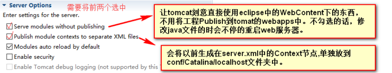
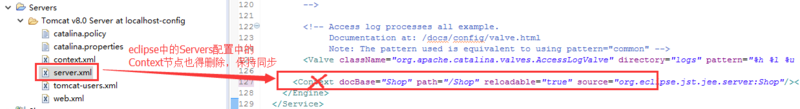

# Eclipse配置Tomcat服务器

ServerLocations 选项卡就不说了，三个选项分别对应部署到哪里，工作空间、安装目录、自定义。

还有就是超时哪里，默认的 45s 大项目未必起得来，一般来说 90s 就足够了...

## Tomcat的Server Options选项

> 引用自：http://www.cnblogs.com/dflmg/p/6223360.html

在 Cotext 节点中有一个 `reloadable='true'` 属性，将它改为 false，可以在修改 java 文件后不用重启服务器即可生效，但是不包括新建 java 文件、添加方法和变量的操作.

为了在开发时，让 tomcat 能够自动重新加载，我们修改过的代码和配置，需要对 Tomcat 的 context.xml 文件进行设置。

在 `<context>` 标签中，加上 reloadable 属性，并且将值设为 true

> reloadable 设为 true，目的是为了方便开发阶段， 它会影响 tomcat 性能；当在正式部署服务时，需要改成 false 

---

原来 Tomcat 安装目录下 `conf/server.xml` 中的 Context 节点（勾选第二个选项之后，server.xml 中就不存在这个节点了） 

会以独立文件的形式存在于 `conf/Catalina/localhost` 目录下

---

### 1.勾选第一个是为了防止出现警告：

> 警告: A docBase D:/Tomcat/webapps/Shop inside the host appBase has been specified, and will be ignored

勾选后表示让 tomcat 直接使用 eclipse 中的 WebContent 下的东西

省去 publish 到 `<workspace>.metadata.pluginsorg.eclipse.wst.server.coretmp0webapps` 并将 tmp0webapps 下相关的 resources 删除，同时会修改 `<workspace>.metadata.pluginsorg.eclipse.wst.server.coreservers.xml` 中的 `serveModulesWithoutPublish=true` 以及 `tmp0/conf/server.xml` 中的 `<Context>` 配置

### 2.勾选第二个是为了防止出现警告：

> 警 告: [SetPropertiesRule]{Server/Service/Engine/Host/Context} Setting property 'source' to 'org.eclipse.jst.j2ee.server:strut2demo' did not find a matching property.

[SetPropertiesRule] 警告的原因是 Tomcat6.0 以上的 server.xml 的 context 节点中不再支持 source 属性了。具体说明如下：

> For Tomcat 6, unlike Tomcat 4.x, it is NOT recommended to place \<Context> elements directly in the server.xml file. This is because it makes modifying the Context configuration more invasive since the main conf/server.xml file cannot be reloaded without restarting Tomcat.